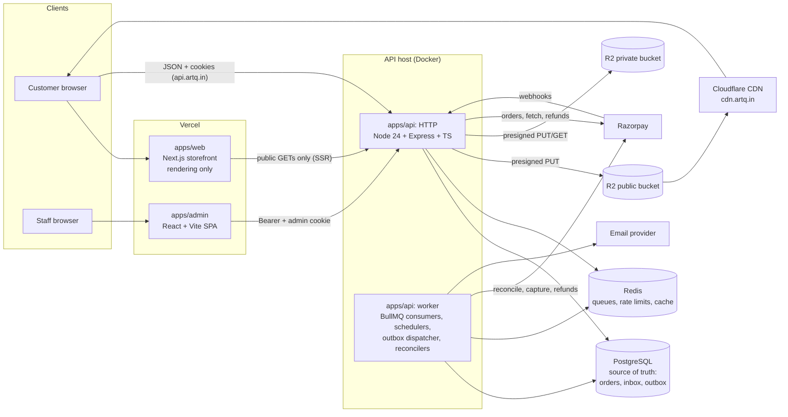
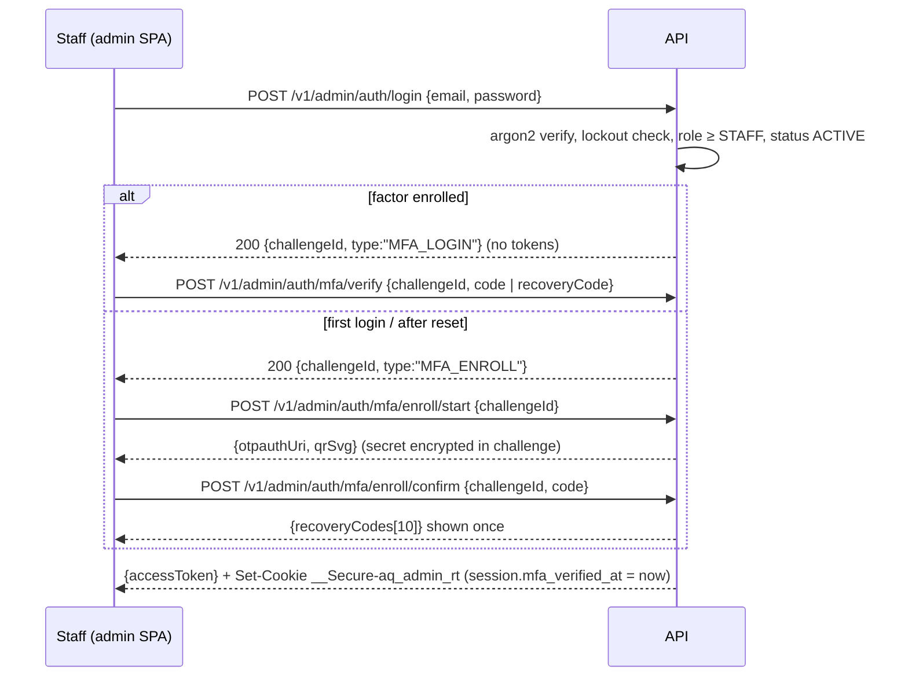

# ArtQ: Technical Architecture

> Companion docs: [database.md](database.md) (data model, SQL) · [api.md](api.md) (contracts) · [product.md](product.md) (rules) · [tasklist.md](tasklist.md) (plan) · [review.md](review.md) (change log)

---

## 1. Architecture at a glance

A **modular monolith**: one Node.js API process type plus one worker process type, sharing one PostgreSQL database. There are no microservices.



**Why this shape**
- **SEO:** the storefront is Next.js with server rendering for public pages.
- **One backend:** the Express API owns every business rule; storefront, admin and any future app are clients.
- **Separate admin SPA:** no SEO needs; isolated deploy and origin (`admin.artq.in`).
- **Durability in Postgres, speed in Redis:** anything that must not be lost (webhook receipts, side-effect intents, idempotency, payment attempts) is written to Postgres first. Redis/BullMQ deliver and schedule work and can be lost without losing correctness (§8).

### 1.1 Rule: the Node.js API is the only backend
Next.js is used **only as a rendering layer**:
- **no** API route handlers (`app/api/*`), **no** Server Actions, **no** database access, **no** secrets (only `NEXT_PUBLIC_*` config);
- **no** auth/session logic: login, refresh, cart, checkout and account calls go from the browser **directly to the API**, which owns the cookies;
- server components `fetch()` only **public, cacheable, non-personal** API endpoints (catalogue, content, settings).

| Responsibility | Lives in |
|---|---|
| Auth, OTP, sessions, MFA, permissions | API |
| Cart, pricing, coupons, shipping calculation, checkout, idempotency | API |
| Payments, Razorpay calls, webhook inbox, reconciliation, refunds | API + worker |
| Orders, inventory, fulfilment, returns, invoices | API |
| Emails, outbox dispatch, image processing, imports, scheduled jobs | Worker |
| SEO HTML and customer UI | Next.js |
| Staff UI | Admin SPA |

### 1.2 What Redis + BullMQ are used for (and what they are not trusted with)
| Use | Example | If Redis is lost |
|-----|---------|------------------|
| Job delivery with retries | email sends, image processing, import batches, webhook processing | Outbox deliveries stay `PENDING`/`LEASED`/`PUBLISHED` (not `COMPLETED`) and inbox rows stay unprocessed in Postgres → claim/sweeper republish them (§8) |
| Delayed & repeatable jobs | expire unpaid orders (every minute), reconcile payments, daily reports | Schedulers are re-registered at worker start |
| Rate limiting & OTP throttling | login 10/min/IP, OTP 5/h/target | Limits reset (acceptable; argon2 + lockouts in Postgres still apply) |
| Session-state cache | `session:<sid>` → result of `aq_session_valid` (TTL 60 s, deleted on every revoke/version change) | Falls back to `aq_session_valid` in Postgres |
| App cache | navigation, settings, types/categories | Rebuilt from Postgres |

Redis runs with AOF persistence, but **no correctness property depends on it**.

---

## 2. Tech stack (decisions)

| Layer | Choice | Version policy | Reason |
|-------|--------|----------------|--------|
| Runtime | **Node.js 24 LTS** ("Krypton") | `engines.node >=24.11 <25`; `.nvmrc` = 24; CI runs 24. Node 20 is end-of-life (Apr 2026) and is not used | Supported LTS through Apr 2028; upgrade to Node 26 LTS once it is LTS and dependencies are verified |
| Language | TypeScript (strict) | **6.0.3** (not 7.x until `typescript-eslint` supports it; docs/compatibility.md) | Shared types |
| Monorepo | pnpm workspaces + Turborepo | pnpm 10.34.6 (corepack), turbo 2.11.6 | Shared packages, cached builds |
| Storefront | Next.js (App Router) + React | Next **16.3.8**, React 19.3.0 (admin: Vite **8.3.2**) | SSR/ISR, image optimisation. Frontend only |
| Admin | React + Vite + React Router + TanStack Query/Table + shadcn/ui | pinned | CRUD-heavy SPA |
| Styling | Tailwind CSS + CSS variables | 4 | Token-based design system |
| Forms/validation | React Hook Form + Zod | Zod schemas shared in `packages/shared` | One validation source |
| API | Express | 5 | Simple, known |
| ORM | **Prisma 6.19.x** | pinned; schema validated on 6.19.3. Prisma 7 (config moves to `prisma.config.ts`) evaluated in the Phase 0 spike, adopted only if all tooling passes | Type-safe queries, migrations |
| Database | **PostgreSQL 16** (managed; minor upgrades follow the provider) | Major pinned to 16 in every environment. The doc validator runs on 16.14 (and 18.3 as a forward-compatibility check); a major upgrade requires a green validator + acceptance run on the new major first | Transactions, row locks, FTS, `pg_trgm` |
| Queue/cache | Redis 7+ + **BullMQ 5.81.5** | pinned; 6.x evaluated before upgrading (same job-id rule verified on 6.3.11) | Jobs, schedulers, rate limits |
| Storage | Cloudflare R2: `artq-public` (CDN) and `artq-private` (no public access) | n/a | Cheap, S3 API |
| Images | sharp | pinned | Re-encode, resize, strip metadata |
| Payments | Razorpay Orders API + Checkout.js + webhooks | API v1 | UPI/cards/netbanking |
| Email | Transactional provider with idempotency-key support (Resend or SES) + React Email | n/a | At-least-once delivery with dedupe |
| SMS/WhatsApp | **Not at launch** (post-launch MSG91 after DLT registration) | n/a | Launch OTP is email-only (§5.7) |
| PDF | @react-pdf/renderer | n/a | Invoices, credit notes, packing slips |
| Excel | exceljs | n/a | Imports/exports |
| Password/MFA | argon2id; TOTP (RFC 6238) via `otplib`; AES-256-GCM secret encryption | n/a | n/a |
| Testing | Vitest, Supertest, Testcontainers (Postgres 16/Redis), Playwright; `tools/doc-validation` for the DB layer | n/a | Real DB for concurrency tests |
| Monitoring | Sentry, pino logs, uptime checks, Bull Board (admin-only) | n/a | n/a |

**Compatibility spike (task 0.1):** before writing feature code, scaffold all apps on Node 24 and confirm install + build + a smoke test for Next.js, Vite, Prisma (generate + migrate), sharp (prebuilt binary), argon2 (prebuilt), BullMQ/ioredis, exceljs, @react-pdf/renderer, otplib. Done: results and pinned versions are in [compatibility.md](compatibility.md).

---

## 3. Repository structure

```
artq/
├── apps/
│   ├── web/                    # Next.js storefront (frontend only)
│   │   ├── app/(shop)/…        # home, shop, type/[slug], category/[slug], technique/[slug], product/[slug],
│   │   │                       # search, new-arrivals, trending, cart, checkout, checkout/success/[orderNumber],
│   │   │                       # wishlist, about, contact, faqs, custom-work, [policy]
│   │   ├── app/(auth)/…        # login, signup, verify, forgot-password, reset-password, set-password
│   │   ├── app/(account)/…     # account, account/addresses, orders, orders/[orderNumber], track/[orderNumber]
│   │   ├── app/sitemap.ts, robots.ts, not-found.tsx, error.tsx, layout.tsx, middleware.ts (redirect lookup only)
│   │   ├── lib/                # api-client (public SSR fetch vs. browser fetch), auth-client (refresh coordinator), analytics, format
│   │   └── components/…
│   ├── admin/                  # React + Vite admin SPA
│   │   └── src/routes/         # see product.md §7 for every module
│   └── api/
│       ├── prisma/             # schema.prisma, migrations/, seed/
│       └── src/
│           ├── server.ts, worker.ts, app.ts, config/env.ts
│           ├── lib/            # prisma, redis, logger, errors, money, tax, slug, storage, razorpay, mailer, safe-fetch, crypto
│           ├── middleware/     # requestId, origin-guard, auth, requirePermission, validate, idempotency, rateLimit, cartToken, errorHandler
│           ├── modules/
│           │   ├── auth/       # customer auth, admin auth + MFA, sessions, OTP
│           │   ├── catalog/    # types, categories, techniques, products, variants, publication gate, search
│           │   ├── inventory/  # reservations, adjustments, recounts, movements
│           │   ├── cart/  wishlist/
│           │   ├── checkout/   # pricing, shipping, coupons, initiate, verify, status
│           │   ├── payments/   # attempts, apply-payment, webhooks inbox, reconciliation, exceptions
│           │   ├── orders/     # lifecycle, fulfilment, cancellation, COD remittance
│           │   ├── refunds/  returns/  invoices/
│           │   ├── customers/  coupons-admin/  shipping-admin/
│           │   ├── content/    # reels, testimonials, slides, faqs, cms pages, newsletter, contact
│           │   ├── media/      # presign, complete, private access
│           │   ├── imports/    # catalog + inventory imports
│           │   ├── outbox/     # writer helper + dispatcher
│           │   └── admin/      # dashboard, staff, settings, audit, jobs view
│           ├── jobs/           # queue + scheduler definitions, consumers
│           └── emails/         # React Email templates
├── packages/
│   ├── shared/                 # zod schemas, enums, permission map, money/tax/shipping pure functions
│   ├── ui/                     # Tailwind preset (tokens), primitives
│   └── config/                 # eslint, tsconfig, prettier
├── docs/
├── docker-compose.yml          # postgres 16, redis 7, s3mock (R2 stand-in), mailpit
└── .github/workflows/
```

Module pattern: `*.routes.ts` (path + middleware) → `*.controller.ts` (parse/shape only) → `*.service.ts` (business logic, transactions, outbox writes) → `*.repo.ts` (complex SQL) → `*.schemas.ts` (zod, strict: unknown keys rejected).

---

## 4. Request lifecycle

```
request → requestId → pino-http → helmet → CORS (allowlist; browser hint only, NOT authorization)
  → body parsers (JSON only, 1 MB; raw body for /v1/webhooks/*)
  → cookieParser → rateLimit (Redis)
  → originGuard (state-changing requests on cookie-authenticated routes, §5.5)
  → cartToken (only on /v1/cart*, /v1/checkout*)
  → authOptional | authRequired(audience) | requirePermission(perm) [+ requireRecentMfa for step-up]
  → validate({body, query, params}) (zod strict)
  → idempotency(operation) (on endpoints listed in api.md §1.2: begin → owner token; services call
     aq_idempotency_assert_owner as the first statement of every transaction, attach/renew/complete with the token)
  → controller → service → prisma
  → errorHandler → {error:{code,message,details}}; Sentry for 5xx
```
HTTP codes: 400 validation, 401 unauthenticated, 403 forbidden/origin rejected, 404, 409 conflict (stock, idempotency in progress, version), 422 business rule, 423 locked, 429 rate-limited, 502/503 provider unavailable, 500.

---

## 5. Authentication, sessions & authorization

### 5.1 Tokens and cookies
| Credential | Where | Lifetime | Notes |
|-----------|-------|----------|-------|
| Storefront access JWT | JS memory only, `Authorization: Bearer` | 10 min | Claims: `sub`, `sid`, `aud=storefront`, `iss=<env issuer>`, `ver` (session authVersion) |
| Storefront refresh token | Cookie **`__Secure-aq_rt`**: `HttpOnly; Secure; SameSite=Strict; Path=/v1/auth; no Domain attribute` (host-only on `api.artq.in`) | Rotated on every use; session idle 30 d / absolute 90 d | 256-bit random; only its SHA-256 is stored (`refresh_tokens`) |
| Admin access JWT | Admin SPA memory | 5 min | `aud=admin`, includes `mfa_at` |
| Admin refresh token | Cookie **`__Secure-aq_admin_rt`**: same attributes, `Path=/v1/admin/auth` | Session idle 12 h / absolute 7 d | Issued **only after MFA** (§5.8) |
| Cart token | Cookie **`__Secure-aq_cart`**: `HttpOnly; Secure; SameSite=Strict; Path=/v1; host-only` | 30 d | Hash stored in `carts.token_hash` |
| Guest order access | Cookie **`__Secure-aq_order`**: same attributes, `Path=/v1/orders` | 1 h | Signed, scoped to one order (§5.6) |

**Paths match the routes**: the API is versioned under `/v1`, so the refresh endpoint `POST /v1/auth/refresh` receives a cookie with `Path=/v1/auth`. (The previous plan's `Path=/auth` would never have been sent to `/v1/auth/refresh`.)

**Set and clear with identical attributes.** Clearing sends the same name, `Path`, `Secure`, `HttpOnly`, `SameSite` and (absent) `Domain`, with `Max-Age=0` and an empty value. A single `cookies.ts` helper builds both, so they cannot drift.

**Environment isolation.** Cookies are host-only, so production (`api.artq.in`), staging (`api-staging.artq.in`) and local (`localhost:4000`) can never see each other's cookies. Additionally, each environment has its own JWT signing key, `iss` value and cookie-name suffix in non-production (`__Secure-aq_rt_stg`). Local development runs over HTTP on `localhost`, so it uses unprefixed names (`aq_rt_dev`) with `Secure=false`, controlled only by `NODE_ENV=development` (refused at boot otherwise).

`web` (`artq.in`) and `api` (`api.artq.in`) are **same-site** (same registrable domain), so `SameSite=Strict` cookies are sent on the browser's cross-origin `fetch(…, {credentials:'include'})`. The admin (`admin.artq.in`) is also same-site with the API. Staging uses the `artq.in` registrable domain too (`staging.artq.in`, `api-staging.artq.in`); Vercel preview URLs (`*.vercel.app`) are **cross-site**, so previews use a mock API or run without login (documented limitation).

### 5.2 Refresh-token rotation and reuse detection
`POST /v1/auth/refresh` (cookie only, empty JSON body, Origin-checked):
1. Hash the presented token; `SELECT … FROM refresh_tokens JOIN sessions … FOR NO KEY UPDATE` (serialises concurrent refreshes of the same token).
2. Unknown hash → 401 `SESSION_INVALID` + clear cookie.
3. `aq_session_valid(sid)` false (revoked/expired, user not `ACTIVE`, or `session.auth_version` ≠ the user's version **for the session's audience**) → revoke session, 401, clear cookie.
4. Token `ACTIVE` and not expired → mark `ROTATED` (`rotated_at = now`), insert successor (`parent_id`), extend session idle expiry, return new access token + `Set-Cookie` new refresh token.
5. Token `ROTATED`:
   - **within 30 s grace** of `rotated_at` *and* its successor is still `ACTIVE` (two tabs refreshed at once): return a new access token **without** `Set-Cookie` (the browser already holds the successor from the first response). No new refresh token is minted.
   - otherwise → **reuse detected**: revoke the session and all its tokens (`REUSE_DETECTED`), audit `security.refresh_reuse`, email the user ("new sign-in activity"), 401, clear cookie.
6. Token history is kept for session lifetime + 30 days.

### 5.3 Browser-tab coordination (storefront and admin)
- The refresh call is wrapped in **`navigator.locks.request('aq-refresh', …)`** (Web Locks API), so only one tab refreshes at a time; other tabs wait and then read the fresh token.
- After a successful refresh, the tab broadcasts `{type:'token', accessToken, exp}` on a `BroadcastChannel('aq-auth')`; other tabs adopt it instead of refreshing.
- Logout broadcasts `{type:'logout'}`; all tabs clear memory state.
- On page load (or reload) the app calls refresh once to obtain an access token; a 401 on any API call triggers one coordinated refresh and one retry.
- **Storefront:** the load-time refresh runs only when this browser has signed in before (`aq_signed_in` flag in localStorage, set at sign-in and cleared at logout or when a refresh is refused). Guests therefore never call refresh, so they get no 401 per page and do not spend the per-IP refresh budget (30/min, shared by everyone behind one carrier NAT). The flag is only a hint: the HttpOnly cookie still decides. If the flag is lost (storage cleared), the visitor simply logs in again. A 401 on a cart call when the session cannot be refreshed retries once as a guest (the cart works without an account). Implemented in `apps/web/lib/session.ts` (task 4.2).
- If Web Locks is unavailable, the server-side 30 s grace window (§5.2) still prevents false reuse detection.

### 5.4 Session revocation and account changes
| Event | Effect |
|-------|--------|
| Logout | Revoke current session; clear cookie |
| Logout everywhere / password change / password reset / email change | `aq_revoke_all_sessions`: `storefront_auth_version++` **and** `admin_auth_version++`; revoke all sessions |
| Staff blocks a user | `aq_revoke_all_sessions(…, block)`: `status = BLOCKED`, both versions++, revoke all sessions; pending unpaid orders expire normally; paid orders are still fulfilled unless staff cancels |
| Role change / permission-relevant change | `aq_change_role`: **`admin_auth_version++` only**; revoke the user's **admin** sessions; storefront sessions stay valid (their version is unchanged) |
| MFA reset by SUPER_ADMIN | Delete factor + recovery codes, `admin_auth_version++`, revoke admin sessions; user must re-enrol |

Users have two versions, `storefront_auth_version` and `admin_auth_version`. A session copies the version for its audience at creation; access tokens carry it as `ver` with `aud`. Every authenticated request checks `session:<sid>` in Redis (TTL 60 s; the key is **deleted synchronously** by every revoke or version change), falling back to `aq_session_valid(sid)` in Postgres. It is rejected if the session is revoked/expired, its version differs from the user's version for that audience, the user is not `ACTIVE`, a `CUSTOMER`-role user presents an admin session, or the token audience is wrong. Revocation therefore takes effect on the next request (C13 in review.md §6 exercises these rules at the database level).

### 5.5 CSRF and Origin protection
Bearer-token requests cannot be forged cross-site, because browsers never attach the header automatically. **Cookie-authenticated** endpoints can be, so they get these layers:
1. `SameSite=Strict` cookies (above).
2. **Origin guard**, applied app-wide (`originPolicy` in `createApp`, so no route can forget it) to every non-GET/HEAD/OPTIONS request, which covers all cookie routes (`/v1/auth/*`, `/v1/admin/auth/*`, `/v1/cart*`, `/v1/checkout*`, `/v1/orders/*` guest routes): `Origin` must be present and exactly match the environment allowlist: `STOREFRONT_ORIGINS` (`https://artq.in`, `https://www.artq.in`) everywhere except `/v1/admin/*`, which accepts only `ADMIN_ORIGINS` (`https://admin.artq.in`). The path is matched case-insensitively, like Express routing. A missing or other origin returns 403 `ORIGIN_REJECTED`. If present, `Sec-Fetch-Site` must be `same-origin` or `same-site`.
3. **JSON only**: state-changing endpoints reject `application/x-www-form-urlencoded`, `multipart/form-data` and `text/plain` (except presigned uploads, which go directly to R2), so HTML forms cannot submit them.
4. GET requests never change state.
5. Webhooks are exempt from the Origin check and authenticated by signature.

CORS headers are configured to the same allowlist, but **CORS is a browser read-permission mechanism, not authorization**: every rule above is enforced server-side regardless of CORS.

### 5.6 Customers, guests and identity linking
- **Accounts** are created only by signup (email + password, email OTP verification) or by the **set-password link** sent to a checkout contact email (clicking the link proves mailbox ownership; the account is created with `email_verified_at`).
- **Guest checkout** creates no user row. Contact email/phone are stored on the order as **unverified**.
- **Guest order access** (view, track, cancel, return, invoice):
  1. the order email contains a tracking link with a random token (stored as `orders.tracking_token_hash`). It grants **read-only** tracking (status timeline, items, masked address) until 90 days after completion;
  2. any action (cancel, return request, invoice download, viewing private attachments) requires an **email OTP** to the order's contact email (`GUEST_ORDER_ACCESS`, bound to `order_id`). Success sets `contact_email_verified_at` and issues the 1-hour `__Secure-aq_order` cookie scoped to that order only.
- **Verified-email linking:** when an account's email becomes verified (signup verify, set-password link, email change verify), guest orders whose `contact_email` equals it (case-insensitive) and whose `user_id` is null are linked to the account in one transaction (audited). Linking never happens on phone matches or unverified emails.
- **Conflicts:**
  - A guest checkout using an email that belongs to an existing account is allowed. The order stays guest-owned until that account holder logs in with the verified email, then it is linked. The checkout shows "Have an account? Log in" without revealing whether the account exists.
  - A logged-in customer entering a different contact email/phone at checkout: the order is owned by the logged-in account (`user_id`) and notifications go to the entered contact email. It is not used for linking.
  - Phone numbers are never identity at launch. A verified phone (post-launch) is unique; a conflicting number cannot be verified on a second account.

### 5.7 OTP at launch: email only
SMS/WhatsApp are post-launch (DLT registration needed). At launch:
- Login: **email + password**, or **email OTP**. Phone login is disabled.
- Phone is a contact field only, stored unverified and **not** unique. Changing it needs no OTP because it confers no access.
- When SMS launches (post-launch backlog), phone becomes a login identifier: a phone change then **requires an OTP to the new number** (`PHONE_CHANGE`), and a verified phone becomes unique.
- Email change always requires an OTP to the **new** email plus a notification to the old one; then `aq_revoke_all_sessions` (both versions++).

### 5.8 Admin authentication with mandatory MFA
> **Status 2026-10-02: MFA deferred by the owner.** Admin login is currently email + password (staff roles only, shared
> lockout, separate `ADMIN` session audience and cookie, 5-min access token, 12 h idle / 7 d absolute), and **step-up is a
> password re-check** recorded in `sessions.mfa_verified_at` (10 minutes, per session). The design below is the target and
> is tracked as tasklist 1.6b. Risk accepted until then: a stolen staff password gives admin access without a second factor.

All staff roles (`STAFF`, `ADMIN`, `SUPER_ADMIN`) require TOTP. **No admin access or refresh token is issued before the MFA step completes.**


- **Challenges** expire in 5 minutes, allow 5 attempts, are single-use and bound to IP + user agent.
- **TOTP:** 30-second step, ±1 step tolerance. `last_used_step` prevents replaying the same code.
- **Secret protection:** AES-256-GCM with a 32-byte key from the secret manager (`MFA_ENCRYPTION_KEY`, versioned via `secret_key_version` for rotation). The secret is never returned after enrolment and never logged.
- **Recovery codes:** 10 codes, argon2id-hashed, single use. Using one prompts regeneration.
- **Lost device:** a SUPER_ADMIN resets another staff member's MFA (audited, step-up required). If the last SUPER_ADMIN is locked out, the break-glass procedure is a server CLI (`pnpm admin:reset-mfa --email`). It requires production DB credentials and is recorded in `audit_logs` and the ops log.
- **Step-up:** refunds, payment/settings changes, staff role changes, MFA resets and exports of customer data require `session.mfa_verified_at` within the last **10 minutes**. Otherwise the API returns 401 `STEP_UP_REQUIRED` and the SPA calls `/v1/admin/auth/step-up` (TOTP).
- **Separation:** admin sessions (`audience=ADMIN`) use a separate cookie and route prefix. Staff accounts cannot use storefront login to obtain admin tokens, and storefront tokens are rejected by `/v1/admin/*`.

### 5.9 Permissions
Permissions are declared in `packages/shared/src/permissions.ts` and checked by `admin.can(permission)` from `createAdminRouter` (`apps/api/src/admin/router.ts`), which also authenticates every `/v1/admin/*` feature route, applies the per-admin rate limit, audits rejected requests and reports successful mutations that wrote no audit entry. **Each endpoint's request schema accepts only the fields its permission covers.** For example, the inventory endpoint's schema has no price fields, and unknown keys are rejected.

| Permission | What it allows | STAFF | ADMIN | SUPER_ADMIN |
|-----------|----------------|:-----:|:-----:|:-----------:|
| `dashboard:read` | Dashboard | ✓ | ✓ | ✓ |
| `orders:read` | Orders list/detail, invoices, packing slips | ✓ | ✓ | ✓ |
| `orders:fulfil` | Confirm, pack, ship (AWB), deliver, RTO, lost | ✓ | ✓ | ✓ |
| `orders:cancel` | Cancel orders | | ✓ | ✓ |
| `refunds:create` | Create refunds (step-up) | | ✓ | ✓ |
| `returns:receive` | Record received/inspected quantities | ✓ | ✓ | ✓ |
| `returns:decide` | Approve/reject returns | | ✓ | ✓ |
| `cod:remit` | Record COD remittances | | ✓ | ✓ |
| `inventory:read` / `inventory:adjust` | Stock view; recounts, write-offs, inventory imports (**on_hand only**) | ✓ / ✓ | ✓ / ✓ | ✓ / ✓ |
| `catalog:read` | Products, types, categories, techniques | ✓ | ✓ | ✓ |
| `catalog:write` | Content, images, variants' non-commercial fields, types/categories/techniques | | ✓ | ✓ |
| `pricing:write` | Variant price, MRP, cost; catalogue imports that change prices | | ✓ | ✓ |
| `catalog:publish` | Publish/unpublish/archive (activation toggle), tax approval | | ✓ | ✓ |
| `imports:catalog` | Catalogue imports | | ✓ | ✓ |
| `customers:read` / `customers:write` | Customers; block/unblock, notes | ✓ (masked contact) / – | ✓ / ✓ | ✓ / ✓ |
| `coupons:write` | Coupons | | ✓ | ✓ |
| `shipping:write` | Shipping rates, zones, serviceability | | ✓ | ✓ |
| `restock:read` / `restock:notify` | Restock requests | ✓ / – | ✓ / ✓ | ✓ / ✓ |
| `content:write` | CMS, reels, testimonials, FAQs, messages | | ✓ | ✓ |
| `media:write` | Upload/delete media | | ✓ | ✓ |
| `payments:exceptions` | View/resolve payment exceptions, run reconciliation | | ✓ | ✓ |
| `jobs:read` / `jobs:retry` | Jobs, webhook inbox, outbox views; retry dead items | | ✓ / – | ✓ / ✓ |
| `settings:write` | Store, shipping, payment toggles (step-up) | | | ✓ |
| `staff:manage` | Staff users, roles, MFA reset (step-up) | | | ✓ |
| `audit:read` | Audit log | | | ✓ |

---

## 6. Catalogue, caching, pricing & shipping

### 6.1 Cache layers and staleness
| Layer | What | Policy |
|-------|------|--------|
| Next.js ISR | Home, listing, product, content pages (HTML) | `revalidate: 60` |
| API HTTP cache headers | **Allow-listed** public GETs only: `/v1/home`, `/v1/navigation`, `/v1/settings/public`, `/v1/types*`, `/v1/categories*`, `/v1/techniques*`, `/v1/products` (listing), `/v1/products/:slug` (incl. `/v1/products/by-ids`), `/v1/products/:slug/related`, `/v1/states`, `/v1/pages/*`, `/v1/faqs`, `/v1/testimonials`, `/v1/reels`, `/v1/seo/*` | `Cache-Control: public, max-age=0, s-maxage=60, stale-while-revalidate=60`; never `Set-Cookie`; cookies ignored; `Vary: Accept-Encoding` |
| Cloudflare (API host) | Cache Rule matching exactly the allow-list above; everything else **bypass** | Respects `s-maxage` |
| Redis app cache | navigation, settings, taxonomy | TTL 300 s, deleted on admin write |
| Cloudflare (CDN host) | Public media renditions | Immutable URLs (content-addressed keys), 1 year |

**Enforcement (task 3.2):** the allow-list lives once in `@artq/shared` (`cache-policy.ts`). The API applies it to every response in `middleware/cachePolicy.ts` (first in the chain, decided when headers are written; on allow-listed routes the request's cookies and `Authorization` are removed before any handler runs). The storefront's server-side `publicGet` refuses any other path, so personal data is only ever fetched in the browser (`clientRequest`, `credentials:'include'`). The Redis app cache keys carry a generation number that writes bump, so a read racing a write cannot store stale data.

**Normal-case staleness** of public catalogue display is about **3 minutes** (60 s ISR + 60 s edge + 60 s stale-while-revalidate). This is **not an enforced maximum**: neither ISR nor `stale-while-revalidate` stops serving an old page when regeneration fails.

**During API outages or failed regeneration:** Next.js keeps serving the last successfully generated HTML, and the CDN may serve its last cached copy, for as long as the outage lasts. Correctness does not depend on freshness:
- the PDP's live availability call (`no-store`) fails, so Add to cart is disabled and the page shows "Prices and stock are temporarily unavailable";
- cart, checkout and account calls fail closed with a maintenance message, and nothing can be bought at a stale price;
- prices are always recomputed server-side at checkout; a changed price returns `PRICE_CHANGED`.
After recovery the next request triggers regeneration; an admin "purge" action clears the CDN cache for urgent price corrections.

**Never cached by any shared cache** (`Cache-Control: private, no-store`): everything under `/v1/auth`, `/v1/me`, `/v1/cart`, `/v1/checkout`, `/v1/orders`, `/v1/admin`, `/v1/uploads`, `/v1/products/:slug/availability`, `/v1/pincodes/*/serviceability`, and any response that depends on a cookie or `Authorization`. The PDP fetches availability client-side after hydration.

### 6.2 Listing filters: same-variant semantics
A product matches when **at least one active variant satisfies all variant filters at once** (size, colour, thickness, price range, in-stock):
```sql
WHERE p.status = 'ACTIVE' AND p.deleted_at IS NULL
  AND EXISTS (SELECT 1 FROM product_variants v
              WHERE v.product_id = p.id AND v.is_active AND v.deleted_at IS NULL AND v.price IS NOT NULL
                AND ($sizes IS NULL OR v.size = ANY($sizes))
                AND ($colors IS NULL OR v.color = ANY($colors))
                AND ($min IS NULL OR v.price >= $min) AND ($max IS NULL OR v.price <= $max)
                AND (NOT $inStock OR v.on_hand - v.reserved > 0))
```
So "20 gm + Metallic Gold + in stock" never matches a product whose gold variant is out of stock while another colour is in stock. The card's displayed "From ₹" uses the cheapest **matching** variant. Price sorting uses the matching variants' minimum. Facet counts apply all other filters (excluding the facet's own dimension) with the same `EXISTS` semantics.

### 6.3 Search
`products.search_vector` is computed by a BEFORE trigger when the product's own text/taxonomy columns change. Changes to variants (SKU/size/colour/thickness/active), category names or type names **append to `search_reindex_queue`** instead of locking the product inside the trigger (that pattern deadlocked; database.md §4.1). The search worker (`aq_process_search_queue`, every 2 s and on NOTIFY) locks each product and then recomputes it, so search reflects those changes within seconds. `pg_trgm` handles typo-tolerant suggestions. A `search.rebuild` admin action recomputes everything.

### 6.4 Pricing engine (`packages/shared/pricing.ts`, called only by the API)
```
priceCart(lines, {coupon, destination, paymentMethod, settings}) →
  1. load variants: must be ACTIVE product + active variant + price present; else line error
  2. lineTotal = price × qty; mrpTotal = (mrp ?? price) × qty
  3. subtotal = Σ lineTotal; mrpDiscount = Σ(mrpTotal − lineTotal)
  4. couponDiscount = validateCoupon(...) (capped, eligible lines only), allocated to lines pro-rata (largest remainder)
  5. shipping = shippingCharge(...)   ← §6.5, the only shipping formula
  6. codFee = paymentMethod === COD ? settings.codFee : 0   (never waived by free shipping)
  7. total = subtotal − couponDiscount + shipping + codFee
  8. per-line included GST (database.md §4.4 rounding)
  returns { lines[], subtotal, mrpTotal, mrpDiscount, couponDiscount, shipping{…}, codFee, total, warnings[] }
```

### 6.5 Shipping charge: the single authoritative algorithm
```
Inputs: lines (variant weight_g, dims, shipping_class, qty), destination pincode, subtotal, couponDiscount,
        coupon type, settings.SHIPPING, zone slabs
1. Serviceability: pincode_serviceability row (else defaults D-6). Not serviceable ⇒ error PINCODE_NOT_SERVICEABLE.
   Any SURFACE_ONLY line and the pincode is air-only ⇒ error SHIPPING_RESTRICTED.
2. Per unit chargeable grams = max(weight_g, volumetric_g), where volumetric_g = ceil(L×W×H / divisor × 1000)
   (divisor 5000; dims required for BULKY variants; others may omit dims ⇒ volumetric = 0).
3. W = Σ(unit chargeable × qty) + packagingWeightG (150 g; BULKY lines add their own box weight via dims).
4. zone = state.shipping_zone; slabs sorted by max_weight_g.
   rate(W) = first slab with max ≥ W  → slab.rate
           = last slab rate + ceil((W − lastMax) / 1000) × zone.extra_per_kg      (if W > lastMax)
5. Free-shipping eligibility: eligible = (subtotal − couponDiscount) ≥ freeThreshold  OR  coupon.type = FREE_SHIPPING
6. If not eligible: shipping = rate(W)
   If eligible and (!heavyCapEnabled or W ≤ heavyCapG): shipping = 0
   If eligible and W > heavyCapG:  shipping = ceil((W − heavyCapG) / 1000) × zone.extra_per_kg
7. COD fee is added separately (§6.4 step 6) and is never part of free shipping.
Output: {actualWeightG, chargeableWeightG, zoneId, rate, shipping, freeShippingApplied, heavySurcharge, remainingForFree}
```
Worked example (Kerala, last slab 5 kg = ₹220, extra ₹40/kg, threshold ₹1,000, cap 10 kg): two 6 kg resin packs (₹10,900; weights here are illustrative, since real packed weights come from D-10) give W = 12,000 + 150 = 12,150 g. The order is eligible, so shipping = ceil(2,150/1000) × ₹40 = **₹120**. An ineligible order of the same weight would pay rate(W) = ₹220 + ceil(7,150/1000) × ₹40 = **₹540**.

Product-specific handling: resin/hardener variants are `SURFACE_ONLY` by default. Glass/acrylic frames and large frames are `BULKY` and need dimensions. Courier acceptance of resin (possible dangerous-goods classification) is business decision D-7; until confirmed, resin ships surface only.

### 6.6 Publication gate
Product status changes to `ACTIVE` only through `POST /v1/admin/products/:id/publish` (`catalog:publish`). The service evaluates the checklist (product.md §8.7), stores `readiness`, and refuses with 422 `NOT_PUBLISHABLE` and the failing checks. The DB check `products_active_gate_ck` is the backstop. Any later edit that breaks readiness (for example deleting the last ready image, or setting a weight back to estimated) is rejected while the product is `ACTIVE`, unless it is unpublished first.

---

## 7. Checkout & payments

### 7.1 Principles
1. **A Razorpay checkout signature proves authenticity, not capture.** The signature is checked against the **stored** `payment_attempts.provider_order_id` (the client's order id is ignored). The payment is then fetched from Razorpay and passed to **`aq_apply_provider_payment`**, the single function used by browser verification, the webhook worker and the reconciler. It binds payment → provider order → ArtQ order through the stored attempt, checks amount and currency, and requires a payment that was captured **and has no provider refunds** before it can fund an order (a payment first seen refunded is `VOID`, or `HELD` when partially refunded; the provider's `amount_refunded` is part of the fetched snapshot). It decides the allocation under the order lock and performs each side effect at most once. A payment reported before its provider order was mapped is recorded `UNLINKED` and is recovered exactly once by the next call after the mapping exists (database.md §8.2).
2. **Persist before calling out.** The payment attempt row (with our `receipt`) exists before `orders.create` is called; results are written after.
3. **No DB transaction spans a network call.**
4. **Everything is idempotent and monotonic**: idempotency keys on client mutations, unique provider ids, status ranks, inbox dedupe, outbox + consumer dedupe.
5. **Every unresolved money state is visible** as a `payment_exception` in the admin.

### 7.2 Happy path
```mermaid
sequenceDiagram
  participant C as Browser
  participant API
  participant DB as Postgres
  participant RZ as Razorpay
  participant WK as Worker
  C->>API: POST /v1/checkout/initiate (Idempotency-Key K)
  API->>DB: claim idempotency (scope cart/user, op, K, hash)
  API->>DB: TX1 reserve stock + coupon, create order PENDING_PAYMENT, attempt CREATING (receipt AQA_n)
  API->>RZ: orders.create {amount, currency INR, receipt AQA_n, notes{order}} (timeout 10 s)
  API->>DB: TX2 attempt CREATED + provider_order_id; idempotency COMPLETED (response stored)
  API-->>C: 201 {orderNumber, razorpay{keyId, orderId, amount}}
  C->>RZ: Checkout.js
  RZ-->>C: {payment_id, order_id, signature}
  C->>API: POST /v1/checkout/verify {orderNumber, paymentId, signature}
  API->>DB: load open attempt → stored provider_order_id
  API->>API: HMAC_SHA256(stored_order_id|payment_id, key_secret) == signature?
  API->>RZ: GET /payments/{payment_id}
  API->>DB: TX aq_apply_provider_payment(...) (database.md §8.2): gated side effects + outbox
  API-->>C: 200 {status:"PLACED"} or 202 {status:"PROCESSING"}
  RZ-->>API: webhook payment.captured / order.paid
  API->>DB: inbox insert (commit) → 200
  WK->>RZ: fetch payment (source of truth) → aq_apply_provider_payment → DUPLICATE (no side effects)
  WK->>DB: outbox → email jobs
```

### 7.3 Failure and recovery matrix
| Situation | Detection | Handling | Customer sees |
|-----------|-----------|----------|---------------|
| Stock unavailable | TX1 conditional update returns 0 rows | Rollback; idempotency COMPLETED with 409 response | Cart refreshed with "only N left" |
| Razorpay `orders.create` definitively fails (4xx) | Provider response | TX: attempt `CREATION_FAILED`; order stays `PENDING_PAYMENT` with reservations until expiry; idempotency COMPLETED with `201 {payment:null, retryPayment:true}` | "Payment couldn't start. Retry" → `/payment/retry` |
| Razorpay timeout / 5xx / network error | Exception | Attempt `PROVIDER_UNKNOWN`; response 202 `{status:"PAYMENT_STARTING", retryAfter:3}`; idempotency left `PROCESSING` with short lock | Spinner, then automatic retry with the same key |
| API crashes after Razorpay created the order, before TX2 | Attempt still `CREATING`; idempotency `PROCESSING` with expired lock (`TAKEOVER`) | Razorpay has **no idempotency header for order creation**; recovery is by our `receipt`. On client retry (same key) or the reconciler (every minute): look the order up by `receipt = AQA_n` → if found, adopt `provider_order_id` → `CREATED`; if not found 2 min after the attempt started → create the provider order (same receipt) or mark `CREATION_FAILED`. If two provider orders ever exist for one attempt, payments on either still bind via whichever id is stored, and payments on an unstored id are `UNLINKED` (reconciliation) | Same as success once adopted |
| Client repeats initiate (double click, retry) | Same key | `COMPLETED` → replay stored response; `PROCESSING` + live lock → 409 `REQUEST_IN_PROGRESS` + `Retry-After`; same key + different body or target → 422 `IDEMPOTENCY_KEY_REUSED` | Single order |
| Original request stalls past its lease; a retry takes over; the original resumes | `TAKEOVER` issues a new owner token (generation + 1) | The new owner resumes the attached order/attempt (never recreates). The stale request's next transaction fails `aq_idempotency_assert_owner` (`IDEMPOTENCY_OWNERSHIP_LOST`) and rolls back; its renew returns false; its complete is rejected. Its HTTP response is 409 `REQUEST_SUPERSEDED`, and a client retry replays the new owner's response | One order, one response |
| Client sends a new key for the same cart while an order is pending | `orders_one_pending_per_cart_uq` | Return the existing pending order (200) instead of creating another | Same order |
| Signature invalid | HMAC mismatch | 422 `PAYMENT_VERIFICATION_FAILED`; audit; the webhook/reconciler remains the source of truth | "Verifying payment…" then real status |
| Provider fetch fails during verify | Timeout | Order **not modified** (`PROCESSING` is derived from authorized payments only); 202 `{status:"PROCESSING"}`; client polls `GET /v1/checkout/status/:orderNumber` (every 3 s, up to 2 min) | "We're confirming your payment" |
| Authorization voided/refunded by the provider before capture (AUTHORIZED → refunded) | Payment observed `refunded` | `VOID`; `aq_reassess_order_payment` returns the order `PROCESSING → UNPAID` (unless another live authorization exists); the expiry job then releases stock and coupon once (`aq_release_unpaid_order` never expires while a live authorization exists) | \"Payment not completed\" |
| Refund made in the Razorpay dashboard after ArtQ allocated the payment | Provider `amount_refunded` > ledger `refund_reserved` | `RECON_MISMATCH`; **refund gate closed** for that payment (new refunds and retries → `REFUND_RECONCILIATION_REQUIRED`) until `aq_reconcile_provider_refunds` records the outside refunds from the provider's refund list | Staff see the exception |
| Payment `authorized` not captured | Fetch status | `PROCESSING`; after 15 min the reconciler calls `POST /payments/{id}/capture` (amount + currency) only if the order is still `PENDING_PAYMENT`. **Capture recovery is by re-fetch, not by an idempotency key**: on timeout or error it fetches the payment; `captured` ⇒ apply; still `authorized` ⇒ retry later; an "already captured" error ⇒ fetch and apply. Otherwise exception `CAPTURE_STUCK_AUTHORIZED` | "Processing" |
| Amount/currency/order mismatch | Fetch compare | Not applied; `AMOUNT_MISMATCH` / `CURRENCY_MISMATCH` exception | "Verifying", then staff contacts the customer |
| Payment failed | Fetch / webhook `payment.failed` | Record payment `FAILED` (rank 1); order stays `PENDING_PAYMENT`; customer can retry with Razorpay or switch to COD (new idempotency key, op `payment.retry`) | "Payment failed. Retry" |
| Capture races expiry | Expiry job | **Pre-expiry check**: before expiring, fetch payments for every open attempt (outside TX). Captured/authorized ⇒ apply instead of expiring. The expiry TX requires `payment_status = UNPAID` | Correct state |
| Capture after expiry or cancellation | Webhook/reconciler | database.md §4.6 rules | Confirmation or refund notice |
| Second distinct capture (also after partial/full refund) | Another `APPLIED` payment exists for the order | `EXCESS` allocation + automatic refund + exception | Duplicate-payment refund notice |
| Same payment reported again (verify + webhook + reconciler, any order, any number of times) | `payments.allocation` already set | `DUPLICATE`: no side effects | Nothing changes |
| Webhook (or verify) for a capture arrives before TX2 saved `provider_order_id` | No attempt maps the provider order | Payment recorded `UNLINKED` + `UNLINKED_PAYMENT`; no order touched. Once TX2 or the reconciler adopts the provider order, the next verify/webhook/reconciler call recovers it once (bind → allocate → resolve exception); concurrent recoveries serialise on the order lock | "Processing", then normal confirmation |
| Payment first observed already refunded (e.g. refunded in the Razorpay dashboard before ArtQ saw the capture) | Fetched `status = refunded` or `amount_refunded > 0` | Fully refunded ⇒ `VOID`: order not funded, provider refund recorded once, no second refund possible. Partially refunded ⇒ `HELD` + `REFUNDED_BEFORE_APPLY` for staff; only the remainder is refundable | "Your payment was refunded" / "We're verifying your payment" |
| Payment reported with a different provider order, amount or currency than stored, or mapping to another order | Identity check | `CONFLICT` + `PAYMENT_IDENTITY_CONFLICT`; nothing attached | "We're verifying your payment" |

**Payment retry** (`POST /v1/orders/:orderNumber/payment/retry`, Idempotency-Key, op `payment.retry`): allowed while `PENDING_PAYMENT` and not expired. It closes the previous open attempt (`CLOSED`) after checking with the provider that it has no authorized/captured payment, creates a new attempt (`CREATING` → provider → `CREATED`), and extends `expires_at` by at most 15 minutes (maximum total 60 minutes).

### 7.4 Reconciliation (worker schedulers)
| Job | Schedule | Action |
|-----|----------|--------|
| `payments.reconcile-attempts` | every 1 min | Attempts in `CREATING`/`PROVIDER_UNKNOWN` older than 60 s: find the provider order by receipt; adopt or create/mark failed. Attempts `CREATED` for `PENDING_PAYMENT`/`PROCESSING` orders: `GET /orders/{id}/payments` → apply any captured, capture stale authorized. **UNLINKED recovery:** for every `UNLINKED` payment whose `provider_order_id` now matches an attempt, re-fetch the payment and call `aq_apply_provider_payment` (binds once, allocates, resolves the exception); payments still unmatched after 24 h stay `UNLINKED` with their exception OPEN for staff |
| `orders.expire-pending` | every 1 min | Pre-expiry provider check, then `aq_release_unpaid_order` (database.md §8.3) |
| `refunds.reconcile` | every 5 min | Payments with `provider_amount_refunded > refund_reserved` (gate closed): `GET /payments/{id}/refunds` → `aq_reconcile_provider_refunds` (own refunds matched by provider id, receipt or `notes.aq_refund_id`; outside refunds recorded once). `UNKNOWN` attempts: first `GET /payments/{id}/refunds` and match `receipt`/`notes.aq_refund_id` → found ⇒ record result; not found ⇒ resend the **same attempt** (same `X-Refund-Idempotency` key, same stored request). `PENDING` → fetch refund by id → `aq_mark_refund_processed` when processed. `REQUESTED` whose delivery is not completed → handled by the outbox (§8.2) |
| `payments.reconcile-daily` | daily (every 24 h; always covers the previous IST day, so the exact run time does not matter) | List the previous day's Razorpay payments and refunds; every fetched payment goes through `aq_apply_provider_payment` (missing → recorded/allocated; refunded at the provider → `VOID`/`HELD` or, for allocated payments, `RECON_MISMATCH` when the provider's `amount_refunded` exceeds ArtQ's counted refunds); refund records not in the ledger → `RECON_MISMATCH` |
| `inventory.drift-check` | 03:00 IST | `variant_reservation_drift`, `product_aggregate_drift`, coupon counters → alert |
| `cod.remittance-overdue` | daily | COD orders `COD_COLLECTED` > 14 days without remittance → notification |

**Provider contracts.** Verified from Razorpay's published API documentation during this review: refunds accept `X-Refund-Idempotency` (key ≥ 10 characters, letters, digits, `-`, `_`); a retry must reuse the same key and an identical body; Razorpay's documentation reports a conflict (HTTP 409, or `BAD_REQUEST` on another page) when the same key arrives with a different body or while the first request is still being processed; the refund body accepts `amount`, `speed`, `notes`, `receipt` (Razorpay also rejects a reused `receipt` on the same payment). **Checked on the test account (task 4.0, 2026-10-03; `apps/api/scripts/razorpay-spike.ts orders`):**
- `GET /v1/orders?receipt=` works but is **eventually consistent**: an order created a moment ago is not found; it was found within 20 s. Recovery therefore never concludes "no provider order" before the 2-minute wait above.
- Razorpay **accepts a second order with the same `receipt`** (no uniqueness). Recovery may find several orders for one attempt: adopt the **earliest** (`created_at`), keep the others unstored; payments on them bind as `UNLINKED` and are handled by reconciliation (already designed).
- Errors are HTTP **400 `BAD_REQUEST_ERROR`** with a `description` even for ids that do not exist ("The id provided does not exist" / "… is not a valid id"); there is no 404. The client classifies by status + description: an unknown id is *not found*, not a transient error.
- An order's payments list is `{entity:'collection', count:0, items:[]}` before payment.
**Payment checks (test payment `pay_…` via `scripts/razorpay-test-checkout.mjs`, then `razorpay-spike.ts payment`, 2026-10-03):**
- **Auto-capture is ON** on the account: a successful payment arrives `captured`. The capture path stays (and runs only for `authorized`); capturing an already-captured payment returns **400 `BAD_REQUEST_ERROR` "This payment has already been captured"**: the client treats that description as success (idempotent capture), then re-fetches.
- An order's payments list contains **every attempt** (here: two abandoned netbanking attempts `created`, one card `failed`, one `captured`). Binding and reconciliation act only on `authorized`/`captured`; `created`/`failed` attempts are informational.
- In test mode Checkout offers UPI only as a QR code on desktop (no UPI-ID box); netbanking and domestic cards work. The test account accepts **domestic cards only** (an international test card fails with `international_transaction_not_allowed`): a launch decision, not a code change.
- **Minimum refund is ₹1** (`amount` < 100 paise → 400 "The amount must be atleast INR 1.00"). The refund service refuses below ₹1 before calling Razorpay; a partial refund that would leave < ₹1 unrefunded is allowed.
- `X-Refund-Idempotency`: same key + same body → **200 with the same refund** (same `rfnd_` id; safe retry); same key + other body → **409** "Different request with the same idempotency key has already been processed" (a bug on our side: alert, never retry with a new key automatically); a new key on a fully refunded payment → 400 "The payment has been fully refunded already" (the client maps it to *already refunded*, then re-fetches the refunds list).
- A refund is `processed` at once in test mode and the payment shows `status: refunded`, `refund_status: full`; production refunds can stay `pending` for days, so status comes from `refund.processed`/`refund.failed` webhooks plus the reconciliation fetch (already designed).
- Reused-receipt refunds could not be separated from the "fully refunded" check on a ₹1 payment; the design never reuses a refund receipt (one per `aq_refund_id`), so nothing depends on it.

**Needs a public webhook URL (staging):** the `x-razorpay-event-id` header; fallback if absent: the payload's event id, else SHA-256 of the raw body as the dedupe key. Late-authorization behaviour and how long refund idempotency keys are kept: from Razorpay support/docs before launch; the design does not depend on either (re-fetch before acting).

---

## 8. Webhooks, outbox & background jobs

### 8.1 Durable webhook inbox
`POST /v1/webhooks/razorpay`:
1. Read the raw body and verify `X-Razorpay-Signature` = HMAC-SHA256(rawBody, `RAZORPAY_WEBHOOK_SECRET`) with a constant-time compare. Invalid → 400 (not stored).
2. `INSERT … ON CONFLICT (provider, event_id) DO NOTHING` with `event_id` from the `x-razorpay-event-id` header, then **commit**.
3. Best-effort `queue.add('webhook.process', {id}, {jobId: 'wh-' + id, removeOnComplete: true})`. (BullMQ rejects custom ids containing `:`; verified on 5.81.5 and 6.3.11.) The job is removed when it completes: BullMQ ignores an `add` whose id still exists, so a retained `wh-<id>` would silently swallow the sweeper's re-enqueue of a FAILED event. Domain failures are recorded by `aq_webhook_fail`, so the job itself completes.
4. Respond **200 only after step 2 committed**. If the DB is unavailable, respond 503 so Razorpay retries.
5. Duplicate delivery: if the row is `PROCESSED`/`IGNORED`, respond 200. If `RECEIVED`/`FAILED`, or `PROCESSING` with an expired lock, re-enqueue and respond 200.

**Processing** (worker, database.md §8.6): `aq_webhook_claim` returns a fresh **lease token** (5-minute lease; `NULL` if another worker holds a live lease). The worker **re-fetches the authoritative object from Razorpay** outside any transaction, renewing the lease every 60 s if the fetch is slow (`aq_webhook_renew`, fenced). It then runs one transaction: `aq_webhook_begin(id, token)` (locks the row, proves ownership) → domain function(s) → `aq_webhook_complete(id, token)`, which raises `LEASE_LOST` if the token no longer matches, rolling back the domain change. Failures call `aq_webhook_fail(id, token)`, which is also fenced, so a stale worker can neither overwrite a newer worker's result nor reschedule its retry. Backoff 30 s × 2ⁿ (max 1 h); after 10 attempts → `DEAD` + `WEBHOOK_DEAD`. Because the worker re-fetches and the functions are monotonic and gated, event order does not matter.
A **sweeper** (every minute) enqueues `wh-<id>` for `RECEIVED`/`FAILED` rows that are due and for `PROCESSING` rows whose lease expired.

### 8.2 Transactional outbox
Domain transactions call `aq_emit(…)`, which inserts one `outbox_events` row and one **`outbox_deliveries` row per consumer** in the same transaction:

| Event | Consumers |
|-------|-----------|
| `order.placed` | customer email, admin email + notification, analytics server event (post-launch) |
| `order.status_changed` (confirmed/shipped/delivered/cancelled/expired) | customer email (respecting notify flag) |
| `order.email_resend` (task 5.1) | customer email (an admin sends `order_placed` / `order_confirmed` / `order_delivered` again) |
| `payment.exception_raised` | admin notification + email |
| `refund.requested` | refund sender (provider call) |
| `refund.processed` / `refund.failed` | customer email, credit-note issuer, admin notification |
| `invoice.render` | PDF renderer (stores private media, sets `invoices.pdf_media_id` once) |
| `variant.back_in_stock` | restock-request emails |
| `return.status_changed` | customer email |
| `account.email_verified` | guest-order linker |

The **dispatcher** (worker, every second, plus `LISTEN/NOTIFY` wake-up) follows database.md §8.7, and **no PostgreSQL transaction is open while it talks to Redis**:
1. **Claim** (short TX): `aq_outbox_claim` leases up to 100 deliveries (`LEASED`, new `lease_token`, `generation + 1`, 30 s lease) that are `PENDING` and due, `LEASED` with an expired lease, or `PUBLISHED` but not `COMPLETED` within the **redelivery timeout (30 min, longer than BullMQ's own retry window)**. Rows past 10 generations become `DEAD` + `OUTBOX_DEAD`.
2. **Publish** (no TX): `queue.add(consumer, {deliveryId}, {jobId: 'outbox-<deliveryId>-<generation>'})`. The id is deterministic per generation, so a repeated add within one generation is ignored by BullMQ.
3. **Ack** (short TX): `aq_outbox_mark_published(id, token)` succeeds only for the current lease owner. A dispatcher whose lease expired gets `false` and does nothing further: the newer owner's publication stands, and any duplicate job is absorbed by consumer dedupe. On an `add` error: `aq_outbox_publish_failed` (fenced) → `PENDING` with backoff.

**Broker acceptance is not completion.** `PUBLISHED` means Redis accepted a job; `COMPLETED` is set only by the consumer. If Redis loses an accepted job (failover, eviction, flush), the delivery is still `PUBLISHED` in PostgreSQL and is republished as the next generation after the redelivery timeout. Outstanding work is always reconstructable from `outbox_deliveries` alone. Retention: `COMPLETED` deliveries 30 days, then events with no open deliveries are purged; `DEAD` rows are kept until resolved in the Jobs & Webhooks view; BullMQ keeps completed jobs 7 days and failed jobs 30 days.

### 8.3 Consumers: at-least-once with dedupe
- **Durable dedupe is the delivery row.** Every consumer starts its transaction with `aq_outbox_begin_consume(deliveryId)` (locks the row; `false` when already `COMPLETED`/`DEAD`, in which case the job is acknowledged and nothing happens) and ends a successful effect with `aq_outbox_complete(deliveryId)`.
- **DB-only effects** (guest-order linker, credit-note issuer, restock notifier bookkeeping): effect + `aq_outbox_complete` in **one** transaction, so they happen exactly once in the database even if jobs are duplicated (C07).
- **External effects** are at-least-once with provider-side dedupe:
  - **email:** TX `email_logs` insert (`SENDING`, `dedupe_key`; skip if `SENT`) → provider call with the same idempotency key → TX mark `SENT` + `aq_outbox_complete`. A crash between provider acceptance and the final commit can produce a duplicate email unless the provider honours the key. **Exactly-once email delivery is not promised.**
  - **refund send:** the provider idempotency key lives on the refund attempt (§10.2), so a duplicate job resends the same key and body and Razorpay returns the original result.
- BullMQ retries: 8 attempts, exponential backoff (5 s base). After the final failure the delivery stays `PUBLISHED` (not completed) and is republished by the dispatcher until the generation limit, then `DEAD` + `OUTBOX_DEAD`.

### 8.4 Job catalogue
| Queue / job | Trigger | Notes |
|-------------|---------|-------|
| `webhook.process` | inbox insert / sweeper | jobId `wh-<eventRowId>`; §8.1 |
| `outbox.dispatch` | scheduler 1 s + NOTIFY | claim → publish → fenced ack; §8.2 |
| consumer queues (`email.customer`, `email.admin`, `notify.admin`, `refund.send`, `invoice.render`, `invoice.credit_note`, `restock.notify`, `account.link_orders`) | outbox deliveries | jobId `outbox-<deliveryId>-<generation>`; §8.3 |
| `search.reindex` | scheduler 2 s + NOTIFY | `aq_process_search_queue` |
| `media.process` | upload complete | §9 |
| `import.apply` | admin confirm | Batches of 25 rows, resumable |
| `payments.*`, `orders.expire-pending`, `refunds.reconcile`, `inventory.drift-check`, `cod.remittance-overdue` | schedulers | §7.4 |
| `reports.daily` | 08:00 IST | Admin summary + low stock |
| `cleanup` | 03:30 IST | Expired OTPs/challenges/idempotency keys (24 h), refresh-token history (session end + 30 d), unclaimed private uploads (24 h), processed webhook payloads > 180 d (metadata kept) |

---

## 9. Media pipeline

### 9.1 Upload (admin and customer)
1. `POST /v1/admin/media/presign` (customers: `/v1/uploads/presign` for custom-work, scoped to the cart; `/v1/me/orders/:n/uploads/presign` or `/v1/orders/:n/uploads/presign` for return photos, scoped to the order) with `{filename, contentType, size, purpose}`. The API checks the allow-list (images: jpeg/png/webp/avif ≤ 15 MB admin / 8 MB customer; video: mp4/webm ≤ 50 MB admin only; xlsx ≤ 5 MB for imports), creates `media` (`PENDING_UPLOAD`, `uploaded_by`, `owner_scope`, `visibility`), and returns a presigned PUT whose signature covers `Content-Type` and `Content-Length`. Expiry 5 minutes.
2. The browser uploads directly to R2.
3. `POST …/media/:id/complete`: only the uploader (same user, or same cart/order scope) may complete. The API `HEAD`s the object; size/type mismatch or a missing object → `REJECTED`; otherwise `UPLOADED` and `media.process` is enqueued.
4. The worker downloads the object, checks magic bytes (`file-type`), decodes with sharp (`limitInputPixels` 40 MP, `failOn: 'error'`), re-encodes to WebP at widths 160–1600 capped at the source width (metadata stripped), computes the placeholder and SHA-256 → `READY`. Decode failure → `REJECTED`; transient failure → `FAILED` (retry 3×). AVIF renditions are deferred (encoding cost; revisit with the storefront image component, task 3.4).
5. Only `READY` media may be attached to anything customer-visible. The publication gate requires a `READY` cover image.

### 9.2 Private media
Return photos, custom-work attachments, invoice/credit-note PDFs and import files live in **`artq-private`**, which has no public URL. Access goes through `GET /v1/…/attachments/:mediaId`. The API authorizes the request (the owning customer's session, the order's guest cookie, or staff with `returns:decide` / `orders:read` / `imports:catalog`) and returns a **302 to a 5-minute presigned GET** with `Cache-Control: private, no-store` and `Content-Disposition: attachment` for non-images. Media ids are not guessable capabilities: every request is authorized.

### 9.3 Remote image downloads (catalogue import): SSRF-safe fetcher
`lib/safe-fetch.ts`, used only by the worker:
- `https:` only; ports 443 only; no credentials in the URL.
- Resolve DNS first and reject private, loopback, link-local, CGNAT, multicast, reserved and cloud-metadata ranges for IPv4 and IPv6 (`10/8`, `172.16/12`, `192.168/16`, `127/8`, `169.254/16`, `100.64/10`, `::1`, `fc00::/7`, `fe80::/10`, `0.0.0.0/8`, …). **Connect to the vetted IP** (pinned lookup), so DNS rebinding cannot swap it.
- Follow at most 3 redirects, re-validating each hop.
- 5 s connect / 30 s total timeout; stream with a **20 MB hard cap**; `Content-Type` must be `image/*`; the result then goes through the same sharp validation as uploads.
- Google Drive share links are converted to the direct-download form only for `drive.google.com` hosts.
- The worker runs with no access to internal admin endpoints. Failures produce a row message (`IMAGE_FETCH_FAILED`) and do not block other rows.

---

## 10. Fulfilment, refunds, returns, COD, invoices

### 10.1 Fulfilment (single shipment in v1)
Confirm → Pack (packing slip PDF) → Ship (courier, AWB, tracking URL, actual weight). Shipping consumes reservations and issues the tax invoice in one transaction (database.md §8.5) → Out for delivery → Delivered (COD: `COD_COLLECTED`). RTO: `RTO_IN_TRANSIT` → `RTO_RECEIVED` (inspect → `RTO_RESTOCK` for sellable units; order `CANCELLED`; prepaid refund per policy, decision D-9; COD `NOT_COLLECTED`; credit note if an invoice exists). Lost: `LOST` → prepaid full refund or manual reship (a new admin order); courier claim tracked in the admin note; `LOST_WRITE_OFF` movement.

### 10.2 Refund flow
1. **Request.** Admin (or the system, for cancellation/excess/late capture) calls `POST /v1/admin/orders/:id/refunds` (Idempotency-Key, op `refund.create`, target `order:<id>`, step-up for staff) with an item allocation (`[{orderItemId, quantity, amount}]`), shipping/COD-fee components, reason/kind and optional `returnRequestId`.
2. **Reserve (one TX):** `aq_request_refund` locks order → payment, inserts the refund and items, and reserves capacity at **item, shipping, COD-fee, order and payment** level (`aq_refund_capacity`; counted statuses `REQUESTED`/`PENDING`/`UNKNOWN`/`PROCESSED`). Any limit hit raises `REFUND_EXCEEDS_CAPACITY:<item|order|payment>` and nothing is written. For online refunds it creates **attempt 1** with an immutable request body, `provider_idempotency_key = artq-refund-<id>-a1` and `receipt = AQR_<id>_A1`, plus a `refund.send` outbox delivery.
3. **Send (no TX):** consumer `refund.send` posts `POST /v1/payments/{payment_id}/refund` with header **`X-Refund-Idempotency: <attempt key>`** and **exactly the stored request body**. The receipt (inside the body) is kept for reconciliation and support lookups.
4. **Record (one TX):** `aq_refund_attempt_result(attempt, outcome, …)`:

| Provider result | Outcome | Effect |
|-----------------|---------|--------|
| 2xx, refund `pending` / `processed` | `ACCEPTED_PENDING` / `ACCEPTED_PROCESSED` | `PENDING` (+ provider refund id) / `PROCESSED` with counters |
| Timeout, connection reset, 5xx | `UNKNOWN` | refund `UNKNOWN`, capacity kept; reconciler searches refunds by receipt/notes, else **resends the same attempt** (same key, same body) |
| 409 "request with the same idempotency key is still in progress" | `IN_PROGRESS` | as `UNKNOWN`; retry later with the same key |
| 409/400 "different request with the same idempotency key" | `MISMATCH` | should be impossible (immutable body): capacity kept, refund `UNKNOWN`, exception `REFUND_IDEMPOTENCY_MISMATCH`, **no automatic retry**; staff reconcile against Razorpay |
| 4xx definitive (amount exceeds captured, already fully refunded, invalid payment) | `FAILED` | before recording, the consumer lists the payment's refunds to make sure no earlier attempt succeeded; then refund `FAILED`, capacity **released**, exception `REFUND_FAILED` |
| Result for an older attempt arriving after a newer one exists | n/a | `STALE`: ignored |

5. **Processed:** webhook `refund.processed` or the reconciler → `aq_mark_refund_processed` (gated, once): processed counters on items, order and payment, `payment_status` → `PARTIALLY_REFUNDED`/`REFUNDED`; outbox → customer email + credit note (if invoiced). For `EXCESS_CAPTURE`/`LATE_CAPTURE` refunds the related exception is resolved and the order totals are untouched.
6. **Reconciliation gate:** while the provider reports more refunded than the ledger reserves for a payment, steps 2 and 7 (new request, retry) fail with `REFUND_RECONCILIATION_REQUIRED`; the `refunds.reconcile` job (§7.4) reconciles the provider's refund list and reopens the gate.
7. **Retry of a FAILED refund** (`POST /v1/admin/refunds/:id/retry`): `aq_retry_refund` reacquires all capacity atomically and creates attempt n+1 with a **new** key and receipt (a reused key would return Razorpay's cached failure, and a reused receipt is rejected). If a newer refund consumed the capacity, the retry returns 409 and the refund stays `FAILED`.
8. **COD refunds:** method `MANUAL_BANK`, no provider attempt; allowed only after collection; the same order/item/component capacity applies (cap = order total). Staff record the bank/UPI reference → `aq_mark_refund_processed`.

### 10.3 Returns
Request (customer, within `returnWindowHours` of delivery, damaged/wrong/defective/missing only, photos required) → staff decides (approve quantities / reject with reason) → `IN_TRANSIT` (pickup or customer ships) → `RECEIVED` (received qty) → `INSPECTED` (sellable/damaged split; sellable restocked) → refund created referencing the return → `REFUNDED` → `CLOSED`. "Missing item" returns skip receipt and go from approval to refund.

### 10.4 Invoices and credit notes
- **Issued at dispatch** (`invoiceAt = DISPATCH`, subject to accountant approval, decision D-2). This avoids credit notes for pre-shipment cancellations. Before dispatch, customers get an **order confirmation** (not a tax invoice).
- Number format: `AQ/26-27/000001` (tax invoice) and `CN/26-27/000001` (credit note), ≤ 16 characters, consecutive per series per financial year via `invoice_counters` (locked row inside the dispatch/credit-note transaction).
- Content: seller legal name, address, GSTIN and state code; buyer name, address and GSTIN if provided; place of supply; per line HSN, qty, taxable value, rate, CGST+SGST (intra-state) or IGST (inter-state); shipping/COD-fee lines taxed per decision D-3; rounding adjustment; total in words.
- Immutable once issued (DB trigger). Any correction is a **credit note** referencing the original. Refunds after dispatch create credit notes for the refunded item/shipping amounts.
- The format, rates, HSN codes and the shipping-charge tax treatment must be **approved by the client's accountant before launch** (task 7.5).

### 10.5 COD remittance
Staff record each courier remittance (reference, date, amount, list of order numbers/AWBs). The service checks each order is `COD_COLLECTED` and its amount equals the order total, sets `COD_REMITTED`, and raises `COD_REMITTANCE_MISMATCH` for differences.

---

## 11. Security checklist
- HTTPS only (HSTS preload after launch); helmet; strict CSP on web/admin (allow Razorpay checkout, CDN, analytics).
- Cookie and Origin rules (§5.1, §5.5); CORS allowlist (not authorization).
- Server-calculated prices, totals, shipping and tax; client `expectedTotal` only detects drift.
- Strict zod schemas (unknown keys rejected) per permission (§5.9); parameterised SQL only.
- Rich text sanitised server-side (`sanitize-html` allowlist).
- Rate limits (api.md §6); argon2id; login lockout 5 failures / 15 min; OTP attempt caps.
- Admin MFA mandatory; step-up for sensitive actions; audit log for all admin mutations and security events.
- Razorpay checkout signature + **server-side payment fetch**; webhook signature on the raw body; secrets only in the secret manager; admin settings never show or store keys.
- Media: presign constraints, ownership check, magic-byte sniffing, re-encode; private bucket for customer files; SSRF-safe fetcher.
- IDOR protection: every customer resource is looked up by (owner, identifier), never by identifier alone; guest access needs a scoped cookie.
- PII minimisation in logs (emails masked, no addresses, no tokens). Customer data export/delete on request (DPDP Act 2023).
- Dependency scanning (Dependabot, `pnpm audit`), lockfile committed, CI on pinned Node 24.

---

## 12. Environments, promotion, migrations, rollback

| Env | Web | Admin | API | DB / Redis / R2 | Payments | Notes |
|-----|-----|-------|-----|-----------------|----------|-------|
| local | `localhost:3000` | `localhost:5173` | `localhost:4000` | docker Postgres/Redis, S3Mock (R2 stand-in; MinIO no longer publishes community images), Mailpit | Razorpay test | `aq_*_dev` cookies |
| staging | `staging.artq.in` | `admin-staging.artq.in` | `api-staging.artq.in` | **separate** DB, Redis, buckets | Razorpay **test** keys + test webhook | `noindex`, basic-auth on web, synthetic data only (no production PII) |
| production | `artq.in` (`www` → 301) | `admin.artq.in` | `api.artq.in` | managed **PostgreSQL 16** with PITR, Redis with AOF, R2 | live keys | MFA mandatory |

Separate credentials, JWT keys, MFA encryption keys, webhook secrets and cookie names per environment. No environment can reach another's database.

**Promotion:** merge to `main` → CI builds **one** API Docker image (tagged with the git SHA) → deploy to staging → automated smoke + Playwright purchase test on staging (Razorpay test mode) → manual approval → **the same image digest** is deployed to production. Web/admin: the Vercel staging deployment is promoted to production (no rebuild).

**Migrations (expand → migrate → contract):**
1. Every migration must be **backward-compatible with the currently running API version** (add nullable columns/tables/indexes `CONCURRENTLY`; no renames or drops in the same release).
2. `prisma migrate deploy` runs as a release step **before** the new API starts. A failure aborts the release with the old version still serving.
3. Destructive changes (drop/rename) ship in a later release, after the code no longer uses the old shape.
4. Data backfills run as idempotent jobs, not inside migrations.

**Rollback:** redeploy the previous image digest (the schema is still compatible by rule 1). Schema rollbacks are not run in production. Data-corrupting incidents are handled by point-in-time restore into a new instance and a controlled cutover (§13). Feature flags (`settings`) can disable COD, online payment or checkout entirely ("store in maintenance") without a deploy.

---

## 13. Backups, recovery & operations

| Item | Target |
|------|--------|
| **RPO** (max data loss) | **≤ 5 minutes** for Postgres (managed PITR / continuous WAL archiving) |
| **RTO** (time to restore service) | **≤ 4 hours** for a full DB restore; ≤ 30 minutes for an app rollback |
| Postgres backups | PITR window 7 days + daily snapshots kept 30 days + monthly kept 12 months (encrypted, separate account/region where the provider allows) |
| R2 media | Daily `rclone sync` of both buckets to a second storage account; invoices are also re-renderable from immutable DB snapshots |
| Redis | AOF every second; not a backup target (state is rebuildable, §1.2) |
| Restore drill | Before launch and then **quarterly**: restore to a scratch instance, run integrity queries (drift views empty, invoice sequence gap-free, order counts), record the time taken |

**Alerts** (to the on-call email/Slack; P1 also by phone):

| Alert | Severity |
|-------|----------|
| API 5xx rate > 2 % for 5 min; `/health/ready` failing | P1 |
| Webhook endpoint returning non-2xx; inbox `FAILED`/`DEAD` > 0 for 15 min | P1 |
| Open payment exceptions older than 1 h (`EXCESS_CAPTURE`, `LATE_CAPTURE_*`, `AMOUNT_MISMATCH`, `REFUND_FAILED`) | P1 |
| Outbox deliveries `PENDING`/`LEASED` older than 5 min, `PUBLISHED` but not completed for > 30 min (broker loss or stuck consumer), or `DEAD` > 0 | P2 |
| Refunds `UNKNOWN` > 30 min; any `REFUND_IDEMPOTENCY_MISMATCH`; refund gate closed > 1 h (`provider_amount_refunded > refund_reserved`) | P1 |
| `search_reindex_queue` older than 5 min; `published_not_ready` non-empty | P3 |
| Orders `PROCESSING` > 30 min; attempts `PROVIDER_UNKNOWN` > 10 min | P2 |
| Drift views non-empty; `OVERSOLD` exception | P2 |
| Daily reconciliation mismatch | P2 |
| BullMQ failed jobs > 10 / 10 min; Redis unavailable | P2 |
| Backup job failure; restore drill overdue | P2 |
| Certificate expiry < 14 days | P3 |

**Ownership:**

| Area | Owner |
|------|-------|
| Platform, deployments, alerts P1/P2, backups, restore drills | Eayila Consultancy tech lead (primary on-call), second developer (secondary) |
| Payment exceptions queue, refunds, COD remittance, returns decisions | ArtQ store owner / admin (business hours; P1 money alerts also copied) |
| Catalogue readiness, stock counts, publication | ArtQ admin |
| Razorpay/courier account settings, KYC | ArtQ owner |
| Tax configuration and invoice format | ArtQ owner + accountant |

---

## 14. Performance plan
- ISR for public pages; `next/image` with CDN renditions and correct `sizes`; `next/font`.
- Hero video `preload="none"` with poster; skipped when `saveData` is on.
- Razorpay script loaded only on checkout; lightbox/zoom dynamically imported.
- API: Prisma `select` minimal fields; indexes per database.md; listing uses the `EXISTS` variant query with `variants_filter_idx`.
- Targets: Lighthouse mobile ≥ 90 on home/listing/PDP; LCP < 2.5 s (4G); CLS < 0.1; API p95 < 300 ms; checkout initiate p95 < 1.5 s including Razorpay.

## 15. Observability
Structured JSON logs (`requestId`, `userId`, `orderNumber`, `attemptId`, `eventId`); Sentry for all apps; `/health` (process) and `/health/ready` (DB + Redis); admin **Jobs & Webhooks** view (queue depths, failed jobs, inbox status counts, outbox backlog, last reconciliation run) and **Payment Exceptions** view (product.md §7).

## 16. Scaling path
| When | Do |
|------|----|
| > 50k visits/day | More API/worker replicas (stateless); Redis-cached listing queries |
| > 5k products | Meilisearch/Typesense |
| Heavy video | Cloudflare Stream / Mux |
| Split shipments / multiple warehouses | `shipment_items`, `warehouses`, per-warehouse stock (database.md §11) |
