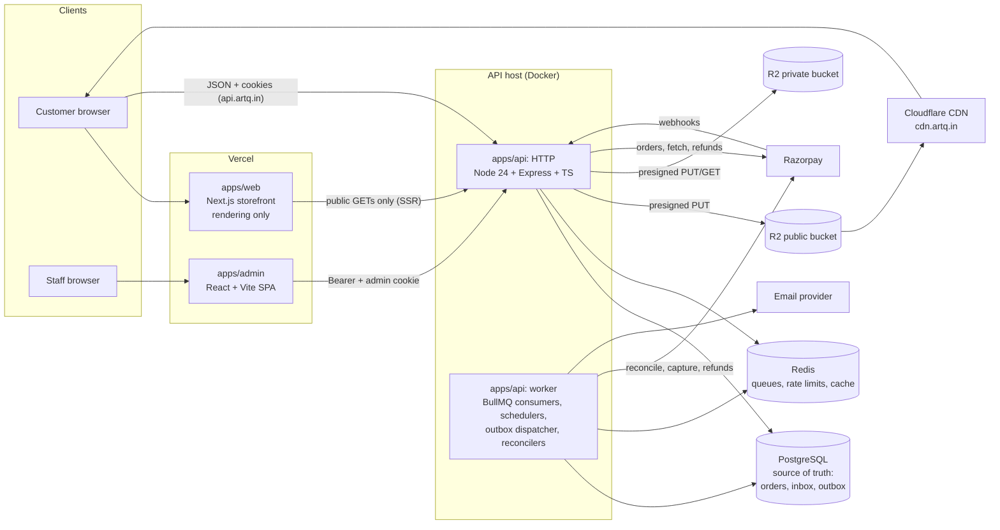
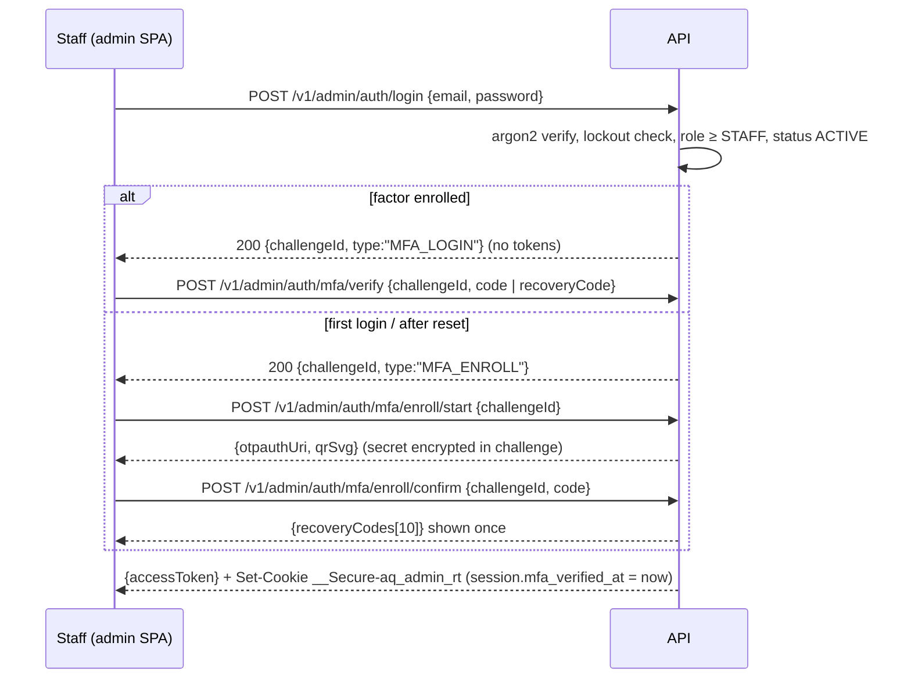

# ArtQ: Technical Architecture

> Companion docs: [database.md](database.md) (data model, SQL) · [api.md](api.md) (contracts) · [product.md](product.md) (rules) · [tasklist.md](tasklist.md) (plan) · [review.md](review.md) (change log)

---

## 1. Architecture at a glance

A **modular monolith**: one Node.js API process type plus one worker process type, sharing one PostgreSQL database. There are no microservices.



**Why this shape**
- **SEO:** the storefront is Next.js with server rendering for public pages.
- **One backend:** the Express API owns every business rule; storefront, admin and any future app are clients.
- **Separate admin SPA:** no SEO needs; isolated deploy and origin (`admin.artq.in`).
- **Durability in Postgres, speed in Redis:** anything that must not be lost (webhook receipts, side-effect intents, idempotency, payment attempts) is written to Postgres first. Redis/BullMQ deliver and schedule work and can be lost without losing correctness (§8).

### 1.1 Rule: the Node.js API is the only backend
Next.js is used **only as a rendering layer**:
- **no** API route handlers (`app/api/*`), **no** Server Actions, **no** database access, **no** secrets (only `NEXT_PUBLIC_*` config);
- **no** auth/session logic: login, refresh, cart, checkout and account calls go from the browser **directly to the API**, which owns the cookies;
- server components `fetch()` only **public, cacheable, non-personal** API endpoints (catalogue, content, settings).

| Responsibility | Lives in |
|---|---|
| Auth, OTP, sessions, MFA, permissions | API |
| Cart, pricing, coupons, shipping calculation, checkout, idempotency | API |
| Payments, Razorpay calls, webhook inbox, reconciliation, refunds | API + worker |
| Orders, inventory, fulfilment, returns, invoices | API |
| Emails, outbox dispatch, image processing, imports, scheduled jobs | Worker |
| SEO HTML and customer UI | Next.js |
| Staff UI | Admin SPA |

### 1.2 What Redis + BullMQ are used for (and what they are not trusted with)
| Use | Example | If Redis is lost |
|-----|---------|------------------|
| Job delivery with retries | email sends, image processing, import batches, webhook processing | Outbox / inbox / import rows are still `PENDING` in Postgres → sweepers re-enqueue |
| Delayed & repeatable jobs | expire unpaid orders (every minute), reconcile payments, daily reports | Schedulers are re-registered at worker start |
| Rate limiting & OTP throttling | login 10/min/IP, OTP 5/h/target | Limits reset (acceptable; argon2 + lockouts in Postgres still apply) |
| Session-state cache | `session:<sid>` → status/role/authVersion (TTL 60 s, deleted on revoke) | Falls back to Postgres lookup |
| App cache | navigation, settings, types/categories | Rebuilt from Postgres |

Redis runs with AOF persistence, but **no correctness property depends on it**.

---

## 2. Tech stack (decisions)

| Layer | Choice | Version policy | Reason |
|-------|--------|----------------|--------|
| Runtime | **Node.js 24 LTS** ("Krypton") | `engines.node >=24.11 <25`; `.nvmrc` = 24; CI runs 24. Node 20 is end-of-life (Apr 2026) and is not used | Supported LTS through Apr 2028; upgrade to Node 26 LTS once it is LTS and dependencies are verified |
| Language | TypeScript (strict) | 5.x | Shared types |
| Monorepo | pnpm workspaces + Turborepo | pnpm 10, turbo 2 | Shared packages, cached builds |
| Storefront | Next.js (App Router) + React | current stable at Phase 0, pinned | SSR/ISR, image optimisation. Frontend only |
| Admin | React + Vite + React Router + TanStack Query/Table + shadcn/ui | pinned | CRUD-heavy SPA |
| Styling | Tailwind CSS + CSS variables | 4 | Token-based design system |
| Forms/validation | React Hook Form + Zod | Zod schemas shared in `packages/shared` | One validation source |
| API | Express | 5 | Simple, known |
| ORM | **Prisma 6.19.x** | pinned; schema validated on 6.19.3. Prisma 7 (config moves to `prisma.config.ts`) evaluated in the Phase 0 spike, adopted only if all tooling passes | Type-safe queries, migrations |
| Database | PostgreSQL | 16+ (managed); validated on 18 | Transactions, row locks, FTS, `pg_trgm` |
| Queue/cache | Redis 7 + BullMQ 5 | pinned | Jobs, schedulers, rate limits |
| Storage | Cloudflare R2: `artq-public` (CDN) and `artq-private` (no public access) | n/a | Cheap, S3 API |
| Images | sharp | pinned | Re-encode, resize, strip metadata |
| Payments | Razorpay Orders API + Checkout.js + webhooks | API v1 | UPI/cards/netbanking |
| Email | Transactional provider with idempotency-key support (Resend or SES) + React Email | n/a | At-least-once delivery with dedupe |
| SMS/WhatsApp | **Not at launch** (post-launch MSG91 after DLT registration) | n/a | Launch OTP is email-only (§5.7) |
| PDF | @react-pdf/renderer | n/a | Invoices, credit notes, packing slips |
| Excel | exceljs | n/a | Imports/exports |
| Password/MFA | argon2id; TOTP (RFC 6238) via `otplib`; AES-256-GCM secret encryption | n/a | n/a |
| Testing | Vitest, Supertest, Testcontainers (Postgres/Redis), Playwright | n/a | Real DB for concurrency tests |
| Monitoring | Sentry, pino logs, uptime checks, Bull Board (admin-only) | n/a | n/a |

**Compatibility spike (task 0.1):** before writing feature code, scaffold all apps on Node 24 and confirm install + build + a smoke test for Next.js, Vite, Prisma (generate + migrate), sharp (prebuilt binary), argon2 (prebuilt), BullMQ/ioredis, exceljs, @react-pdf/renderer, otplib. Record pinned versions in `docs/review.md` §4.

---

## 3. Repository structure

```
artq/
├── apps/
│   ├── web/                    # Next.js storefront (frontend only)
│   │   ├── app/(shop)/…        # home, shop, type/[slug], category/[slug], technique/[slug], product/[slug],
│   │   │                       # search, new-arrivals, trending, cart, checkout, checkout/success/[orderNumber],
│   │   │                       # wishlist, about, contact, faqs, custom-work, [policy]
│   │   ├── app/(auth)/…        # login, signup, verify, forgot-password, reset-password, set-password
│   │   ├── app/(account)/…     # account, account/addresses, orders, orders/[orderNumber], track/[orderNumber]
│   │   ├── app/sitemap.ts, robots.ts, not-found.tsx, error.tsx, layout.tsx, middleware.ts (redirect lookup only)
│   │   ├── lib/                # api-client (public SSR fetch vs. browser fetch), auth-client (refresh coordinator), analytics, format
│   │   └── components/…
│   ├── admin/                  # React + Vite admin SPA
│   │   └── src/routes/         # see product.md §7 for every module
│   └── api/
│       ├── prisma/             # schema.prisma, migrations/, seed/
│       └── src/
│           ├── server.ts, worker.ts, app.ts, config/env.ts
│           ├── lib/            # prisma, redis, logger, errors, money, tax, slug, storage, razorpay, mailer, safe-fetch, crypto
│           ├── middleware/     # requestId, origin-guard, auth, requirePermission, validate, idempotency, rateLimit, cartToken, errorHandler
│           ├── modules/
│           │   ├── auth/       # customer auth, admin auth + MFA, sessions, OTP
│           │   ├── catalog/    # types, categories, techniques, products, variants, publication gate, search
│           │   ├── inventory/  # reservations, adjustments, recounts, movements
│           │   ├── cart/  wishlist/
│           │   ├── checkout/   # pricing, shipping, coupons, initiate, verify, status
│           │   ├── payments/   # attempts, apply-payment, webhooks inbox, reconciliation, exceptions
│           │   ├── orders/     # lifecycle, fulfilment, cancellation, COD remittance
│           │   ├── refunds/  returns/  invoices/
│           │   ├── customers/  coupons-admin/  shipping-admin/
│           │   ├── content/    # reels, testimonials, slides, faqs, cms pages, newsletter, contact
│           │   ├── media/      # presign, complete, private access
│           │   ├── imports/    # catalog + inventory imports
│           │   ├── outbox/     # writer helper + dispatcher
│           │   └── admin/      # dashboard, staff, settings, audit, jobs view
│           ├── jobs/           # queue + scheduler definitions, consumers
│           └── emails/         # React Email templates
├── packages/
│   ├── shared/                 # zod schemas, enums, permission map, money/tax/shipping pure functions
│   ├── ui/                     # Tailwind preset (tokens), primitives
│   └── config/                 # eslint, tsconfig, prettier
├── docs/
├── docker-compose.yml          # postgres, redis, mailpit, minio
└── .github/workflows/
```

Module pattern: `*.routes.ts` (path + middleware) → `*.controller.ts` (parse/shape only) → `*.service.ts` (business logic, transactions, outbox writes) → `*.repo.ts` (complex SQL) → `*.schemas.ts` (zod, strict: unknown keys rejected).

---

## 4. Request lifecycle

```
request → requestId → pino-http → helmet → CORS (allowlist; browser hint only, NOT authorization)
  → body parsers (JSON only, 1 MB; raw body for /v1/webhooks/*)
  → cookieParser → rateLimit (Redis)
  → originGuard (state-changing requests on cookie-authenticated routes, §5.5)
  → cartToken (only on /v1/cart*, /v1/checkout*)
  → authOptional | authRequired(audience) | requirePermission(perm) [+ requireRecentMfa for step-up]
  → validate({body, query, params}) (zod strict)
  → idempotency(operation) (on endpoints listed in api.md §1.2)
  → controller → service → prisma
  → errorHandler → {error:{code,message,details}}; Sentry for 5xx
```
HTTP codes: 400 validation, 401 unauthenticated, 403 forbidden/origin rejected, 404, 409 conflict (stock, idempotency in progress, version), 422 business rule, 423 locked, 429 rate-limited, 502/503 provider unavailable, 500.

---

## 5. Authentication, sessions & authorization

### 5.1 Tokens and cookies
| Credential | Where | Lifetime | Notes |
|-----------|-------|----------|-------|
| Storefront access JWT | JS memory only, `Authorization: Bearer` | 10 min | Claims: `sub`, `sid`, `aud=storefront`, `iss=<env issuer>`, `ver` (session authVersion) |
| Storefront refresh token | Cookie **`__Secure-aq_rt`**: `HttpOnly; Secure; SameSite=Strict; Path=/v1/auth; no Domain attribute` (host-only on `api.artq.in`) | Rotated on every use; session idle 30 d / absolute 90 d | 256-bit random; only its SHA-256 is stored (`refresh_tokens`) |
| Admin access JWT | Admin SPA memory | 5 min | `aud=admin`, includes `mfa_at` |
| Admin refresh token | Cookie **`__Secure-aq_admin_rt`**: same attributes, `Path=/v1/admin/auth` | Session idle 12 h / absolute 7 d | Issued **only after MFA** (§5.8) |
| Cart token | Cookie **`__Secure-aq_cart`**: `HttpOnly; Secure; SameSite=Strict; Path=/v1; host-only` | 30 d | Hash stored in `carts.token_hash` |
| Guest order access | Cookie **`__Secure-aq_order`**: same attributes, `Path=/v1/orders` | 1 h | Signed, scoped to one order (§5.6) |

**Paths match the routes**: the API is versioned under `/v1`, so the refresh endpoint `POST /v1/auth/refresh` receives a cookie with `Path=/v1/auth`. (The previous plan's `Path=/auth` would never have been sent to `/v1/auth/refresh`.)

**Set and clear with identical attributes.** Clearing sends the same name, `Path`, `Secure`, `HttpOnly`, `SameSite` and (absent) `Domain`, with `Max-Age=0` and an empty value. A single `cookies.ts` helper builds both, so they cannot drift.

**Environment isolation.** Cookies are host-only, so production (`api.artq.in`), staging (`api-staging.artq.in`) and local (`localhost:4000`) can never see each other's cookies. Additionally, each environment has its own JWT signing key, `iss` value and cookie-name suffix in non-production (`__Secure-aq_rt_stg`). Local development runs over HTTP on `localhost`, so it uses unprefixed names (`aq_rt_dev`) with `Secure=false`, controlled only by `NODE_ENV=development` (refused at boot otherwise).

`web` (`artq.in`) and `api` (`api.artq.in`) are **same-site** (same registrable domain), so `SameSite=Strict` cookies are sent on the browser's cross-origin `fetch(…, {credentials:'include'})`. The admin (`admin.artq.in`) is also same-site with the API. Staging uses the `artq.in` registrable domain too (`staging.artq.in`, `api-staging.artq.in`); Vercel preview URLs (`*.vercel.app`) are **cross-site**, so previews use a mock API or run without login (documented limitation).

### 5.2 Refresh-token rotation and reuse detection
`POST /v1/auth/refresh` (cookie only, empty JSON body, Origin-checked):
1. Hash the presented token; `SELECT … FROM refresh_tokens JOIN sessions … FOR UPDATE`.
2. Unknown hash → 401 `SESSION_INVALID` + clear cookie.
3. Session revoked/expired, user not `ACTIVE`, or `session.auth_version < user.auth_version` → revoke session, 401, clear cookie.
4. Token `ACTIVE` and not expired → mark `ROTATED` (`rotated_at = now`), insert successor (`parent_id`), extend session idle expiry, return new access token + `Set-Cookie` new refresh token.
5. Token `ROTATED`:
   - **within 30 s grace** of `rotated_at` *and* its successor is still `ACTIVE` (two tabs refreshed at once): return a new access token **without** `Set-Cookie` (the browser already holds the successor from the first response). No new refresh token is minted.
   - otherwise → **reuse detected**: revoke the session and all its tokens (`REUSE_DETECTED`), audit `security.refresh_reuse`, email the user ("new sign-in activity"), 401, clear cookie.
6. Token history is kept for session lifetime + 30 days.

### 5.3 Browser-tab coordination (storefront and admin)
- The refresh call is wrapped in **`navigator.locks.request('aq-refresh', …)`** (Web Locks API), so only one tab refreshes at a time; other tabs wait and then read the fresh token.
- After a successful refresh, the tab broadcasts `{type:'token', accessToken, exp}` on a `BroadcastChannel('aq-auth')`; other tabs adopt it instead of refreshing.
- Logout broadcasts `{type:'logout'}`; all tabs clear memory state.
- On page load (or reload) the app calls refresh once to obtain an access token; a 401 on any API call triggers one coordinated refresh and one retry.
- If Web Locks is unavailable, the server-side 30 s grace window (§5.2) still prevents false reuse detection.

### 5.4 Session revocation and account changes
| Event | Effect |
|-------|--------|
| Logout | Revoke current session; clear cookie |
| Logout everywhere / password change / password reset | `auth_version++`; revoke all sessions (reset also revokes the current one) |
| Staff blocks a user | `status = BLOCKED`, `auth_version++`, revoke all sessions; pending unpaid orders are left to expire normally; paid orders are still fulfilled unless staff cancels |
| Role change / permission-relevant change | `auth_version++`; revoke all **admin** sessions of that user; customer sessions unaffected |
| MFA reset by SUPER_ADMIN | Delete factor + recovery codes, `auth_version++`, revoke admin sessions; user must re-enrol |

Every authenticated request checks the session: `session:<sid>` from Redis (TTL 60 s; **deleted synchronously on revoke**), falling back to Postgres. A request is rejected if the session is revoked/expired, `session.auth_version < user.auth_version`, the user is not `ACTIVE`, or the token audience is wrong. Revocation therefore takes effect on the next request, not at access-token expiry.

### 5.5 CSRF and Origin protection
Bearer-token requests cannot be forged cross-site, because browsers never attach the header automatically. **Cookie-authenticated** endpoints can be, so they get these layers:
1. `SameSite=Strict` cookies (above).
2. **Origin guard** on every non-GET request to a route that reads a cookie (`/v1/auth/*`, `/v1/admin/auth/*`, `/v1/cart*`, `/v1/checkout*`, `/v1/orders/*` guest routes): `Origin` must be present and exactly match the environment allowlist (`https://artq.in`, `https://www.artq.in`, `https://admin.artq.in` for admin auth). A missing or other origin returns 403 `ORIGIN_REJECTED`. If present, `Sec-Fetch-Site` must be `same-origin` or `same-site`.
3. **JSON only**: state-changing endpoints reject `application/x-www-form-urlencoded`, `multipart/form-data` and `text/plain` (except presigned uploads, which go directly to R2), so HTML forms cannot submit them.
4. GET requests never change state.
5. Webhooks are exempt from the Origin check and authenticated by signature.

CORS headers are configured to the same allowlist, but **CORS is a browser read-permission mechanism, not authorization**: every rule above is enforced server-side regardless of CORS.

### 5.6 Customers, guests and identity linking
- **Accounts** are created only by signup (email + password, email OTP verification) or by the **set-password link** sent to a checkout contact email (clicking the link proves mailbox ownership; the account is created with `email_verified_at`).
- **Guest checkout** creates no user row. Contact email/phone are stored on the order as **unverified**.
- **Guest order access** (view, track, cancel, return, invoice):
  1. the order email contains a tracking link with a random token (stored as `orders.tracking_token_hash`). It grants **read-only** tracking (status timeline, items, masked address) until 90 days after completion;
  2. any action (cancel, return request, invoice download, viewing private attachments) requires an **email OTP** to the order's contact email (`GUEST_ORDER_ACCESS`, bound to `order_id`). Success sets `contact_email_verified_at` and issues the 1-hour `__Secure-aq_order` cookie scoped to that order only.
- **Verified-email linking:** when an account's email becomes verified (signup verify, set-password link, email change verify), guest orders whose `contact_email` equals it (case-insensitive) and whose `user_id` is null are linked to the account in one transaction (audited). Linking never happens on phone matches or unverified emails.
- **Conflicts:**
  - A guest checkout using an email that belongs to an existing account is allowed. The order stays guest-owned until that account holder logs in with the verified email, then it is linked. The checkout shows "Have an account? Log in" without revealing whether the account exists.
  - A logged-in customer entering a different contact email/phone at checkout: the order is owned by the logged-in account (`user_id`) and notifications go to the entered contact email. It is not used for linking.
  - Phone numbers are never identity at launch. A verified phone (post-launch) is unique; a conflicting number cannot be verified on a second account.

### 5.7 OTP at launch: email only
SMS/WhatsApp are post-launch (DLT registration needed). At launch:
- Login: **email + password**, or **email OTP**. Phone login is disabled.
- Phone is a contact field only, stored unverified and **not** unique. Changing it needs no OTP because it confers no access.
- When SMS launches (post-launch backlog), phone becomes a login identifier: a phone change then **requires an OTP to the new number** (`PHONE_CHANGE`), and a verified phone becomes unique.
- Email change always requires an OTP to the **new** email plus a notification to the old one; `auth_version++`.

### 5.8 Admin authentication with mandatory MFA
All staff roles (`STAFF`, `ADMIN`, `SUPER_ADMIN`) require TOTP. **No admin access or refresh token is issued before the MFA step completes.**


- **Challenges** expire in 5 minutes, allow 5 attempts, are single-use and bound to IP + user agent.
- **TOTP:** 30-second step, ±1 step tolerance. `last_used_step` prevents replaying the same code.
- **Secret protection:** AES-256-GCM with a 32-byte key from the secret manager (`MFA_ENCRYPTION_KEY`, versioned via `secret_key_version` for rotation). The secret is never returned after enrolment and never logged.
- **Recovery codes:** 10 codes, argon2id-hashed, single use. Using one prompts regeneration.
- **Lost device:** a SUPER_ADMIN resets another staff member's MFA (audited, step-up required). If the last SUPER_ADMIN is locked out, the break-glass procedure is a server CLI (`pnpm admin:reset-mfa --email`). It requires production DB credentials and is recorded in `audit_logs` and the ops log.
- **Step-up:** refunds, payment/settings changes, staff role changes, MFA resets and exports of customer data require `session.mfa_verified_at` within the last **10 minutes**. Otherwise the API returns 401 `STEP_UP_REQUIRED` and the SPA calls `/v1/admin/auth/step-up` (TOTP).
- **Separation:** admin sessions (`audience=ADMIN`) use a separate cookie and route prefix. Staff accounts cannot use storefront login to obtain admin tokens, and storefront tokens are rejected by `/v1/admin/*`.

### 5.9 Permissions
Permissions are declared in `packages/shared/permissions.ts` and checked by `requirePermission()`. **Each endpoint's request schema accepts only the fields its permission covers.** For example, the inventory endpoint's schema has no price fields, and unknown keys are rejected.

| Permission | What it allows | STAFF | ADMIN | SUPER_ADMIN |
|-----------|----------------|:-----:|:-----:|:-----------:|
| `dashboard:read` | Dashboard | ✓ | ✓ | ✓ |
| `orders:read` | Orders list/detail, invoices, packing slips | ✓ | ✓ | ✓ |
| `orders:fulfil` | Confirm, pack, ship (AWB), deliver, RTO, lost | ✓ | ✓ | ✓ |
| `orders:cancel` | Cancel orders | | ✓ | ✓ |
| `refunds:create` | Create refunds (step-up) | | ✓ | ✓ |
| `returns:receive` | Record received/inspected quantities | ✓ | ✓ | ✓ |
| `returns:decide` | Approve/reject returns | | ✓ | ✓ |
| `cod:remit` | Record COD remittances | | ✓ | ✓ |
| `inventory:read` / `inventory:adjust` | Stock view; recounts, write-offs, inventory imports (**on_hand only**) | ✓ / ✓ | ✓ / ✓ | ✓ / ✓ |
| `catalog:read` | Products, types, categories, techniques | ✓ | ✓ | ✓ |
| `catalog:write` | Content, images, variants' non-commercial fields, types/categories/techniques | | ✓ | ✓ |
| `pricing:write` | Variant price, MRP, cost; catalogue imports that change prices | | ✓ | ✓ |
| `catalog:publish` | Publish/unpublish/archive (activation toggle), tax approval | | ✓ | ✓ |
| `imports:catalog` | Catalogue imports | | ✓ | ✓ |
| `customers:read` / `customers:write` | Customers; block/unblock, notes | ✓ (masked contact) / – | ✓ / ✓ | ✓ / ✓ |
| `coupons:write` | Coupons | | ✓ | ✓ |
| `shipping:write` | Shipping rates, zones, serviceability | | ✓ | ✓ |
| `restock:read` / `restock:notify` | Restock requests | ✓ / – | ✓ / ✓ | ✓ / ✓ |
| `content:write` | CMS, reels, testimonials, FAQs, messages | | ✓ | ✓ |
| `media:write` | Upload/delete media | | ✓ | ✓ |
| `payments:exceptions` | View/resolve payment exceptions, run reconciliation | | ✓ | ✓ |
| `jobs:read` / `jobs:retry` | Jobs, webhook inbox, outbox views; retry dead items | | ✓ / – | ✓ / ✓ |
| `settings:write` | Store, shipping, payment toggles (step-up) | | | ✓ |
| `staff:manage` | Staff users, roles, MFA reset (step-up) | | | ✓ |
| `audit:read` | Audit log | | | ✓ |

---

## 6. Catalogue, caching, pricing & shipping

### 6.1 Cache layers and maximum staleness
| Layer | What | Policy |
|-------|------|--------|
| Next.js ISR | Home, listing, product, content pages (HTML) | `revalidate: 60` |
| API HTTP cache headers | **Allow-listed** public GETs only: `/v1/home`, `/v1/navigation`, `/v1/settings/public`, `/v1/types*`, `/v1/categories*`, `/v1/techniques*`, `/v1/products` (listing), `/v1/products/:slug`, `/v1/pages/*`, `/v1/faqs`, `/v1/testimonials`, `/v1/reels`, `/v1/seo/*` | `Cache-Control: public, max-age=0, s-maxage=60, stale-while-revalidate=60`; never `Set-Cookie`; cookies ignored; `Vary: Accept-Encoding` |
| Cloudflare (API host) | Cache Rule matching exactly the allow-list above; everything else **bypass** | Respects `s-maxage` |
| Redis app cache | navigation, settings, taxonomy | TTL 300 s, deleted on admin write |
| Cloudflare (CDN host) | Public media renditions | Immutable URLs (content-addressed keys), 1 year |

**Maximum staleness for public catalogue display:** about **3 minutes** (60 s ISR + 60 s edge + 60 s SWR). This is acceptable because price and stock are always re-validated live in cart and checkout.

**Never cached by any shared cache** (`Cache-Control: private, no-store`): everything under `/v1/auth`, `/v1/me`, `/v1/cart`, `/v1/checkout`, `/v1/orders`, `/v1/admin`, `/v1/uploads`, `/v1/products/:slug/availability`, `/v1/pincodes/*/serviceability`, and any response that depends on a cookie or `Authorization`. The PDP fetches availability client-side after hydration.

### 6.2 Listing filters: same-variant semantics
A product matches when **at least one active variant satisfies all variant filters at once** (size, colour, thickness, price range, in-stock):
```sql
WHERE p.status = 'ACTIVE' AND p.deleted_at IS NULL
  AND EXISTS (SELECT 1 FROM product_variants v
              WHERE v.product_id = p.id AND v.is_active AND v.deleted_at IS NULL AND v.price IS NOT NULL
                AND ($sizes IS NULL OR v.size = ANY($sizes))
                AND ($colors IS NULL OR v.color = ANY($colors))
                AND ($min IS NULL OR v.price >= $min) AND ($max IS NULL OR v.price <= $max)
                AND (NOT $inStock OR v.on_hand - v.reserved > 0))
```
So "20 gm + Metallic Gold + in stock" never matches a product whose gold variant is out of stock while another colour is in stock. The card's displayed "From ₹" uses the cheapest **matching** variant. Price sorting uses the matching variants' minimum. Facet counts apply all other filters (excluding the facet's own dimension) with the same `EXISTS` semantics.

### 6.3 Search
`products.search_vector` is rebuilt by DB triggers when the product, its variants (SKU/size/colour/thickness/active), its category name or its type name change (database.md §6). `pg_trgm` handles typo-tolerant suggestions. A `search.rebuild` admin action recomputes everything.

### 6.4 Pricing engine (`packages/shared/pricing.ts`, called only by the API)
```
priceCart(lines, {coupon, destination, paymentMethod, settings}) →
  1. load variants: must be ACTIVE product + active variant + price present; else line error
  2. lineTotal = price × qty; mrpTotal = (mrp ?? price) × qty
  3. subtotal = Σ lineTotal; mrpDiscount = Σ(mrpTotal − lineTotal)
  4. couponDiscount = validateCoupon(...) (capped, eligible lines only), allocated to lines pro-rata (largest remainder)
  5. shipping = shippingCharge(...)   ← §6.5, the only shipping formula
  6. codFee = paymentMethod === COD ? settings.codFee : 0   (never waived by free shipping)
  7. total = subtotal − couponDiscount + shipping + codFee
  8. per-line included GST (database.md §4.4 rounding)
  returns { lines[], subtotal, mrpTotal, mrpDiscount, couponDiscount, shipping{…}, codFee, total, warnings[] }
```

### 6.5 Shipping charge: the single authoritative algorithm
```
Inputs: lines (variant weight_g, dims, shipping_class, qty), destination pincode, subtotal, couponDiscount,
        coupon type, settings.SHIPPING, zone slabs
1. Serviceability: pincode_serviceability row (else defaults D-6). Not serviceable ⇒ error PINCODE_NOT_SERVICEABLE.
   Any SURFACE_ONLY line and the pincode is air-only ⇒ error SHIPPING_RESTRICTED.
2. Per unit chargeable grams = max(weight_g, volumetric_g), where volumetric_g = ceil(L×W×H / divisor × 1000)
   (divisor 5000; dims required for BULKY variants; others may omit dims ⇒ volumetric = 0).
3. W = Σ(unit chargeable × qty) + packagingWeightG (150 g; BULKY lines add their own box weight via dims).
4. zone = state.shipping_zone; slabs sorted by max_weight_g.
   rate(W) = first slab with max ≥ W  → slab.rate
           = last slab rate + ceil((W − lastMax) / 1000) × zone.extra_per_kg      (if W > lastMax)
5. Free-shipping eligibility: eligible = (subtotal − couponDiscount) ≥ freeThreshold  OR  coupon.type = FREE_SHIPPING
6. If not eligible: shipping = rate(W)
   If eligible and (!heavyCapEnabled or W ≤ heavyCapG): shipping = 0
   If eligible and W > heavyCapG:  shipping = ceil((W − heavyCapG) / 1000) × zone.extra_per_kg
7. COD fee is added separately (§6.4 step 6) and is never part of free shipping.
Output: {actualWeightG, chargeableWeightG, zoneId, rate, shipping, freeShippingApplied, heavySurcharge, remainingForFree}
```
Worked example (Kerala, last slab 5 kg = ₹220, extra ₹40/kg, threshold ₹1,000, cap 10 kg): two 6 kg resin packs (₹10,900; weights here are illustrative, since real packed weights come from D-10) give W = 12,000 + 150 = 12,150 g. The order is eligible, so shipping = ceil(2,150/1000) × ₹40 = **₹120**. An ineligible order of the same weight would pay rate(W) = ₹220 + ceil(7,150/1000) × ₹40 = **₹540**.

Product-specific handling: resin/hardener variants are `SURFACE_ONLY` by default. Glass/acrylic frames and large frames are `BULKY` and need dimensions. Courier acceptance of resin (possible dangerous-goods classification) is business decision D-7; until confirmed, resin ships surface only.

### 6.6 Publication gate
Product status changes to `ACTIVE` only through `POST /v1/admin/products/:id/publish` (`catalog:publish`). The service evaluates the checklist (product.md §8.7), stores `readiness`, and refuses with 422 `NOT_PUBLISHABLE` and the failing checks. The DB check `products_active_gate_ck` is the backstop. Any later edit that breaks readiness (for example deleting the last ready image, or setting a weight back to estimated) is rejected while the product is `ACTIVE`, unless it is unpublished first.

---

## 7. Checkout & payments

### 7.1 Principles
1. **A Razorpay checkout signature proves authenticity, not capture.** We mark an order `PAID` only after fetching the payment from Razorpay and confirming: `status = captured`, `payment.order_id` equals the **stored** `payment_attempts.provider_order_id` for this order, `amount` equals the attempt amount, `currency = INR`.
2. **Persist before calling out.** The payment attempt row (with our `receipt`) exists before `orders.create` is called; results are written after.
3. **No DB transaction spans a network call.**
4. **Everything is idempotent and monotonic**: idempotency keys on client mutations, unique provider ids, status ranks, inbox dedupe, outbox + consumer dedupe.
5. **Every unresolved money state is visible** as a `payment_exception` in the admin.

### 7.2 Happy path
```mermaid
sequenceDiagram
  participant C as Browser
  participant API
  participant DB as Postgres
  participant RZ as Razorpay
  participant WK as Worker
  C->>API: POST /v1/checkout/initiate (Idempotency-Key K)
  API->>DB: claim idempotency (scope cart/user, op, K, hash)
  API->>DB: TX1 reserve stock + coupon, create order PENDING_PAYMENT, attempt CREATING (receipt AQA_n)
  API->>RZ: orders.create {amount, currency INR, receipt AQA_n, notes{order}} (timeout 10 s)
  API->>DB: TX2 attempt CREATED + provider_order_id; idempotency COMPLETED (response stored)
  API-->>C: 201 {orderNumber, razorpay{keyId, orderId, amount}}
  C->>RZ: Checkout.js
  RZ-->>C: {payment_id, order_id, signature}
  C->>API: POST /v1/checkout/verify {orderNumber, paymentId, signature}
  API->>DB: load open attempt → stored provider_order_id
  API->>API: HMAC_SHA256(stored_order_id|payment_id, key_secret) == signature?
  API->>RZ: GET /payments/{payment_id}
  API->>DB: applyPayment TX (database.md §8.3) + outbox order.placed
  API-->>C: 200 {status:"PLACED"} or 202 {status:"PROCESSING"}
  RZ-->>API: webhook payment.captured / order.paid
  API->>DB: inbox insert (commit) → 200
  WK->>RZ: fetch payment (source of truth) → applyPayment (no-op if already applied)
  WK->>DB: outbox → email jobs
```

### 7.3 Failure and recovery matrix
| Situation | Detection | Handling | Customer sees |
|-----------|-----------|----------|---------------|
| Stock unavailable | TX1 conditional update returns 0 rows | Rollback; idempotency COMPLETED with 409 response | Cart refreshed with "only N left" |
| Razorpay `orders.create` definitively fails (4xx) | Provider response | TX: attempt `CREATION_FAILED`; order stays `PENDING_PAYMENT` with reservations until expiry; idempotency COMPLETED with `201 {payment:null, retryPayment:true}` | "Payment couldn't start. Retry" → `/payment/retry` |
| Razorpay timeout / 5xx / network error | Exception | Attempt `PROVIDER_UNKNOWN`; response 202 `{status:"PAYMENT_STARTING", retryAfter:3}`; idempotency left `PROCESSING` with short lock | Spinner, then automatic retry with the same key |
| API crashes after Razorpay created the order, before TX2 | Attempt still `CREATING`; idempotency `PROCESSING` with expired lock | On client retry (same key) or the reconciler (every minute): `GET /orders?receipt=AQA_n` → if found, adopt `provider_order_id` → `CREATED`; if not found after 2 min → create a new provider order for the **same attempt receipt** (or mark `CREATION_FAILED`) | Same as success once adopted |
| Client repeats initiate (double click, retry) | Same key | `COMPLETED` → replay stored response; `PROCESSING` + live lock → 409 `REQUEST_IN_PROGRESS` + `Retry-After`; same key + different body → 422 `IDEMPOTENCY_KEY_REUSED` | Single order |
| Client sends a new key for the same cart while an order is pending | `orders_one_pending_per_cart_uq` | Return the existing pending order (200) instead of creating another | Same order |
| Signature invalid | HMAC mismatch | 422 `PAYMENT_VERIFICATION_FAILED`; audit; the webhook/reconciler remains the source of truth | "Verifying payment…" then real status |
| Provider fetch fails during verify | Timeout | `payment_status = PROCESSING`; 202 `{status:"PROCESSING"}`; client polls `GET /v1/checkout/status/:orderNumber` (every 3 s, up to 2 min) | "We're confirming your payment" |
| Payment `authorized` not captured | Fetch status | `PROCESSING`; reconciler captures after 15 min if the order is still valid, else exception `CAPTURE_STUCK_AUTHORIZED` | "Processing" |
| Amount/currency/order mismatch | Fetch compare | Not applied; `AMOUNT_MISMATCH` / `CURRENCY_MISMATCH` exception | "Verifying", then staff contacts the customer |
| Payment failed | Fetch / webhook `payment.failed` | Record payment `FAILED` (rank 1); order stays `PENDING_PAYMENT`; customer can retry with Razorpay or switch to COD (new idempotency key, op `payment.retry`) | "Payment failed. Retry" |
| Capture races expiry | Expiry job | **Pre-expiry check**: before expiring, fetch payments for every open attempt (outside TX). Captured/authorized ⇒ apply instead of expiring. The expiry TX requires `payment_status = UNPAID` | Correct state |
| Capture after expiry or cancellation | Webhook/reconciler | database.md §4.6 rules | Confirmation or refund notice |
| Second distinct capture | `applyPayment` sees order already `PAID` | `EXCESS` allocation + auto refund + exception | Duplicate-payment refund notice |

**Payment retry** (`POST /v1/orders/:orderNumber/payment/retry`, Idempotency-Key, op `payment.retry`): allowed while `PENDING_PAYMENT` and not expired. It closes the previous open attempt (`CLOSED`) after checking with the provider that it has no authorized/captured payment, creates a new attempt (`CREATING` → provider → `CREATED`), and extends `expires_at` by at most 15 minutes (maximum total 60 minutes).

### 7.4 Reconciliation (worker schedulers)
| Job | Schedule | Action |
|-----|----------|--------|
| `payments.reconcile-attempts` | every 1 min | Attempts in `CREATING`/`PROVIDER_UNKNOWN` older than 60 s: find the provider order by receipt; adopt or create/mark failed. Attempts `CREATED` for `PENDING_PAYMENT`/`PROCESSING` orders: `GET /orders/{id}/payments` → apply any captured, capture stale authorized |
| `orders.expire-pending` | every 1 min | Pre-expiry provider check, then the database.md §8.4 TX |
| `refunds.reconcile` | every 5 min | Refunds `REQUESTED` (not sent) → send; `UNKNOWN`/`PENDING` → `GET /payments/{id}/refunds`, match by `receipt` → update status |
| `payments.reconcile-daily` | 02:30 IST | List the previous day's Razorpay payments and refunds; compare with DB: missing → `UNLINKED_PAYMENT`; amount/status differences → `RECON_MISMATCH` |
| `inventory.drift-check` | 03:00 IST | `variant_reservation_drift`, `product_aggregate_drift`, coupon counters → alert |
| `cod.remittance-overdue` | daily | COD orders `COD_COLLECTED` > 14 days without remittance → notification |

Razorpay API capabilities assumed here (fetch order by `receipt`, list payments of an order, capture, refund with `receipt`, list refunds of a payment, `x-razorpay-event-id` header) are **verified in the Phase 4 payment spike against the test account before implementation**. Any gap is recorded in review.md §4.

---

## 8. Webhooks, outbox & background jobs

### 8.1 Durable webhook inbox
`POST /v1/webhooks/razorpay`:
1. Read the raw body and verify `X-Razorpay-Signature` = HMAC-SHA256(rawBody, `RAZORPAY_WEBHOOK_SECRET`) with a constant-time compare. Invalid → 400 (not stored).
2. `INSERT … ON CONFLICT (provider, event_id) DO NOTHING` with `event_id` from the `x-razorpay-event-id` header, then **commit**.
3. Best-effort `queue.add('webhook.process', {id}, {jobId: 'wh:'+id})`.
4. Respond **200 only after step 2 committed**. If the DB is unavailable, respond 503 so Razorpay retries.
5. Duplicate delivery: if the row is `PROCESSED`/`IGNORED`, respond 200. If `RECEIVED`/`FAILED`, or `PROCESSING` with an expired lock, re-enqueue and respond 200.

**Processing** (worker): claim (database.md §8.7), then **re-fetch the authoritative object from Razorpay** (payment, refund or order) and apply it with monotonic rules. Event order therefore does not matter: an old `payment.authorized` arriving after `payment.captured` cannot lower the rank. Mark `PROCESSED` in the same transaction as the domain change. On error, mark `FAILED` with exponential backoff (30 s × 2ⁿ, max 1 h); after 10 attempts mark `DEAD` and raise a `WEBHOOK_DEAD` exception.
A **sweeper** (every minute) re-enqueues `RECEIVED`/`FAILED` rows due for retry and `PROCESSING` rows whose lock expired (worker crash).

### 8.2 Transactional outbox
Domain transactions insert `outbox_events` rows for every critical side effect:

| Event | Consumers |
|-------|-----------|
| `order.placed` | customer email, admin email + notification, analytics server event (post-launch) |
| `order.status_changed` (confirmed/shipped/delivered/cancelled/expired) | customer email (respecting notify flag) |
| `payment.exception_raised` | admin notification + email |
| `refund.requested` | refund sender (provider call) |
| `refund.processed` / `refund.failed` | customer email, credit-note issuer, admin notification |
| `invoice.render` | PDF renderer (stores private media, sets `invoices.pdf_media_id` once) |
| `variant.back_in_stock` | restock-request emails |
| `return.status_changed` | customer email |
| `account.email_verified` | guest-order linker |

The **dispatcher** (worker, every second, plus `LISTEN/NOTIFY` wake-up) runs database.md §8.8: `FOR UPDATE SKIP LOCKED` batch → `queue.add(consumer, payload, {jobId:'outbox:'+id+':'+consumer})` → mark `DISPATCHED`. A crash re-enqueues the same jobIds, and BullMQ ignores a duplicate jobId while the job exists. Completed jobs are kept for 7 days so late duplicates are still recognised.

### 8.3 Consumers: at-least-once with dedupe
- **DB side effects** (refund sender, guest linker, credit-note issuer): insert into `processed_messages(consumer, message_id)` in the same transaction as the effect; on conflict, skip.
- **Emails:** `email_logs.dedupe_key` (`<event>:<aggregate>:<recipient>`). Insert `SENDING` → call the provider with the same idempotency key → mark `SENT`. If a `SENT` row exists, skip. **Delivery is at-least-once, not exactly-once**: a crash between provider acceptance and the `SENT` update can produce a duplicate, mitigated by the provider idempotency key where supported.
- **Provider calls** (refund send, capture): idempotent by our `receipt`; before retrying an `UNKNOWN` call, query the provider by receipt.
- BullMQ retries: 8 attempts, exponential backoff (5 s base); final failure → job moved to failed set + `OUTBOX_DEAD` or `REFUND_FAILED` exception as applicable.

### 8.4 Job catalogue
| Queue / job | Trigger | Notes |
|-------------|---------|-------|
| `webhook.process` | inbox insert / sweeper | §8.1 |
| `outbox.dispatch` | scheduler 1 s + NOTIFY | §8.2 |
| `email.send` | outbox | §8.3 |
| `refund.send` | outbox `refund.requested` / reconciler | Razorpay refund with `receipt` |
| `invoice.render` | outbox | Private PDF |
| `media.process` | upload complete | §9 |
| `import.apply` | admin confirm | Batches of 25 rows, resumable |
| `payments.*`, `orders.expire-pending`, `refunds.reconcile`, `inventory.drift-check`, `cod.remittance-overdue` | schedulers | §7.4 |
| `reports.daily` | 08:00 IST | Admin summary + low stock |
| `cleanup` | 03:30 IST | Expired OTPs/challenges/idempotency keys (24 h), refresh-token history (session end + 30 d), unclaimed private uploads (24 h), processed webhook payloads > 180 d (metadata kept) |

---

## 9. Media pipeline

### 9.1 Upload (admin and customer)
1. `POST /v1/admin/media/presign` (customers: `/v1/uploads/presign` for custom-work, scoped to the cart; `/v1/me/orders/:n/uploads/presign` or `/v1/orders/:n/uploads/presign` for return photos, scoped to the order) with `{filename, contentType, size, purpose}`. The API checks the allow-list (images: jpeg/png/webp/avif ≤ 15 MB admin / 8 MB customer; video: mp4/webm ≤ 50 MB admin only; xlsx ≤ 5 MB for imports), creates `media` (`PENDING_UPLOAD`, `uploaded_by`, `owner_scope`, `visibility`), and returns a presigned PUT whose signature covers `Content-Type` and `Content-Length`. Expiry 5 minutes.
2. The browser uploads directly to R2.
3. `POST …/media/:id/complete`: only the uploader (same user, or same cart/order scope) may complete. The API `HEAD`s the object; size/type mismatch or a missing object → `REJECTED`; otherwise `UPLOADED` and `media.process` is enqueued.
4. The worker downloads the object, checks magic bytes (`file-type`), decodes with sharp (`limitInputPixels` 40 MP, `failOn: 'error'`), re-encodes to WebP/AVIF at widths 160–1600 (metadata stripped), computes the placeholder and SHA-256 → `READY`. Decode failure → `REJECTED`; transient failure → `FAILED` (retry 3×).
5. Only `READY` media may be attached to anything customer-visible. The publication gate requires a `READY` cover image.

### 9.2 Private media
Return photos, custom-work attachments, invoice/credit-note PDFs and import files live in **`artq-private`**, which has no public URL. Access goes through `GET /v1/…/attachments/:mediaId`. The API authorizes the request (the owning customer's session, the order's guest cookie, or staff with `returns:decide` / `orders:read` / `imports:catalog`) and returns a **302 to a 5-minute presigned GET** with `Cache-Control: private, no-store` and `Content-Disposition: attachment` for non-images. Media ids are not guessable capabilities: every request is authorized.

### 9.3 Remote image downloads (catalogue import): SSRF-safe fetcher
`lib/safe-fetch.ts`, used only by the worker:
- `https:` only; ports 443 only; no credentials in the URL.
- Resolve DNS first and reject private, loopback, link-local, CGNAT, multicast, reserved and cloud-metadata ranges for IPv4 and IPv6 (`10/8`, `172.16/12`, `192.168/16`, `127/8`, `169.254/16`, `100.64/10`, `::1`, `fc00::/7`, `fe80::/10`, `0.0.0.0/8`, …). **Connect to the vetted IP** (pinned lookup), so DNS rebinding cannot swap it.
- Follow at most 3 redirects, re-validating each hop.
- 5 s connect / 30 s total timeout; stream with a **20 MB hard cap**; `Content-Type` must be `image/*`; the result then goes through the same sharp validation as uploads.
- Google Drive share links are converted to the direct-download form only for `drive.google.com` hosts.
- The worker runs with no access to internal admin endpoints. Failures produce a row message (`IMAGE_FETCH_FAILED`) and do not block other rows.

---

## 10. Fulfilment, refunds, returns, COD, invoices

### 10.1 Fulfilment (single shipment in v1)
Confirm → Pack (packing slip PDF) → Ship (courier, AWB, tracking URL, actual weight). Shipping consumes reservations and issues the tax invoice in one transaction (database.md §8.5) → Out for delivery → Delivered (COD: `COD_COLLECTED`). RTO: `RTO_IN_TRANSIT` → `RTO_RECEIVED` (inspect → `RTO_RESTOCK` for sellable units; order `CANCELLED`; prepaid refund per policy, decision D-9; COD `NOT_COLLECTED`; credit note if an invoice exists). Lost: `LOST` → prepaid full refund or manual reship (a new admin order); courier claim tracked in the admin note; `LOST_WRITE_OFF` movement.

### 10.2 Refund flow
1. Admin (or the system, for cancellation/excess/late capture) calls `POST /v1/admin/orders/:id/refunds` (Idempotency-Key, op `refund.create`, step-up for staff) with an item allocation (`[{orderItemId, quantity, amount}]`) + shipping/COD-fee components + reason/kind (+ `returnRequestId`).
2. TX: lock order → lock payment → validate the item bounds and the capacity rule → insert refund `REQUESTED` + items + outbox `refund.requested` (database.md §8.6).
3. Worker `refund.send`: POST Razorpay refund (`amount`, `receipt = AQR_n`, notes). Success → `PENDING` with `provider_refund_id`; timeout → `UNKNOWN` (reconciler queries by receipt); definitive error → `FAILED` + `REFUND_FAILED` exception (capacity released automatically because `FAILED` is excluded from the sum).
4. Webhook `refund.processed` / reconciler → `PROCESSED`: update `payments.amount_refunded`, `orders.refunded_amount`, `order_items.refunded_*`, `payment_status`; outbox → customer email + credit note (if invoiced).
5. COD refunds: method `MANUAL_BANK`. Staff records the bank/UPI transfer reference → `PROCESSED`. Requires the order to be `COD_COLLECTED` or `COD_REMITTED`.

### 10.3 Returns
Request (customer, within `returnWindowHours` of delivery, damaged/wrong/defective/missing only, photos required) → staff decides (approve quantities / reject with reason) → `IN_TRANSIT` (pickup or customer ships) → `RECEIVED` (received qty) → `INSPECTED` (sellable/damaged split; sellable restocked) → refund created referencing the return → `REFUNDED` → `CLOSED`. "Missing item" returns skip receipt and go from approval to refund.

### 10.4 Invoices and credit notes
- **Issued at dispatch** (`invoiceAt = DISPATCH`, subject to accountant approval, decision D-2). This avoids credit notes for pre-shipment cancellations. Before dispatch, customers get an **order confirmation** (not a tax invoice).
- Number format: `AQ/26-27/000001` (tax invoice) and `CN/26-27/000001` (credit note), ≤ 16 characters, consecutive per series per financial year via `invoice_counters` (locked row inside the dispatch/credit-note transaction).
- Content: seller legal name, address, GSTIN and state code; buyer name, address and GSTIN if provided; place of supply; per line HSN, qty, taxable value, rate, CGST+SGST (intra-state) or IGST (inter-state); shipping/COD-fee lines taxed per decision D-3; rounding adjustment; total in words.
- Immutable once issued (DB trigger). Any correction is a **credit note** referencing the original. Refunds after dispatch create credit notes for the refunded item/shipping amounts.
- The format, rates, HSN codes and the shipping-charge tax treatment must be **approved by the client's accountant before launch** (task 7.5).

### 10.5 COD remittance
Staff record each courier remittance (reference, date, amount, list of order numbers/AWBs). The service checks each order is `COD_COLLECTED` and its amount equals the order total, sets `COD_REMITTED`, and raises `COD_REMITTANCE_MISMATCH` for differences.

---

## 11. Security checklist
- HTTPS only (HSTS preload after launch); helmet; strict CSP on web/admin (allow Razorpay checkout, CDN, analytics).
- Cookie and Origin rules (§5.1, §5.5); CORS allowlist (not authorization).
- Server-calculated prices, totals, shipping and tax; client `expectedTotal` only detects drift.
- Strict zod schemas (unknown keys rejected) per permission (§5.9); parameterised SQL only.
- Rich text sanitised server-side (`sanitize-html` allowlist).
- Rate limits (api.md §6); argon2id; login lockout 5 failures / 15 min; OTP attempt caps.
- Admin MFA mandatory; step-up for sensitive actions; audit log for all admin mutations and security events.
- Razorpay checkout signature + **server-side payment fetch**; webhook signature on the raw body; secrets only in the secret manager; admin settings never show or store keys.
- Media: presign constraints, ownership check, magic-byte sniffing, re-encode; private bucket for customer files; SSRF-safe fetcher.
- IDOR protection: every customer resource is looked up by (owner, identifier), never by identifier alone; guest access needs a scoped cookie.
- PII minimisation in logs (emails masked, no addresses, no tokens). Customer data export/delete on request (DPDP Act 2023).
- Dependency scanning (Dependabot, `pnpm audit`), lockfile committed, CI on pinned Node 24.

---

## 12. Environments, promotion, migrations, rollback

| Env | Web | Admin | API | DB / Redis / R2 | Payments | Notes |
|-----|-----|-------|-----|-----------------|----------|-------|
| local | `localhost:3000` | `localhost:5173` | `localhost:4000` | docker Postgres/Redis, MinIO, Mailpit | Razorpay test | `aq_*_dev` cookies |
| staging | `staging.artq.in` | `admin-staging.artq.in` | `api-staging.artq.in` | **separate** DB, Redis, buckets | Razorpay **test** keys + test webhook | `noindex`, basic-auth on web, synthetic data only (no production PII) |
| production | `artq.in` (`www` → 301) | `admin.artq.in` | `api.artq.in` | managed PG with PITR, Redis with AOF, R2 | live keys | MFA mandatory |

Separate credentials, JWT keys, MFA encryption keys, webhook secrets and cookie names per environment. No environment can reach another's database.

**Promotion:** merge to `main` → CI builds **one** API Docker image (tagged with the git SHA) → deploy to staging → automated smoke + Playwright purchase test on staging (Razorpay test mode) → manual approval → **the same image digest** is deployed to production. Web/admin: the Vercel staging deployment is promoted to production (no rebuild).

**Migrations (expand → migrate → contract):**
1. Every migration must be **backward-compatible with the currently running API version** (add nullable columns/tables/indexes `CONCURRENTLY`; no renames or drops in the same release).
2. `prisma migrate deploy` runs as a release step **before** the new API starts. A failure aborts the release with the old version still serving.
3. Destructive changes (drop/rename) ship in a later release, after the code no longer uses the old shape.
4. Data backfills run as idempotent jobs, not inside migrations.

**Rollback:** redeploy the previous image digest (the schema is still compatible by rule 1). Schema rollbacks are not run in production. Data-corrupting incidents are handled by point-in-time restore into a new instance and a controlled cutover (§13). Feature flags (`settings`) can disable COD, online payment or checkout entirely ("store in maintenance") without a deploy.

---

## 13. Backups, recovery & operations

| Item | Target |
|------|--------|
| **RPO** (max data loss) | **≤ 5 minutes** for Postgres (managed PITR / continuous WAL archiving) |
| **RTO** (time to restore service) | **≤ 4 hours** for a full DB restore; ≤ 30 minutes for an app rollback |
| Postgres backups | PITR window 7 days + daily snapshots kept 30 days + monthly kept 12 months (encrypted, separate account/region where the provider allows) |
| R2 media | Daily `rclone sync` of both buckets to a second storage account; invoices are also re-renderable from immutable DB snapshots |
| Redis | AOF every second; not a backup target (state is rebuildable, §1.2) |
| Restore drill | Before launch and then **quarterly**: restore to a scratch instance, run integrity queries (drift views empty, invoice sequence gap-free, order counts), record the time taken |

**Alerts** (to the on-call email/Slack; P1 also by phone):

| Alert | Severity |
|-------|----------|
| API 5xx rate > 2 % for 5 min; `/health/ready` failing | P1 |
| Webhook endpoint returning non-2xx; inbox `FAILED`/`DEAD` > 0 for 15 min | P1 |
| Open payment exceptions older than 1 h (`EXCESS_CAPTURE`, `LATE_CAPTURE_*`, `AMOUNT_MISMATCH`, `REFUND_FAILED`) | P1 |
| Outbox `PENDING` older than 5 min, or `DEAD` > 0 | P2 |
| Orders `PROCESSING` > 30 min; attempts `PROVIDER_UNKNOWN` > 10 min | P2 |
| Drift views non-empty; `OVERSOLD` exception | P2 |
| Daily reconciliation mismatch | P2 |
| BullMQ failed jobs > 10 / 10 min; Redis unavailable | P2 |
| Backup job failure; restore drill overdue | P2 |
| Certificate expiry < 14 days | P3 |

**Ownership:**

| Area | Owner |
|------|-------|
| Platform, deployments, alerts P1/P2, backups, restore drills | Eayila Consultancy tech lead (primary on-call), second developer (secondary) |
| Payment exceptions queue, refunds, COD remittance, returns decisions | ArtQ store owner / admin (business hours; P1 money alerts also copied) |
| Catalogue readiness, stock counts, publication | ArtQ admin |
| Razorpay/courier account settings, KYC | ArtQ owner |
| Tax configuration and invoice format | ArtQ owner + accountant |

---

## 14. Performance plan
- ISR for public pages; `next/image` with CDN renditions and correct `sizes`; `next/font`.
- Hero video `preload="none"` with poster; skipped when `saveData` is on.
- Razorpay script loaded only on checkout; lightbox/zoom dynamically imported.
- API: Prisma `select` minimal fields; indexes per database.md; listing uses the `EXISTS` variant query with `variants_filter_idx`.
- Targets: Lighthouse mobile ≥ 90 on home/listing/PDP; LCP < 2.5 s (4G); CLS < 0.1; API p95 < 300 ms; checkout initiate p95 < 1.5 s including Razorpay.

## 15. Observability
Structured JSON logs (`requestId`, `userId`, `orderNumber`, `attemptId`, `eventId`); Sentry for all apps; `/health` (process) and `/health/ready` (DB + Redis); admin **Jobs & Webhooks** view (queue depths, failed jobs, inbox status counts, outbox backlog, last reconciliation run) and **Payment Exceptions** view (product.md §7).

## 16. Scaling path
| When | Do |
|------|----|
| > 50k visits/day | More API/worker replicas (stateless); Redis-cached listing queries |
| > 5k products | Meilisearch/Typesense |
| Heavy video | Cloudflare Stream / Mux |
| Split shipments / multiple warehouses | `shipment_items`, `warehouses`, per-warehouse stock (database.md §11) |
