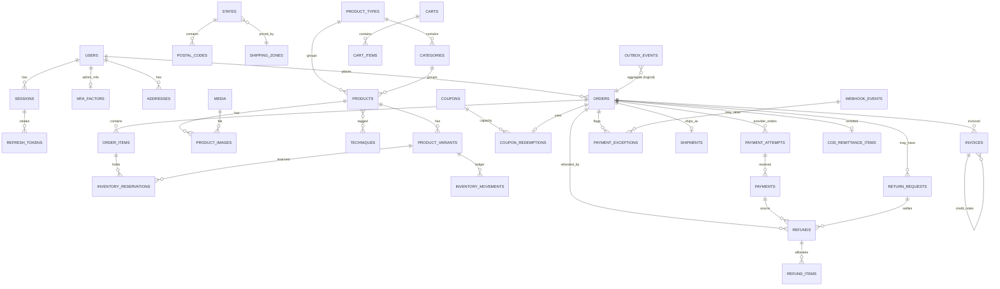

# ArtQ: Database Design

> **PostgreSQL 16 (pinned major for deployment; validated on 16.14, forward-compatibility run on 18.3)** · Prisma ORM 6.19.3 · Extensions: `pg_trgm`, `citext`, `unaccent`
> Companion docs: [architecture.md](architecture.md) (flows, jobs) · [api.md](api.md) (contracts) · [catalog.md](catalog.md) (data) · [review.md](review.md) (change log)
>
> **Authority:** §5 (Prisma schema) is the source of truth for columns and types; §6 (`0002`) adds constraints and triggers Prisma
> cannot express; §6b (`0003`) contains the **money/stock functions the API calls**. §3–§4 explain semantics; §8 shows how services call
> the functions. If prose and code blocks disagree, the code blocks win and the prose is a bug.
>
> **Executable checks:** `tools/doc-validation` extracts §5, §6 and §6b from this file and runs them on PostgreSQL 16.14 with real
> concurrency (review.md §6). It validates the database layer only; the application does not exist yet.

---

## 1. Conventions

| Rule | Detail |
|------|--------|
| Names | Tables `snake_case` plural; Prisma models PascalCase singular mapped with `@@map`; columns `snake_case` via `@map` |
| Keys | `INT` identity PKs internally. Customers see slugs, order numbers (`AQ10001`), payment receipts (`AQA_…`), never raw ids |
| Money | **Integer paise** everywhere (`₹849 → 84900`). No floats, no `DECIMAL` money. Rounding happens once, per line (see §4.4) |
| Weight | Integer grams. Dimensions in cm (`DECIMAL(6,1)`) |
| Time | `TIMESTAMPTZ` stored UTC; displayed Asia/Kolkata |
| Deletion | Catalogue, users and coupons are **soft-deleted** (`deleted_at`). Anything referenced by an order, payment, refund, invoice, reservation or movement uses `ON DELETE RESTRICT`. Orders, order items, payments, refunds, invoices, movements and audit logs are **never deleted** |
| Snapshots | Orders copy product name, variant label, SKU, prices, tax, weight and addresses at purchase. `order_items` commercial columns and issued `invoices` are immutable (DB triggers, §6) |
| Enums | Postgres enums via Prisma (multi-line `enum` blocks; single-line enums are invalid Prisma syntax) |
| Case-insensitive text | `CITEXT` for emails and coupon codes |
| JSON | Only for flexible/opaque data (settings values, provider payloads, pricing snapshot, import messages). Never for fields we filter or join on |
| Concurrency | Short transactions; row locks in the **global lock order** (§4.1); explicit locks are `FOR NO KEY UPDATE` (never plain `FOR UPDATE`, which conflicts with the key-share locks taken by foreign-key checks and caused 149 deadlocks in C09; primary keys are never updated). The only exception is work-queue claiming (`outbox_deliveries`, `search_reindex_queue`), which uses `FOR UPDATE SKIP LOCKED` on rows nothing references concurrently; triggers never lock rows of other tables; optimistic `version` column on products/variants/orders for admin edits |
| Critical transactions | Payment application, reservations, releases, refunds, inventory adjustments, idempotency, inbox/outbox leases and session validity are **database functions** (`aq_*`, §6b) called by the services, so the tested code is the shipped code. Every side effect inside them is gated by an affected-row check |
| External calls | **Never inside a DB transaction.** Persist intent → commit → call provider → persist result (architecture.md §7) |

---

## 2. Entity-relationship overview



---

## 3. Tables: semantics and invariants

### 3.1 Identity, sessions, MFA

| Table | Purpose & rules |
|-------|-----------------|
| `users` | Registered accounts only (**no guest user rows**). `email` required, unique among non-deleted users. `phone` optional and **not a login identifier at launch**; unique only once verified (`users_phone_verified_uq`). **Two authorization versions**: `storefront_auth_version` and `admin_auth_version`. Role changes and MFA resets increment only `admin_auth_version` (`aq_change_role`); block, password change/reset, email change and "log out everywhere" increment both (`aq_revoke_all_sessions`). A session is valid only while its `auth_version` equals the user's version **for its audience** (`aq_session_valid`). `status`: `PENDING_VERIFICATION` (signed up, email unverified) → `ACTIVE` ↔ `BLOCKED`; `DELETED` (anonymised after 30 days) |
| `sessions` | One login on one device. `audience` = `STOREFRONT` or `ADMIN`; `auth_version` copied from the matching user column at creation. A `CUSTOMER`-role user can never hold a valid admin session (admin tokens are never accepted by storefront routes and vice versa). Idle expiry (storefront 30 d, admin 12 h) and absolute expiry (storefront 90 d, admin 7 d). `mfa_verified_at` used for admin step-up. `revoked_at` + `revoke_reason` (`LOGOUT`, `REUSE_DETECTED`, `BLOCKED`, `ROLE_CHANGED`, `PASSWORD_RESET`, `ADMIN_REVOKED`, `MFA_RESET`) |
| `refresh_tokens` | Token **history** per session: only the SHA-256 hash is stored. `ACTIVE` → `ROTATED` (with `rotated_at`) → never reactivated. Presenting a `ROTATED` token outside the 30-second grace window = reuse → whole session revoked (architecture.md §5.2). Rows retained for session life + 30 days |
| `auth_challenges` | Pending MFA step: `MFA_LOGIN`, `MFA_ENROLL` (holds the encrypted pending TOTP secret), `STEP_UP`. 5-minute expiry, max 5 attempts, single use |
| `mfa_factors` | One confirmed TOTP factor per staff user. Secret encrypted (AES-256-GCM, envelope key version `secret_key_version`); `last_used_step` blocks TOTP replay |
| `mfa_recovery_codes` | 10 one-time codes, argon2id-hashed; `used_at` set on use |
| `otp_codes` | Email OTPs at launch (`channel = EMAIL`). Purposes: `SIGNUP_VERIFY`, `LOGIN`, `GUEST_ORDER_ACCESS` (bound to `order_id`), `EMAIL_CHANGE`; `PHONE_CHANGE` reserved for when SMS launches. Hash = sha256(code + pepper); 10-min expiry; 5 attempts |
| `password_reset_tokens` | Hashed single-use link token, 30 min |

### 3.2 Geography, addresses, serviceability

| Table | Purpose & rules |
|-------|-----------------|
| `countries`, `states` | India + 36 states/UTs with GST state code (`gst_code`, Kerala = `32`) and `shipping_zone_id` |
| `postal_codes` | **Geography only** (India Post directory): pincode → office, district, state. Used to auto-fill city/state. *Existence of a pincode does not mean ArtQ can deliver there* |
| `pincode_serviceability` | **Commercial delivery rules**: deliverable?, COD allowed?, EDD range, source (`MANUAL` or `CSV` at launch, courier API later). Resolution order: explicit row → default policy setting `SHIPPING.defaultServiceable` / `SHIPPING.defaultCod` (business decision D-6, product.md §11). **Surface reach (D-7, settled in task 4.4):** whether surface transport reaches a pincode comes from `SHIPPING.airOnlyPincodePrefixes` (default `744` Andaman & Nicobar, `68255` Lakshadweep; owner + courier to confirm), not from this table: SURFACE_ONLY items (resin) cannot ship to an air-only pincode (`SHIPPING_RESTRICTED`). The `surface_only` column cannot express "air only", so it is informational only and not used by the shipping algorithm (dropping it would be a contract-phase migration) |
| `addresses` | Customer address book (max 10, one default). Orders never reference addresses; they snapshot them |

### 3.3 Catalogue

| Table | Purpose & rules |
|-------|-----------------|
| `product_types` | Homepage tiles / admin "Product Types" (Resins, Wooden Frames…). `tile_link_url` lets a tile point elsewhere (e.g. "UV Resin" tile → `/category/uv-resin`) |
| `categories` | Sub-groups within one type. `UNIQUE(id, type_id)` enables the composite FK that guarantees a product's category belongs to its type |
| `techniques` | Cross-cutting tags (reference site calls them "occasions"); admin "Techniques" |
| `products` | `status`: **`DRAFT`** (default; never visible), **`ACTIVE`** (visible; see "Publication gate: who enforces what" below), **`ARCHIVED`** (hidden, kept for history). `type_id`/`category_id` nullable **only for drafts** (an import with an unknown type yields a genuine *Unassigned* state, never a fake "Unknown"). `readiness` JSON stores the last publication-gate evaluation (product.md §8.7); `data_flags` holds import warnings (`STOCK_AMBIGUOUS`, `DESCRIPTION_SUSPECT_COPY`, `SIZE_CONFLICT`, `WEIGHT_ESTIMATED`, `PRICE_MISSING`…). Aggregates `min_price`, `max_price`, `max_mrp`, `available_qty`, `active_variant_count` are maintained in the same transaction as variant changes (§7). `import_key` = stable product handle across imports. `search_vector` is computed by a BEFORE trigger on the product's own columns; variant/category/type changes append to `search_reindex_queue` and the search worker rebuilds within seconds (§7) |
| `product_variants` | The buyable unit. `price` nullable **only while draft** (publication gate requires it). `net_quantity` + `net_unit` (`G`, `KG`, `ML`, `PCS`, `IN`) normalise sizes ("500GM", "500 gm" → 500 G). **Inventory:** `on_hand` = physical sellable units in the store; `reserved` = Σ active reservations; **available = on_hand − reserved**. `inventory_counted_at` set by a physical count (publication requires it). Shipping: `weight_g` + `weight_source` (`ESTIMATED` blocks publication), optional dims, `shipping_class` (`STANDARD`, `BULKY`, `SURFACE_ONLY`). **No backorders in v1** (no `allow_backorder` column). Dimensions: all three absent, or all three present and positive (`variants_dims_ck`) |
| `product_images` | Ordered images; exactly one cover. Only `media.status = READY` images are exposed to the storefront |
| `product_relations` | Frequently bought together / similar |
| `slug_redirects` | Old slug → new slug for 301s |
| `size_charts` | Optional size chart per category/product |


**Publication gate: who enforces what**

| Rule (product.md §8.7) | Service (`catalog.publish`) | Database |
|------|:---:|------|
| Type + category set; category belongs to type | ✓ | ✓ `products_category_matches_type_fk`, `products_active_gate_ck`, trigger |
| Description present, no unresolved data flags (product and variants) | ✓ | ✓ `products_publish_gate_trg` (on every transition to `ACTIVE`) |
| HSN + GST approved | ✓ | ✓ check + trigger |
| READY public cover image | ✓ | ✓ trigger (checks `media.status = 'READY'`) |
| Every active variant: price, normalised size/unit, counted stock, **measured** weight, dims if bulky | ✓ | ✓ trigger |
| `is_publishable` / `readiness` / `published_at` stored | ✓ sets them | `is_publishable` alone proves nothing; the trigger recomputes `product_readiness_failures()` from the related rows |
| A related row changes **after** publication (image fails, weight set back to estimated, variant flagged) | ✓ edit-guard rejects the change while ACTIVE | ✗ the trigger cannot see it; the `published_not_ready` view is checked nightly and raises `PUBLISHED_NOT_READY` |
| MRP ≥ price, price > 0 | ✓ | ✓ variant checks |
### 3.4 Media

| Column group | Rules |
|---|---|
| `visibility` | `PUBLIC` (catalogue, CMS, served via CDN) or `PRIVATE` (return photos, custom-work attachments, invoice PDFs, import files; separate bucket, short-lived signed URLs after an authorization check) |
| `status` | `PENDING_UPLOAD` (presigned) → `UPLOADED` (object HEAD verified) → `PROCESSING` → `READY` / `REJECTED` (type/size/decode failure) / `FAILED` (processing error, retryable) |
| Integrity | `declared_mime`/`declared_size` from the presign request; `detected_mime` (magic bytes) and `size_bytes` (actual) after upload; mismatch ⇒ `REJECTED`. `checksum_sha256` for dedupe |
| Ownership | `uploaded_by` + `owner_scope` (`admin`, `return:<orderId>`, `custom-work:<cartTokenHash>`, `import`). An upload can be attached only by its owner within its scope; unattached private uploads are purged after 24 h (`claimed_at` null) |
| Deletion | Soft delete; FK `RESTRICT` from every referencing table, so in-use media cannot be removed |

### 3.5 Inventory

**Model:** `available = on_hand − reserved`. Every change writes an `inventory_movements` row with both deltas and the resulting values.

| Event | `on_hand` | `reserved` | Reservation row | Movement reason |
|-------|-----------|-----------|-----------------|-----------------|
| Checkout initiates (prepaid or COD) | – | +q | `ACTIVE` | `RESERVE` |
| Payment expires / order cancelled before shipment | – | −q | `RELEASED` (`release_reason`) | `RELEASE` |
| Shipment dispatched (fulfilment → `SHIPPED`) | −q | −q | `CONSUMED` | `CONSUME` |
| Late capture after expiry, stock reacquired | – | +q | **new** `ACTIVE` row | `RESERVE` |
| Physical recount (admin sets counted quantity) | set to counted | – | – | `RECOUNT` (delta recorded) |
| Damage / write-off in store | −q | – | – | `DAMAGE_WRITE_OFF` |
| Return received & inspected: sellable units | +q | – | – | `RETURN_RESTOCK` |
| Return received: damaged units | – | – | – | `RETURN_DAMAGED` (0 deltas, audit only) |
| RTO received back (inspected sellable) | +q | – | – | `RTO_RESTOCK` |
| Shipment lost | – | – | – | `LOST_WRITE_OFF` (0 deltas; stock already consumed) |
| Catalogue import: **new** variant only | set initial | – | – | `IMPORT_INITIAL` |
| Inventory import (count sheet) | set/delta | – | – | `RECOUNT` / `ADJUSTMENT` (`import_id`) |

Rules:
- Checkout reserves only if `on_hand − reserved ≥ q` (`aq_reserve_order`: conditional `UPDATE` per line, variants ascending, then products ascending). **Nothing ever writes `reserved` except reservation transitions** (`aq_reserve_order`, `aq_release_unpaid_order`, dispatch consumption).
- Recounts, adjustments, write-offs and inventory imports go through `aq_adjust_on_hand` and change only `on_hand`. A count lower than `reserved` is accepted (physical truth), creates an `OVERSOLD` exception and makes `available` negative until resolved (cancel/refund or restock). Checkout can never create this state.
- The catalogue import **never** changes `on_hand` of existing variants (it reports `STOCK_IGNORED`); stock changes go through the separate inventory import or the Inventory page.
- `variant_reservation_drift` (§6) must always be empty; the nightly job alerts on rows.

`stock_notifications` = admin **"Restock Requests"**: email (+ optional user) waiting for a variant. When a variant's `available` goes from 0 to > 0 inside a transaction, an outbox event `variant.back_in_stock` is written; the consumer emails pending requests and marks them `NOTIFIED`.

### 3.6 Cart

`carts.token_hash` = sha256 of the `aq_cart` cookie value (raw token never stored). `contact_email/phone` captured at checkout step 1 are **unverified** and used only for that checkout and abandoned-cart reminders (post-launch, consent-gated). Cart items hold `added_price` only for "price changed" notices; checkout always re-prices.

### 3.7 Coupons

`coupons.reserved_count` + `redeemed_count` ≤ `usage_limit_total` (DB check). `coupon_redemptions` (one per order):

| Status | Meaning | Counter effect |
|--------|---------|----------------|
| `RESERVED` | Checkout created a pending order with this coupon | `reserved_count +1` |
| `REDEEMED` | Payment captured (prepaid) or COD order placed | `reserved −1`, `redeemed +1` |
| `RELEASED` | Unpaid order expired/cancelled | `reserved −1` (**`redeemed_count` untouched**) |
| `REVERSED` | A *redeemed* order was cancelled before shipment and policy restores the use | `redeemed −1` |

`over_limit = true` marks a redemption honoured without capacity (late capture after the last use was taken). It is **excluded from counters**, raises `COUPON_OVER_LIMIT`, and the customer is never charged more than they paid.
Functions: `aq_reserve_coupon` (checkout), redemption inside `aq_apply_provider_payment`, release inside `aq_release_unpaid_order`, reversal by `aq_reverse_coupon` (migration `0006`, inside the cancellation transaction). Every counter change is gated by the redemption-row transition that justifies it (`UPDATE … WHERE status = 'RESERVED'` with an affected-row check), so a repeated call cannot move a counter twice.
Per-customer limit counts `RESERVED` + `REDEEMED` (not over-limit) rows matching `user_id`, or for guests `customer_email` (normalised). Guest email/phone are unverified, so this limit is best-effort for guests (documented limitation).

### 3.8 Shipping

`shipping_zones` (with `extra_per_kg`) + `shipping_rate_slabs` (zone × max weight → rate). The single algorithm is in architecture.md §6.5; settings in `SHIPPING`.

### 3.9 Orders: four independent state dimensions

| Dimension | Column | Values |
|-----------|--------|--------|
| Lifecycle | `status` | `PENDING_PAYMENT`, `PLACED`, `CONFIRMED`, `COMPLETED`, `CANCELLED`, `EXPIRED` |
| Payment | `payment_status` | `UNPAID`, `PROCESSING` (authorized / provider unknown), `PAID`, `PARTIALLY_REFUNDED`, `REFUNDED`, `COD_PENDING`, `COD_COLLECTED`, `COD_REMITTED`, `NOT_COLLECTED` (COD RTO/cancel) |
| Fulfilment | `fulfilment_status` | `UNFULFILLED`, `PACKED`, `SHIPPED`, `OUT_FOR_DELIVERY`, `DELIVERED`, `RTO_IN_TRANSIT`, `RTO_RECEIVED`, `LOST` |
| Returns | `return_status` | `NONE`, `OPEN`, `CLOSED` (detail in `return_requests`) |

Every change in any dimension writes `order_status_history(dimension, from_value, to_value, actor)`. Transition tables: §4.

Other order rules:
- `user_id` is set only when the buyer was **authenticated** at checkout, or later by verified-email linking (architecture.md §5.6). Guest orders have `user_id NULL`.
- `contact_email` / `contact_phone` are unverified unless `contact_email_verified_at` is set (account email, guest OTP, or set-password link).
- `captured_amount` = sum of `APPLIED` captured payments (excess captures excluded). `refunded_amount` = sum of `PROCESSED` refunds. Check: `refunded_amount ≤ captured_amount` (prepaid) or `≤ total` (COD manual refunds).
- `pricing_snapshot` (JSON) stores the full `priceCart()` output used to create the order (zone, slabs, thresholds, coupon rule) for audit.
- `tracking_token_hash`: hash of the guest tracking link token.
- `has_open_exception` drives the admin badge; maintained by the exception service.

`order_items` are immutable snapshots (trigger). Mutable counters: `return_requested_qty`, `returned_qty`, `refunded_qty`, `refunded_amount`, all bounded by checks.

### 3.10 Idempotency, payments, refunds, exceptions

| Table | Rules |
|-------|-------|
| `idempotency_keys` | `UNIQUE(scope, operation, key)`. `scope` = `user:<id>` / `cart:<id>` / `order:<number>` (guest order cookie) / `staff:<id>`. `operation` ∈ `checkout.initiate`, `payment.retry`, `order.cancel`, `refund.create`, `return.create`. **`target_resource`** = the resource the request mutates (`cart:<id>`, `order:<number>`, `order:<id>` for admin). **`request_hash`** = sha256 of canonical JSON `{operation, target, scope, body}` (api.md §1.2). `aq_idempotency_begin` returns `NEW`, `REPLAY`, `IN_PROGRESS`, `TAKEOVER` or `CONFLICT`; a different target **or** hash under the same key is always `CONFLICT`. **Ownership fencing:** `NEW` and `TAKEOVER` issue a fresh `owner_token` and `generation + 1`; attaching the resource (`aq_idempotency_attach`), renewing the lease (`aq_idempotency_renew`) and completing (`aq_idempotency_complete`) all require the current token, and `aq_idempotency_assert_owner` is the first statement of every transaction that acts for the request, so a stale owner's domain mutation rolls back before commit. A `TAKEOVER` returns the attached resource so the new owner **resumes** it (order, attempt, refund) instead of recreating it. Retention 24 h |
| `payment_attempts` | One per **Razorpay order**, created **before** calling Razorpay (`CREATING`, our `receipt` `AQA_<id>`); `provider_order_id` stored when known; at most one open attempt per order. `PAID` when a captured payment is applied; `CLOSED` when superseded/expired; `CREATION_FAILED` when Razorpay definitively rejected creation |
| `payments` | One per **Razorpay payment id** (unique). Monotonic `status_rank`: `CREATED 0 < FAILED 1 < AUTHORIZED 2 < CAPTURED 3 < REFUNDED 4` (failed → authorized allowed: Razorpay late authorization). **`allocation`** is NULL until the first time the payment is seen captured, then set **exactly once** under the order lock: `APPLIED` (funds the order), `EXCESS` (another APPLIED payment already funds the order, whatever its later refund state), `LATE` (order expired without restorable stock, or cancelled), `HELD` (amount/currency mismatch, **partially refunded before ArtQ applied it**, or unexpected order state), `VOID` (**captured and fully refunded before ArtQ applied it**: funds nothing), `UNLINKED` (no attempt maps its provider order *yet*). The `allocation IS NULL → value` update is **the gate** for every payment side effect (§8.2). **Capture history ≠ eligibility to fund:** `status_rank ≥ 3` means "was captured"; only a payment with `provider_amount_refunded = 0` may become `APPLIED`/`EXCESS`/`LATE`. **UNLINKED recovery:** once the attempt's `provider_order_id` exists, the next verify/webhook/reconciler call performs the one-time transition `UNLINKED → (order_id, attempt_id bound, allocation NULL)` under the order lock (gated `WHERE allocation = 'UNLINKED' AND order_id IS NULL`), then allocates normally and resolves the `UNLINKED_PAYMENT` exception. Identity (provider order id, amount, currency, bound order) is never overwritten; a mismatching report returns `CONFLICT` + `PAYMENT_IDENTITY_CONFLICT`. `provider_amount_refunded` (provider's `amount_refunded`, monotonic), `refund_reserved` (counted refunds) and `amount_refunded` (processed) with `amount_refunded ≤ refund_reserved ≤ amount`; `provider_amount_refunded > refund_reserved` on an allocated payment raises `RECON_MISMATCH` (money refunded at the provider that the ledger does not explain) |
| `refunds` | Every refund, provider or manual. `status`: `REQUESTED` (capacity reserved) → `PENDING` (provider accepted) → `PROCESSED`; `UNKNOWN` (outcome unknown; resend the **same** attempt or reconcile); `FAILED` (definitive; capacity released); `CANCELLED` (manual COD refund withdrawn before processing via `aq_cancel_manual_refund`; capacity released; online refunds are never cancelled because a provider call may be in flight). **Counted toward capacity: `REQUESTED`, `PENDING`, `UNKNOWN`, `PROCESSED`.** Components `items_amount + shipping_amount + cod_fee_amount + unallocated_amount = amount`; `unallocated_amount` only for `EXCESS_CAPTURE`/`LATE_CAPTURE` refunds of a non-funding payment (allocation `EXCESS`, `LATE`, `HELD` or `VOID`) and for **`PROVIDER_INITIATED`** refunds: money the provider had already refunded when ArtQ first allocated the payment, recorded once as `PROCESSED` (idempotency key `provider-refunded-<payment id>`) so payment capacity can never refund it again. `attempt_no` = current provider attempt. `idempotency_key` = the API key (unique per order). `method = MANUAL_BANK` for COD (no payment, no provider attempt) |
| `refund_attempts` | One per provider call series: **`provider_idempotency_key`** (`artq-refund-<id>-a<n>`, sent as `X-Refund-Idempotency`), `receipt` (`AQR_<id>_A<n>`, correlation only), immutable `request` JSON (payment id, amount, speed, receipt, notes). Retries of the same attempt reuse key + request byte-for-byte; a retry after `FAILED` creates attempt n+1 with a new key and receipt |
| `refund_items` | Item allocation (quantity, amount, included tax) for credit notes and item capacity |
| Capacity counters | `order_items.refund_reserved_qty/amount` (≤ quantity / net_amount), `orders.refund_reserved_total` (≤ captured_amount, or total for COD), `refund_reserved_shipping` (≤ shipping_fee), `refund_reserved_cod_fee` (≤ cod_fee), `payments.refund_reserved` (≤ amount). Changed only by `aq_refund_capacity(refund, ±1)` with conditional updates; `refunded_*` counters (processed) are always ≤ the reserved ones (DB checks) |
| `payment_exceptions` | Durable queue of money/stock problems: `AMOUNT_MISMATCH`, `CURRENCY_MISMATCH`, `EXCESS_CAPTURE`, `LATE_CAPTURE_EXPIRED`, `LATE_CAPTURE_CANCELLED`, `UNLINKED_PAYMENT`, `CAPTURE_STUCK_AUTHORIZED`, `PROVIDER_ORDER_UNKNOWN`, `REFUND_FAILED`, `REFUND_UNKNOWN`, `REFUND_IDEMPOTENCY_MISMATCH`, `PAYMENT_IDENTITY_CONFLICT`, `REFUNDED_BEFORE_APPLY` (OPEN for partial, auto-RESOLVED for full), `WEBHOOK_DEAD`, `OUTBOX_DEAD`, `RECON_MISMATCH`, `COUPON_OVER_LIMIT`, `OVERSOLD`, `COD_REMITTANCE_MISMATCH`, `PUBLISHED_NOT_READY`, `REFUNDED_OUTSIDE_ARTQ` (refunds made at the provider outside ArtQ, recorded by reconciliation; OPEN for staff to allocate for credit notes). `dedupe_key` unique so repeated detection never duplicates |

### 3.11 Reliability tables

| Table | Rules |
|-------|-------|
| `webhook_events` | **Durable inbox.** `UNIQUE(provider, event_id)`. `RECEIVED` → `PROCESSING` (claimed with a fresh **`lease_token`** + `locked_until`) → `PROCESSED`/`IGNORED`, or `FAILED` (retry at `next_attempt_at`, exponential) → `DEAD` after 10 attempts (`WEBHOOK_DEAD`). Completion, failure and renewal are **fenced** by the lease token (§8.6); `webhook_lease_ck` keeps token and status consistent. The endpoint acknowledges only after the insert committed |
| `outbox_events` | **Transactional outbox**: one row per domain event, written in the *same transaction* as the domain change (`aq_emit`) |
| `outbox_deliveries` | One row **per (event, consumer)**: `PENDING` → `LEASED` (claim: `lease_token`, `lease_expires_at`, `generation + 1`) → `PUBLISHED` (broker accepted; fenced ack) → `COMPLETED` (consumer finished; **durable dedupe record**). `PUBLISHED` rows not completed within the redelivery timeout are re-leased and republished (Redis may have lost them); after 10 generations → `DEAD` + `OUTBOX_DEAD`. PostgreSQL alone can reconstruct all outstanding work |
| `search_reindex_queue` | Append-only product ids (no unique key, so concurrent inserts never wait on each other) drained by the search worker |
| `email_logs` | `dedupe_key` unique (`<event>:<aggregate>:<recipient>`) + `outbox_delivery_id`. Insert `SENDING` → provider call with the same idempotency key → `SENT`. **At-least-once**: a crash after the provider accepted but before `SENT` can resend unless the provider deduplicates the key |
| `audit_logs` | Every admin mutation and security event, with before/after, session, IP |

### 3.12 Fulfilment, COD, returns, invoices

| Table | Rules |
|-------|-------|
| `shipments` | **v1 = exactly one shipment per order** (`UNIQUE(order_id)`); split fulfilment is out of scope (post-launch would add `shipment_items`). `UNIQUE(courier_name, awb_number)` |
| `cod_remittances` + `cod_remittance_items` | Courier remittance batches; each COD order appears in at most one remittance (`UNIQUE(order_id)`). Amount mismatch vs order total ⇒ `COD_REMITTANCE_MISMATCH` |
| `return_requests` + items + media | `REQUESTED` → `APPROVED`/`REJECTED` → `IN_TRANSIT` → `RECEIVED` → `INSPECTED` → `REFUNDED` → `CLOSED` (or `CANCELLED`). Per item: `requested_qty ≥ approved_qty ≥ received_qty`; `sellable_qty` and `damaged_qty` are recorded together, each between 0 and `received_qty`, summing to `received_qty` (`return_items_qty_ck`); the request cannot become `INSPECTED` while any approved item lacks a complete inspection (`return_inspection_complete_trg`). `order_items.return_requested_qty` bounds the total across all non-rejected requests (≤ quantity). Photos are `PRIVATE` media |
| `invoices` | Immutable tax documents: `TAX_INVOICE` (one per order, issued at dispatch) and `CREDIT_NOTE` (references `original_invoice_id` and `refund_id`). `number` ≤ 16 chars (GST rule), unique per kind+FY via `invoice_counters`. Seller/buyer snapshots, place of supply, per-line HSN/taxable/CGST/SGST/IGST, rounding adjustment. Only the PDF reference may be set once after issue (trigger) |

### 3.13 Content & system
`reels`, `testimonials`, `home_slides`, `faqs`, `cms_pages`, `newsletter_subscribers`, `contact_messages` (+ private attachments), `search_logs`, `seo_overrides`, `redirects`, `settings`, `notifications`, `product_imports` + `product_import_rows` (§9).

**Settings keys** (`settings.key`, JSON value):

| Key | Example | Public |
|-----|---------|:------:|
| `STORE_INFO` | `{name:"ArtQ", legalName, gstin, address, stateCode:"32", phone, email, whatsapp}` | partly |
| `ANNOUNCEMENT_BAR` | `{enabled:true, messages:["Shipping all over India","Free shipping on orders above ₹1000"]}` | ✓ |
| `HOME_SECTIONS`, `HERO`, `INSTAGRAM_MOMENTS`, `SOCIAL` | home layout & content | ✓ |
| `SHIPPING` | `{freeThreshold:100000, packagingWeightG:150, volumetricDivisor:5000, heavyCapG:10000, heavyCapEnabled:true, defaultServiceable:true, defaultCod:true, estimatedDays:{min:4,max:7}, airOnlyPincodePrefixes:['744','68255']}` (edited on the admin Shipping Rates page; a stored value without `airOnlyPincodePrefixes` reads as the default) | ✓ (subset) |
| `PAYMENT` | `{razorpayEnabled:true, codEnabled:true, codFee:4000, codMin:20000, codMax:500000, pendingExpiryMinutes:30, autoRefundExcessCapture:true}` | ✓ (no secrets) |
| `ORDER` | `{customerCancelUntil:"UNFULFILLED", returnWindowHours:48, completeAfterDays:7}` | ✓ |
| `TAX` | `{pricesIncludeTax:true, shippingTaxRule:"CA_DECISION", invoiceAt:"DISPATCH"}` | |
| `NOTIFY` | `{adminEmails:[…], dailySummary:true, lowStockEmail:true}` | |

Payment provider **secrets are never stored in `settings`**; they live in the secret manager / environment.

---

## 4. State machines and concurrency rules

### 4.1 Global lock order (all writers, including triggers)
Every transaction acquires row locks in this order and only in this order. Explicit locks use `FOR NO KEY UPDATE`; conditional `UPDATE`s lock implicitly.

| Step | Rows | Notes |
|------|------|-------|
| 1 | The claimed lease/ownership row: `idempotency_keys` (`aq_idempotency_assert_owner`, API requests), `webhook_events` (`aq_webhook_begin`) or `outbox_deliveries` (`aq_outbox_begin_consume`) | At most one per transaction |
| 2 | `orders` (ascending id if several) | Payment application, releases, refunds, fulfilment, returns |
| 3 | **Order-owned rows**: `order_items`, `inventory_reservations`, `coupon_redemptions`, `refunds`, `refund_items`, `refund_attempts`, `return_requests` (+items), `shipments`, `invoices` of that order | Only modified while holding that order's lock, so their relative position is free; within the group, ascending id |
| 4 | `payments` (ascending id) | |
| 5 | `product_variants` (ascending id) | Catalogue edits first lock **all** variants they touch, ascending, before touching the product (`aq_edit_variants`) |
| 6 | `products` (ascending id) | Aggregates (`aq_refresh_products`), sold counts, search rebuild (worker locks the product, then computes) |
| 7 | `coupons` | |
| 8 | `invoice_counters` | Dispatch / credit notes |

**Triggers never lock rows of another table.** The product search vector is computed in a BEFORE trigger on the product row itself; variant, category and type changes only append to `search_reindex_queue`. (The previous design updated the parent product from the variant trigger, i.e. a product lock *inside* the variant loop. The validator's negative control shows it deadlocks: 43–74 deadlocks per 600 mixed operations, versus 0 in 1,200 with this order; review.md §6.)

| Flow | Lock sequence |
|------|---------------|
| Checkout reserve (`aq_reserve_order`) | order → variants ↑ → products ↑ (→ coupon via `aq_reserve_coupon`) |
| Release unpaid (`aq_release_unpaid_order`) | order → reservations → variants ↑ → products ↑ → coupon |
| Payment application (`aq_apply_provider_payment`) | order → payment → (late capture: variants ↑ → products ↑) → products ↑ (sold) → coupon |
| Refund request / retry / result (`aq_request_refund`, `aq_retry_refund`, `aq_refund_attempt_result`) | order → payment → order items ↑ (order-owned) |
| Inventory adjustment / import (`aq_adjust_on_hand`) | variants ↑ → products ↑ |
| Catalogue variant edit (`aq_edit_variants`) | all variants of the product ↑ → product |
| Taxonomy rename | category/type row only (+ queue inserts) |
| Search worker (`aq_process_search_queue`) | queue rows (SKIP LOCKED) → each product ↑ individually |
| Dispatch | order → reservations → variants ↑ → products ↑ → invoice counter |

### 4.2 Order lifecycle (`status`)

| From | To | Trigger | Notes |
|------|----|---------|-------|
| — | `PENDING_PAYMENT` | prepaid checkout initiated | reservations + coupon `RESERVED`; `expires_at = now + 30 min` |
| — | `PLACED` | COD checkout (`aq_place_cod_order`, migration `0007`) | `payment_status = COD_PENDING`; coupon `REDEEMED` |
| `PENDING_PAYMENT` | `PLACED` | captured payment applied | `payment_status = PAID`; coupon `REDEEMED` |
| `PENDING_PAYMENT` | `EXPIRED` | expiry job, **after** pre-expiry provider check finds no authorized/captured payment | reservations `RELEASED`; coupon `RELEASED` |
| `PENDING_PAYMENT` | `CANCELLED` | customer abandons ("cancel and edit cart") / admin | same releases; any later capture → refund (§4.6) |
| `EXPIRED` | `PLACED` | late capture **and** stock reacquired for every line | new reservations; coupon re-reserved/redeemed or `over_limit` |
| `PLACED` | `CONFIRMED` | admin confirms | |
| `PLACED`, `CONFIRMED` | `CANCELLED` | customer (only while `fulfilment_status = UNFULFILLED`) or admin (while `UNFULFILLED`/`PACKED`) | one transaction, lock order §4.1: `UPDATE orders … WHERE status IN ('PLACED','CONFIRMED') AND fulfilment_status IN (…)` must affect 1 row, then release ACTIVE reservations, then prepaid ⇒ `aq_request_refund(kind CANCELLATION, all items + shipping)`, then coupon `aq_reverse_coupon(order)` (migration `0006`): `UPDATE coupon_redemptions SET status='REVERSED' WHERE order_id=… AND status='REDEEMED'` and only if that affected 1 row (and not over-limit) `redeemed_count − 1` (D-14) |
| `CONFIRMED` | `COMPLETED` | system, `completeAfterDays` after `DELIVERED` with no open return | |
| `CONFIRMED` | `CANCELLED` | RTO received (fulfilment `RTO_RECEIVED`) | prepaid ⇒ refund per policy; COD ⇒ `NOT_COLLECTED` |
| `CANCELLED`, `EXPIRED`*, `COMPLETED` | — | terminal (*except the late-capture path above) | |

### 4.3 Fulfilment (`fulfilment_status`), single shipment
`UNFULFILLED → PACKED → SHIPPED → OUT_FOR_DELIVERY → DELIVERED`; `SHIPPED/OUT_FOR_DELIVERY → RTO_IN_TRANSIT → RTO_RECEIVED`; `SHIPPED/OUT_FOR_DELIVERY → LOST`. Fulfilment starts only after the order is **confirmed** (`status = CONFIRMED`) and (prepaid) `payment_status = PAID` or (COD) `COD_PENDING`. `SHIPPED` consumes reservations and issues the tax invoice in the same transaction.

### 4.4 Payment (`payment_status`)

| From | To | Trigger |
|------|----|---------|
| `UNPAID` | `PROCESSING` | an `AUTHORIZED`, not-yet-allocated payment is observed. `PROCESSING` is **derived**: it holds only while such a payment exists (a verify call that cannot reach the provider changes nothing on the order) |
| `UNPAID`/`PROCESSING` | `PAID` | a payment with provider status `captured`, matching amount/currency/provider order, is applied |
| `PROCESSING` | `UNPAID` | `aq_reassess_order_payment`, under the order lock, whenever a payment resolves without funding the order (`VOID`, `HELD`) and no other authorized, unallocated payment remains (e.g. an authorization the provider voided and refunded). The order then expires normally and releases stock and coupon once; `aq_release_unpaid_order` also refuses to expire while a live authorization exists |
| `PAID` | `PARTIALLY_REFUNDED` / `REFUNDED` | refund `PROCESSED` (refunded < / = captured) |
| `COD_PENDING` | `COD_COLLECTED` | fulfilment `DELIVERED` |
| `COD_COLLECTED` | `COD_REMITTED` | order included in a recorded remittance |
| `COD_PENDING` | `NOT_COLLECTED` | RTO / cancellation |
| `COD_*` | `PARTIALLY_REFUNDED` / `REFUNDED` | manual refund processed after collection |

Rounding: per order line, included tax = `net − round_half_up(net × 100 / (100 + rate))`; CGST = floor(tax/2), SGST = tax − CGST; IGST = tax. Totals are sums of line values; any difference to the paise total is shown as `rounding_adjustment` (normally 0).

### 4.5 Refunds and returns
- **Capacity is reserved at every level in one transaction** (`aq_refund_capacity`, §8.5): each item's `refund_reserved_qty/amount`, the order's shipping, COD-fee and total counters, and the payment's `refund_reserved`. Allocations in `REQUESTED`, `PENDING`, `UNKNOWN` and `PROCESSED` all count; `FAILED`/`CANCELLED` release (policy: a definitive provider failure frees the capacity; an `UNKNOWN` or idempotency-mismatch outcome keeps it reserved until resolved). Concurrent requests serialise on the order lock and conditional updates, so one item cannot be over-refunded even while the payment still has room.
- **Retry of a FAILED refund** (`aq_retry_refund`) reacquires the same item/component/order/payment capacity atomically **before** creating attempt n+1. If a newer refund has consumed it, the retry fails with `REFUND_EXCEEDS_CAPACITY` and the refund stays `FAILED`.
- **Provider-refund reconciliation gate.** If the provider reports more refunded on a payment than the ledger reserves (`provider_amount_refunded > refund_reserved`: refunds made outside ArtQ, e.g. in the Razorpay dashboard, after allocation), **no new refund and no retry** may reserve capacity on that payment (`REFUND_RECONCILIATION_REQUIRED`). Comparing against `refund_reserved` (which already includes ArtQ's own requested, pending and unknown refunds) means ArtQ's own refunds never trigger the gate. The reconciler then fetches the payment's refund list and calls `aq_reconcile_provider_refunds`: refunds matching ArtQ's own (provider refund id, attempt receipt or `notes.aq_refund_id`) are marked processed once and never counted as external; the rest are recorded once (cumulatively, idempotent) as `PROCESSED` `PROVIDER_INITIATED` refunds reducing payment capacity and, for an `APPLIED` payment, order capacity and `refunded_amount`. The gate clears and the `RECON_MISMATCH` exception is resolved only when the ledger explains the provider total.
- **Manual COD refunds** use the same counters (order total instead of captured amount); there is no payment row or provider attempt.
- Item amount refundable per unit = `net_amount / quantity` (last unit absorbs rounding). Shipping is refunded only for full pre-dispatch cancellation, or at admin discretion for merchant-fault returns. COD fee is refunded only for full pre-dispatch cancellation.
- Return approval ≠ receipt ≠ inspection. Restock (`RETURN_RESTOCK`) only for `sellable_qty` after inspection. A return refund links `refunds.return_request_id`.
- A refund after the tax invoice was issued creates a `CREDIT_NOTE` once `PROCESSED`.

### 4.6 Late and excess captures

| Situation | Action | Customer communication |
|-----------|--------|------------------------|
| Duplicate notification of the **same** payment id (verify, webhook, reconciler, retries) | `allocation` already set ⇒ `DUPLICATE`, **no side effects** (monotonic status / refunded-amount update only) | none |
| Capture reported **before** the attempt's provider order id was saved | Recorded `UNLINKED` (no order touched, `UNLINKED_PAYMENT` exception). After the mapping exists, the next verify/webhook/reconciler call binds it once and allocates normally; the exception is resolved | normal flow once recovered |
| Payment report whose provider order, amount or currency differs from the stored payment, or that maps to a different order | `CONFLICT`: nothing attached or changed; `PAYMENT_IDENTITY_CONFLICT` exception | "We're verifying your payment" |
| **First** observation already **fully refunded** (`refunded`, or `amount_refunded = amount`) | `allocation = VOID`; order not funded (stays unpaid/expires); provider refund recorded once as `PROVIDER_INITIATED` (capacity exhausted, so no second refund); `REFUNDED_BEFORE_APPLY` auto-resolved | "Your payment was refunded; the order was not placed" (with the expiry notice) |
| **First** observation **partially refunded** (`captured`, `0 < amount_refunded < amount`) | `allocation = HELD` (no funding policy); refunded part recorded as `PROVIDER_INITIATED`; `REFUNDED_BEFORE_APPLY` OPEN for staff; only the remainder can still be refunded | "We're verifying your payment" |
| Captured and applied (or HELD), later reported (more) refunded | `DUPLICATE`; if the provider's refunded amount exceeds ArtQ's reserved refunds ⇒ `RECON_MISMATCH` and the **refund gate closes** for that payment; reconciliation records the outside refunds once (order totals updated for APPLIED payments), then the gate reopens | per refund flow |
| **AUTHORIZED**, then voided/refunded by the provider before capture | `VOID`; order reassessed `PROCESSING → UNPAID` (unless another live authorization exists) and then expires normally, releasing stock and coupon once | "Payment not completed" |
| Second **distinct** captured payment while another payment is `APPLIED` to the order, including after `PARTIALLY_REFUNDED`/`REFUNDED` | `allocation = EXCESS`; exception `EXCESS_CAPTURE`; automatic refund of that payment (`EXCESS_CAPTURE`, `unallocated_amount`) | "We received a duplicate payment; refunded in 5–7 working days" |
| Capture for an `EXPIRED` order, stock reacquirable | `aq_reacquire_order` (all-or-nothing subtransaction) → `APPLIED`, new reservations, coupon re-redeemed or `over_limit`, `EXPIRED → PLACED`, `PAID` | normal order confirmation |
| Capture for an `EXPIRED` order, stock not reacquirable | `allocation = LATE`, full automatic refund (`LATE_CAPTURE`), exception `LATE_CAPTURE_EXPIRED`, order stays `EXPIRED` | "Payment received after your order expired and the item sold out; full refund issued" |
| Capture for a `CANCELLED` order | Never revive. `allocation = LATE`, full automatic refund, exception `LATE_CAPTURE_CANCELLED` | "Your cancelled order's payment has been refunded" |
| Amount or currency mismatch, or an unexpected order state (e.g. COD order) | `allocation = HELD`; **not** applied; exception `AMOUNT_MISMATCH`/`CURRENCY_MISMATCH`; manual review | "We're verifying your payment" |
| Payment `authorized` > 15 min | Capture via API if the order is still `PENDING_PAYMENT`/`PLACED` and amounts match; otherwise exception `CAPTURE_STUCK_AUTHORIZED` and let Razorpay void/auto-refund per account settings | "Payment processing" |

---

## 5. Prisma schema (`apps/api/prisma/schema.prisma`)

Validated with `prisma validate` (Prisma 6.19.3) and applied to PostgreSQL 16.14 and 18.3 by `tools/doc-validation` (review.md §6). UUID keys use `dbgenerated("gen_random_uuid()")` so rows created by SQL functions get ids too.
Post-launch tables (`collections`, `collection_products`, `product_reviews`, `shipment_items`) are **not** in the initial migration.

<!-- validate:schema.prisma -->
```prisma
generator client {
  provider        = "prisma-client-js"
  previewFeatures = ["postgresqlExtensions"]
}

datasource db {
  provider   = "postgresql"
  url        = env("DATABASE_URL")
  extensions = [pg_trgm, citext, unaccent]
}

// ───────────────────────────── ENUMS ─────────────────────────────
enum UserRole {
  CUSTOMER
  STAFF
  ADMIN
  SUPER_ADMIN
}
enum UserStatus {
  PENDING_VERIFICATION
  ACTIVE
  BLOCKED
  DELETED
}
enum SessionAudience {
  STOREFRONT
  ADMIN
}
enum RefreshTokenStatus {
  ACTIVE
  ROTATED
  REVOKED
}
enum ChallengeType {
  MFA_LOGIN
  MFA_ENROLL
  STEP_UP
}
enum OtpChannel {
  EMAIL
  SMS
  WHATSAPP
}
enum OtpPurpose {
  SIGNUP_VERIFY
  LOGIN
  GUEST_ORDER_ACCESS
  EMAIL_CHANGE
  PHONE_CHANGE
}
enum AddressLabel {
  HOME
  WORK
  OTHER
}
enum MediaKind {
  IMAGE
  VIDEO
  DOCUMENT
}
enum MediaVisibility {
  PUBLIC
  PRIVATE
}
enum MediaStatus {
  PENDING_UPLOAD
  UPLOADED
  PROCESSING
  READY
  REJECTED
  FAILED
}
enum ProductStatus {
  DRAFT
  ACTIVE
  ARCHIVED
}
enum WeightSource {
  ESTIMATED
  MEASURED
}
enum ShippingClass {
  STANDARD
  BULKY
  SURFACE_ONLY
}
enum RelationKind {
  FREQUENTLY_BOUGHT_TOGETHER
  SIMILAR
}
enum ReservationStatus {
  ACTIVE
  CONSUMED
  RELEASED
}
enum InventoryReason {
  IMPORT_INITIAL
  RECOUNT
  ADJUSTMENT
  DAMAGE_WRITE_OFF
  RESERVE
  RELEASE
  CONSUME
  RETURN_RESTOCK
  RETURN_DAMAGED
  RTO_RESTOCK
  LOST_WRITE_OFF
}
enum StockNotificationStatus {
  PENDING
  NOTIFIED
  CANCELLED
}
enum CartStatus {
  ACTIVE
  CONVERTED
  MERGED
  ABANDONED
}
enum CouponType {
  PERCENT
  FLAT
  FREE_SHIPPING
}
enum CouponScope {
  ALL
  TYPES
  CATEGORIES
  PRODUCTS
}
enum CouponTargetType {
  TYPE
  CATEGORY
  PRODUCT
}
enum RedemptionStatus {
  RESERVED
  REDEEMED
  RELEASED
  REVERSED
}
enum OrderStatus {
  PENDING_PAYMENT
  PLACED
  CONFIRMED
  COMPLETED
  CANCELLED
  EXPIRED
}
enum OrderPaymentStatus {
  UNPAID
  PROCESSING
  PAID
  PARTIALLY_REFUNDED
  REFUNDED
  COD_PENDING
  COD_COLLECTED
  COD_REMITTED
  NOT_COLLECTED
}
enum FulfilmentStatus {
  UNFULFILLED
  PACKED
  SHIPPED
  OUT_FOR_DELIVERY
  DELIVERED
  RTO_IN_TRANSIT
  RTO_RECEIVED
  LOST
}
enum OrderReturnStatus {
  NONE
  OPEN
  CLOSED
}
enum PaymentMethod {
  RAZORPAY
  COD
}
enum StatusDimension {
  ORDER
  PAYMENT
  FULFILMENT
  RETURN
}
enum ActorType {
  CUSTOMER
  ADMIN
  SYSTEM
  WEBHOOK
}
enum IdempotencyStatus {
  PROCESSING
  COMPLETED
}
enum PaymentAttemptStatus {
  CREATING
  CREATED
  PROVIDER_UNKNOWN
  CREATION_FAILED
  PAID
  CLOSED
}
enum ProviderPaymentStatus {
  CREATED
  FAILED
  AUTHORIZED
  CAPTURED
  REFUNDED
}
enum PaymentAllocation {
  APPLIED
  EXCESS
  LATE
  HELD
  UNLINKED
  VOID
}
enum RefundKind {
  CANCELLATION
  RETURN
  GOODWILL
  EXCESS_CAPTURE
  LATE_CAPTURE
  PRICE_ADJUSTMENT
  PROVIDER_INITIATED
}
enum RefundMethod {
  ORIGINAL_PAYMENT
  MANUAL_BANK
}
enum RefundStatus {
  REQUESTED
  PENDING
  PROCESSED
  FAILED
  UNKNOWN
  CANCELLED
}
enum ExceptionType {
  AMOUNT_MISMATCH
  CURRENCY_MISMATCH
  EXCESS_CAPTURE
  LATE_CAPTURE_EXPIRED
  LATE_CAPTURE_CANCELLED
  UNLINKED_PAYMENT
  CAPTURE_STUCK_AUTHORIZED
  PROVIDER_ORDER_UNKNOWN
  REFUND_FAILED
  REFUND_UNKNOWN
  WEBHOOK_DEAD
  OUTBOX_DEAD
  RECON_MISMATCH
  COUPON_OVER_LIMIT
  OVERSOLD
  COD_REMITTANCE_MISMATCH
  REFUND_IDEMPOTENCY_MISMATCH
  PUBLISHED_NOT_READY
  PAYMENT_IDENTITY_CONFLICT
  REFUNDED_BEFORE_APPLY
  REFUNDED_OUTSIDE_ARTQ
}
enum ExceptionStatus {
  OPEN
  AUTO_RESOLVING
  RESOLVED
  DISMISSED
}
enum WebhookStatus {
  RECEIVED
  PROCESSING
  PROCESSED
  FAILED
  DEAD
  IGNORED
}
enum OutboxStatus {
  PENDING
  LEASED
  PUBLISHED
  COMPLETED
  DEAD
}
enum ShipmentStatus {
  CREATED
  SHIPPED
  OUT_FOR_DELIVERY
  DELIVERED
  RTO_IN_TRANSIT
  RTO_RECEIVED
  LOST
}
enum ReturnReason {
  DAMAGED
  WRONG_ITEM
  DEFECTIVE
  MISSING_ITEM
  OTHER
}
enum ReturnStatus {
  REQUESTED
  APPROVED
  REJECTED
  IN_TRANSIT
  RECEIVED
  INSPECTED
  REFUNDED
  CLOSED
  CANCELLED
}
enum InvoiceKind {
  TAX_INVOICE
  CREDIT_NOTE
}
enum SubscriberStatus {
  SUBSCRIBED
  UNSUBSCRIBED
}
enum MessageKind {
  CONTACT
  CUSTOM_WORK
}
enum MessageStatus {
  NEW
  IN_PROGRESS
  REPLIED
  CLOSED
}
enum FaqGroup {
  ORDERS
  SHIPPING
  PAYMENTS
  PRODUCTS
  RETURNS
}
enum ImportKind {
  CATALOG
  INVENTORY
}
enum ImportStatus {
  UPLOADED
  VALIDATING
  VALIDATED
  IMPORTING
  COMPLETED
  COMPLETED_WITH_ERRORS
  FAILED
  CANCELLED
}
enum ImportRowStatus {
  PENDING
  CREATED
  UPDATED
  UNCHANGED
  SKIPPED
  NEEDS_REVIEW
  FAILED
}
enum RefundAttemptStatus {
  SENDING
  ACCEPTED
  UNKNOWN
  FAILED
  MISMATCH
}

enum EmailStatus {
  SENDING
  SENT
  FAILED
  BOUNCED
}
enum NotificationAudience {
  ADMIN
  CUSTOMER
}

// ─────────────────────────── USERS & AUTH ───────────────────────────
model User {
  id               Int        @id @default(autoincrement())
  name             String?    @db.VarChar(120)
  email            String     @db.Citext
  emailVerifiedAt  DateTime?  @map("email_verified_at") @db.Timestamptz
  phone            String?    @db.VarChar(15)
  phoneVerifiedAt  DateTime?  @map("phone_verified_at") @db.Timestamptz
  passwordHash     String?    @map("password_hash")
  role             UserRole   @default(CUSTOMER)
  status           UserStatus @default(PENDING_VERIFICATION)
  storefrontAuthVersion Int   @default(1) @map("storefront_auth_version")
  adminAuthVersion Int        @default(1) @map("admin_auth_version")
  marketingOptIn   Boolean    @default(false) @map("marketing_opt_in")
  failedLoginCount Int        @default(0) @map("failed_login_count")
  lockedUntil      DateTime?  @map("locked_until") @db.Timestamptz
  lastLoginAt      DateTime?  @map("last_login_at") @db.Timestamptz
  adminNotes       String?    @map("admin_notes")
  createdAt        DateTime   @default(now()) @map("created_at") @db.Timestamptz
  updatedAt        DateTime   @updatedAt @map("updated_at") @db.Timestamptz
  deletedAt        DateTime?  @map("deleted_at") @db.Timestamptz

  sessions            Session[]
  challenges          AuthChallenge[]
  mfaFactor           MfaFactor?
  recoveryCodes       MfaRecoveryCode[]
  otpCodes            OtpCode[]
  passwordResetTokens PasswordResetToken[]
  addresses           Address[]
  orders              Order[]
  carts               Cart[]
  wishlist            WishlistItem[]
  stockNotifications  StockNotification[]
  uploads             Media[]             @relation("MediaUploader")

  @@index([role])
  @@index([createdAt])
  @@map("users")
}

model Session {
  id            String          @id @default(dbgenerated("gen_random_uuid()")) @db.Uuid
  userId        Int             @map("user_id")
  audience      SessionAudience
  /// copy of users.storefront_auth_version or users.admin_auth_version (by audience) at creation
  authVersion   Int             @map("auth_version")
  mfaVerifiedAt DateTime?       @map("mfa_verified_at") @db.Timestamptz
  ip            String?         @db.Inet
  userAgent     String?         @map("user_agent")
  createdAt     DateTime        @default(now()) @map("created_at") @db.Timestamptz
  lastUsedAt    DateTime        @default(now()) @map("last_used_at") @db.Timestamptz
  idleExpiresAt DateTime        @map("idle_expires_at") @db.Timestamptz
  absoluteExpiresAt DateTime    @map("absolute_expires_at") @db.Timestamptz
  revokedAt     DateTime?       @map("revoked_at") @db.Timestamptz
  revokeReason  String?         @map("revoke_reason") @db.VarChar(40)
  user          User            @relation(fields: [userId], references: [id], onDelete: Cascade)
  refreshTokens RefreshToken[]

  @@index([userId, revokedAt])
  @@map("sessions")
}

model RefreshToken {
  id         String             @id @default(dbgenerated("gen_random_uuid()")) @db.Uuid
  sessionId  String             @map("session_id") @db.Uuid
  tokenHash  String             @unique @map("token_hash") @db.Char(64)
  status     RefreshTokenStatus @default(ACTIVE)
  parentId   String?            @map("parent_id") @db.Uuid
  issuedAt   DateTime           @default(now()) @map("issued_at") @db.Timestamptz
  rotatedAt  DateTime?          @map("rotated_at") @db.Timestamptz
  expiresAt  DateTime           @map("expires_at") @db.Timestamptz
  session    Session            @relation(fields: [sessionId], references: [id], onDelete: Cascade)

  @@index([sessionId, status])
  @@map("refresh_tokens")
}

model AuthChallenge {
  id                     String        @id @default(dbgenerated("gen_random_uuid()")) @db.Uuid
  userId                 Int           @map("user_id")
  type                   ChallengeType
  sessionId              String?       @map("session_id") @db.Uuid
  attempts               Int           @default(0)
  pendingSecretCiphertext Bytes?       @map("pending_secret_ciphertext")
  pendingSecretKeyVersion Int?         @map("pending_secret_key_version")
  ip                     String?       @db.Inet
  userAgent              String?       @map("user_agent")
  expiresAt              DateTime      @map("expires_at") @db.Timestamptz
  consumedAt             DateTime?     @map("consumed_at") @db.Timestamptz
  createdAt              DateTime      @default(now()) @map("created_at") @db.Timestamptz
  user                   User          @relation(fields: [userId], references: [id], onDelete: Cascade)

  @@index([userId, createdAt])
  @@map("auth_challenges")
}

model MfaFactor {
  userId           Int       @id @map("user_id")
  secretCiphertext Bytes     @map("secret_ciphertext")
  secretKeyVersion Int       @map("secret_key_version")
  lastUsedStep     BigInt?   @map("last_used_step")
  confirmedAt      DateTime  @map("confirmed_at") @db.Timestamptz
  createdAt        DateTime  @default(now()) @map("created_at") @db.Timestamptz
  user             User      @relation(fields: [userId], references: [id], onDelete: Cascade)

  @@map("mfa_factors")
}

model MfaRecoveryCode {
  id        Int       @id @default(autoincrement())
  userId    Int       @map("user_id")
  codeHash  String    @map("code_hash")
  usedAt    DateTime? @map("used_at") @db.Timestamptz
  createdAt DateTime  @default(now()) @map("created_at") @db.Timestamptz
  user      User      @relation(fields: [userId], references: [id], onDelete: Cascade)

  @@index([userId])
  @@map("mfa_recovery_codes")
}

model OtpCode {
  id         Int        @id @default(autoincrement())
  target     String     @db.VarChar(160)
  channel    OtpChannel
  purpose    OtpPurpose
  codeHash   String     @map("code_hash") @db.Char(64)
  attempts   Int        @default(0)
  userId     Int?       @map("user_id")
  orderId    Int?       @map("order_id")
  expiresAt  DateTime   @map("expires_at") @db.Timestamptz
  consumedAt DateTime?  @map("consumed_at") @db.Timestamptz
  createdAt  DateTime   @default(now()) @map("created_at") @db.Timestamptz
  user       User?      @relation(fields: [userId], references: [id], onDelete: Cascade)
  order      Order?     @relation(fields: [orderId], references: [id], onDelete: Cascade)

  @@index([target, purpose, createdAt(sort: Desc)])
  @@map("otp_codes")
}

model PasswordResetToken {
  id        Int       @id @default(autoincrement())
  userId    Int       @map("user_id")
  tokenHash String    @unique @map("token_hash") @db.Char(64)
  expiresAt DateTime  @map("expires_at") @db.Timestamptz
  usedAt    DateTime? @map("used_at") @db.Timestamptz
  createdAt DateTime  @default(now()) @map("created_at") @db.Timestamptz
  user      User      @relation(fields: [userId], references: [id], onDelete: Cascade)

  @@map("password_reset_tokens")
}

// ───────────────────────── GEOGRAPHY & ADDRESSES ─────────────────────────
model Country {
  id        Int       @id @default(autoincrement())
  name      String    @db.VarChar(80)
  iso2      String    @unique @db.Char(2)
  phoneCode String    @map("phone_code") @db.VarChar(6)
  isActive  Boolean   @default(true) @map("is_active")
  states    State[]
  addresses Address[]

  @@map("countries")
}

model State {
  id             Int           @id @default(autoincrement())
  countryId      Int           @map("country_id")
  name           String        @db.VarChar(80)
  code           String        @db.VarChar(4)
  gstCode        String?       @map("gst_code") @db.Char(2)
  shippingZoneId Int?          @map("shipping_zone_id")
  isActive       Boolean       @default(true) @map("is_active")
  country        Country       @relation(fields: [countryId], references: [id])
  shippingZone   ShippingZone? @relation(fields: [shippingZoneId], references: [id])
  addresses      Address[]
  postalCodes    PostalCode[]

  @@unique([countryId, name])
  @@map("states")
}

/// Geography only (India Post directory). Existence does NOT imply deliverability.
model PostalCode {
  pincode    String @db.Char(6)
  officeName String @map("office_name") @db.VarChar(120)
  district   String @db.VarChar(80)
  stateId    Int    @map("state_id")
  state      State  @relation(fields: [stateId], references: [id])

  @@id([pincode, officeName])
  @@index([pincode])
  @@map("postal_codes")
}

/// Commercial delivery rules per pincode (manual at launch, courier API later).
model PincodeServiceability {
  pincode       String   @id @db.Char(6)
  isServiceable Boolean  @map("is_serviceable")
  codAvailable  Boolean  @map("cod_available")
  surfaceOnly   Boolean  @default(true) @map("surface_only")
  eddMinDays    Int?     @map("edd_min_days")
  eddMaxDays    Int?     @map("edd_max_days")
  source        String   @default("MANUAL") @db.VarChar(20)
  note          String?
  updatedBy     Int?     @map("updated_by")
  updatedAt     DateTime @updatedAt @map("updated_at") @db.Timestamptz

  @@map("pincode_serviceability")
}

model Address {
  id        Int          @id @default(autoincrement())
  userId    Int          @map("user_id")
  label     AddressLabel @default(HOME)
  fullName  String       @map("full_name") @db.VarChar(120)
  phone     String       @db.VarChar(15)
  line1     String       @db.VarChar(200)
  line2     String?      @db.VarChar(200)
  landmark  String?      @db.VarChar(120)
  city      String       @db.VarChar(80)
  stateId   Int          @map("state_id")
  pincode   String       @db.Char(6)
  countryId Int          @map("country_id")
  isDefault Boolean      @default(false) @map("is_default")
  createdAt DateTime     @default(now()) @map("created_at") @db.Timestamptz
  updatedAt DateTime     @updatedAt @map("updated_at") @db.Timestamptz
  user      User         @relation(fields: [userId], references: [id], onDelete: Cascade)
  state     State        @relation(fields: [stateId], references: [id])
  country   Country      @relation(fields: [countryId], references: [id])

  @@index([userId])
  @@map("addresses")
}

// ───────────────────────────── MEDIA ─────────────────────────────
model Media {
  id             Int             @id @default(autoincrement())
  key            String          @unique
  visibility     MediaVisibility
  kind           MediaKind
  declaredMime   String          @map("declared_mime") @db.VarChar(80)
  detectedMime   String?         @map("detected_mime") @db.VarChar(80)
  declaredSize   Int             @map("declared_size")
  sizeBytes      Int?            @map("size_bytes")
  checksumSha256 String?         @map("checksum_sha256") @db.Char(64)
  width          Int?
  height         Int?
  durationS      Decimal?        @map("duration_s") @db.Decimal(8, 2)
  renditions     Json            @default("{}")
  placeholder    String?
  status         MediaStatus     @default(PENDING_UPLOAD)
  failureReason  String?         @map("failure_reason")
  sourceUrl      String?         @map("source_url")
  uploadedBy     Int?            @map("uploaded_by")
  ownerScope     String          @map("owner_scope") @db.VarChar(60)
  claimedAt      DateTime?       @map("claimed_at") @db.Timestamptz
  createdAt      DateTime        @default(now()) @map("created_at") @db.Timestamptz
  updatedAt      DateTime        @updatedAt @map("updated_at") @db.Timestamptz
  deletedAt      DateTime?       @map("deleted_at") @db.Timestamptz
  uploader       User?           @relation("MediaUploader", fields: [uploadedBy], references: [id])

  productImages       ProductImage[]
  variantImages       ProductVariant[]     @relation("VariantImage")
  productVideos       Product[]            @relation("ProductVideo")
  productOgImages     Product[]            @relation("ProductOgImage")
  typeImages          ProductType[]        @relation("TypeImage")
  typeBanners         ProductType[]        @relation("TypeBanner")
  categoryImages      Category[]           @relation("CategoryImage")
  techniqueImages     Technique[]          @relation("TechniqueImage")
  techniqueHeroes     Technique[]          @relation("TechniqueHero")
  reelVideos          Reel[]               @relation("ReelVideo")
  reelThumbnails      Reel[]               @relation("ReelThumbnail")
  testimonialAvatars  Testimonial[]
  slideImages         HomeSlide[]          @relation("SlideMedia")
  slideMobileImages   HomeSlide[]          @relation("SlideMobileMedia")
  returnAttachments   ReturnRequestMedia[]
  messageAttachments  ContactMessageMedia[]
  invoicePdfs         Invoice[]
  importFiles         ProductImport[]

  @@index([status, createdAt])
  @@map("media")
}

// ──────────────────────────── CATALOGUE ────────────────────────────
model ProductType {
  id              Int        @id @default(autoincrement())
  name            String     @db.VarChar(80)
  slug            String     @unique @db.VarChar(100)
  description     String?
  imageMediaId    Int?       @map("image_media_id")
  bannerMediaId   Int?       @map("banner_media_id")
  tileLinkUrl     String?    @map("tile_link_url") @db.VarChar(300)
  sortOrder       Int        @default(0) @map("sort_order")
  isActive        Boolean    @default(true) @map("is_active")
  showOnHome      Boolean    @default(true) @map("show_on_home")
  showInMenu      Boolean    @default(true) @map("show_in_menu")
  metaTitle       String?    @map("meta_title") @db.VarChar(160)
  metaDescription String?    @map("meta_description") @db.VarChar(320)
  createdAt       DateTime   @default(now()) @map("created_at") @db.Timestamptz
  updatedAt       DateTime   @updatedAt @map("updated_at") @db.Timestamptz
  image           Media?     @relation("TypeImage", fields: [imageMediaId], references: [id], onDelete: Restrict)
  banner          Media?     @relation("TypeBanner", fields: [bannerMediaId], references: [id], onDelete: Restrict)
  categories      Category[]
  products        Product[]

  @@index([isActive, sortOrder])
  @@map("product_types")
}

model Category {
  id              Int         @id @default(autoincrement())
  typeId          Int         @map("type_id")
  name            String      @db.VarChar(100)
  slug            String      @unique @db.VarChar(120)
  description     String?
  imageMediaId    Int?        @map("image_media_id")
  sizeChartId     Int?        @map("size_chart_id")
  defaultHsnCode  String?     @map("default_hsn_code") @db.VarChar(8)
  defaultGstRate  Decimal?    @map("default_gst_rate") @db.Decimal(4, 2)
  sortOrder       Int         @default(0) @map("sort_order")
  isActive        Boolean     @default(true) @map("is_active")
  metaTitle       String?     @map("meta_title") @db.VarChar(160)
  metaDescription String?     @map("meta_description") @db.VarChar(320)
  createdAt       DateTime    @default(now()) @map("created_at") @db.Timestamptz
  updatedAt       DateTime    @updatedAt @map("updated_at") @db.Timestamptz
  type            ProductType @relation(fields: [typeId], references: [id], onDelete: Restrict)
  image           Media?      @relation("CategoryImage", fields: [imageMediaId], references: [id], onDelete: Restrict)
  sizeChart       SizeChart?  @relation(fields: [sizeChartId], references: [id], onDelete: SetNull)
  products        Product[]

  @@unique([typeId, name])
  @@unique([id, typeId])
  @@index([typeId, isActive, sortOrder])
  @@map("categories")
}

model Technique {
  id              Int                @id @default(autoincrement())
  name            String             @db.VarChar(100)
  slug            String             @unique @db.VarChar(120)
  description     String?
  imageMediaId    Int?               @map("image_media_id")
  heroMediaId     Int?               @map("hero_media_id")
  sortOrder       Int                @default(0) @map("sort_order")
  isActive        Boolean            @default(true) @map("is_active")
  metaTitle       String?            @map("meta_title") @db.VarChar(160)
  metaDescription String?            @map("meta_description") @db.VarChar(320)
  createdAt       DateTime           @default(now()) @map("created_at") @db.Timestamptz
  updatedAt       DateTime           @updatedAt @map("updated_at") @db.Timestamptz
  image           Media?             @relation("TechniqueImage", fields: [imageMediaId], references: [id], onDelete: Restrict)
  hero            Media?             @relation("TechniqueHero", fields: [heroMediaId], references: [id], onDelete: Restrict)
  products        ProductTechnique[]

  @@map("techniques")
}

model SizeChart {
  id         Int        @id @default(autoincrement())
  name       String     @db.VarChar(100)
  content    Json?
  createdAt  DateTime   @default(now()) @map("created_at") @db.Timestamptz
  updatedAt  DateTime   @updatedAt @map("updated_at") @db.Timestamptz
  categories Category[]
  products   Product[]

  @@map("size_charts")
}

model Product {
  id                 Int           @id @default(autoincrement())
  typeId             Int?          @map("type_id")
  categoryId         Int?          @map("category_id")
  status             ProductStatus @default(DRAFT)
  publishedAt        DateTime?     @map("published_at") @db.Timestamptz
  isPublishable      Boolean       @default(false) @map("is_publishable")
  readiness          Json          @default("{}")
  dataFlags          String[]      @default([]) @map("data_flags")
  importKey          String?       @unique @map("import_key") @db.VarChar(120)
  name               String        @db.VarChar(200)
  slug               String        @unique @db.VarChar(220)
  shortDescription   String?       @map("short_description") @db.VarChar(300)
  description        String?
  productDetails     String[]      @default([]) @map("product_details")
  specificationsCare String[]      @default([]) @map("specifications_care")
  howToUse           String?       @map("how_to_use")
  specifications     Json          @default("{}")
  tags               String[]      @default([])
  hsnCode            String?       @map("hsn_code") @db.VarChar(8)
  gstRate            Decimal?      @map("gst_rate") @db.Decimal(4, 2)
  taxApprovedAt      DateTime?     @map("tax_approved_at") @db.Timestamptz
  taxApprovedBy      Int?          @map("tax_approved_by")
  videoMediaId       Int?          @map("video_media_id")
  ogMediaId          Int?          @map("og_media_id")
  sizeChartId        Int?          @map("size_chart_id")
  isNewArrival       Boolean       @default(false) @map("is_new_arrival")
  newArrivalRank     Int?          @map("new_arrival_rank")
  isTrending         Boolean       @default(false) @map("is_trending")
  trendingRank       Int?          @map("trending_rank")
  isFeatured         Boolean       @default(false) @map("is_featured")
  sortOrder          Int           @default(0) @map("sort_order")
  minPrice           Int?          @map("min_price")
  maxPrice           Int?          @map("max_price")
  maxMrp             Int?          @map("max_mrp")
  availableQty       Int           @default(0) @map("available_qty")
  activeVariantCount Int           @default(0) @map("active_variant_count")
  soldCount          Int           @default(0) @map("sold_count")
  searchVector       Unsupported("tsvector")? @map("search_vector")
  metaTitle          String?       @map("meta_title") @db.VarChar(160)
  metaDescription    String?       @map("meta_description") @db.VarChar(320)
  version            Int           @default(1)
  createdBy          Int?          @map("created_by")
  updatedBy          Int?          @map("updated_by")
  createdAt          DateTime      @default(now()) @map("created_at") @db.Timestamptz
  updatedAt          DateTime      @updatedAt @map("updated_at") @db.Timestamptz
  deletedAt          DateTime?     @map("deleted_at") @db.Timestamptz

  type               ProductType?        @relation(fields: [typeId], references: [id], onDelete: Restrict)
  category           Category?           @relation(fields: [categoryId], references: [id], onDelete: Restrict)
  sizeChart          SizeChart?          @relation(fields: [sizeChartId], references: [id], onDelete: SetNull)
  video              Media?              @relation("ProductVideo", fields: [videoMediaId], references: [id], onDelete: Restrict)
  ogImage            Media?              @relation("ProductOgImage", fields: [ogMediaId], references: [id], onDelete: Restrict)
  variants           ProductVariant[]
  images             ProductImage[]
  techniques         ProductTechnique[]
  relations          ProductRelation[]   @relation("ProductRelationFrom")
  relatedFrom        ProductRelation[]   @relation("ProductRelationTo")
  wishlistItems      WishlistItem[]
  orderItems         OrderItem[]
  reels              Reel[]
  testimonials       Testimonial[]
  stockNotifications StockNotification[]

  @@index([status, typeId])
  @@index([status, categoryId])
  @@index([isNewArrival, newArrivalRank])
  @@index([isTrending, trendingRank])
  @@index([minPrice])
  @@index([createdAt(sort: Desc)])
  @@map("products")
}

model ProductVariant {
  id                 Int           @id @default(autoincrement())
  productId          Int           @map("product_id")
  sku                String        @db.VarChar(64)
  size               String?       @db.VarChar(60)
  netQuantity        Decimal?      @map("net_quantity") @db.Decimal(10, 3)
  netUnit            String?       @map("net_unit") @db.VarChar(8)
  color              String?       @db.VarChar(60)
  colorHex           String?       @map("color_hex") @db.Char(7)
  thickness          String?       @db.VarChar(40)
  label              String        @db.VarChar(160)
  price              Int?
  mrp                Int?
  priceApprovedAt    DateTime?     @map("price_approved_at") @db.Timestamptz
  costPrice          Int?          @map("cost_price")
  onHand             Int           @default(0) @map("on_hand")
  reserved           Int           @default(0)
  inventoryCountedAt DateTime?     @map("inventory_counted_at") @db.Timestamptz
  lowStockThreshold  Int           @default(5) @map("low_stock_threshold")
  weightG            Int?          @map("weight_g")
  weightSource       WeightSource? @map("weight_source")
  lengthCm           Decimal?      @map("length_cm") @db.Decimal(6, 1)
  widthCm            Decimal?      @map("width_cm") @db.Decimal(6, 1)
  heightCm           Decimal?      @map("height_cm") @db.Decimal(6, 1)
  shippingClass      ShippingClass @default(STANDARD) @map("shipping_class")
  imageMediaId       Int?          @map("image_media_id")
  barcode            String?       @db.VarChar(64)
  sortOrder          Int           @default(0) @map("sort_order")
  isActive           Boolean       @default(true) @map("is_active")
  dataFlags          String[]      @default([]) @map("data_flags")
  version            Int           @default(1)
  createdAt          DateTime      @default(now()) @map("created_at") @db.Timestamptz
  updatedAt          DateTime      @updatedAt @map("updated_at") @db.Timestamptz
  deletedAt          DateTime?     @map("deleted_at") @db.Timestamptz

  product            Product               @relation(fields: [productId], references: [id], onDelete: Restrict)
  image              Media?                @relation("VariantImage", fields: [imageMediaId], references: [id], onDelete: Restrict)
  cartItems          CartItem[]
  orderItems         OrderItem[]
  reservations       InventoryReservation[]
  movements          InventoryMovement[]
  stockNotifications StockNotification[]
  reels              Reel[]

  @@index([productId, sortOrder])
  @@map("product_variants")
}

model ProductImage {
  id        Int     @id @default(autoincrement())
  productId Int     @map("product_id")
  mediaId   Int     @map("media_id")
  alt       String? @db.VarChar(200)
  sortOrder Int     @default(0) @map("sort_order")
  isCover   Boolean @default(false) @map("is_cover")
  product   Product @relation(fields: [productId], references: [id], onDelete: Cascade)
  media     Media   @relation(fields: [mediaId], references: [id], onDelete: Restrict)

  @@unique([productId, mediaId])
  @@index([productId, sortOrder])
  @@map("product_images")
}

model ProductTechnique {
  productId   Int       @map("product_id")
  techniqueId Int       @map("technique_id")
  product     Product   @relation(fields: [productId], references: [id], onDelete: Cascade)
  technique   Technique @relation(fields: [techniqueId], references: [id], onDelete: Cascade)

  @@id([productId, techniqueId])
  @@map("product_techniques")
}

model ProductRelation {
  productId        Int          @map("product_id")
  relatedProductId Int          @map("related_product_id")
  kind             RelationKind
  sortOrder        Int          @default(0) @map("sort_order")
  product          Product      @relation("ProductRelationFrom", fields: [productId], references: [id], onDelete: Cascade)
  related          Product      @relation("ProductRelationTo", fields: [relatedProductId], references: [id], onDelete: Cascade)

  @@id([productId, relatedProductId, kind])
  @@map("product_relations")
}

model SlugRedirect {
  id        Int      @id @default(autoincrement())
  entity    String   @db.VarChar(20)
  oldSlug   String   @map("old_slug") @db.VarChar(220)
  newSlug   String   @map("new_slug") @db.VarChar(220)
  createdAt DateTime @default(now()) @map("created_at") @db.Timestamptz

  @@unique([entity, oldSlug])
  @@map("slug_redirects")
}

// ──────────────────────────── INVENTORY ────────────────────────────
model InventoryReservation {
  id            Int               @id @default(autoincrement())
  orderId       Int               @map("order_id")
  orderItemId   Int               @map("order_item_id")
  variantId     Int               @map("variant_id")
  quantity      Int
  status        ReservationStatus @default(ACTIVE)
  createdAt     DateTime          @default(now()) @map("created_at") @db.Timestamptz
  consumedAt    DateTime?         @map("consumed_at") @db.Timestamptz
  releasedAt    DateTime?         @map("released_at") @db.Timestamptz
  releaseReason String?           @map("release_reason") @db.VarChar(40)
  order         Order             @relation(fields: [orderId], references: [id], onDelete: Restrict)
  orderItem     OrderItem         @relation(fields: [orderItemId], references: [id], onDelete: Restrict)
  variant       ProductVariant    @relation(fields: [variantId], references: [id], onDelete: Restrict)
  movements     InventoryMovement[]

  @@index([variantId, status])
  @@index([orderId])
  @@map("inventory_reservations")
}

model InventoryMovement {
  id              BigInt                @id @default(autoincrement())
  variantId       Int                   @map("variant_id")
  reason          InventoryReason
  onHandDelta     Int                   @map("on_hand_delta")
  reservedDelta   Int                   @map("reserved_delta")
  onHandAfter     Int                   @map("on_hand_after")
  reservedAfter   Int                   @map("reserved_after")
  orderId         Int?                  @map("order_id")
  reservationId   Int?                  @map("reservation_id")
  returnRequestId Int?                  @map("return_request_id")
  importId        Int?                  @map("import_id")
  note            String?
  actorId         Int?                  @map("actor_id")
  createdAt       DateTime              @default(now()) @map("created_at") @db.Timestamptz
  variant         ProductVariant        @relation(fields: [variantId], references: [id], onDelete: Restrict)
  order           Order?                @relation(fields: [orderId], references: [id], onDelete: Restrict)
  reservation     InventoryReservation? @relation(fields: [reservationId], references: [id], onDelete: Restrict)
  returnRequest   ReturnRequest?        @relation(fields: [returnRequestId], references: [id], onDelete: Restrict)
  import          ProductImport?        @relation(fields: [importId], references: [id], onDelete: Restrict)

  @@index([variantId, createdAt(sort: Desc)])
  @@map("inventory_movements")
}

/// "Restock Requests" in admin.
model StockNotification {
  id         Int                     @id @default(autoincrement())
  variantId  Int                     @map("variant_id")
  productId  Int                     @map("product_id")
  userId     Int?                    @map("user_id")
  email      String                  @db.Citext
  status     StockNotificationStatus @default(PENDING)
  notifiedAt DateTime?               @map("notified_at") @db.Timestamptz
  createdAt  DateTime                @default(now()) @map("created_at") @db.Timestamptz
  variant    ProductVariant          @relation(fields: [variantId], references: [id], onDelete: Cascade)
  product    Product                 @relation(fields: [productId], references: [id], onDelete: Cascade)
  user       User?                   @relation(fields: [userId], references: [id], onDelete: SetNull)

  @@index([variantId, status])
  @@map("stock_notifications")
}

// ─────────────────────────── CART & WISHLIST ───────────────────────────
model Cart {
  id             Int        @id @default(autoincrement())
  tokenHash      String     @unique @map("token_hash") @db.Char(64)
  userId         Int?       @map("user_id")
  status         CartStatus @default(ACTIVE)
  couponId       Int?       @map("coupon_id")
  contactEmail   String?    @map("contact_email") @db.Citext
  contactPhone   String?    @map("contact_phone") @db.VarChar(15)
  pincode        String?    @db.Char(6)
  lastActivityAt DateTime   @default(now()) @map("last_activity_at") @db.Timestamptz
  createdAt      DateTime   @default(now()) @map("created_at") @db.Timestamptz
  updatedAt      DateTime   @updatedAt @map("updated_at") @db.Timestamptz
  user           User?      @relation(fields: [userId], references: [id], onDelete: SetNull)
  coupon         Coupon?    @relation(fields: [couponId], references: [id], onDelete: SetNull)
  items          CartItem[]
  orders         Order[]

  @@index([status, lastActivityAt])
  @@map("carts")
}

model CartItem {
  id         Int            @id @default(autoincrement())
  cartId     Int            @map("cart_id")
  variantId  Int            @map("variant_id")
  quantity   Int
  addedPrice Int            @map("added_price")
  createdAt  DateTime       @default(now()) @map("created_at") @db.Timestamptz
  updatedAt  DateTime       @updatedAt @map("updated_at") @db.Timestamptz
  cart       Cart           @relation(fields: [cartId], references: [id], onDelete: Cascade)
  variant    ProductVariant @relation(fields: [variantId], references: [id], onDelete: Cascade)

  @@unique([cartId, variantId])
  @@map("cart_items")
}

model WishlistItem {
  userId    Int      @map("user_id")
  productId Int      @map("product_id")
  createdAt DateTime @default(now()) @map("created_at") @db.Timestamptz
  user      User     @relation(fields: [userId], references: [id], onDelete: Cascade)
  product   Product  @relation(fields: [productId], references: [id], onDelete: Cascade)

  @@id([userId, productId])
  @@map("wishlist_items")
}

// ───────────────────────────── COUPONS ─────────────────────────────
model Coupon {
  id                Int                @id @default(autoincrement())
  code              String             @unique @db.Citext
  title             String             @db.VarChar(120)
  description       String?
  type              CouponType
  value             Int
  maxDiscount       Int?               @map("max_discount")
  minOrderValue     Int                @default(0) @map("min_order_value")
  startsAt          DateTime?          @map("starts_at") @db.Timestamptz
  endsAt            DateTime?          @map("ends_at") @db.Timestamptz
  usageLimitTotal   Int?               @map("usage_limit_total")
  usageLimitPerCustomer Int?           @default(1) @map("usage_limit_per_customer")
  reservedCount     Int                @default(0) @map("reserved_count")
  redeemedCount     Int                @default(0) @map("redeemed_count")
  firstOrderOnly    Boolean            @default(false) @map("first_order_only")
  isPublic          Boolean            @default(false) @map("is_public")
  isActive          Boolean            @default(true) @map("is_active")
  appliesTo         CouponScope        @default(ALL) @map("applies_to")
  createdBy         Int?               @map("created_by")
  createdAt         DateTime           @default(now()) @map("created_at") @db.Timestamptz
  updatedAt         DateTime           @updatedAt @map("updated_at") @db.Timestamptz
  deletedAt         DateTime?          @map("deleted_at") @db.Timestamptz
  targets           CouponTarget[]
  redemptions       CouponRedemption[]
  carts             Cart[]
  orders            Order[]

  @@map("coupons")
}

model CouponTarget {
  couponId   Int              @map("coupon_id")
  targetType CouponTargetType @map("target_type")
  targetId   Int              @map("target_id")
  coupon     Coupon           @relation(fields: [couponId], references: [id], onDelete: Cascade)

  @@id([couponId, targetType, targetId])
  @@map("coupon_targets")
}

model CouponRedemption {
  id            Int              @id @default(autoincrement())
  couponId      Int              @map("coupon_id")
  orderId       Int              @unique @map("order_id")
  userId        Int?             @map("user_id")
  customerEmail String           @map("customer_email") @db.Citext
  customerPhone String?          @map("customer_phone") @db.VarChar(15)
  discount      Int
  status        RedemptionStatus @default(RESERVED)
  overLimit     Boolean          @default(false) @map("over_limit")
  reservedAt    DateTime         @default(now()) @map("reserved_at") @db.Timestamptz
  redeemedAt    DateTime?        @map("redeemed_at") @db.Timestamptz
  releasedAt    DateTime?        @map("released_at") @db.Timestamptz
  reversedAt    DateTime?        @map("reversed_at") @db.Timestamptz
  coupon        Coupon           @relation(fields: [couponId], references: [id], onDelete: Restrict)
  order         Order            @relation(fields: [orderId], references: [id], onDelete: Restrict)

  @@index([couponId, status])
  @@index([couponId, userId])
  @@index([couponId, customerEmail])
  @@map("coupon_redemptions")
}

// ───────────────────────────── SHIPPING ─────────────────────────────
model ShippingZone {
  id         Int                @id @default(autoincrement())
  name       String             @db.VarChar(80)
  extraPerKg Int                @map("extra_per_kg")
  isActive   Boolean            @default(true) @map("is_active")
  sortOrder  Int                @default(0) @map("sort_order")
  states     State[]
  slabs      ShippingRateSlab[]
  orders     Order[]

  @@map("shipping_zones")
}

model ShippingRateSlab {
  id         Int          @id @default(autoincrement())
  zoneId     Int          @map("zone_id")
  maxWeightG Int          @map("max_weight_g")
  rate       Int
  zone       ShippingZone @relation(fields: [zoneId], references: [id], onDelete: Cascade)

  @@unique([zoneId, maxWeightG])
  @@map("shipping_rate_slabs")
}

// ────────────────────────────── ORDERS ──────────────────────────────
model Order {
  id                    Int                @id @default(autoincrement())
  orderNumber           String             @unique @map("order_number") @db.VarChar(20)
  userId                Int?               @map("user_id")
  cartId                Int?               @map("cart_id")
  contactEmail          String             @map("contact_email") @db.Citext
  contactPhone          String             @map("contact_phone") @db.VarChar(15)
  contactEmailVerifiedAt DateTime?         @map("contact_email_verified_at") @db.Timestamptz
  status                OrderStatus        @default(PENDING_PAYMENT)
  paymentStatus         OrderPaymentStatus @default(UNPAID) @map("payment_status")
  fulfilmentStatus      FulfilmentStatus   @default(UNFULFILLED) @map("fulfilment_status")
  returnStatus          OrderReturnStatus  @default(NONE) @map("return_status")
  paymentMethod         PaymentMethod      @map("payment_method")
  currency              String             @default("INR") @db.Char(3)
  subtotal              Int
  mrpTotal              Int                @map("mrp_total")
  couponDiscount        Int                @default(0) @map("coupon_discount")
  shippingFee           Int                @default(0) @map("shipping_fee")
  codFee                Int                @default(0) @map("cod_fee")
  total                 Int
  capturedAmount        Int                @default(0) @map("captured_amount")
  refundedAmount        Int                @default(0) @map("refunded_amount")
  refundReservedTotal   Int                @default(0) @map("refund_reserved_total")
  refundReservedShipping Int               @default(0) @map("refund_reserved_shipping")
  refundReservedCodFee  Int                @default(0) @map("refund_reserved_cod_fee")
  taxTotal              Int                @default(0) @map("tax_total")
  couponId              Int?               @map("coupon_id")
  couponCode            String?            @map("coupon_code") @db.Citext
  actualWeightG         Int                @map("actual_weight_g")
  chargeableWeightG     Int                @map("chargeable_weight_g")
  shippingZoneId        Int?               @map("shipping_zone_id")
  pricingSnapshot       Json               @map("pricing_snapshot")

  shipName              String             @map("ship_name") @db.VarChar(120)
  shipPhone             String             @map("ship_phone") @db.VarChar(15)
  shipLine1             String             @map("ship_line1") @db.VarChar(200)
  shipLine2             String?            @map("ship_line2") @db.VarChar(200)
  shipLandmark          String?            @map("ship_landmark") @db.VarChar(120)
  shipCity              String             @map("ship_city") @db.VarChar(80)
  shipState             String             @map("ship_state") @db.VarChar(80)
  shipStateCode         String?            @map("ship_state_code") @db.Char(2)
  shipPincode           String             @map("ship_pincode") @db.Char(6)
  shipCountry           String             @default("India") @map("ship_country") @db.VarChar(80)
  billSameAsShip        Boolean            @default(true) @map("bill_same_as_ship")
  billingSnapshot       Json?              @map("billing_snapshot")
  gstin                 String?            @db.VarChar(15)
  businessName          String?            @map("business_name") @db.VarChar(160)

  customerNote          String?            @map("customer_note") @db.VarChar(500)
  adminNote             String?            @map("admin_note")
  source                String             @default("web") @db.VarChar(20)
  utmSource             String?            @map("utm_source") @db.VarChar(80)
  utmMedium             String?            @map("utm_medium") @db.VarChar(80)
  utmCampaign           String?            @map("utm_campaign") @db.VarChar(120)
  ip                    String?            @db.Inet
  userAgent             String?            @map("user_agent")
  trackingTokenHash     String             @unique @map("tracking_token_hash") @db.Char(64)
  hasOpenException      Boolean            @default(false) @map("has_open_exception")
  version               Int                @default(1)

  expiresAt             DateTime?          @map("expires_at") @db.Timestamptz
  placedAt              DateTime?          @map("placed_at") @db.Timestamptz
  confirmedAt           DateTime?          @map("confirmed_at") @db.Timestamptz
  completedAt           DateTime?          @map("completed_at") @db.Timestamptz
  cancelledAt           DateTime?          @map("cancelled_at") @db.Timestamptz
  expiredAt             DateTime?          @map("expired_at") @db.Timestamptz
  cancelReason          String?            @map("cancel_reason") @db.VarChar(300)
  cancelledBy           ActorType?         @map("cancelled_by")
  createdAt             DateTime           @default(now()) @map("created_at") @db.Timestamptz
  updatedAt             DateTime           @updatedAt @map("updated_at") @db.Timestamptz

  user                  User?                  @relation(fields: [userId], references: [id], onDelete: Restrict)
  cart                  Cart?                  @relation(fields: [cartId], references: [id], onDelete: SetNull)
  coupon                Coupon?                @relation(fields: [couponId], references: [id], onDelete: Restrict)
  shippingZone          ShippingZone?          @relation(fields: [shippingZoneId], references: [id], onDelete: Restrict)
  items                 OrderItem[]
  history               OrderStatusHistory[]
  reservations          InventoryReservation[]
  movements             InventoryMovement[]
  redemption            CouponRedemption?
  paymentAttempts       PaymentAttempt[]
  payments              Payment[]
  refunds               Refund[]
  exceptions            PaymentException[]
  shipment              Shipment?
  codRemittanceItem     CodRemittanceItem?
  returns               ReturnRequest[]
  invoices              Invoice[]
  otpCodes              OtpCode[]

  @@index([userId, createdAt(sort: Desc)])
  @@index([status, createdAt(sort: Desc)])
  @@index([paymentStatus])
  @@index([fulfilmentStatus])
  @@index([contactEmail])
  @@index([status, expiresAt])
  @@map("orders")
}

model OrderItem {
  id                 Int             @id @default(autoincrement())
  orderId            Int             @map("order_id")
  productId          Int             @map("product_id")
  variantId          Int             @map("variant_id")
  productName        String          @map("product_name") @db.VarChar(200)
  variantLabel       String          @map("variant_label") @db.VarChar(160)
  sku                String          @db.VarChar(64)
  imageUrl           String?         @map("image_url")
  unitPrice          Int             @map("unit_price")
  unitMrp            Int?            @map("unit_mrp")
  quantity           Int
  lineTotal          Int             @map("line_total")
  discount           Int             @default(0)
  netAmount          Int             @map("net_amount")
  taxRate            Decimal         @map("tax_rate") @db.Decimal(4, 2)
  taxAmount          Int             @map("tax_amount")
  hsnCode            String?         @map("hsn_code") @db.VarChar(8)
  weightG            Int             @map("weight_g")
  returnRequestedQty Int             @default(0) @map("return_requested_qty")
  returnedQty        Int             @default(0) @map("returned_qty")
  refundedQty        Int             @default(0) @map("refunded_qty")
  refundedAmount     Int             @default(0) @map("refunded_amount")
  refundReservedQty  Int             @default(0) @map("refund_reserved_qty")
  refundReservedAmount Int           @default(0) @map("refund_reserved_amount")
  order              Order           @relation(fields: [orderId], references: [id], onDelete: Restrict)
  product            Product         @relation(fields: [productId], references: [id], onDelete: Restrict)
  variant            ProductVariant  @relation(fields: [variantId], references: [id], onDelete: Restrict)
  reservations       InventoryReservation[]
  refundItems        RefundItem[]
  returnItems        ReturnRequestItem[]

  @@index([orderId])
  @@index([productId])
  @@map("order_items")
}

model OrderStatusHistory {
  id             Int             @id @default(autoincrement())
  orderId        Int             @map("order_id")
  dimension      StatusDimension
  fromValue      String?         @map("from_value") @db.VarChar(30)
  toValue        String          @map("to_value") @db.VarChar(30)
  note           String?
  actorType      ActorType       @map("actor_type")
  actorId        Int?            @map("actor_id")
  createdAt      DateTime        @default(now()) @map("created_at") @db.Timestamptz
  order          Order           @relation(fields: [orderId], references: [id], onDelete: Restrict)

  @@index([orderId, createdAt])
  @@map("order_status_history")
}

// ─────────────────────── IDEMPOTENCY, PAYMENTS, REFUNDS ───────────────────────
model IdempotencyKey {
  id           Int               @id @default(autoincrement())
  scope        String            @db.VarChar(60)
  operation    String            @db.VarChar(60)
  key          String            @db.VarChar(100)
  targetResource String          @map("target_resource") @db.VarChar(80)
  /// Fencing: a fresh token and generation+1 on NEW and TAKEOVER. Every later write must present the token.
  ownerToken   String?           @map("owner_token") @db.Uuid
  generation   Int               @default(0)
  requestHash  String            @map("request_hash") @db.Char(64)
  status       IdempotencyStatus @default(PROCESSING)
  lockedUntil  DateTime          @map("locked_until") @db.Timestamptz
  resourceType String?           @map("resource_type") @db.VarChar(30)
  resourceId   String?           @map("resource_id") @db.VarChar(40)
  responseCode Int?              @map("response_code")
  responseBody Json?             @map("response_body")
  createdAt    DateTime          @default(now()) @map("created_at") @db.Timestamptz
  completedAt  DateTime?         @map("completed_at") @db.Timestamptz
  expiresAt    DateTime          @map("expires_at") @db.Timestamptz

  @@unique([scope, operation, key])
  @@index([expiresAt])
  @@map("idempotency_keys")
}

model PaymentAttempt {
  id               Int                  @id @default(autoincrement())
  orderId          Int                  @map("order_id")
  receipt          String               @unique @db.VarChar(40)
  providerOrderId  String?              @unique @map("provider_order_id") @db.VarChar(64)
  amount           Int
  currency         String               @default("INR") @db.Char(3)
  status           PaymentAttemptStatus @default(CREATING)
  lastError        String?              @map("last_error")
  providerCheckedAt DateTime?           @map("provider_checked_at") @db.Timestamptz
  createdAt        DateTime             @default(now()) @map("created_at") @db.Timestamptz
  updatedAt        DateTime             @updatedAt @map("updated_at") @db.Timestamptz
  order            Order                @relation(fields: [orderId], references: [id], onDelete: Restrict)
  payments         Payment[]

  @@index([status, createdAt])
  @@index([orderId])
  @@map("payment_attempts")
}

model Payment {
  id                Int                   @id @default(autoincrement())
  orderId           Int?                  @map("order_id")
  attemptId         Int?                  @map("attempt_id")
  providerPaymentId String                @unique @map("provider_payment_id") @db.VarChar(64)
  providerOrderId   String                @map("provider_order_id") @db.VarChar(64)
  method            String?               @db.VarChar(20)
  amount            Int
  currency          String                @db.Char(3)
  status            ProviderPaymentStatus
  statusRank        Int                   @map("status_rank")
  allocation        PaymentAllocation?
  allocatedAt       DateTime?             @map("allocated_at") @db.Timestamptz
  refundReserved    Int                   @default(0) @map("refund_reserved")
  /// Provider-reported amount_refunded (authoritative, monotonic). Refunds ArtQ did not initiate are recorded as
  /// PROVIDER_INITIATED refunds so capacity never allows refunding the same money twice.
  providerAmountRefunded Int              @default(0) @map("provider_amount_refunded")
  amountRefunded    Int                   @default(0) @map("amount_refunded")
  capturedAt        DateTime?             @map("captured_at") @db.Timestamptz
  errorCode         String?               @map("error_code") @db.VarChar(80)
  errorDescription  String?               @map("error_description")
  raw               Json?
  createdAt         DateTime              @default(now()) @map("created_at") @db.Timestamptz
  updatedAt         DateTime              @updatedAt @map("updated_at") @db.Timestamptz
  order             Order?                @relation(fields: [orderId], references: [id], onDelete: Restrict)
  attempt           PaymentAttempt?       @relation(fields: [attemptId], references: [id], onDelete: Restrict)
  refunds           Refund[]
  exceptions        PaymentException[]

  @@index([orderId])
  @@index([providerOrderId])
  @@map("payments")
}

model Refund {
  id                Int           @id @default(autoincrement())
  orderId           Int           @map("order_id")
  paymentId         Int?          @map("payment_id")
  returnRequestId   Int?          @map("return_request_id")
  kind              RefundKind
  method            RefundMethod
  status            RefundStatus  @default(REQUESTED)
  amount            Int
  itemsAmount       Int           @default(0) @map("items_amount")
  shippingAmount    Int           @default(0) @map("shipping_amount")
  codFeeAmount      Int           @default(0) @map("cod_fee_amount")
  /// Only for EXCESS_CAPTURE / LATE_CAPTURE refunds: returns a whole non-order-funding payment.
  unallocatedAmount Int           @default(0) @map("unallocated_amount")
  reason            String?
  attemptNo         Int           @default(1) @map("attempt_no")
  idempotencyKey    String?       @map("idempotency_key") @db.VarChar(100)
  providerRefundId  String?       @unique @map("provider_refund_id") @db.VarChar(64)
  manualReference   String?       @map("manual_reference") @db.VarChar(120)
  failureReason     String?       @map("failure_reason")
  requestedBy       Int?          @map("requested_by")
  raw               Json?
  createdAt         DateTime      @default(now()) @map("created_at") @db.Timestamptz
  sentAt            DateTime?     @map("sent_at") @db.Timestamptz
  processedAt       DateTime?     @map("processed_at") @db.Timestamptz
  updatedAt         DateTime      @updatedAt @map("updated_at") @db.Timestamptz
  order             Order         @relation(fields: [orderId], references: [id], onDelete: Restrict)
  payment           Payment?      @relation(fields: [paymentId], references: [id], onDelete: Restrict)
  returnRequest     ReturnRequest? @relation(fields: [returnRequestId], references: [id], onDelete: Restrict)
  items             RefundItem[]
  attempts          RefundAttempt[]
  creditNotes       Invoice[]
  exceptions        PaymentException[]

  @@index([orderId])
  @@index([status, createdAt])
  @@map("refunds")
}

/// One provider call series. Retrying the SAME attempt reuses its key and immutable request;
/// a new attempt (after FAILED) gets a new key and receipt.
model RefundAttempt {
  id                     Int                 @id @default(autoincrement())
  refundId               Int                 @map("refund_id")
  attemptNo              Int                 @map("attempt_no")
  providerIdempotencyKey String              @unique @map("provider_idempotency_key") @db.VarChar(64)
  receipt                String              @unique @db.VarChar(40)
  request                Json
  status                 RefundAttemptStatus @default(SENDING)
  sendCount              Int                 @default(0) @map("send_count")
  lastHttpStatus         Int?                @map("last_http_status")
  response               Json?
  providerRefundId       String?             @unique @map("provider_refund_id") @db.VarChar(64)
  createdAt              DateTime            @default(now()) @map("created_at") @db.Timestamptz
  updatedAt              DateTime            @updatedAt @map("updated_at") @db.Timestamptz
  refund                 Refund              @relation(fields: [refundId], references: [id], onDelete: Restrict)

  @@unique([refundId, attemptNo])
  @@map("refund_attempts")
}

model RefundItem {
  refundId    Int       @map("refund_id")
  orderItemId Int       @map("order_item_id")
  quantity    Int
  amount      Int
  taxAmount   Int       @map("tax_amount")
  refund      Refund    @relation(fields: [refundId], references: [id], onDelete: Restrict)
  orderItem   OrderItem @relation(fields: [orderItemId], references: [id], onDelete: Restrict)

  @@id([refundId, orderItemId])
  @@map("refund_items")
}

model PaymentException {
  id             Int             @id @default(autoincrement())
  type           ExceptionType
  status         ExceptionStatus @default(OPEN)
  dedupeKey      String          @unique @map("dedupe_key") @db.VarChar(120)
  orderId        Int?            @map("order_id")
  paymentId      Int?            @map("payment_id")
  refundId       Int?            @map("refund_id")
  webhookEventId Int?            @map("webhook_event_id")
  amount         Int?
  details        Json            @default("{}")
  assignedTo     Int?            @map("assigned_to")
  resolution     String?
  createdAt      DateTime        @default(now()) @map("created_at") @db.Timestamptz
  resolvedAt     DateTime?       @map("resolved_at") @db.Timestamptz
  resolvedBy     Int?            @map("resolved_by")
  order          Order?          @relation(fields: [orderId], references: [id], onDelete: Restrict)
  payment        Payment?        @relation(fields: [paymentId], references: [id], onDelete: Restrict)
  refund         Refund?         @relation(fields: [refundId], references: [id], onDelete: Restrict)
  webhookEvent   WebhookEvent?   @relation(fields: [webhookEventId], references: [id], onDelete: Restrict)

  @@index([status, type, createdAt])
  @@map("payment_exceptions")
}

model WebhookEvent {
  id                Int           @id @default(autoincrement())
  provider          String        @db.VarChar(20)
  eventId           String        @map("event_id") @db.VarChar(120)
  eventType         String        @map("event_type") @db.VarChar(80)
  payload           Json
  status            WebhookStatus @default(RECEIVED)
  attempts          Int           @default(0)
  lastError         String?       @map("last_error")
  nextAttemptAt     DateTime      @default(now()) @map("next_attempt_at") @db.Timestamptz
  lockedUntil       DateTime?     @map("locked_until") @db.Timestamptz
  leaseToken        String?       @map("lease_token") @db.Uuid
  providerCreatedAt DateTime?     @map("provider_created_at") @db.Timestamptz
  receivedAt        DateTime      @default(now()) @map("received_at") @db.Timestamptz
  processedAt       DateTime?     @map("processed_at") @db.Timestamptz
  exceptions        PaymentException[]

  @@unique([provider, eventId])
  @@index([status, nextAttemptAt])
  @@map("webhook_events")
}

model OutboxEvent {
  id            BigInt           @id @default(autoincrement())
  aggregateType String           @map("aggregate_type") @db.VarChar(40)
  aggregateId   String           @map("aggregate_id") @db.VarChar(40)
  eventType     String           @map("event_type") @db.VarChar(60)
  payload       Json
  createdAt     DateTime         @default(now()) @map("created_at") @db.Timestamptz
  deliveries    OutboxDelivery[]

  @@index([createdAt])
  @@map("outbox_events")
}

/// One row per (event, consumer). PostgreSQL is the source of truth for outstanding work;
/// BullMQ only transports. COMPLETED is the durable consumer-dedupe record.
model OutboxDelivery {
  id             BigInt       @id @default(autoincrement())
  eventId        BigInt       @map("event_id")
  consumer       String       @db.VarChar(60)
  status         OutboxStatus @default(PENDING)
  generation     Int          @default(0)
  leaseToken     String?      @map("lease_token") @db.Uuid
  leaseExpiresAt DateTime?    @map("lease_expires_at") @db.Timestamptz
  nextAttemptAt  DateTime     @default(now()) @map("next_attempt_at") @db.Timestamptz
  publishedAt    DateTime?    @map("published_at") @db.Timestamptz
  completedAt    DateTime?    @map("completed_at") @db.Timestamptz
  lastError      String?      @map("last_error")
  event          OutboxEvent  @relation(fields: [eventId], references: [id], onDelete: Restrict)

  @@unique([eventId, consumer])
  @@index([status, nextAttemptAt])
  @@map("outbox_deliveries")
}

/// Append-only (no unique key, so inserts never wait on each other); drained by the search worker.
model SearchReindexQueue {
  id         BigInt   @id @default(autoincrement())
  productId  Int      @map("product_id")
  enqueuedAt DateTime @default(now()) @map("enqueued_at") @db.Timestamptz

  @@index([productId])
  @@map("search_reindex_queue")
}

// ───────────────────────── FULFILMENT, COD, RETURNS ─────────────────────────
/// v1: exactly one shipment per order (no split fulfilment).
model Shipment {
  id            Int            @id @default(autoincrement())
  orderId       Int            @unique @map("order_id")
  courierName   String         @map("courier_name") @db.VarChar(80)
  awbNumber     String         @map("awb_number") @db.VarChar(40)
  trackingUrl   String?        @map("tracking_url")
  status        ShipmentStatus @default(CREATED)
  weightG       Int?           @map("weight_g")
  shippedAt     DateTime?      @map("shipped_at") @db.Timestamptz
  deliveredAt   DateTime?      @map("delivered_at") @db.Timestamptz
  rtoInitiatedAt DateTime?     @map("rto_initiated_at") @db.Timestamptz
  rtoReceivedAt DateTime?      @map("rto_received_at") @db.Timestamptz
  lostAt        DateTime?      @map("lost_at") @db.Timestamptz
  createdAt     DateTime       @default(now()) @map("created_at") @db.Timestamptz
  updatedAt     DateTime       @updatedAt @map("updated_at") @db.Timestamptz
  order         Order          @relation(fields: [orderId], references: [id], onDelete: Restrict)

  @@unique([courierName, awbNumber])
  @@map("shipments")
}

model CodRemittance {
  id          Int                 @id @default(autoincrement())
  courierName String              @map("courier_name") @db.VarChar(80)
  reference   String              @db.VarChar(80)
  amount      Int
  remittedAt  DateTime            @map("remitted_at") @db.Timestamptz
  note        String?
  recordedBy  Int?                @map("recorded_by")
  createdAt   DateTime            @default(now()) @map("created_at") @db.Timestamptz
  items       CodRemittanceItem[]

  @@unique([courierName, reference])
  @@map("cod_remittances")
}

model CodRemittanceItem {
  remittanceId Int           @map("remittance_id")
  orderId      Int           @unique @map("order_id")
  amount       Int
  remittance   CodRemittance @relation(fields: [remittanceId], references: [id], onDelete: Restrict)
  order        Order         @relation(fields: [orderId], references: [id], onDelete: Restrict)

  @@id([remittanceId, orderId])
  @@map("cod_remittance_items")
}

model ReturnRequest {
  id          Int                  @id @default(autoincrement())
  orderId     Int                  @map("order_id")
  userId      Int?                 @map("user_id")
  reason      ReturnReason
  description String?
  status      ReturnStatus         @default(REQUESTED)
  adminNote   String?              @map("admin_note")
  decidedBy   Int?                 @map("decided_by")
  decidedAt   DateTime?            @map("decided_at") @db.Timestamptz
  receivedAt  DateTime?            @map("received_at") @db.Timestamptz
  inspectedAt DateTime?            @map("inspected_at") @db.Timestamptz
  closedAt    DateTime?            @map("closed_at") @db.Timestamptz
  createdAt   DateTime             @default(now()) @map("created_at") @db.Timestamptz
  updatedAt   DateTime             @updatedAt @map("updated_at") @db.Timestamptz
  order       Order                @relation(fields: [orderId], references: [id], onDelete: Restrict)
  items       ReturnRequestItem[]
  media       ReturnRequestMedia[]
  refunds     Refund[]
  movements   InventoryMovement[]

  @@index([status, createdAt])
  @@map("return_requests")
}

model ReturnRequestItem {
  returnRequestId Int           @map("return_request_id")
  orderItemId     Int           @map("order_item_id")
  requestedQty    Int           @map("requested_qty")
  approvedQty     Int?          @map("approved_qty")
  receivedQty     Int?          @map("received_qty")
  sellableQty     Int?          @map("sellable_qty")
  damagedQty      Int?          @map("damaged_qty")
  returnRequest   ReturnRequest @relation(fields: [returnRequestId], references: [id], onDelete: Restrict)
  orderItem       OrderItem     @relation(fields: [orderItemId], references: [id], onDelete: Restrict)

  @@id([returnRequestId, orderItemId])
  @@map("return_request_items")
}

model ReturnRequestMedia {
  returnRequestId Int           @map("return_request_id")
  mediaId         Int           @map("media_id")
  returnRequest   ReturnRequest @relation(fields: [returnRequestId], references: [id], onDelete: Restrict)
  media           Media         @relation(fields: [mediaId], references: [id], onDelete: Restrict)

  @@id([returnRequestId, mediaId])
  @@map("return_request_media")
}

model Invoice {
  id                Int          @id @default(autoincrement())
  orderId           Int          @map("order_id")
  kind              InvoiceKind
  number            String       @unique @db.VarChar(16)
  fy                String       @db.VarChar(5)
  seq               Int
  issuedAt          DateTime     @map("issued_at") @db.Timestamptz
  originalInvoiceId Int?         @map("original_invoice_id")
  refundId          Int?         @map("refund_id")
  sellerSnapshot    Json         @map("seller_snapshot")
  buyerSnapshot     Json         @map("buyer_snapshot")
  placeOfSupply     String       @map("place_of_supply") @db.Char(2)
  lines             Json
  taxableTotal      Int          @map("taxable_total")
  cgstTotal         Int          @map("cgst_total")
  sgstTotal         Int          @map("sgst_total")
  igstTotal         Int          @map("igst_total")
  roundingAdjustment Int         @default(0) @map("rounding_adjustment")
  grandTotal        Int          @map("grand_total")
  pdfMediaId        Int?         @map("pdf_media_id")
  createdBy         Int?         @map("created_by")
  createdAt         DateTime     @default(now()) @map("created_at") @db.Timestamptz
  order             Order        @relation(fields: [orderId], references: [id], onDelete: Restrict)
  original          Invoice?     @relation("CreditNoteOf", fields: [originalInvoiceId], references: [id], onDelete: Restrict)
  creditNotes       Invoice[]    @relation("CreditNoteOf")
  refund            Refund?      @relation(fields: [refundId], references: [id], onDelete: Restrict)
  pdf               Media?       @relation(fields: [pdfMediaId], references: [id], onDelete: Restrict)

  @@unique([kind, fy, seq])
  @@index([orderId])
  @@map("invoices")
}

model InvoiceCounter {
  kind   InvoiceKind
  fy     String      @db.VarChar(5)
  lastNo Int         @default(0) @map("last_no")

  @@id([kind, fy])
  @@map("invoice_counters")
}

// ───────────────────────── CONTENT & MARKETING ─────────────────────────
model Reel {
  id               Int             @id @default(autoincrement())
  title            String?         @db.VarChar(160)
  videoMediaId     Int             @map("video_media_id")
  thumbnailMediaId Int?            @map("thumbnail_media_id")
  productId        Int?            @map("product_id")
  variantId        Int?            @map("variant_id")
  instagramUrl     String?         @map("instagram_url")
  sortOrder        Int             @default(0) @map("sort_order")
  isActive         Boolean         @default(true) @map("is_active")
  createdAt        DateTime        @default(now()) @map("created_at") @db.Timestamptz
  updatedAt        DateTime        @updatedAt @map("updated_at") @db.Timestamptz
  video            Media           @relation("ReelVideo", fields: [videoMediaId], references: [id], onDelete: Restrict)
  thumbnail        Media?          @relation("ReelThumbnail", fields: [thumbnailMediaId], references: [id], onDelete: Restrict)
  product          Product?        @relation(fields: [productId], references: [id], onDelete: SetNull)
  variant          ProductVariant? @relation(fields: [variantId], references: [id], onDelete: SetNull)

  @@index([isActive, sortOrder])
  @@map("reels")
}

model Testimonial {
  id            Int      @id @default(autoincrement())
  name          String   @db.VarChar(120)
  location      String?  @db.VarChar(80)
  quote         String
  rating        Int      @db.SmallInt
  avatarMediaId Int?     @map("avatar_media_id")
  productId     Int?     @map("product_id")
  sortOrder     Int      @default(0) @map("sort_order")
  isActive      Boolean  @default(true) @map("is_active")
  createdAt     DateTime @default(now()) @map("created_at") @db.Timestamptz
  avatar        Media?   @relation(fields: [avatarMediaId], references: [id], onDelete: Restrict)
  product       Product? @relation(fields: [productId], references: [id], onDelete: SetNull)

  @@map("testimonials")
}

model HomeSlide {
  id            Int       @id @default(autoincrement())
  heading       String?   @db.VarChar(160)
  subheading    String?   @db.VarChar(240)
  ctaText       String?   @map("cta_text") @db.VarChar(40)
  ctaLink       String?   @map("cta_link")
  mediaId       Int       @map("media_id")
  mobileMediaId Int?      @map("mobile_media_id")
  sortOrder     Int       @default(0) @map("sort_order")
  isActive      Boolean   @default(true) @map("is_active")
  startsAt      DateTime? @map("starts_at") @db.Timestamptz
  endsAt        DateTime? @map("ends_at") @db.Timestamptz
  media         Media     @relation("SlideMedia", fields: [mediaId], references: [id], onDelete: Restrict)
  mobileMedia   Media?    @relation("SlideMobileMedia", fields: [mobileMediaId], references: [id], onDelete: Restrict)

  @@map("home_slides")
}

model Faq {
  id        Int      @id @default(autoincrement())
  group     FaqGroup
  question  String   @db.VarChar(300)
  answer    String
  sortOrder Int      @default(0) @map("sort_order")
  isActive  Boolean  @default(true) @map("is_active")

  @@map("faqs")
}

model CmsPage {
  id              Int      @id @default(autoincrement())
  slug            String   @unique @db.VarChar(80)
  title           String   @db.VarChar(160)
  content         String
  metaTitle       String?  @map("meta_title") @db.VarChar(160)
  metaDescription String?  @map("meta_description") @db.VarChar(320)
  isPublished     Boolean  @default(true) @map("is_published")
  updatedBy       Int?     @map("updated_by")
  updatedAt       DateTime @updatedAt @map("updated_at") @db.Timestamptz

  @@map("cms_pages")
}

model NewsletterSubscriber {
  id               Int              @id @default(autoincrement())
  email            String           @unique @db.Citext
  status           SubscriberStatus @default(SUBSCRIBED)
  source           String           @default("footer") @db.VarChar(20)
  unsubscribeToken String           @unique @map("unsubscribe_token") @db.Char(32)
  createdAt        DateTime         @default(now()) @map("created_at") @db.Timestamptz
  unsubscribedAt   DateTime?        @map("unsubscribed_at") @db.Timestamptz

  @@map("newsletter_subscribers")
}

model ContactMessage {
  id          Int                   @id @default(autoincrement())
  kind        MessageKind           @default(CONTACT)
  name        String                @db.VarChar(120)
  email       String                @db.Citext
  phone       String?               @db.VarChar(15)
  subject     String?               @db.VarChar(160)
  message     String
  orderNumber String?               @map("order_number") @db.VarChar(20)
  details     Json?
  status      MessageStatus         @default(NEW)
  adminNote   String?               @map("admin_note")
  createdAt   DateTime              @default(now()) @map("created_at") @db.Timestamptz
  attachments ContactMessageMedia[]

  @@index([status, createdAt])
  @@map("contact_messages")
}

model ContactMessageMedia {
  messageId Int            @map("message_id")
  mediaId   Int            @map("media_id")
  message   ContactMessage @relation(fields: [messageId], references: [id], onDelete: Restrict)
  media     Media          @relation(fields: [mediaId], references: [id], onDelete: Restrict)

  @@id([messageId, mediaId])
  @@map("contact_message_media")
}

model SearchLog {
  id           BigInt   @id @default(autoincrement())
  query        String   @db.VarChar(120)
  normalized   String   @db.VarChar(120)
  resultsCount Int      @map("results_count")
  createdAt    DateTime @default(now()) @map("created_at") @db.Timestamptz

  @@index([normalized, createdAt])
  @@map("search_logs")
}

model SeoOverride {
  id              Int     @id @default(autoincrement())
  path            String  @unique @db.VarChar(300)
  metaTitle       String? @map("meta_title") @db.VarChar(160)
  metaDescription String? @map("meta_description") @db.VarChar(320)
  canonical       String?
  noindex         Boolean @default(false)

  @@map("seo_overrides")
}

model Redirect {
  id         Int    @id @default(autoincrement())
  fromPath   String @unique @map("from_path") @db.VarChar(300)
  toPath     String @map("to_path") @db.VarChar(300)
  statusCode Int    @default(301) @map("status_code") @db.SmallInt

  @@map("redirects")
}

// ────────────────────────────── SYSTEM ──────────────────────────────
model Setting {
  key       String   @id @db.VarChar(64)
  value     Json
  isPublic  Boolean  @default(false) @map("is_public")
  updatedBy Int?     @map("updated_by")
  updatedAt DateTime @updatedAt @map("updated_at") @db.Timestamptz

  @@map("settings")
}

model Notification {
  id        Int                  @id @default(autoincrement())
  userId    Int?                 @map("user_id")
  audience  NotificationAudience
  type      String               @db.VarChar(40)
  title     String               @db.VarChar(160)
  body      String?
  link      String?
  readAt    DateTime?            @map("read_at") @db.Timestamptz
  createdAt DateTime             @default(now()) @map("created_at") @db.Timestamptz

  @@index([audience, readAt, createdAt])
  @@map("notifications")
}

model EmailLog {
  id                Int         @id @default(autoincrement())
  dedupeKey         String      @unique @map("dedupe_key") @db.VarChar(120)
  outboxDeliveryId  BigInt?     @map("outbox_delivery_id")
  toEmail           String      @map("to_email") @db.Citext
  template          String      @db.VarChar(60)
  subject           String      @db.VarChar(200)
  providerMessageId String?     @map("provider_message_id") @db.VarChar(120)
  status            EmailStatus @default(SENDING)
  attempts          Int         @default(0)
  error             String?
  orderId           Int?        @map("order_id")
  userId            Int?        @map("user_id")
  createdAt         DateTime    @default(now()) @map("created_at") @db.Timestamptz
  updatedAt         DateTime    @updatedAt @map("updated_at") @db.Timestamptz

  @@index([orderId])
  @@map("email_logs")
}

model AuditLog {
  id        BigInt   @id @default(autoincrement())
  actorId   Int?     @map("actor_id")
  sessionId String?  @map("session_id") @db.Uuid
  action    String   @db.VarChar(60)
  entity    String   @db.VarChar(40)
  entityId  String?  @map("entity_id") @db.VarChar(40)
  before    Json?
  after     Json?
  ip        String?  @db.Inet
  userAgent String?  @map("user_agent")
  createdAt DateTime @default(now()) @map("created_at") @db.Timestamptz

  @@index([entity, entityId])
  @@index([actorId, createdAt])
  @@map("audit_logs")
}

model ProductImport {
  id           Int                @id @default(autoincrement())
  kind         ImportKind
  fileMediaId  Int                @map("file_media_id")
  fileName     String             @map("file_name") @db.VarChar(200)
  status       ImportStatus       @default(UPLOADED)
  totalRows    Int                @default(0) @map("total_rows")
  createdCount Int                @default(0) @map("created_count")
  updatedCount Int                @default(0) @map("updated_count")
  unchangedCount Int              @default(0) @map("unchanged_count")
  reviewCount  Int                @default(0) @map("review_count")
  failedCount  Int                @default(0) @map("failed_count")
  validatedAt  DateTime?          @map("validated_at") @db.Timestamptz
  createdBy    Int                @map("created_by")
  createdAt    DateTime           @default(now()) @map("created_at") @db.Timestamptz
  completedAt  DateTime?          @map("completed_at") @db.Timestamptz
  file         Media              @relation(fields: [fileMediaId], references: [id], onDelete: Restrict)
  rows         ProductImportRow[]
  movements    InventoryMovement[]

  @@index([status, createdAt])
  @@map("product_imports")
}

model ProductImportRow {
  id                Int             @id @default(autoincrement())
  importId          Int             @map("import_id")
  rowNumber         Int             @map("row_number")
  sku               String?         @db.VarChar(64)
  productKey        String?         @map("product_key") @db.VarChar(120)
  payload           Json
  status            ImportRowStatus @default(PENDING)
  messages          Json            @default("[]")
  baseVersion       Int?            @map("base_version")
  productId         Int?            @map("product_id")
  variantId         Int?            @map("variant_id")
  attempts          Int             @default(0)
  processedAt       DateTime?       @map("processed_at") @db.Timestamptz
  import            ProductImport   @relation(fields: [importId], references: [id], onDelete: Cascade)

  @@unique([importId, rowNumber])
  @@index([importId, status])
  @@map("product_import_rows")
}
```

---

## 6. Raw SQL migration (`0002_constraints_search_integrity`)

Applied immediately after `0001_init` in the same release. Validated on PostgreSQL 16.14 (deployment major) and 18.3.

<!-- validate:0002.sql -->
```sql
-- 0002_constraints_search_integrity.sql
-- Things Prisma cannot express: partial unique indexes, cross-column/table checks,
-- composite FKs, sequences, triggers. Runs right after 0001_init in the same release.

-- ── Partial unique indexes ─────────────────────────────────────────────
CREATE UNIQUE INDEX users_email_live_uq          ON users (email) WHERE deleted_at IS NULL;
CREATE UNIQUE INDEX users_phone_verified_uq      ON users (phone) WHERE phone_verified_at IS NOT NULL AND deleted_at IS NULL;
CREATE UNIQUE INDEX variants_sku_live_uq         ON product_variants (sku) WHERE deleted_at IS NULL;
CREATE UNIQUE INDEX variants_options_live_uq     ON product_variants (product_id, COALESCE(size,''), COALESCE(color,''), COALESCE(thickness,''))
  WHERE deleted_at IS NULL;
CREATE UNIQUE INDEX carts_user_active_uq         ON carts (user_id) WHERE status = 'ACTIVE' AND user_id IS NOT NULL;
CREATE UNIQUE INDEX addresses_one_default_uq     ON addresses (user_id) WHERE is_default;
CREATE UNIQUE INDEX product_images_one_cover_uq  ON product_images (product_id) WHERE is_cover;
CREATE UNIQUE INDEX stock_notif_pending_uq       ON stock_notifications (variant_id, email) WHERE status = 'PENDING';
CREATE UNIQUE INDEX reservations_live_uq         ON inventory_reservations (order_item_id) WHERE status IN ('ACTIVE','CONSUMED');
CREATE UNIQUE INDEX orders_one_pending_per_cart_uq ON orders (cart_id) WHERE status = 'PENDING_PAYMENT' AND cart_id IS NOT NULL;
CREATE UNIQUE INDEX attempts_one_open_per_order_uq ON payment_attempts (order_id) WHERE status IN ('CREATING','CREATED','PROVIDER_UNKNOWN');
CREATE UNIQUE INDEX invoices_one_tax_invoice_uq  ON invoices (order_id) WHERE kind = 'TAX_INVOICE';
CREATE UNIQUE INDEX refunds_idempotency_uq       ON refunds (order_id, idempotency_key) WHERE idempotency_key IS NOT NULL;
CREATE UNIQUE INDEX mfa_recovery_live_uq         ON mfa_recovery_codes (user_id, code_hash) WHERE used_at IS NULL;

-- ── Composite FK: a product's category must belong to the product's type ──
-- (categories has UNIQUE(id, type_id) from 0001)
ALTER TABLE products ADD CONSTRAINT products_category_matches_type_fk
  FOREIGN KEY (category_id, type_id) REFERENCES categories (id, type_id) ON DELETE RESTRICT;

-- ── Catalogue checks ─────────────────────────────────────────────────────
ALTER TABLE products ADD CONSTRAINT products_gst_rate_ck   CHECK (gst_rate IS NULL OR gst_rate BETWEEN 0 AND 40);
ALTER TABLE products ADD CONSTRAINT products_active_gate_ck CHECK (
  status <> 'ACTIVE' OR (is_publishable AND type_id IS NOT NULL AND category_id IS NOT NULL
                         AND hsn_code IS NOT NULL AND gst_rate IS NOT NULL AND tax_approved_at IS NOT NULL
                         AND published_at IS NOT NULL));
ALTER TABLE product_variants ADD CONSTRAINT variants_price_ck   CHECK (price IS NULL OR price > 0);
ALTER TABLE product_variants ADD CONSTRAINT variants_mrp_ck     CHECK (mrp IS NULL OR (price IS NOT NULL AND mrp >= price));
ALTER TABLE product_variants ADD CONSTRAINT variants_cost_ck    CHECK (cost_price IS NULL OR cost_price >= 0);
ALTER TABLE product_variants ADD CONSTRAINT variants_on_hand_ck CHECK (on_hand >= 0);
ALTER TABLE product_variants ADD CONSTRAINT variants_reserved_ck CHECK (reserved >= 0);
-- NOTE: reserved may exceed on_hand only after a physical recount/write-off (oversold); checkout never allows it.
ALTER TABLE product_variants ADD CONSTRAINT variants_weight_ck  CHECK (weight_g IS NULL OR weight_g > 0);
-- All three dimensions absent, or all three present and positive. (The previous form
-- "(all NULL) OR (l>0 AND w>0 AND h>0)" evaluated to NULL, i.e. passed, when only some were set.)
ALTER TABLE product_variants ADD CONSTRAINT variants_dims_ck    CHECK (
  (length_cm IS NULL AND width_cm IS NULL AND height_cm IS NULL)
  OR (length_cm IS NOT NULL AND width_cm IS NOT NULL AND height_cm IS NOT NULL
      AND length_cm > 0 AND width_cm > 0 AND height_cm > 0));
ALTER TABLE product_variants ADD CONSTRAINT variants_low_stock_ck CHECK (low_stock_threshold >= 0);
ALTER TABLE product_variants ADD CONSTRAINT variants_hex_ck     CHECK (color_hex IS NULL OR color_hex ~ '^#[0-9A-Fa-f]{6}$');
ALTER TABLE addresses        ADD CONSTRAINT addresses_pincode_ck CHECK (pincode ~ '^[1-9][0-9]{5}$');
ALTER TABLE testimonials     ADD CONSTRAINT testimonials_rating_ck CHECK (rating BETWEEN 1 AND 5);
ALTER TABLE media            ADD CONSTRAINT media_size_ck CHECK (declared_size > 0 AND (size_bytes IS NULL OR size_bytes > 0));

-- ── Cart, coupons, shipping ─────────────────────────────────────────────
ALTER TABLE cart_items ADD CONSTRAINT cart_items_qty_ck CHECK (quantity BETWEEN 1 AND 50);
ALTER TABLE coupons ADD CONSTRAINT coupons_value_ck CHECK (
  (type = 'PERCENT' AND value BETWEEN 1 AND 100) OR (type = 'FLAT' AND value > 0) OR (type = 'FREE_SHIPPING' AND value = 0));
ALTER TABLE coupons ADD CONSTRAINT coupons_counts_ck CHECK (reserved_count >= 0 AND redeemed_count >= 0);
ALTER TABLE coupons ADD CONSTRAINT coupons_capacity_ck CHECK (usage_limit_total IS NULL OR reserved_count + redeemed_count <= usage_limit_total);
ALTER TABLE coupons ADD CONSTRAINT coupons_window_ck CHECK (starts_at IS NULL OR ends_at IS NULL OR starts_at < ends_at);
ALTER TABLE coupon_redemptions ADD CONSTRAINT redemptions_discount_ck CHECK (discount >= 0);
ALTER TABLE shipping_rate_slabs ADD CONSTRAINT slabs_ck CHECK (max_weight_g > 0 AND rate >= 0);
ALTER TABLE shipping_zones ADD CONSTRAINT zones_extra_ck CHECK (extra_per_kg >= 0);

-- ── Orders ──────────────────────────────────────────────────────────────
ALTER TABLE orders ADD CONSTRAINT orders_money_ck CHECK (
  subtotal >= 0 AND mrp_total >= subtotal AND coupon_discount BETWEEN 0 AND subtotal
  AND shipping_fee >= 0 AND cod_fee >= 0 AND captured_amount >= 0 AND refunded_amount >= 0 AND tax_total >= 0);
ALTER TABLE orders ADD CONSTRAINT orders_total_ck CHECK (total = subtotal - coupon_discount + shipping_fee + cod_fee);
-- Refund capacity at order level (reserved = REQUESTED + PENDING + UNKNOWN + PROCESSED allocations of
-- order-funded refunds; excess/late-capture refunds are capped on their own payment row instead).
ALTER TABLE orders ADD CONSTRAINT orders_refund_cap_ck CHECK (
  refund_reserved_total <= CASE WHEN payment_method = 'COD' THEN total ELSE captured_amount END
  AND refund_reserved_shipping BETWEEN 0 AND shipping_fee
  AND refund_reserved_cod_fee  BETWEEN 0 AND cod_fee
  AND refunded_amount BETWEEN 0 AND refund_reserved_total);
ALTER TABLE orders ADD CONSTRAINT orders_cod_fee_ck CHECK (payment_method = 'COD' OR cod_fee = 0);
ALTER TABLE orders ADD CONSTRAINT orders_weights_ck CHECK (actual_weight_g > 0 AND chargeable_weight_g >= actual_weight_g);
ALTER TABLE order_items ADD CONSTRAINT order_items_ck CHECK (
  quantity > 0 AND unit_price > 0 AND line_total = unit_price * quantity
  AND discount BETWEEN 0 AND line_total AND net_amount = line_total - discount
  AND tax_amount BETWEEN 0 AND net_amount AND weight_g > 0
  AND return_requested_qty BETWEEN 0 AND quantity AND returned_qty BETWEEN 0 AND return_requested_qty
  AND refund_reserved_qty BETWEEN 0 AND quantity AND refund_reserved_amount BETWEEN 0 AND net_amount
  AND refunded_qty BETWEEN 0 AND refund_reserved_qty AND refunded_amount BETWEEN 0 AND refund_reserved_amount);

-- ── Inventory ───────────────────────────────────────────────────────────
ALTER TABLE inventory_reservations ADD CONSTRAINT reservations_ck CHECK (
  quantity > 0
  AND (status <> 'CONSUMED' OR consumed_at IS NOT NULL)
  AND (status <> 'RELEASED' OR released_at IS NOT NULL));
ALTER TABLE inventory_movements ADD CONSTRAINT movements_after_ck CHECK (on_hand_after >= 0 AND reserved_after >= 0);

-- ── Payments & refunds ──────────────────────────────────────────────────
ALTER TABLE payment_attempts ADD CONSTRAINT attempts_amount_ck CHECK (amount > 0);
ALTER TABLE payments ADD CONSTRAINT payments_amount_ck CHECK (
  amount > 0 AND refund_reserved BETWEEN 0 AND amount AND amount_refunded BETWEEN 0 AND refund_reserved
  AND provider_amount_refunded BETWEEN 0 AND amount);
ALTER TABLE payments ADD CONSTRAINT payments_allocation_ck CHECK (
  (allocation IS NULL) = (allocated_at IS NULL)
  AND (allocation IS NULL OR allocation = 'UNLINKED' OR status_rank >= 3));
ALTER TABLE refunds ADD CONSTRAINT refunds_amount_ck CHECK (
  amount > 0 AND items_amount >= 0 AND shipping_amount >= 0 AND cod_fee_amount >= 0 AND unallocated_amount >= 0
  AND amount = items_amount + shipping_amount + cod_fee_amount + unallocated_amount
  AND (unallocated_amount = 0 OR (kind IN ('EXCESS_CAPTURE','LATE_CAPTURE','PROVIDER_INITIATED')
                                  AND items_amount = 0 AND shipping_amount = 0 AND cod_fee_amount = 0)));
ALTER TABLE refunds ADD CONSTRAINT refunds_method_ck CHECK (
  (method = 'ORIGINAL_PAYMENT' AND payment_id IS NOT NULL) OR (method = 'MANUAL_BANK' AND payment_id IS NULL));
ALTER TABLE refund_attempts ADD CONSTRAINT refund_attempts_key_ck CHECK (
  provider_idempotency_key ~ '^[A-Za-z0-9_-]{10,64}$' AND attempt_no >= 1);
ALTER TABLE refund_items ADD CONSTRAINT refund_items_ck CHECK (quantity >= 0 AND amount >= 0 AND tax_amount BETWEEN 0 AND amount);
ALTER TABLE idempotency_keys ADD CONSTRAINT idempotency_owner_ck CHECK (
  (status <> 'PROCESSING' OR owner_token IS NOT NULL) AND generation >= 0);
ALTER TABLE webhook_events ADD CONSTRAINT webhook_lease_ck CHECK (
  (status = 'PROCESSING') = (lease_token IS NOT NULL AND locked_until IS NOT NULL));
ALTER TABLE outbox_deliveries ADD CONSTRAINT outbox_lease_ck CHECK (
  (status = 'LEASED') = (lease_token IS NOT NULL AND lease_expires_at IS NOT NULL)
  AND (status <> 'COMPLETED' OR completed_at IS NOT NULL) AND generation >= 0);
ALTER TABLE cod_remittances ADD CONSTRAINT cod_remit_amount_ck CHECK (amount > 0);
ALTER TABLE cod_remittance_items ADD CONSTRAINT cod_remit_item_amount_ck CHECK (amount > 0);

-- ── Returns ─────────────────────────────────────────────────────────────
-- Each quantity individually bounded; sellable/damaged recorded together and only after receipt;
-- when recorded they must account for every received unit. (The previous form accepted e.g. -1 + 3 = 2.)
ALTER TABLE return_request_items ADD CONSTRAINT return_items_qty_ck CHECK (
  requested_qty > 0
  AND (approved_qty IS NULL OR approved_qty BETWEEN 0 AND requested_qty)
  AND (received_qty IS NULL OR (approved_qty IS NOT NULL AND received_qty BETWEEN 0 AND approved_qty))
  AND ((sellable_qty IS NULL AND damaged_qty IS NULL)
       OR (received_qty IS NOT NULL AND sellable_qty IS NOT NULL AND damaged_qty IS NOT NULL
           AND sellable_qty BETWEEN 0 AND received_qty AND damaged_qty BETWEEN 0 AND received_qty
           AND sellable_qty + damaged_qty = received_qty)));

-- A return can only become INSPECTED when every approved item has a complete inspection record.
CREATE OR REPLACE FUNCTION return_inspection_complete_guard() RETURNS trigger AS $$
BEGIN
  IF NEW.status = 'INSPECTED' AND OLD.status IS DISTINCT FROM 'INSPECTED' AND EXISTS (
       SELECT 1 FROM return_request_items i
        WHERE i.return_request_id = NEW.id AND COALESCE(i.approved_qty, 0) > 0
          AND (i.received_qty IS NULL OR i.sellable_qty IS NULL OR i.damaged_qty IS NULL)) THEN
    RAISE EXCEPTION 'return % cannot be INSPECTED: incomplete item inspection', NEW.id USING ERRCODE = 'check_violation';
  END IF;
  RETURN NEW;
END $$ LANGUAGE plpgsql;
CREATE TRIGGER return_inspection_complete_trg BEFORE UPDATE OF status ON return_requests
  FOR EACH ROW EXECUTE FUNCTION return_inspection_complete_guard();

-- ── Sequences ───────────────────────────────────────────────────────────
CREATE SEQUENCE order_number_seq START 10001;   -- 'AQ' || nextval('order_number_seq')

-- ── Invoices are immutable once issued ─────────────────────────────────
CREATE OR REPLACE FUNCTION invoices_immutable() RETURNS trigger AS $$
BEGIN
  IF TG_OP = 'DELETE' THEN
    RAISE EXCEPTION 'invoices are immutable (id=%)', OLD.id;
  END IF;
  -- only allowed change: attaching the rendered PDF once
  IF (to_jsonb(NEW) - 'pdf_media_id') <> (to_jsonb(OLD) - 'pdf_media_id')
     OR (OLD.pdf_media_id IS NOT NULL AND NEW.pdf_media_id IS DISTINCT FROM OLD.pdf_media_id) THEN
    RAISE EXCEPTION 'invoices are immutable (id=%); issue a credit note instead', OLD.id;
  END IF;
  RETURN NEW;
END $$ LANGUAGE plpgsql;
CREATE TRIGGER invoices_immutable_trg BEFORE UPDATE OR DELETE ON invoices
  FOR EACH ROW EXECUTE FUNCTION invoices_immutable();

-- Order items are snapshots: commercial columns never change after insert.
CREATE OR REPLACE FUNCTION order_items_snapshot_guard() RETURNS trigger AS $$
BEGIN
  IF (NEW.order_id, NEW.product_id, NEW.variant_id, NEW.product_name, NEW.variant_label, NEW.sku,
      NEW.unit_price, NEW.unit_mrp, NEW.quantity, NEW.line_total, NEW.discount, NEW.net_amount,
      NEW.tax_rate, NEW.tax_amount, NEW.hsn_code, NEW.weight_g)
     IS DISTINCT FROM
     (OLD.order_id, OLD.product_id, OLD.variant_id, OLD.product_name, OLD.variant_label, OLD.sku,
      OLD.unit_price, OLD.unit_mrp, OLD.quantity, OLD.line_total, OLD.discount, OLD.net_amount,
      OLD.tax_rate, OLD.tax_amount, OLD.hsn_code, OLD.weight_g) THEN
    RAISE EXCEPTION 'order_items snapshot columns are immutable (id=%)', OLD.id;
  END IF;
  RETURN NEW;
END $$ LANGUAGE plpgsql;
CREATE TRIGGER order_items_snapshot_trg BEFORE UPDATE ON order_items
  FOR EACH ROW EXECUTE FUNCTION order_items_snapshot_guard();

-- ── Search document ─────────────────────────────────────────────────────
-- Lock strategy (database.md §4.1): triggers never lock rows of OTHER tables. The product's own
-- vector is computed in a BEFORE trigger on products (no extra row lock). Changes to variants,
-- categories or types only APPEND to search_reindex_queue (no unique key ⇒ inserts never wait on
-- each other); the search worker drains the queue in its own short transactions.
CREATE INDEX products_name_trgm   ON products USING GIN (name gin_trgm_ops);
CREATE INDEX products_tags_gin    ON products USING GIN (tags);
CREATE INDEX products_search_gin  ON products USING GIN (search_vector);
CREATE INDEX variants_filter_idx  ON product_variants (product_id, is_active, price) WHERE deleted_at IS NULL;

CREATE OR REPLACE FUNCTION product_search_vector(p products) RETURNS tsvector AS $$
  SELECT
      setweight(to_tsvector('simple', unaccent(coalesce(p.name,''))), 'A')
   || setweight(to_tsvector('simple', unaccent(coalesce((SELECT name FROM product_types WHERE id = p.type_id),'') || ' ' ||
                                               coalesce((SELECT name FROM categories WHERE id = p.category_id),''))), 'B')
   || setweight(to_tsvector('simple', unaccent(array_to_string(p.tags,' ') || ' ' || coalesce((
        SELECT string_agg(concat_ws(' ', sku, size, color, thickness), ' ' ORDER BY id)   -- deterministic order
          FROM product_variants WHERE product_id = p.id AND deleted_at IS NULL AND is_active), ''))), 'C')
   || setweight(to_tsvector('english', regexp_replace(coalesce(p.description,''), '<[^>]+>', ' ', 'g')), 'D')
$$ LANGUAGE sql STABLE;

CREATE OR REPLACE FUNCTION products_search_trg_fn() RETURNS trigger AS $$
BEGIN
  NEW.search_vector := product_search_vector(NEW);
  RETURN NEW;
END $$ LANGUAGE plpgsql;
CREATE TRIGGER products_search_trg BEFORE INSERT OR UPDATE OF name, tags, description, type_id, category_id ON products
  FOR EACH ROW EXECUTE FUNCTION products_search_trg_fn();

CREATE OR REPLACE FUNCTION variants_search_enqueue_fn() RETURNS trigger AS $$
BEGIN
  IF TG_OP <> 'DELETE' THEN INSERT INTO search_reindex_queue (product_id) VALUES (NEW.product_id); END IF;
  IF TG_OP <> 'INSERT' AND (TG_OP = 'DELETE' OR OLD.product_id <> NEW.product_id) THEN
    INSERT INTO search_reindex_queue (product_id) VALUES (OLD.product_id);
  END IF;
  RETURN NULL;
END $$ LANGUAGE plpgsql;
CREATE TRIGGER variants_search_trg AFTER INSERT OR DELETE OR UPDATE OF sku, size, color, thickness, is_active, deleted_at, product_id
  ON product_variants FOR EACH ROW EXECUTE FUNCTION variants_search_enqueue_fn();

CREATE OR REPLACE FUNCTION taxonomy_search_enqueue_fn() RETURNS trigger AS $$
BEGIN
  IF TG_TABLE_NAME = 'categories' THEN
    INSERT INTO search_reindex_queue (product_id) SELECT id FROM products WHERE category_id = NEW.id;
  ELSE
    INSERT INTO search_reindex_queue (product_id) SELECT id FROM products WHERE type_id = NEW.id;
  END IF;
  RETURN NULL;
END $$ LANGUAGE plpgsql;
CREATE TRIGGER categories_search_trg AFTER UPDATE OF name ON categories
  FOR EACH ROW EXECUTE FUNCTION taxonomy_search_enqueue_fn();
CREATE TRIGGER types_search_trg AFTER UPDATE OF name ON product_types
  FOR EACH ROW EXECUTE FUNCTION taxonomy_search_enqueue_fn();

-- ── Publication gate: evaluated by the DB on every transition to ACTIVE ──────
-- The service evaluates the same function, stores the result in products.readiness and sets
-- is_publishable/published_at; this trigger is the backstop. It cannot re-run automatically when a
-- related row changes after publication; the service edit-guard blocks such changes and the
-- published_not_ready view (nightly check → PUBLISHED_NOT_READY exception) detects any that slip through.
CREATE OR REPLACE FUNCTION product_readiness_failures(p products) RETURNS text[] AS $$
  SELECT array_remove(ARRAY[
    CASE WHEN p.type_id IS NULL OR p.category_id IS NULL THEN 'taxonomy' END,
    CASE WHEN p.description IS NULL OR btrim(p.description) = '' THEN 'no_description' END,
    CASE WHEN p.hsn_code IS NULL OR p.gst_rate IS NULL OR p.tax_approved_at IS NULL THEN 'no_tax' END,
    CASE WHEN cardinality(p.data_flags) > 0 THEN 'has_flags' END,
    CASE WHEN NOT EXISTS (SELECT 1 FROM product_images pi JOIN media m ON m.id = pi.media_id
                           WHERE pi.product_id = p.id AND pi.is_cover AND m.status = 'READY'
                             AND m.visibility = 'PUBLIC' AND m.deleted_at IS NULL) THEN 'no_image' END,
    CASE WHEN NOT EXISTS (SELECT 1 FROM product_variants v WHERE v.product_id = p.id AND v.is_active AND v.deleted_at IS NULL)
         THEN 'no_active_variant' END,
    CASE WHEN EXISTS (SELECT 1 FROM product_variants v WHERE v.product_id = p.id AND v.is_active AND v.deleted_at IS NULL
                        AND (v.price IS NULL OR v.net_quantity IS NULL OR v.net_unit IS NULL)) THEN 'no_price_or_size' END,
    CASE WHEN EXISTS (SELECT 1 FROM product_variants v WHERE v.product_id = p.id AND v.is_active AND v.deleted_at IS NULL
                        AND v.inventory_counted_at IS NULL) THEN 'stock_uncounted' END,
    CASE WHEN EXISTS (SELECT 1 FROM product_variants v WHERE v.product_id = p.id AND v.is_active AND v.deleted_at IS NULL
                        AND (v.weight_g IS NULL OR v.weight_source IS DISTINCT FROM 'MEASURED'
                             OR (v.shipping_class = 'BULKY' AND v.length_cm IS NULL))) THEN 'shipping_data' END,
    CASE WHEN EXISTS (SELECT 1 FROM product_variants v WHERE v.product_id = p.id AND v.is_active AND v.deleted_at IS NULL
                        AND cardinality(v.data_flags) > 0) THEN 'variant_flags' END
  ]::text[], NULL)
$$ LANGUAGE sql STABLE;

CREATE OR REPLACE FUNCTION products_publish_gate_fn() RETURNS trigger AS $$
DECLARE f text[];
BEGIN
  IF NEW.status = 'ACTIVE' AND (TG_OP = 'INSERT' OR OLD.status IS DISTINCT FROM 'ACTIVE') THEN
    f := product_readiness_failures(NEW);
    IF cardinality(f) > 0 THEN
      RAISE EXCEPTION 'NOT_PUBLISHABLE: %', array_to_string(f, ',') USING ERRCODE = 'check_violation';
    END IF;
  END IF;
  RETURN NEW;
END $$ LANGUAGE plpgsql;
CREATE TRIGGER products_publish_gate_trg BEFORE INSERT OR UPDATE OF status ON products
  FOR EACH ROW EXECUTE FUNCTION products_publish_gate_fn();

CREATE OR REPLACE VIEW published_not_ready AS
  SELECT p.id, f AS failures FROM products p CROSS JOIN LATERAL product_readiness_failures(p) f
  WHERE p.status = 'ACTIVE' AND cardinality(f) > 0;

-- ── Aggregate rebuild + drift detection ────────────────────────────────
-- The application updates aggregates in the same transaction as every variant change;
-- this function is the single definition, also used by the nightly drift check.
CREATE OR REPLACE FUNCTION product_aggregates(p_id INT)
RETURNS TABLE (min_price INT, max_price INT, max_mrp INT, available_qty INT, active_variant_count INT) AS $$
  SELECT MIN(price) FILTER (WHERE price IS NOT NULL),
         MAX(price) FILTER (WHERE price IS NOT NULL),
         MAX(mrp),
         COALESCE(SUM(GREATEST(on_hand - reserved, 0)), 0)::INT,
         COUNT(*)::INT
  FROM product_variants
  WHERE product_id = p_id AND is_active AND deleted_at IS NULL
$$ LANGUAGE sql STABLE;

CREATE OR REPLACE VIEW product_aggregate_drift AS
  SELECT p.id, p.min_price, a.min_price AS exp_min_price, p.max_price, a.max_price AS exp_max_price,
         p.max_mrp, a.max_mrp AS exp_max_mrp, p.available_qty, a.available_qty AS exp_available_qty,
         p.active_variant_count, a.active_variant_count AS exp_active_variant_count
  FROM products p CROSS JOIN LATERAL product_aggregates(p.id) a
  WHERE (p.min_price, p.max_price, p.max_mrp, p.available_qty, p.active_variant_count)
        IS DISTINCT FROM (a.min_price, a.max_price, a.max_mrp, a.available_qty, a.active_variant_count);

CREATE OR REPLACE VIEW variant_reservation_drift AS
  SELECT v.id, v.reserved, COALESCE(SUM(r.quantity) FILTER (WHERE r.status = 'ACTIVE'), 0) AS expected_reserved
  FROM product_variants v LEFT JOIN inventory_reservations r ON r.variant_id = v.id
  GROUP BY v.id, v.reserved
  HAVING v.reserved <> COALESCE(SUM(r.quantity) FILTER (WHERE r.status = 'ACTIVE'), 0);
```

---

## 6b. Money & stock functions (`0003_money_stock_functions`)

Applied after `0002`. These functions **are the implementation** of the money/stock paths: services call them with
`prisma.$queryRaw` inside their own short transactions and never re-implement their logic. Inputs that come from Razorpay are
fetched by the service **before** the transaction. Explicit branching and affected-row checks are in the code below; nothing
critical is left to comments. Behaviour is exercised by checks C03–C13 (review.md §6).

| Function | Used by | Purpose |
|----------|---------|---------|
| `aq_idempotency_begin`, `aq_idempotency_assert_owner`, `aq_idempotency_attach`, `aq_idempotency_renew`, `aq_idempotency_complete` | idempotency middleware + the services it wraps | key + target + hash; NEW/REPLAY/IN_PROGRESS/TAKEOVER/CONFLICT; owner token fencing |
| `aq_reserve_order`, `aq_reserve_coupon` | checkout TX1 | stock + coupon capacity |
| `aq_release_unpaid_order` | expiry job, pre-payment cancellation | release stock/coupon, close attempts |
| `aq_apply_provider_payment` | **verify, webhook worker, reconciler** | the only way a payment changes an order; also recovers UNLINKED payments and handles payments first seen refunded |
| `aq_reassess_order_payment` | (internal) payment application | derived `PROCESSING ↔ UNPAID` for unpaid orders |
| `aq_reconcile_provider_refunds` | reconciler (after `RECON_MISMATCH`, daily) | provider refund list → ledger; clears the refund gate |
| `aq_reacquire_order` | (internal) late capture | all-or-nothing re-reservation |
| `aq_request_refund`, `aq_retry_refund`, `aq_refund_attempt_result`, `aq_mark_refund_processed`, `aq_cancel_manual_refund`, `aq_refund_capacity` | refund API, `refund.send` consumer, webhook, reconciler | capacity + provider attempts |
| `aq_adjust_on_hand`, `aq_edit_variants`, `aq_refresh_products` | Inventory page/import, catalogue editor | lock-ordered stock and catalogue writes |
| `aq_import_initial_stock` (migration `0004`) | catalogue import | initial `on_hand` of a variant the import just created (`IMPORT_INITIAL`, stays uncounted); refuses a variant with stock or history (`STOCK_ALREADY_SET`), so retried batches never double stock; caller refreshes aggregates after locking the batch's variants |
| `aq_reverse_coupon` (migration `0006`) | order cancellation (D-14) | a CANCELLED order's REDEEMED coupon use → `REVERSED`, `redeemed_count − 1` unless over-limit; repeated calls return false; refuses an order that is not `CANCELLED` (`INVARIANT`) |
| `aq_place_cod_order` (migration `0007`) | checkout TX1 (COD), payment retry → COD | pending COD order → `PLACED` + `COD_PENDING`: open attempts `CLOSED`, sold counts, coupon `RESERVED → REDEEMED` (gated), cart `CONVERTED`, history, `order.placed`; `DUPLICATE` if already placed; `INVALID_TRANSITION` otherwise |
| `aq_process_search_queue` | search worker | deferred search rebuild |
| `aq_webhook_claim/begin/renew/complete/fail` | webhook worker + sweeper | fenced inbox leases |
| `aq_emit`, `aq_outbox_claim`, `aq_outbox_mark_published`, `aq_outbox_publish_failed`, `aq_outbox_begin_consume`, `aq_outbox_complete` | domain functions, dispatcher, consumers | outbox deliveries |
| `aq_session_valid`, `aq_change_role`, `aq_revoke_all_sessions` | auth middleware (cache miss), admin | audience-specific auth versions |

<!-- validate:0003.sql -->
```sql
-- 0003_money_stock_functions.sql
-- The money/stock-critical transactions, implemented ONCE as database functions and called by the
-- API services and workers (Prisma $queryRaw). Each function runs inside the caller's transaction and
-- performs NO network I/O. Lock order: database.md §4.1. Every business side effect is gated by an
-- affected-row check on the state transition that authorises it.

-- ── Small helpers ───────────────────────────────────────────────────────
CREATE OR REPLACE FUNCTION aq_history(p_order INT, p_dim TEXT, p_from TEXT, p_to TEXT, p_actor TEXT, p_note TEXT DEFAULT NULL)
RETURNS void AS $$
  INSERT INTO order_status_history (order_id, dimension, from_value, to_value, actor_type, note)
  VALUES (p_order, p_dim::"StatusDimension", p_from, p_to, p_actor::"ActorType", p_note);
$$ LANGUAGE sql;

-- Outbox: one event row + one delivery row per consumer, in the caller's transaction.
CREATE OR REPLACE FUNCTION aq_emit(p_agg_type TEXT, p_agg_id TEXT, p_type TEXT, p_payload JSONB, p_consumers TEXT[])
RETURNS BIGINT AS $$
DECLARE e BIGINT;
BEGIN
  INSERT INTO outbox_events (aggregate_type, aggregate_id, event_type, payload)
  VALUES (p_agg_type, p_agg_id, p_type, p_payload) RETURNING id INTO e;
  INSERT INTO outbox_deliveries (event_id, consumer) SELECT e, c FROM unnest(p_consumers) AS c;
  RETURN e;
END $$ LANGUAGE plpgsql;

CREATE OR REPLACE FUNCTION aq_raise_exception(p_type TEXT, p_dedupe TEXT, p_order INT, p_payment INT, p_refund INT, p_amount INT, p_details JSONB)
RETURNS BOOLEAN AS $$
DECLARE eid INT;
BEGIN
  INSERT INTO payment_exceptions (type, dedupe_key, order_id, payment_id, refund_id, amount, details)
  VALUES (p_type::"ExceptionType", p_dedupe, p_order, p_payment, p_refund, p_amount, COALESCE(p_details, '{}'))
  ON CONFLICT (dedupe_key) DO NOTHING
  RETURNING id INTO eid;
  IF eid IS NOT NULL THEN
    IF p_order IS NOT NULL THEN UPDATE orders SET has_open_exception = TRUE WHERE id = p_order; END IF;
    -- aggregate id = exception row id (dedupe keys can exceed outbox_events.aggregate_id's 40 characters)
    PERFORM aq_emit('payment_exception', eid::TEXT, 'payment.exception_raised',
                    jsonb_build_object('type', p_type, 'order_id', p_order, 'dedupe_key', p_dedupe), ARRAY['notify.admin']);
  END IF;
  RETURN eid IS NOT NULL;
END $$ LANGUAGE plpgsql;

-- Product aggregates; locks products in ascending id order (lock-order step "products").
CREATE OR REPLACE FUNCTION aq_refresh_products(p_ids INT[]) RETURNS void AS $$
DECLARE pid INT;
BEGIN
  FOR pid IN SELECT DISTINCT x FROM unnest(p_ids) AS x WHERE x IS NOT NULL ORDER BY 1 LOOP
    UPDATE products p SET min_price = a.min_price, max_price = a.max_price, max_mrp = a.max_mrp,
                          available_qty = a.available_qty, active_variant_count = a.active_variant_count
      FROM product_aggregates(pid) a WHERE p.id = pid;
  END LOOP;
END $$ LANGUAGE plpgsql;

-- ── Idempotency (api.md §1.2) ──────────────────────────────────────────
-- p_hash = sha256(canonical JSON {operation, target, scope, body}) computed by the API.
-- Ownership is fenced: NEW and TAKEOVER issue a fresh owner_token and generation+1. Every later write
-- (attach resource, renew, complete) must present the token, inside the same transaction as the domain
-- change it guards, so a stale owner is rejected before its mutation can commit.
CREATE OR REPLACE FUNCTION aq_idempotency_begin(p_scope TEXT, p_op TEXT, p_key TEXT, p_target TEXT, p_hash TEXT, p_lock_s INT DEFAULT 60)
RETURNS TABLE (outcome TEXT, response_code INT, response_body JSONB, resource_type TEXT, resource_id TEXT, owner_token UUID, generation INT) AS $$
#variable_conflict use_column
DECLARE k idempotency_keys%ROWTYPE; t UUID; g INT;
BEGIN
  INSERT INTO idempotency_keys (scope, operation, key, target_resource, request_hash, status, locked_until, expires_at, owner_token, generation)
  VALUES (p_scope, p_op, p_key, p_target, p_hash, 'PROCESSING', now() + make_interval(secs => p_lock_s), now() + interval '24 hours',
          gen_random_uuid(), 1)
  ON CONFLICT (scope, operation, key) DO NOTHING
  RETURNING idempotency_keys.owner_token, idempotency_keys.generation INTO t, g;
  IF FOUND THEN
    RETURN QUERY SELECT 'NEW'::TEXT, NULL::INT, NULL::JSONB, NULL::TEXT, NULL::TEXT, t, g; RETURN;
  END IF;
  SELECT * INTO k FROM idempotency_keys i WHERE i.scope = p_scope AND i.operation = p_op AND i.key = p_key FOR NO KEY UPDATE;
  IF k.target_resource <> p_target OR k.request_hash <> p_hash THEN
    RETURN QUERY SELECT 'CONFLICT'::TEXT, 422, NULL::JSONB, NULL::TEXT, NULL::TEXT, NULL::UUID, NULL::INT; RETURN;   -- IDEMPOTENCY_KEY_REUSED
  ELSIF k.status = 'COMPLETED' THEN
    RETURN QUERY SELECT 'REPLAY'::TEXT, k.response_code, k.response_body, k.resource_type::TEXT, k.resource_id::TEXT, NULL::UUID, NULL::INT; RETURN;
  ELSIF k.locked_until > now() THEN
    RETURN QUERY SELECT 'IN_PROGRESS'::TEXT, 409, NULL::JSONB, NULL::TEXT, NULL::TEXT, NULL::UUID, NULL::INT; RETURN;  -- REQUEST_IN_PROGRESS
  END IF;
  -- Lease expired: the previous owner is presumed dead. Fence it out with a new token + generation.
  UPDATE idempotency_keys SET locked_until = now() + make_interval(secs => p_lock_s),
         owner_token = gen_random_uuid(), generation = idempotency_keys.generation + 1
   WHERE id = k.id
  RETURNING idempotency_keys.owner_token, idempotency_keys.generation INTO t, g;
  RETURN QUERY SELECT 'TAKEOVER'::TEXT, NULL::INT, NULL::JSONB, k.resource_type::TEXT, k.resource_id::TEXT, t, g;  -- resume from resource
END $$ LANGUAGE plpgsql;

-- First statement of every transaction that acts for an idempotent request: locks the record and proves ownership.
CREATE OR REPLACE FUNCTION aq_idempotency_assert_owner(p_scope TEXT, p_op TEXT, p_key TEXT, p_token UUID) RETURNS void AS $$
BEGIN
  PERFORM 1 FROM idempotency_keys
   WHERE scope = p_scope AND operation = p_op AND key = p_key AND status = 'PROCESSING' AND owner_token = p_token
   FOR NO KEY UPDATE;
  IF NOT FOUND THEN RAISE EXCEPTION 'IDEMPOTENCY_OWNERSHIP_LOST:%', p_key USING ERRCODE = 'P0003'; END IF;
END $$ LANGUAGE plpgsql;

-- Record the resource created for this request (same transaction as its creation).
CREATE OR REPLACE FUNCTION aq_idempotency_attach(p_scope TEXT, p_op TEXT, p_key TEXT, p_token UUID, p_rtype TEXT, p_rid TEXT)
RETURNS void AS $$
BEGIN
  PERFORM aq_idempotency_assert_owner(p_scope, p_op, p_key, p_token);
  UPDATE idempotency_keys SET resource_type = p_rtype, resource_id = p_rid
   WHERE scope = p_scope AND operation = p_op AND key = p_key AND owner_token = p_token;
END $$ LANGUAGE plpgsql;

-- Extend the lease during a slow provider call. FALSE ⇒ ownership lost: stop and do not call out again.
CREATE OR REPLACE FUNCTION aq_idempotency_renew(p_scope TEXT, p_op TEXT, p_key TEXT, p_token UUID, p_lock_s INT DEFAULT 60)
RETURNS BOOLEAN AS $$
DECLARE n INT;
BEGIN
  UPDATE idempotency_keys SET locked_until = now() + make_interval(secs => p_lock_s)
   WHERE scope = p_scope AND operation = p_op AND key = p_key AND status = 'PROCESSING' AND owner_token = p_token;
  GET DIAGNOSTICS n = ROW_COUNT; RETURN n = 1;
END $$ LANGUAGE plpgsql;

CREATE OR REPLACE FUNCTION aq_idempotency_complete(p_scope TEXT, p_op TEXT, p_key TEXT, p_token UUID, p_code INT, p_body JSONB, p_rtype TEXT, p_rid TEXT)
RETURNS void AS $$
BEGIN
  UPDATE idempotency_keys SET status = 'COMPLETED', response_code = p_code, response_body = p_body,
         resource_type = COALESCE(p_rtype, resource_type), resource_id = COALESCE(p_rid, resource_id), completed_at = now()
   WHERE scope = p_scope AND operation = p_op AND key = p_key AND status = 'PROCESSING' AND owner_token = p_token;
  IF NOT FOUND THEN RAISE EXCEPTION 'IDEMPOTENCY_OWNERSHIP_LOST:%', p_key USING ERRCODE = 'P0003'; END IF;
END $$ LANGUAGE plpgsql;

-- ── Inventory ───────────────────────────────────────────────────────────
-- Reserve every line of an order (TX1 of checkout). Variants ascending, then products ascending.
CREATE OR REPLACE FUNCTION aq_reserve_order(p_order INT) RETURNS void AS $$
DECLARE r RECORD; v RECORD; rid INT;
BEGIN
  PERFORM 1 FROM orders WHERE id = p_order FOR NO KEY UPDATE;
  FOR r IN SELECT oi.id, oi.variant_id, oi.quantity FROM order_items oi WHERE oi.order_id = p_order ORDER BY oi.variant_id, oi.id LOOP
    UPDATE product_variants SET reserved = reserved + r.quantity, version = version + 1, updated_at = now()
     WHERE id = r.variant_id AND is_active AND deleted_at IS NULL AND price IS NOT NULL AND on_hand - reserved >= r.quantity
    RETURNING on_hand, reserved INTO v;
    IF NOT FOUND THEN RAISE EXCEPTION 'OUT_OF_STOCK:%', r.variant_id USING ERRCODE = 'P0001'; END IF;
    INSERT INTO inventory_reservations (order_id, order_item_id, variant_id, quantity) VALUES (p_order, r.id, r.variant_id, r.quantity)
    RETURNING id INTO rid;
    INSERT INTO inventory_movements (variant_id, reason, on_hand_delta, reserved_delta, on_hand_after, reserved_after, order_id, reservation_id)
    VALUES (r.variant_id, 'RESERVE', 0, r.quantity, v.on_hand, v.reserved, p_order, rid);
  END LOOP;
  PERFORM aq_refresh_products(ARRAY(SELECT product_id FROM order_items WHERE order_id = p_order));
END $$ LANGUAGE plpgsql;

-- Re-reserve after a late capture; all-or-nothing via a subtransaction.
CREATE OR REPLACE FUNCTION aq_reacquire_order(p_order INT) RETURNS BOOLEAN AS $$
BEGIN
  BEGIN
    PERFORM aq_reserve_order(p_order);
    RETURN TRUE;
  EXCEPTION WHEN SQLSTATE 'P0001' THEN
    RETURN FALSE;                                   -- savepoint rolled back; nothing reserved
  END;
END $$ LANGUAGE plpgsql;

-- Release reservations of an unpaid order (expiry / cancellation before payment).
CREATE OR REPLACE FUNCTION aq_release_unpaid_order(p_order INT, p_new_status TEXT, p_reason TEXT, p_actor TEXT)
RETURNS TEXT AS $$
DECLARE o RECORD; r RECORD; v RECORD; red RECORD;
BEGIN
  IF p_new_status NOT IN ('EXPIRED', 'CANCELLED') THEN RAISE EXCEPTION 'bad status %', p_new_status; END IF;
  SELECT id, order_number, status, payment_status INTO o FROM orders WHERE id = p_order FOR NO KEY UPDATE;
  IF o.status <> 'PENDING_PAYMENT' OR o.payment_status <> 'UNPAID' THEN RETURN 'SKIPPED'; END IF;
  IF EXISTS (SELECT 1 FROM payments WHERE order_id = p_order AND allocation IS NULL AND status = 'AUTHORIZED') THEN
    RETURN 'SKIPPED';                  -- a live authorization: apply/capture or reassess first
  END IF;
  FOR r IN SELECT id, variant_id, quantity FROM inventory_reservations
            WHERE order_id = p_order AND status = 'ACTIVE' ORDER BY variant_id, id LOOP
    UPDATE product_variants SET reserved = reserved - r.quantity, version = version + 1 WHERE id = r.variant_id
    RETURNING on_hand, reserved INTO v;
    UPDATE inventory_reservations SET status = 'RELEASED', released_at = now(), release_reason = p_reason WHERE id = r.id;
    INSERT INTO inventory_movements (variant_id, reason, on_hand_delta, reserved_delta, on_hand_after, reserved_after, order_id, reservation_id)
    VALUES (r.variant_id, 'RELEASE', 0, -r.quantity, v.on_hand, v.reserved, p_order, r.id);
    IF v.on_hand - v.reserved > 0 AND v.on_hand - v.reserved - r.quantity <= 0 THEN
      PERFORM aq_emit('variant', r.variant_id::TEXT, 'variant.back_in_stock', jsonb_build_object('variant_id', r.variant_id), ARRAY['restock.notify']);
    END IF;
  END LOOP;
  PERFORM aq_refresh_products(ARRAY(SELECT product_id FROM order_items WHERE order_id = p_order));
  UPDATE coupon_redemptions SET status = 'RELEASED', released_at = now()
   WHERE order_id = p_order AND status = 'RESERVED' RETURNING coupon_id, over_limit INTO red;
  IF FOUND AND NOT red.over_limit THEN
    UPDATE coupons SET reserved_count = reserved_count - 1 WHERE id = red.coupon_id;   -- never touches redeemed_count
  END IF;
  UPDATE payment_attempts SET status = 'CLOSED'
   WHERE order_id = p_order AND status IN ('CREATING','CREATED','PROVIDER_UNKNOWN','CREATION_FAILED');
  UPDATE orders SET status = p_new_status::"OrderStatus",
         expired_at = CASE WHEN p_new_status = 'EXPIRED' THEN now() END,
         cancelled_at = CASE WHEN p_new_status = 'CANCELLED' THEN now() END,
         cancel_reason = CASE WHEN p_new_status = 'CANCELLED' THEN p_reason END,
         cancelled_by = CASE WHEN p_new_status = 'CANCELLED' THEN p_actor::"ActorType" END,
         expires_at = NULL, version = version + 1
   WHERE id = p_order AND status = 'PENDING_PAYMENT';
  PERFORM aq_history(p_order, 'ORDER', 'PENDING_PAYMENT', p_new_status, p_actor, p_reason);
  PERFORM aq_emit('order', o.order_number, 'order.' || lower(p_new_status), jsonb_build_object('order_id', p_order), ARRAY['email.customer']);
  RETURN p_new_status;
END $$ LANGUAGE plpgsql;

-- Physical stock changes (recount / adjustment / write-off), batch, variants ascending then products.
-- Never writes `reserved`. p_rows = [{"variant_id":1,"kind":"RECOUNT"|"ADJUSTMENT"|"DAMAGE_WRITE_OFF","quantity":n,"note":"…"}]
CREATE OR REPLACE FUNCTION aq_adjust_on_hand(p_rows JSONB, p_actor INT, p_import INT DEFAULT NULL) RETURNS void AS $$
DECLARE r RECORD; v RECORD; new_on_hand INT; was_available INT;
BEGIN
  FOR r IN SELECT * FROM jsonb_to_recordset(p_rows) AS x(variant_id INT, kind TEXT, quantity INT, note TEXT) ORDER BY variant_id LOOP
    SELECT id, product_id, on_hand, reserved INTO v FROM product_variants WHERE id = r.variant_id FOR NO KEY UPDATE;
    IF NOT FOUND THEN RAISE EXCEPTION 'NOT_FOUND:variant:%', r.variant_id; END IF;
    was_available := v.on_hand - v.reserved;
    new_on_hand := CASE r.kind WHEN 'RECOUNT' THEN r.quantity
                               WHEN 'ADJUSTMENT' THEN v.on_hand + r.quantity
                               WHEN 'DAMAGE_WRITE_OFF' THEN v.on_hand - abs(r.quantity) END;
    IF new_on_hand IS NULL OR new_on_hand < 0 THEN RAISE EXCEPTION 'INVALID_ADJUSTMENT:%', r.variant_id; END IF;
    UPDATE product_variants SET on_hand = new_on_hand, version = version + 1,
           inventory_counted_at = CASE WHEN r.kind = 'RECOUNT' THEN now() ELSE inventory_counted_at END
     WHERE id = v.id;
    INSERT INTO inventory_movements (variant_id, reason, on_hand_delta, reserved_delta, on_hand_after, reserved_after, import_id, note, actor_id)
    VALUES (v.id, r.kind::"InventoryReason", new_on_hand - v.on_hand, 0, new_on_hand, v.reserved, p_import, r.note, p_actor);
    IF new_on_hand < v.reserved THEN
      PERFORM aq_raise_exception('OVERSOLD', 'OVERSOLD:' || v.id || ':' || current_date, NULL, NULL, NULL, NULL,
                                 jsonb_build_object('variant_id', v.id, 'on_hand', new_on_hand, 'reserved', v.reserved));
    END IF;
    IF was_available <= 0 AND new_on_hand - v.reserved > 0 THEN
      PERFORM aq_emit('variant', v.id::TEXT, 'variant.back_in_stock', jsonb_build_object('variant_id', v.id), ARRAY['restock.notify']);
    END IF;
  END LOOP;
  PERFORM aq_refresh_products(ARRAY(SELECT product_id FROM product_variants
                                     WHERE id IN (SELECT (x->>'variant_id')::INT FROM jsonb_array_elements(p_rows) x)));
END $$ LANGUAGE plpgsql;

-- Catalogue edit of several variants of one product: variants ascending, then the product.
-- p_rows = [{"variant_id":1,"color":"…","is_active":true}] (non-commercial fields only in this reference)
CREATE OR REPLACE FUNCTION aq_edit_variants(p_product INT, p_rows JSONB) RETURNS void AS $$
DECLARE r RECORD;
BEGIN
  PERFORM 1 FROM product_variants WHERE product_id = p_product ORDER BY id FOR NO KEY UPDATE;
  FOR r IN SELECT * FROM jsonb_to_recordset(p_rows) AS x(variant_id INT, color TEXT, is_active BOOLEAN) ORDER BY variant_id LOOP
    UPDATE product_variants SET color = COALESCE(r.color, color), is_active = COALESCE(r.is_active, is_active), version = version + 1
     WHERE id = r.variant_id AND product_id = p_product;
  END LOOP;
  PERFORM aq_refresh_products(ARRAY[p_product]);
END $$ LANGUAGE plpgsql;

-- Search worker: drains the append-only queue; locks products in ascending id order.
CREATE OR REPLACE FUNCTION aq_process_search_queue(p_limit INT DEFAULT 500) RETURNS INT AS $$
DECLARE pid INT; n INT := 0;
BEGIN
  CREATE TEMP TABLE IF NOT EXISTS _sq (product_id INT) ON COMMIT DROP;
  WITH q AS (DELETE FROM search_reindex_queue WHERE id IN (
               SELECT id FROM search_reindex_queue ORDER BY id LIMIT p_limit FOR UPDATE SKIP LOCKED)
             RETURNING product_id)
  INSERT INTO _sq SELECT product_id FROM q;
  FOR pid IN SELECT DISTINCT product_id FROM _sq ORDER BY 1 LOOP
    -- Lock first, compute in a LATER statement: under READ COMMITTED the computing statement then sees every
    -- change committed before the lock was granted. (Computing inside the waiting UPDATE would reuse an older
    -- snapshot after the wait and could overwrite a newer vector.)
    PERFORM 1 FROM products WHERE id = pid FOR NO KEY UPDATE;
    UPDATE products p SET search_vector = product_search_vector(p) WHERE id = pid;
    n := n + 1;
  END LOOP;
  DELETE FROM _sq;
  RETURN n;
END $$ LANGUAGE plpgsql;

-- ── Coupons ─────────────────────────────────────────────────────────────
CREATE OR REPLACE FUNCTION aq_reserve_coupon(p_order INT, p_coupon INT, p_user INT, p_email TEXT, p_phone TEXT, p_discount INT)
RETURNS void AS $$
DECLARE c RECORD; used INT;
BEGIN
  SELECT * INTO c FROM coupons WHERE id = p_coupon FOR NO KEY UPDATE;
  IF NOT FOUND OR NOT c.is_active OR c.deleted_at IS NOT NULL
     OR (c.starts_at IS NOT NULL AND c.starts_at > now()) OR (c.ends_at IS NOT NULL AND c.ends_at <= now()) THEN
    RAISE EXCEPTION 'COUPON_INVALID' USING ERRCODE = 'P0001';
  END IF;
  SELECT count(*) INTO used FROM coupon_redemptions
   WHERE coupon_id = p_coupon AND status IN ('RESERVED','REDEEMED') AND NOT over_limit
     AND ((p_user IS NOT NULL AND user_id = p_user) OR customer_email = p_email::citext);   -- citext = text would compare case-sensitively
  IF c.usage_limit_per_customer IS NOT NULL AND used >= c.usage_limit_per_customer THEN
    RAISE EXCEPTION 'COUPON_USAGE_EXCEEDED:customer' USING ERRCODE = 'P0001';
  END IF;
  UPDATE coupons SET reserved_count = reserved_count + 1
   WHERE id = p_coupon AND (usage_limit_total IS NULL OR reserved_count + redeemed_count < usage_limit_total);
  IF NOT FOUND THEN RAISE EXCEPTION 'COUPON_USAGE_EXCEEDED:total' USING ERRCODE = 'P0001'; END IF;
  INSERT INTO coupon_redemptions (coupon_id, order_id, user_id, customer_email, customer_phone, discount, status)
  VALUES (p_coupon, p_order, p_user, p_email, p_phone, p_discount, 'RESERVED');
END $$ LANGUAGE plpgsql;

-- ── Order payment-state reassessment ─────────────────────────────────────
-- payment_status PROCESSING is DERIVED: an unpaid order is PROCESSING only while an authorized, not-yet-allocated
-- payment exists. Whenever a payment for an unpaid order resolves without funding it (VOID, HELD), the order is
-- reassessed under its lock and returns to UNPAID, so the normal expiry releases stock and coupon exactly once.
-- Provider-unknown attempts never set PROCESSING; the expiry job's pre-expiry provider check covers them.
CREATE OR REPLACE FUNCTION aq_reassess_order_payment(p_order INT, p_actor TEXT) RETURNS TEXT AS $$
DECLARE o RECORD; n INT;
BEGIN
  SELECT id, status, payment_status INTO o FROM orders WHERE id = p_order FOR NO KEY UPDATE;
  IF o.status <> 'PENDING_PAYMENT' OR o.payment_status <> 'PROCESSING' THEN RETURN 'UNCHANGED'; END IF;
  IF EXISTS (SELECT 1 FROM payments WHERE order_id = p_order AND allocation = 'APPLIED') THEN
    RAISE EXCEPTION 'INVARIANT: order % is PENDING_PAYMENT with an APPLIED payment', p_order;
  END IF;
  IF EXISTS (SELECT 1 FROM payments WHERE order_id = p_order AND allocation IS NULL AND status = 'AUTHORIZED') THEN
    RETURN 'PROCESSING';
  END IF;
  UPDATE orders SET payment_status = 'UNPAID', version = version + 1
   WHERE id = p_order AND status = 'PENDING_PAYMENT' AND payment_status = 'PROCESSING';
  GET DIAGNOSTICS n = ROW_COUNT;
  IF n = 1 THEN PERFORM aq_history(p_order, 'PAYMENT', 'PROCESSING', 'UNPAID', p_actor, 'no live authorization remains'); END IF;
  RETURN 'UNPAID';
END $$ LANGUAGE plpgsql;

-- ── Payment application (verify, webhook and reconciliation all call this) ─────
-- Inputs come from a provider FETCH made before the transaction (never from the browser):
-- order_id, payment id, amount, currency, status and amount_refunded of the Razorpay payment entity.
-- Returns: UNLINKED | CONFLICT | NOT_CAPTURED | AUTHORIZED | DUPLICATE | APPLIED | EXCESS | LATE | HELD | VOID
--
-- Capture history (status_rank >= 3: captured or refunded) is separate from ELIGIBILITY TO FUND an order:
-- only a captured payment with no provider refunds may fund. A payment first seen already (partially) refunded
-- never initiates fulfilment: fully refunded → VOID; partially refunded → HELD (no funding policy; review).
CREATE OR REPLACE FUNCTION aq_apply_provider_payment(
  p_provider_order_id TEXT, p_payment_id TEXT, p_amount INT, p_currency TEXT, p_status TEXT, p_amount_refunded INT,
  p_captured_at TIMESTAMPTZ, p_method TEXT, p_raw JSONB, p_actor TEXT)
RETURNS TEXT AS $$
DECLARE
  att RECORD; o RECORD; pay RECORD; red RECORD; c RECORD; it RECORD;
  v_rank INT; v_refunded INT; v_alloc TEXT; v_refund INT; n INT; v_recovered BOOLEAN := FALSE;
BEGIN
  v_rank := CASE p_status WHEN 'CREATED' THEN 0 WHEN 'FAILED' THEN 1 WHEN 'AUTHORIZED' THEN 2
                          WHEN 'CAPTURED' THEN 3 WHEN 'REFUNDED' THEN 4 END;
  IF v_rank IS NULL THEN RAISE EXCEPTION 'unknown provider status %', p_status; END IF;
  IF p_amount_refunded IS NULL OR p_amount_refunded < 0 OR p_amount_refunded > p_amount THEN
    RAISE EXCEPTION 'invalid provider amount_refunded % for amount %', p_amount_refunded, p_amount;
  END IF;
  -- Razorpay status "refunded" means fully refunded; take the larger figure if the entity is inconsistent.
  v_refunded := CASE WHEN p_status = 'REFUNDED' THEN p_amount ELSE p_amount_refunded END;

  -- 1. Bind payment → provider order → ArtQ order via the STORED attempt.
  SELECT id, order_id, amount, currency INTO att FROM payment_attempts WHERE provider_order_id = p_provider_order_id;
  IF NOT FOUND THEN
    -- No mapping (yet): record the payment as UNLINKED, never attach it to any order.
    INSERT INTO payments (provider_payment_id, provider_order_id, method, amount, currency, status, status_rank,
                          provider_amount_refunded, allocation, allocated_at, captured_at, raw, updated_at)
    VALUES (p_payment_id, p_provider_order_id, p_method, p_amount, p_currency, p_status::"ProviderPaymentStatus", v_rank,
            v_refunded, 'UNLINKED', now(), p_captured_at, p_raw, now())
    ON CONFLICT (provider_payment_id) DO UPDATE
       SET status = CASE WHEN EXCLUDED.status_rank > payments.status_rank THEN EXCLUDED.status ELSE payments.status END,
           status_rank = GREATEST(payments.status_rank, EXCLUDED.status_rank),
           provider_amount_refunded = GREATEST(payments.provider_amount_refunded, EXCLUDED.provider_amount_refunded),
           captured_at = COALESCE(payments.captured_at, EXCLUDED.captured_at), updated_at = now()
     WHERE payments.provider_order_id = EXCLUDED.provider_order_id
       AND payments.amount = EXCLUDED.amount AND payments.currency = EXCLUDED.currency;
    SELECT * INTO pay FROM payments WHERE provider_payment_id = p_payment_id;
    IF pay.provider_order_id <> p_provider_order_id OR pay.amount <> p_amount OR pay.currency <> p_currency THEN
      PERFORM aq_raise_exception('PAYMENT_IDENTITY_CONFLICT', 'PAYMENT_IDENTITY_CONFLICT:' || p_payment_id || ':' || p_provider_order_id,
                                 pay.order_id, pay.id, NULL, p_amount, jsonb_build_object('reported_provider_order_id', p_provider_order_id,
                                 'stored_provider_order_id', pay.provider_order_id, 'reported_amount', p_amount, 'stored_amount', pay.amount));
      RETURN 'CONFLICT';
    END IF;
    IF pay.allocation = 'UNLINKED' THEN
      PERFORM aq_raise_exception('UNLINKED_PAYMENT', 'UNLINKED_PAYMENT:' || p_payment_id, NULL, pay.id, NULL, p_amount,
                                 jsonb_build_object('provider_order_id', p_provider_order_id));
      RETURN 'UNLINKED';
    END IF;
    RETURN 'DUPLICATE';
  END IF;

  -- 2. Order lock first (lock order §4.1); every decision below is made under it.
  SELECT * INTO o FROM orders WHERE id = att.order_id FOR NO KEY UPDATE;

  -- 3. Monotonic upsert. Identity (provider order, amount, currency) is never overwritten; status and
  --    provider_amount_refunded only move forward; order_id/attempt_id are set only on insert or by step 5.
  INSERT INTO payments (order_id, attempt_id, provider_payment_id, provider_order_id, method, amount, currency,
                        status, status_rank, provider_amount_refunded, captured_at, raw, updated_at)
  VALUES (o.id, att.id, p_payment_id, p_provider_order_id, p_method, p_amount, p_currency,
          p_status::"ProviderPaymentStatus", v_rank, v_refunded, p_captured_at, p_raw, now())
  ON CONFLICT (provider_payment_id) DO UPDATE
     SET status = CASE WHEN EXCLUDED.status_rank > payments.status_rank THEN EXCLUDED.status ELSE payments.status END,
         status_rank = GREATEST(payments.status_rank, EXCLUDED.status_rank),
         provider_amount_refunded = GREATEST(payments.provider_amount_refunded, EXCLUDED.provider_amount_refunded),
         captured_at = COALESCE(payments.captured_at, EXCLUDED.captured_at),
         raw = CASE WHEN EXCLUDED.status_rank >= payments.status_rank THEN EXCLUDED.raw ELSE payments.raw END,
         updated_at = now()
   WHERE payments.provider_order_id = EXCLUDED.provider_order_id
     AND payments.amount = EXCLUDED.amount AND payments.currency = EXCLUDED.currency
     AND (EXCLUDED.status_rank > payments.status_rank OR EXCLUDED.provider_amount_refunded > payments.provider_amount_refunded);
  SELECT * INTO pay FROM payments WHERE provider_payment_id = p_payment_id FOR NO KEY UPDATE;

  -- 4. Identity check: a payment can never be attached to an order other than the one its stored
  --    provider order maps to, nor change amount/currency.
  IF pay.provider_order_id <> p_provider_order_id OR pay.amount <> p_amount OR pay.currency <> p_currency
     OR (pay.order_id IS NOT NULL AND pay.order_id <> o.id) THEN
    PERFORM aq_raise_exception('PAYMENT_IDENTITY_CONFLICT', 'PAYMENT_IDENTITY_CONFLICT:' || p_payment_id || ':' || p_provider_order_id,
                               o.id, pay.id, NULL, p_amount, jsonb_build_object('reported_provider_order_id', p_provider_order_id,
                               'stored_provider_order_id', pay.provider_order_id, 'stored_order_id', pay.order_id,
                               'reported_amount', p_amount, 'stored_amount', pay.amount));
    RETURN 'CONFLICT';
  END IF;

  -- 5. Recovery transition UNLINKED → (bound, allocation NULL). Gated: exactly one caller performs it.
  IF pay.allocation = 'UNLINKED' THEN
    UPDATE payments SET order_id = o.id, attempt_id = att.id, allocation = NULL, allocated_at = NULL, updated_at = now()
     WHERE id = pay.id AND allocation = 'UNLINKED' AND order_id IS NULL AND provider_order_id = p_provider_order_id;
    GET DIAGNOSTICS n = ROW_COUNT;
    IF n = 0 THEN RETURN 'DUPLICATE'; END IF;
    v_recovered := TRUE;
    SELECT * INTO pay FROM payments WHERE id = pay.id;
  END IF;

  -- 6. Not captured yet: at most a first-time UNPAID → PROCESSING indicator.
  IF pay.status_rank < 3 THEN
    IF v_recovered THEN
      UPDATE payment_exceptions SET status = 'RESOLVED', resolved_at = now(), order_id = o.id, payment_id = pay.id,
             resolution = 'Recovered: bound to order ' || o.order_number || ' (not captured yet)'
       WHERE dedupe_key = 'UNLINKED_PAYMENT:' || p_payment_id AND status <> 'RESOLVED';
    END IF;
    IF pay.status = 'AUTHORIZED' THEN
      UPDATE orders SET payment_status = 'PROCESSING' WHERE id = o.id AND status = 'PENDING_PAYMENT' AND payment_status = 'UNPAID';
      GET DIAGNOSTICS n = ROW_COUNT;
      IF n = 1 THEN PERFORM aq_history(o.id, 'PAYMENT', 'UNPAID', 'PROCESSING', p_actor); END IF;
      RETURN 'AUTHORIZED';
    END IF;
    RETURN 'NOT_CAPTURED';
  END IF;

  -- 7. THE GATE: a captured payment is allocated exactly once. Later observations only reconcile refunds.
  IF pay.allocation IS NOT NULL THEN
    IF pay.provider_amount_refunded > pay.refund_reserved THEN
      -- Money refunded at the provider that the ArtQ ledger does not account for (e.g. dashboard refund):
      -- surface for review; never auto-adjust order totals or create another refund.
      PERFORM aq_raise_exception('RECON_MISMATCH', 'REFUND_RECON:' || p_payment_id || ':' || pay.provider_amount_refunded,
                                 o.id, pay.id, NULL, pay.provider_amount_refunded - pay.refund_reserved,
                                 jsonb_build_object('provider_amount_refunded', pay.provider_amount_refunded,
                                                    'ledger_refund_reserved', pay.refund_reserved, 'allocation', pay.allocation));
    END IF;
    RETURN 'DUPLICATE';
  END IF;

  -- 8. Allocation decision (under the order lock). Eligibility to fund is checked before anything else.
  IF pay.amount <> att.amount OR pay.currency <> att.currency THEN
    v_alloc := 'HELD';
  ELSIF pay.provider_amount_refunded >= pay.amount THEN
    v_alloc := 'VOID';                 -- captured and fully refunded before ArtQ applied it: funds nothing
  ELSIF pay.provider_amount_refunded > 0 THEN
    v_alloc := 'HELD';                 -- partially refunded before apply: no funding policy ⇒ review
  ELSIF EXISTS (SELECT 1 FROM payments x WHERE x.order_id = o.id AND x.allocation = 'APPLIED' AND x.id <> pay.id) THEN
    v_alloc := 'EXCESS';               -- order already funded, whatever its later refund state
  ELSIF o.payment_method = 'RAZORPAY' AND o.status = 'PENDING_PAYMENT' THEN
    v_alloc := 'APPLIED';
  ELSIF o.payment_method = 'RAZORPAY' AND o.status = 'EXPIRED' THEN
    v_alloc := CASE WHEN aq_reacquire_order(o.id) THEN 'APPLIED' ELSE 'LATE' END;
  ELSIF o.status = 'CANCELLED' THEN
    v_alloc := 'LATE';
  ELSE
    v_alloc := 'HELD';                 -- unexpected (e.g. COD order); manual review
  END IF;

  UPDATE payments SET allocation = v_alloc::"PaymentAllocation", allocated_at = now()
   WHERE id = pay.id AND allocation IS NULL;
  GET DIAGNOSTICS n = ROW_COUNT;
  IF n = 0 THEN RETURN 'DUPLICATE'; END IF;

  IF v_recovered THEN
    UPDATE payment_exceptions SET status = 'RESOLVED', resolved_at = now(), order_id = o.id, payment_id = pay.id,
           resolution = 'Recovered: bound to order ' || o.order_number || ', allocation ' || v_alloc
     WHERE dedupe_key = 'UNLINKED_PAYMENT:' || p_payment_id AND status <> 'RESOLVED';
  END IF;

  -- 9. Money already refunded at the provider before allocation: record it once as a PROCESSED
  --    PROVIDER_INITIATED refund so payment capacity can never refund the same money again.
  IF pay.provider_amount_refunded > 0 THEN
    INSERT INTO refunds (order_id, payment_id, kind, method, status, amount, unallocated_amount, reason,
                         idempotency_key, processed_at, updated_at)
    VALUES (o.id, pay.id, 'PROVIDER_INITIATED', 'ORIGINAL_PAYMENT', 'PROCESSED', pay.provider_amount_refunded,
            pay.provider_amount_refunded, 'Refunded at the provider before ArtQ applied the payment',
            'provider-refunded-' || p_payment_id, now(), now());
    UPDATE payments SET refund_reserved = refund_reserved + pay.provider_amount_refunded,
                        amount_refunded = amount_refunded + pay.provider_amount_refunded
     WHERE id = pay.id AND refund_reserved + pay.provider_amount_refunded <= amount;
    GET DIAGNOSTICS n = ROW_COUNT;
    IF n <> 1 THEN RAISE EXCEPTION 'INVARIANT: provider refund exceeds payment % capacity', pay.id; END IF;
    PERFORM aq_raise_exception('REFUNDED_BEFORE_APPLY', 'REFUNDED_BEFORE_APPLY:' || p_payment_id, o.id, pay.id, NULL,
                               pay.provider_amount_refunded, jsonb_build_object('amount', pay.amount,
                               'provider_amount_refunded', pay.provider_amount_refunded, 'allocation', v_alloc));
    IF v_alloc = 'VOID' THEN
      UPDATE payment_exceptions SET status = 'RESOLVED', resolved_at = now(),
             resolution = 'Fully refunded at the provider; no funds held; order not funded'
       WHERE dedupe_key = 'REFUNDED_BEFORE_APPLY:' || p_payment_id;
    END IF;
  END IF;

  -- 10. Side effects, each gated by its own transition.
  IF v_alloc = 'APPLIED' THEN
    UPDATE orders SET status = 'PLACED', payment_status = 'PAID', captured_amount = captured_amount + pay.amount,
           placed_at = now(), expires_at = NULL, expired_at = NULL, version = version + 1
     WHERE id = o.id AND status IN ('PENDING_PAYMENT','EXPIRED') AND captured_amount = 0;
    GET DIAGNOSTICS n = ROW_COUNT;
    IF n <> 1 THEN RAISE EXCEPTION 'INVARIANT: order % could not transition to PLACED', o.id; END IF;
    UPDATE payment_attempts SET status = 'PAID' WHERE id = att.id;

    FOR it IN SELECT product_id, sum(quantity)::INT AS q FROM order_items WHERE order_id = o.id GROUP BY product_id ORDER BY product_id LOOP
      UPDATE products SET sold_count = sold_count + it.q WHERE id = it.product_id;
    END LOOP;

    SELECT * INTO red FROM coupon_redemptions WHERE order_id = o.id AND status IN ('RESERVED','RELEASED');
    IF FOUND THEN
      SELECT * INTO c FROM coupons WHERE id = red.coupon_id FOR NO KEY UPDATE;
      IF red.status = 'RESERVED' THEN
        UPDATE coupon_redemptions SET status = 'REDEEMED', redeemed_at = now() WHERE id = red.id AND status = 'RESERVED';
        GET DIAGNOSTICS n = ROW_COUNT;
        IF n = 1 AND NOT red.over_limit THEN
          UPDATE coupons SET reserved_count = reserved_count - 1, redeemed_count = redeemed_count + 1 WHERE id = c.id;
        END IF;
      ELSE
        UPDATE coupons SET redeemed_count = redeemed_count + 1
         WHERE id = c.id AND (usage_limit_total IS NULL OR reserved_count + redeemed_count < usage_limit_total);
        GET DIAGNOSTICS n = ROW_COUNT;
        UPDATE coupon_redemptions SET status = 'REDEEMED', redeemed_at = now(), over_limit = (n = 0)
         WHERE id = red.id AND status = 'RELEASED';
        IF n = 0 THEN
          PERFORM aq_raise_exception('COUPON_OVER_LIMIT', 'COUPON_OVER_LIMIT:' || o.id, o.id, pay.id, NULL, red.discount, NULL);
        END IF;
      END IF;
    END IF;

    UPDATE carts SET status = 'CONVERTED' WHERE id = o.cart_id AND status = 'ACTIVE';
    PERFORM aq_history(o.id, 'ORDER', o.status::TEXT, 'PLACED', p_actor);
    PERFORM aq_history(o.id, 'PAYMENT', o.payment_status::TEXT, 'PAID', p_actor);
    PERFORM aq_emit('order', o.order_number, 'order.placed', jsonb_build_object('order_id', o.id, 'late', o.status = 'EXPIRED'),
                    ARRAY['email.customer','email.admin','notify.admin']);
    RETURN 'APPLIED';
  END IF;

  IF v_alloc IN ('EXCESS','LATE') THEN
    PERFORM aq_raise_exception(CASE WHEN v_alloc = 'EXCESS' THEN 'EXCESS_CAPTURE'
                                    WHEN o.status = 'CANCELLED' THEN 'LATE_CAPTURE_CANCELLED' ELSE 'LATE_CAPTURE_EXPIRED' END,
                               v_alloc || '_CAPTURE:' || p_payment_id, o.id, pay.id, NULL, pay.amount, NULL);
    v_refund := aq_request_refund(o.id, pay.id, CASE WHEN v_alloc = 'EXCESS' THEN 'EXCESS_CAPTURE' ELSE 'LATE_CAPTURE' END,
                                  '[]'::JSONB, 0, 0, pay.amount, 'Automatic: ' || lower(v_alloc) || ' capture',
                                  'auto-' || lower(v_alloc) || '-' || p_payment_id, NULL);
    PERFORM aq_emit('order', o.order_number, 'payment.refund_notice', jsonb_build_object('order_id', o.id, 'reason', v_alloc),
                    ARRAY['email.customer']);
    RETURN v_alloc;
  END IF;

  IF v_alloc = 'VOID' THEN
    PERFORM aq_reassess_order_payment(o.id, p_actor);   -- AUTHORIZED → refunded must not leave the order PROCESSING
    RETURN 'VOID';                     -- no inventory, coupon or outbox effects; at most PROCESSING → UNPAID
  END IF;

  -- HELD: amount/currency mismatch, partially refunded before apply, or unexpected order state.
  IF pay.amount <> att.amount OR pay.currency <> att.currency THEN
    PERFORM aq_raise_exception(CASE WHEN pay.currency <> att.currency THEN 'CURRENCY_MISMATCH' ELSE 'AMOUNT_MISMATCH' END,
                               'HELD:' || p_payment_id, o.id, pay.id, NULL, pay.amount,
                               jsonb_build_object('expected', att.amount, 'received', pay.amount, 'order_status', o.status));
  ELSIF pay.provider_amount_refunded = 0 THEN
    PERFORM aq_raise_exception('AMOUNT_MISMATCH', 'HELD:' || p_payment_id, o.id, pay.id, NULL, pay.amount,
                               jsonb_build_object('reason', 'unexpected order state', 'order_status', o.status,
                                                  'payment_method', o.payment_method));
  END IF;
  PERFORM aq_reassess_order_payment(o.id, p_actor);
  RETURN 'HELD';
END $$ LANGUAGE plpgsql;

-- ── Refund capacity ─────────────────────────────────────────────────────
-- Counted allocations: REQUESTED, PENDING, UNKNOWN, PROCESSED. FAILED and CANCELLED release.
-- Item, shipping, COD-fee and order capacity apply to order-funded refunds; EXCESS/LATE refunds
-- (unallocated_amount) are capped by their own payment row only. Payment cap applies to every online refund.
CREATE OR REPLACE FUNCTION aq_refund_capacity(p_refund INT, p_sign INT) RETURNS void AS $$
DECLARE rf RECORD; it RECORD; n INT; order_part INT;
BEGIN
  SELECT * INTO rf FROM refunds WHERE id = p_refund;
  order_part := rf.items_amount + rf.shipping_amount + rf.cod_fee_amount;
  FOR it IN SELECT order_item_id, quantity, amount FROM refund_items WHERE refund_id = p_refund ORDER BY order_item_id LOOP
    UPDATE order_items
       SET refund_reserved_qty = refund_reserved_qty + p_sign * it.quantity,
           refund_reserved_amount = refund_reserved_amount + p_sign * it.amount
     WHERE id = it.order_item_id AND order_id = rf.order_id
       AND refund_reserved_qty + p_sign * it.quantity BETWEEN refunded_qty AND quantity
       AND refund_reserved_amount + p_sign * it.amount BETWEEN refunded_amount AND net_amount;
    GET DIAGNOSTICS n = ROW_COUNT;
    IF n = 0 THEN RAISE EXCEPTION 'REFUND_EXCEEDS_CAPACITY:item:%', it.order_item_id USING ERRCODE = 'P0001'; END IF;
  END LOOP;
  IF order_part > 0 THEN
    UPDATE orders
       SET refund_reserved_total = refund_reserved_total + p_sign * order_part,
           refund_reserved_shipping = refund_reserved_shipping + p_sign * rf.shipping_amount,
           refund_reserved_cod_fee = refund_reserved_cod_fee + p_sign * rf.cod_fee_amount
     WHERE id = rf.order_id
       AND refund_reserved_total + p_sign * order_part
           BETWEEN refunded_amount AND CASE WHEN payment_method = 'COD' THEN total ELSE captured_amount END
       AND refund_reserved_shipping + p_sign * rf.shipping_amount BETWEEN 0 AND shipping_fee
       AND refund_reserved_cod_fee + p_sign * rf.cod_fee_amount BETWEEN 0 AND cod_fee;
    GET DIAGNOSTICS n = ROW_COUNT;
    IF n = 0 THEN RAISE EXCEPTION 'REFUND_EXCEEDS_CAPACITY:order' USING ERRCODE = 'P0001'; END IF;
  END IF;
  IF rf.payment_id IS NOT NULL AND p_sign > 0 THEN
    -- Reconciliation gate: if the provider reports more refunded than the ledger accounts for (refunds made
    -- outside ArtQ, not yet reconciled), no new refund or retry may reserve capacity on this payment.
    PERFORM 1 FROM payments WHERE id = rf.payment_id AND provider_amount_refunded > refund_reserved;
    IF FOUND THEN RAISE EXCEPTION 'REFUND_RECONCILIATION_REQUIRED:payment' USING ERRCODE = 'P0001'; END IF;
  END IF;
  IF rf.payment_id IS NOT NULL THEN
    UPDATE payments SET refund_reserved = refund_reserved + p_sign * rf.amount
     WHERE id = rf.payment_id AND refund_reserved + p_sign * rf.amount BETWEEN amount_refunded AND amount;
    GET DIAGNOSTICS n = ROW_COUNT;
    IF n = 0 THEN RAISE EXCEPTION 'REFUND_EXCEEDS_CAPACITY:payment' USING ERRCODE = 'P0001'; END IF;
  END IF;
END $$ LANGUAGE plpgsql;

CREATE OR REPLACE FUNCTION aq_new_refund_attempt(p_refund INT) RETURNS INT AS $$
DECLARE rf RECORD; pr RECORD; a INT;
BEGIN
  SELECT * INTO rf FROM refunds WHERE id = p_refund;
  IF rf.method <> 'ORIGINAL_PAYMENT' THEN RETURN NULL; END IF;
  SELECT provider_payment_id INTO pr FROM payments WHERE id = rf.payment_id;
  INSERT INTO refund_attempts (refund_id, attempt_no, provider_idempotency_key, receipt, request, updated_at)
  VALUES (rf.id, rf.attempt_no,
          'artq-refund-' || rf.id || '-a' || rf.attempt_no,                 -- X-Refund-Idempotency (≥10 chars, [A-Za-z0-9_-])
          'AQR_' || rf.id || '_A' || rf.attempt_no,                          -- receipt: correlation for reconciliation
          jsonb_build_object('payment_id', pr.provider_payment_id, 'amount', rf.amount, 'speed', 'normal',
                             'receipt', 'AQR_' || rf.id || '_A' || rf.attempt_no,
                             'notes', jsonb_build_object('aq_refund_id', rf.id, 'aq_attempt', rf.attempt_no)),
          now())
  RETURNING id INTO a;
  PERFORM aq_emit('refund', rf.id::TEXT, 'refund.requested', jsonb_build_object('refund_attempt_id', a), ARRAY['refund.send']);
  RETURN a;
END $$ LANGUAGE plpgsql;

-- Create a refund and reserve capacity atomically. Lock order: order → payment → (order-owned rows).
-- p_items = [{"order_item_id":1,"quantity":1,"amount":45000,"tax_amount":6864}]
CREATE OR REPLACE FUNCTION aq_request_refund(p_order INT, p_payment INT, p_kind TEXT, p_items JSONB,
  p_shipping INT, p_cod_fee INT, p_unallocated INT, p_reason TEXT, p_idem_key TEXT, p_requested_by INT)
RETURNS INT AS $$
DECLARE o RECORD; pay RECORD; v_items INT; v_total INT; v_method TEXT; rid INT;
BEGIN
  SELECT * INTO o FROM orders WHERE id = p_order FOR NO KEY UPDATE;
  IF p_payment IS NOT NULL THEN
    SELECT * INTO pay FROM payments WHERE id = p_payment AND order_id = p_order FOR NO KEY UPDATE;
    IF NOT FOUND OR pay.status_rank < 3 THEN RAISE EXCEPTION 'REFUND_PAYMENT_INVALID' USING ERRCODE = 'P0001'; END IF;
    IF (p_kind IN ('EXCESS_CAPTURE','LATE_CAPTURE')) <> (pay.allocation IN ('EXCESS','LATE','HELD','VOID')) THEN
      RAISE EXCEPTION 'REFUND_PAYMENT_INVALID:allocation' USING ERRCODE = 'P0001';
    END IF;
    v_method := 'ORIGINAL_PAYMENT';
  ELSE
    IF o.payment_method <> 'COD' OR o.payment_status NOT IN ('COD_COLLECTED','COD_REMITTED','PARTIALLY_REFUNDED') THEN
      RAISE EXCEPTION 'REFUND_PAYMENT_INVALID:cod' USING ERRCODE = 'P0001';
    END IF;
    v_method := 'MANUAL_BANK';
  END IF;
  SELECT COALESCE(sum((x->>'amount')::INT), 0) INTO v_items FROM jsonb_array_elements(p_items) x;
  v_total := v_items + p_shipping + p_cod_fee + p_unallocated;
  IF v_total <= 0 THEN RAISE EXCEPTION 'REFUND_AMOUNT_INVALID' USING ERRCODE = 'P0001'; END IF;
  INSERT INTO refunds (order_id, payment_id, kind, method, status, amount, items_amount, shipping_amount, cod_fee_amount,
                       unallocated_amount, reason, idempotency_key, requested_by, updated_at)
  VALUES (p_order, p_payment, p_kind::"RefundKind", v_method::"RefundMethod", 'REQUESTED', v_total, v_items, p_shipping, p_cod_fee,
          p_unallocated, p_reason, p_idem_key, p_requested_by, now())
  RETURNING id INTO rid;
  INSERT INTO refund_items (refund_id, order_item_id, quantity, amount, tax_amount)
  SELECT rid, (x->>'order_item_id')::INT, (x->>'quantity')::INT, (x->>'amount')::INT, COALESCE((x->>'tax_amount')::INT, 0)
    FROM jsonb_array_elements(p_items) x;
  PERFORM aq_refund_capacity(rid, 1);            -- raises ⇒ whole transaction rolls back
  PERFORM aq_new_refund_attempt(rid);            -- online refunds only
  RETURN rid;
END $$ LANGUAGE plpgsql;

-- Retry a FAILED refund: reacquire ALL capacity first, then a NEW provider attempt (new key + receipt).
CREATE OR REPLACE FUNCTION aq_retry_refund(p_refund INT) RETURNS INT AS $$
DECLARE rf RECORD;
BEGIN
  SELECT order_id, payment_id INTO rf FROM refunds WHERE id = p_refund;
  PERFORM 1 FROM orders WHERE id = rf.order_id FOR NO KEY UPDATE;
  IF rf.payment_id IS NOT NULL THEN PERFORM 1 FROM payments WHERE id = rf.payment_id FOR NO KEY UPDATE; END IF;
  UPDATE refunds SET status = 'REQUESTED', attempt_no = attempt_no + 1, failure_reason = NULL, updated_at = now()
   WHERE id = p_refund AND status = 'FAILED';
  IF NOT FOUND THEN RAISE EXCEPTION 'REFUND_NOT_RETRYABLE' USING ERRCODE = 'P0001'; END IF;
  PERFORM aq_refund_capacity(p_refund, 1);       -- fails if a newer refund consumed the capacity
  PERFORM aq_new_refund_attempt(p_refund);
  RETURN (SELECT attempt_no FROM refunds WHERE id = p_refund);
END $$ LANGUAGE plpgsql;

-- Record a provider-call outcome for one attempt (refund.send consumer / reconciler).
-- p_outcome: ACCEPTED_PENDING | ACCEPTED_PROCESSED | UNKNOWN | IN_PROGRESS | FAILED | MISMATCH
CREATE OR REPLACE FUNCTION aq_refund_attempt_result(p_attempt INT, p_outcome TEXT, p_http INT, p_response JSONB, p_provider_refund_id TEXT)
RETURNS TEXT AS $$
DECLARE a RECORD; rf RECORD; n INT;
BEGIN
  SELECT * INTO a FROM refund_attempts WHERE id = p_attempt;
  SELECT * INTO rf FROM refunds WHERE id = a.refund_id;
  PERFORM 1 FROM orders WHERE id = rf.order_id FOR NO KEY UPDATE;
  IF rf.payment_id IS NOT NULL THEN PERFORM 1 FROM payments WHERE id = rf.payment_id FOR NO KEY UPDATE; END IF;
  SELECT * INTO rf FROM refunds WHERE id = a.refund_id FOR NO KEY UPDATE;
  IF rf.attempt_no <> a.attempt_no OR rf.status IN ('PROCESSED','FAILED','CANCELLED') THEN RETURN 'STALE'; END IF;
  UPDATE refund_attempts SET send_count = send_count + 1, last_http_status = p_http, response = p_response,
         provider_refund_id = COALESCE(p_provider_refund_id, provider_refund_id),
         status = (CASE p_outcome WHEN 'ACCEPTED_PENDING' THEN 'ACCEPTED' WHEN 'ACCEPTED_PROCESSED' THEN 'ACCEPTED'
                                  WHEN 'FAILED' THEN 'FAILED' WHEN 'MISMATCH' THEN 'MISMATCH' ELSE 'UNKNOWN' END)::"RefundAttemptStatus",
         updated_at = now()
   WHERE id = a.id;
  IF p_outcome IN ('ACCEPTED_PENDING','ACCEPTED_PROCESSED') THEN
    UPDATE refunds SET status = 'PENDING', provider_refund_id = p_provider_refund_id, sent_at = COALESCE(sent_at, now())
     WHERE id = rf.id AND status IN ('REQUESTED','UNKNOWN');
    IF p_outcome = 'ACCEPTED_PROCESSED' THEN RETURN aq_mark_refund_processed(rf.id, p_provider_refund_id); END IF;
    RETURN 'PENDING';
  ELSIF p_outcome IN ('UNKNOWN','IN_PROGRESS') THEN
    UPDATE refunds SET status = 'UNKNOWN' WHERE id = rf.id AND status IN ('REQUESTED','UNKNOWN');
    RETURN 'UNKNOWN';                              -- resend SAME key + SAME request later, or reconcile by receipt
  ELSIF p_outcome = 'MISMATCH' THEN
    UPDATE refunds SET status = 'UNKNOWN' WHERE id = rf.id;   -- capacity stays reserved until a human resolves it
    PERFORM aq_raise_exception('REFUND_IDEMPOTENCY_MISMATCH', 'REFUND_IDEMPOTENCY_MISMATCH:' || a.id, rf.order_id, rf.payment_id, rf.id, rf.amount, p_response);
    RETURN 'MISMATCH';
  ELSE
    UPDATE refunds SET status = 'FAILED', failure_reason = p_response->>'description' WHERE id = rf.id AND status IN ('REQUESTED','UNKNOWN','PENDING');
    GET DIAGNOSTICS n = ROW_COUNT;
    IF n = 1 THEN
      PERFORM aq_refund_capacity(rf.id, -1);       -- policy: definitive failure releases capacity
      PERFORM aq_raise_exception('REFUND_FAILED', 'REFUND_FAILED:' || rf.id || ':' || a.attempt_no, rf.order_id, rf.payment_id, rf.id, rf.amount, p_response);
    END IF;
    RETURN 'FAILED';
  END IF;
END $$ LANGUAGE plpgsql;

-- PROCESSED (webhook refund.processed, reconciler, or manual COD transfer reference). Gated, once.
CREATE OR REPLACE FUNCTION aq_mark_refund_processed(p_refund INT, p_provider_refund_id TEXT) RETURNS TEXT AS $$
DECLARE rf RECORD; o RECORD; it RECORD; n INT; v_order_part INT;
BEGIN
  SELECT order_id, payment_id INTO rf FROM refunds WHERE id = p_refund;
  SELECT * INTO o FROM orders WHERE id = rf.order_id FOR NO KEY UPDATE;
  IF rf.payment_id IS NOT NULL THEN PERFORM 1 FROM payments WHERE id = rf.payment_id FOR NO KEY UPDATE; END IF;
  UPDATE refunds SET status = 'PROCESSED', processed_at = now(), provider_refund_id = COALESCE(p_provider_refund_id, provider_refund_id)
   WHERE id = p_refund AND status IN ('REQUESTED','PENDING','UNKNOWN')
  RETURNING * INTO rf;
  GET DIAGNOSTICS n = ROW_COUNT;
  IF n = 0 THEN RETURN 'DUPLICATE'; END IF;
  FOR it IN SELECT order_item_id, quantity, amount FROM refund_items WHERE refund_id = p_refund ORDER BY order_item_id LOOP
    UPDATE order_items SET refunded_qty = refunded_qty + it.quantity, refunded_amount = refunded_amount + it.amount WHERE id = it.order_item_id;
  END LOOP;
  v_order_part := rf.items_amount + rf.shipping_amount + rf.cod_fee_amount;
  IF rf.payment_id IS NOT NULL THEN
    UPDATE payments SET amount_refunded = amount_refunded + rf.amount WHERE id = rf.payment_id;
  END IF;
  IF v_order_part > 0 THEN
    UPDATE orders SET refunded_amount = refunded_amount + v_order_part,
           payment_status = (CASE WHEN refunded_amount + v_order_part >= CASE WHEN payment_method = 'COD' THEN total ELSE captured_amount END
                                  THEN 'REFUNDED' ELSE 'PARTIALLY_REFUNDED' END)::"OrderPaymentStatus"
     WHERE id = o.id;
    PERFORM aq_history(o.id, 'PAYMENT', o.payment_status::TEXT, (SELECT payment_status::TEXT FROM orders WHERE id = o.id), 'SYSTEM');
  ELSE
    UPDATE payment_exceptions SET status = 'RESOLVED', resolved_at = now(), resolution = 'Automatic refund processed'
     WHERE payment_id = rf.payment_id AND type IN ('EXCESS_CAPTURE','LATE_CAPTURE_EXPIRED','LATE_CAPTURE_CANCELLED') AND status <> 'RESOLVED';
  END IF;
  PERFORM aq_emit('refund', p_refund::TEXT, 'refund.processed', jsonb_build_object('refund_id', p_refund, 'order_id', o.id),
                  ARRAY['email.customer','invoice.credit_note']);
  RETURN 'PROCESSED';
END $$ LANGUAGE plpgsql;

-- Reconcile the provider's refund records for one payment into the ledger (reconciler; after RECON_MISMATCH).
-- p_refunds = GET /payments/{id}/refunds items: [{"id","amount","status","receipt","notes":{"aq_refund_id"}}]
-- ArtQ's own refunds are matched by provider refund id, attempt receipt or notes.aq_refund_id and are never
-- counted as external; processed ones are marked PROCESSED once. Refunds made outside ArtQ are recorded once as
-- PROCESSED PROVIDER_INITIATED refunds (cumulative, idempotent), reducing payment (and, for an APPLIED payment,
-- order) capacity. The refund gate clears only when the ledger explains the provider's refunded total.
CREATE OR REPLACE FUNCTION aq_reconcile_provider_refunds(p_payment INT, p_refunds JSONB) RETURNS TEXT AS $$
DECLARE pay RECORD; o RECORD; r RECORD; ours INT; ours_status TEXT; n INT;
        v_list_total INT := 0; v_external INT := 0; v_recorded INT; v_delta INT; v_ids TEXT := '';
BEGIN
  SELECT order_id INTO pay FROM payments WHERE id = p_payment;
  IF pay.order_id IS NULL THEN RETURN 'UNBOUND'; END IF;              -- UNLINKED: recover first
  SELECT * INTO o FROM orders WHERE id = pay.order_id FOR NO KEY UPDATE;
  SELECT * INTO pay FROM payments WHERE id = p_payment FOR NO KEY UPDATE;
  FOR r IN SELECT x->>'id' AS id, (x->>'amount')::INT AS amount, x->>'status' AS status, x->>'receipt' AS receipt,
                  x->'notes'->>'aq_refund_id' AS aq_refund_id
             FROM jsonb_array_elements(p_refunds) x ORDER BY x->>'id' LOOP
    CONTINUE WHEN r.status = 'failed';
    v_list_total := v_list_total + r.amount;
    SELECT rf.id, rf.status INTO ours, ours_status FROM refunds rf
      LEFT JOIN refund_attempts ra ON ra.refund_id = rf.id
     WHERE rf.payment_id = p_payment AND rf.kind <> 'PROVIDER_INITIATED'
       AND (rf.provider_refund_id = r.id OR ra.provider_refund_id = r.id OR ra.receipt = r.receipt OR rf.id::TEXT = r.aq_refund_id)
     LIMIT 1;
    IF FOUND THEN
      IF r.status = 'processed' AND ours_status IN ('REQUESTED','PENDING','UNKNOWN') THEN
        PERFORM aq_mark_refund_processed(ours, r.id);                  -- gated: once
      ELSE
        UPDATE refunds SET provider_refund_id = r.id WHERE id = ours AND provider_refund_id IS NULL;
      END IF;
    ELSE
      v_external := v_external + r.amount;
      v_ids := v_ids || r.id || ' ';
    END IF;
  END LOOP;
  SELECT COALESCE(sum(amount), 0) INTO v_recorded FROM refunds WHERE payment_id = p_payment AND kind = 'PROVIDER_INITIATED';
  v_delta := v_external - v_recorded;
  IF v_delta < 0 THEN
    PERFORM aq_raise_exception('RECON_MISMATCH', 'REFUND_RECON_NEGATIVE:' || pay.provider_payment_id || ':' || v_external,
                               o.id, p_payment, NULL, -v_delta, jsonb_build_object('external', v_external, 'recorded', v_recorded));
    RETURN 'INCONSISTENT';
  ELSIF v_delta > 0 THEN
    INSERT INTO refunds (order_id, payment_id, kind, method, status, amount, unallocated_amount, reason,
                         idempotency_key, processed_at, updated_at)
    VALUES (o.id, p_payment, 'PROVIDER_INITIATED', 'ORIGINAL_PAYMENT', 'PROCESSED', v_delta, v_delta,
            'Refunded at the provider outside ArtQ: ' || btrim(v_ids),
            'provider-refunds-' || pay.provider_payment_id || '-' || v_external, now(), now());
    UPDATE payments SET refund_reserved = refund_reserved + v_delta, amount_refunded = amount_refunded + v_delta
     WHERE id = p_payment AND refund_reserved + v_delta <= amount;
    GET DIAGNOSTICS n = ROW_COUNT;
    IF n <> 1 THEN RAISE EXCEPTION 'INVARIANT: provider refunds exceed payment % capacity', p_payment; END IF;
    IF pay.allocation = 'APPLIED' THEN                                 -- money left an order-funding payment
      UPDATE orders SET refund_reserved_total = refund_reserved_total + v_delta, refunded_amount = refunded_amount + v_delta,
             payment_status = (CASE WHEN refunded_amount + v_delta >= captured_amount THEN 'REFUNDED' ELSE 'PARTIALLY_REFUNDED' END)::"OrderPaymentStatus"
       WHERE id = o.id AND refund_reserved_total + v_delta <= captured_amount;
      GET DIAGNOSTICS n = ROW_COUNT;
      IF n <> 1 THEN RAISE EXCEPTION 'INVARIANT: provider refunds exceed order % capacity', o.id; END IF;
      PERFORM aq_history(o.id, 'PAYMENT', o.payment_status::TEXT, (SELECT payment_status::TEXT FROM orders WHERE id = o.id), 'SYSTEM',
                         'refund made outside ArtQ recorded');
    END IF;
    PERFORM aq_raise_exception('REFUNDED_OUTSIDE_ARTQ', 'REFUNDED_OUTSIDE_ARTQ:' || pay.provider_payment_id || ':' || v_external,
                               o.id, p_payment, NULL, v_delta, jsonb_build_object('provider_refund_ids', btrim(v_ids)));
  END IF;
  UPDATE payments SET provider_amount_refunded = GREATEST(provider_amount_refunded, v_list_total) WHERE id = p_payment;
  SELECT * INTO pay FROM payments WHERE id = p_payment;
  IF pay.provider_amount_refunded <= pay.refund_reserved THEN
    UPDATE payment_exceptions SET status = 'RESOLVED', resolved_at = now(), resolution = 'Provider refunds reconciled into the ledger'
     WHERE payment_id = p_payment AND type = 'RECON_MISMATCH' AND dedupe_key LIKE 'REFUND_RECON:%' AND status <> 'RESOLVED';
    RETURN 'RECONCILED';
  END IF;
  RETURN 'STILL_UNEXPLAINED';                                          -- gate stays closed
END $$ LANGUAGE plpgsql;

-- Cancel a MANUAL_BANK (COD) refund that has not been processed. Online refunds cannot be cancelled once
-- requested: a provider call may already be in flight, so their capacity is only released by a FAILED result.
CREATE OR REPLACE FUNCTION aq_cancel_manual_refund(p_refund INT) RETURNS void AS $$
DECLARE rf RECORD; n INT;
BEGIN
  SELECT order_id INTO rf FROM refunds WHERE id = p_refund;
  PERFORM 1 FROM orders WHERE id = rf.order_id FOR NO KEY UPDATE;
  UPDATE refunds SET status = 'CANCELLED', updated_at = now()
   WHERE id = p_refund AND method = 'MANUAL_BANK' AND status = 'REQUESTED';
  GET DIAGNOSTICS n = ROW_COUNT;
  IF n = 0 THEN RAISE EXCEPTION 'REFUND_NOT_CANCELLABLE' USING ERRCODE = 'P0001'; END IF;
  PERFORM aq_refund_capacity(p_refund, -1);
END $$ LANGUAGE plpgsql;

-- ── Webhook inbox leases (fenced) ───────────────────────────────────────
CREATE OR REPLACE FUNCTION aq_webhook_claim(p_id INT, p_lease_s INT DEFAULT 300) RETURNS UUID AS $$
  UPDATE webhook_events SET status = 'PROCESSING', attempts = attempts + 1,
         lease_token = gen_random_uuid(), locked_until = now() + make_interval(secs => p_lease_s)
   WHERE id = p_id AND (status IN ('RECEIVED','FAILED') AND next_attempt_at <= now()
                        OR (status = 'PROCESSING' AND locked_until < now()))
  RETURNING lease_token;
$$ LANGUAGE sql;

-- First statement of the domain transaction: locks the event and proves the lease is still ours.
CREATE OR REPLACE FUNCTION aq_webhook_begin(p_id INT, p_token UUID) RETURNS BOOLEAN AS $$
  SELECT EXISTS (SELECT 1 FROM webhook_events WHERE id = p_id AND status = 'PROCESSING' AND lease_token = p_token FOR NO KEY UPDATE);
$$ LANGUAGE sql;

CREATE OR REPLACE FUNCTION aq_webhook_renew(p_id INT, p_token UUID, p_lease_s INT DEFAULT 300) RETURNS BOOLEAN AS $$
DECLARE n INT;
BEGIN
  UPDATE webhook_events SET locked_until = now() + make_interval(secs => p_lease_s)
   WHERE id = p_id AND status = 'PROCESSING' AND lease_token = p_token;
  GET DIAGNOSTICS n = ROW_COUNT; RETURN n = 1;
END $$ LANGUAGE plpgsql;

-- Same transaction as the domain change; raises if the lease was lost so the domain change rolls back.
CREATE OR REPLACE FUNCTION aq_webhook_complete(p_id INT, p_token UUID, p_final TEXT DEFAULT 'PROCESSED') RETURNS void AS $$
BEGIN
  UPDATE webhook_events SET status = p_final::"WebhookStatus", processed_at = now(), lease_token = NULL, locked_until = NULL, last_error = NULL
   WHERE id = p_id AND status = 'PROCESSING' AND lease_token = p_token;
  IF NOT FOUND THEN RAISE EXCEPTION 'LEASE_LOST:webhook:%', p_id USING ERRCODE = 'P0002'; END IF;
END $$ LANGUAGE plpgsql;

CREATE OR REPLACE FUNCTION aq_webhook_fail(p_id INT, p_token UUID, p_error TEXT) RETURNS TEXT AS $$
DECLARE e RECORD;
BEGIN
  UPDATE webhook_events SET
         status = (CASE WHEN attempts >= 10 THEN 'DEAD' ELSE 'FAILED' END)::"WebhookStatus",
         last_error = p_error, lease_token = NULL, locked_until = NULL,
         next_attempt_at = now() + make_interval(secs => least(3600, 30 * power(2, attempts)::INT))
   WHERE id = p_id AND status = 'PROCESSING' AND lease_token = p_token
  RETURNING id, status INTO e;
  IF NOT FOUND THEN RETURN 'LEASE_LOST'; END IF;           -- a newer worker owns it; do nothing
  IF e.status = 'DEAD' THEN
    PERFORM aq_raise_exception('WEBHOOK_DEAD', 'WEBHOOK_DEAD:' || p_id, NULL, NULL, NULL, NULL, jsonb_build_object('webhook_event_id', p_id));
    UPDATE payment_exceptions SET webhook_event_id = p_id WHERE dedupe_key = 'WEBHOOK_DEAD:' || p_id;
  END IF;
  RETURN e.status::TEXT;
END $$ LANGUAGE plpgsql;

-- ── Outbox deliveries (lease + fencing; no network inside a transaction) ──
-- Claim: short transaction. Eligible: PENDING due, LEASED with expired lease, PUBLISHED but not
-- completed within p_redeliver_s (broker may have lost the job). Rows past p_max_gen become DEAD.
CREATE OR REPLACE FUNCTION aq_outbox_claim(p_limit INT, p_lease_s INT, p_redeliver_s INT, p_max_gen INT)
RETURNS TABLE (delivery_id BIGINT, consumer TEXT, generation INT, lease_token UUID, event_id BIGINT, event_type TEXT, payload JSONB) AS $$
#variable_conflict use_column
DECLARE d RECORD;
BEGIN
  FOR d IN SELECT x.id FROM outbox_deliveries x
            WHERE x.generation >= p_max_gen
              AND ((x.status = 'PENDING' AND x.next_attempt_at <= now())
                   OR (x.status = 'LEASED' AND x.lease_expires_at < now())
                   OR (x.status = 'PUBLISHED' AND x.published_at < now() - make_interval(secs => p_redeliver_s)))
            ORDER BY x.id FOR UPDATE SKIP LOCKED LOOP
    UPDATE outbox_deliveries SET status = 'DEAD', lease_token = NULL, lease_expires_at = NULL WHERE id = d.id;
    PERFORM aq_raise_exception('OUTBOX_DEAD', 'OUTBOX_DEAD:' || d.id, NULL, NULL, NULL, NULL, jsonb_build_object('delivery_id', d.id));
  END LOOP;
  RETURN QUERY
  WITH c AS (
    SELECT x.id FROM outbox_deliveries x
     WHERE (x.status = 'PENDING' AND x.next_attempt_at <= now())
        OR (x.status = 'LEASED' AND x.lease_expires_at < now())
        OR (x.status = 'PUBLISHED' AND x.published_at < now() - make_interval(secs => p_redeliver_s))
     ORDER BY x.id LIMIT p_limit FOR UPDATE SKIP LOCKED)
  UPDATE outbox_deliveries o SET status = 'LEASED', generation = o.generation + 1, lease_token = gen_random_uuid(),
         lease_expires_at = now() + make_interval(secs => p_lease_s)
    FROM c, outbox_events e
   WHERE o.id = c.id AND e.id = o.event_id
  RETURNING o.id, o.consumer::TEXT, o.generation, o.lease_token, e.id, e.event_type::TEXT, e.payload;
END $$ LANGUAGE plpgsql;

-- Broker accepted the job (after queue.add returned). Fenced by lease token.
CREATE OR REPLACE FUNCTION aq_outbox_mark_published(p_id BIGINT, p_token UUID) RETURNS BOOLEAN AS $$
DECLARE n INT;
BEGIN
  UPDATE outbox_deliveries SET status = 'PUBLISHED', published_at = now(), lease_token = NULL, lease_expires_at = NULL
   WHERE id = p_id AND status = 'LEASED' AND lease_token = p_token;
  GET DIAGNOSTICS n = ROW_COUNT; RETURN n = 1;
END $$ LANGUAGE plpgsql;

CREATE OR REPLACE FUNCTION aq_outbox_publish_failed(p_id BIGINT, p_token UUID, p_error TEXT) RETURNS BOOLEAN AS $$
DECLARE n INT;
BEGIN
  UPDATE outbox_deliveries SET status = 'PENDING', lease_token = NULL, lease_expires_at = NULL, last_error = p_error,
         next_attempt_at = now() + make_interval(secs => least(600, 5 * power(2, generation)::INT))
   WHERE id = p_id AND status = 'LEASED' AND lease_token = p_token;
  GET DIAGNOSTICS n = ROW_COUNT; RETURN n = 1;
END $$ LANGUAGE plpgsql;

-- Consumer side, inside the consumer's own transaction:
--   aq_outbox_begin_consume → (apply effect) → aq_outbox_complete. Returns FALSE when already done.
CREATE OR REPLACE FUNCTION aq_outbox_begin_consume(p_id BIGINT) RETURNS BOOLEAN AS $$
  SELECT EXISTS (SELECT 1 FROM outbox_deliveries WHERE id = p_id AND status NOT IN ('COMPLETED','DEAD') FOR NO KEY UPDATE);
$$ LANGUAGE sql;

CREATE OR REPLACE FUNCTION aq_outbox_complete(p_id BIGINT) RETURNS BOOLEAN AS $$
DECLARE n INT;
BEGIN
  UPDATE outbox_deliveries SET status = 'COMPLETED', completed_at = now(), lease_token = NULL, lease_expires_at = NULL
   WHERE id = p_id AND status NOT IN ('COMPLETED','DEAD');
  GET DIAGNOSTICS n = ROW_COUNT; RETURN n = 1;
END $$ LANGUAGE plpgsql;

-- ── Sessions: audience-specific authorization versions (architecture.md §5.4) ──
-- Storefront sessions compare with users.storefront_auth_version, admin sessions with users.admin_auth_version.
-- Used by the auth middleware on a Redis cache miss (cache key session:<sid>, deleted on every change below).
CREATE OR REPLACE FUNCTION aq_session_valid(p_sid UUID) RETURNS BOOLEAN AS $$
  SELECT EXISTS (
    SELECT 1 FROM sessions s JOIN users u ON u.id = s.user_id
     WHERE s.id = p_sid AND s.revoked_at IS NULL AND s.idle_expires_at > now() AND s.absolute_expires_at > now()
       AND u.status = 'ACTIVE' AND u.deleted_at IS NULL
       AND s.auth_version = CASE s.audience WHEN 'ADMIN' THEN u.admin_auth_version ELSE u.storefront_auth_version END
       AND (s.audience = 'STOREFRONT' OR u.role <> 'CUSTOMER'));
$$ LANGUAGE sql STABLE;

-- Role change: admin authorization only. Storefront sessions of the same person stay valid.
CREATE OR REPLACE FUNCTION aq_change_role(p_user INT, p_role TEXT) RETURNS void AS $$
BEGIN
  UPDATE users SET role = p_role::"UserRole", admin_auth_version = admin_auth_version + 1 WHERE id = p_user;
  UPDATE sessions SET revoked_at = now(), revoke_reason = 'ROLE_CHANGED'
   WHERE user_id = p_user AND audience = 'ADMIN' AND revoked_at IS NULL;
END $$ LANGUAGE plpgsql;

-- Global logout: block, password change/reset, email change, logout-everywhere.
CREATE OR REPLACE FUNCTION aq_revoke_all_sessions(p_user INT, p_reason TEXT, p_block BOOLEAN DEFAULT FALSE) RETURNS void AS $$
BEGIN
  UPDATE users SET storefront_auth_version = storefront_auth_version + 1, admin_auth_version = admin_auth_version + 1,
         status = CASE WHEN p_block THEN 'BLOCKED'::"UserStatus" ELSE status END
   WHERE id = p_user;
  UPDATE sessions SET revoked_at = now(), revoke_reason = p_reason WHERE user_id = p_user AND revoked_at IS NULL;
END $$ LANGUAGE plpgsql;
```

---

### 6c. Later migrations (hand-written, additive)

`0001`–`0003` are generated from the validated blocks above. Later changes are numbered migrations in
`apps/api/prisma/migrations/` (expand → migrate → contract, architecture.md §12) and are listed here:

| Migration | Task | Adds |
|-----------|------|------|
| `0004_import_initial_stock` | 2.7 | `aq_import_initial_stock(p_variant, p_quantity, p_import, p_actor)`: locks the variant, refuses stock already set or any movement (`STOCK_ALREADY_SET`), sets `on_hand` (never `inventory_counted_at`), inserts the `IMPORT_INITIAL` movement. Wrapper `importInitialStock` |
| `0005_refresh_products_lock_first` | 2.8 | Replaces `aq_refresh_products`: locks each product (`FOR NO KEY UPDATE`) in one statement and computes its aggregates in the next. The `0003` version computed inside the `UPDATE` that waited for the lock, so under READ COMMITTED two transactions changing **different variants of the same product** (a stock count and a checkout, which lock only their own variants) could write aggregates missing the other's committed change (`product_aggregate_drift`). Found by the task 2.8 concurrency test; regression test in `inventory.test.ts` |
| `0006_coupon_reverse` | 4.3 | `aq_reverse_coupon(p_order)`: locks the order (must be `CANCELLED`), moves its `REDEEMED` redemption to `REVERSED` and, unless over-limit, locks the coupon and decrements `redeemed_count` (D-14). Gated by the row transition, so a retry changes nothing. Wrapper `reverseCoupon` |
| `0007_place_cod_order` | 4.7 | `aq_place_cod_order(p_order, p_actor)`: the COD placement step (§5 COD row) as one gated function mirroring the APPLIED branch of `aq_apply_provider_payment` without a payment; refuses an order with an authorized/captured payment or an item without an active reservation. Wrapper `placeCodOrder` |

---

## 7. Denormalised aggregates

| Field | Maintained by | When | Drift check |
|-------|--------------|------|-------------|
| `products.min_price/max_price/max_mrp/available_qty/active_variant_count` | `aq_refresh_products` (`product_aggregates()`) | Same transaction as any variant price/active/stock/reservation change; products locked after variants (§4.1) | `product_aggregate_drift` view: nightly rebuild + alert |
| `product_variants.reserved` | Reservation transitions only | Same transaction | `variant_reservation_drift` (must be empty; alert, never silently auto-fixed) |
| `products.sold_count` | `aq_apply_provider_payment` (+qty, once, gated by allocation); paid cancellation (−qty) | Same transaction | nightly recompute |
| `coupons.reserved_count/redeemed_count` | Redemption transitions (gated) | Same transaction | nightly recompute from `coupon_redemptions` (non-over-limit) |
| Refund capacity and refunded counters (items, order, payment) | `aq_refund_capacity`, `aq_mark_refund_processed` | Same transaction | nightly: counters = Σ of counted/processed refunds |
| `products.search_vector` | BEFORE trigger (own columns) + `search_reindex_queue` → `aq_process_search_queue` | Own columns: same transaction. Variant/category/type changes: **eventually**, normally within seconds (worker runs every 2 s and on NOTIFY) | queue depth alert; `search.rebuild` admin action |

---

## 8. How services call the critical transactions

Each numbered block is **one short transaction** (`BEGIN … COMMIT`); provider calls happen between transactions, never inside.

### 8.1 Checkout initiate
```
TX0  (outcome, …, resource, token) := aq_idempotency_begin(scope, 'checkout.initiate', key, 'cart:<id>', hash)
       REPLAY → return stored response · IN_PROGRESS → 409 · CONFLICT → 422
       NEW → continue with token · TAKEOVER → continue with the NEW token and RESUME the attached resource (below)
TX1  aq_idempotency_assert_owner(scope, op, key, token)                          -- first statement; raises if superseded
     re-price (priceCart) → INSERT orders, order_items → aq_reserve_order(order) → [aq_reserve_coupon(…)]
     → INSERT payment_attempts (CREATING, receipt AQA_<id>) → aq_idempotency_attach(scope, op, key, token, 'order', orderNumber)
     (OUT_OF_STOCK / COUPON_* raise ⇒ ROLLBACK ⇒ aq_idempotency_complete(scope, op, key, token, 409|422, body, NULL, NULL))
NET  aq_idempotency_renew(…, token) if slow (false ⇒ stop: a newer owner is in charge)
     Razorpay POST /v1/orders {amount, currency:'INR', receipt:'AQA_<id>', notes}   (timeout 10 s)
TX2  aq_idempotency_assert_owner(…, token)
     UPDATE payment_attempts SET provider_order_id=…, status='CREATED' WHERE id=… AND status IN ('CREATING','PROVIDER_UNKNOWN')
     → aq_idempotency_complete(scope, op, key, token, 201, body, 'order', orderNumber)
```
**Resume after TAKEOVER** (resource = existing order): never create a second order. Load the order's open attempt. `CREATED` ⇒ return
its Razorpay details. `CREATING`/`PROVIDER_UNKNOWN` ⇒ look the provider order up by the attempt's **existing** receipt and adopt it;
create one (same receipt) only if none exists. Order-creation recovery has no provider idempotency header; the receipt is the key
(architecture.md §7.3). A stale owner that resumes later fails `aq_idempotency_assert_owner` in TX2 and its transaction rolls back;
if it already created a provider order, that order carries the same receipt and is adopted by the resuming owner's receipt lookup or left unpaid to expire. C10 verifies the database fencing; the provider-side behaviour is not executed (task 4.0).

### 8.2 Apply a provider payment: verify, webhook and reconciliation share one call
```
NET  GET /v1/payments/{payment_id}           (provider truth: order_id, amount, currency, status, amount_refunded)
TX   [worker only] aq_webhook_begin(event, token)           (fenced; false ⇒ stop)
     outcome := aq_apply_provider_payment(provider_order_id, payment_id, amount, currency, status, amount_refunded,
                                          captured_at, method, raw, actor)
     [worker only] aq_webhook_complete(event, token)         (raises LEASE_LOST ⇒ whole TX rolls back)
```
`aq_apply_provider_payment` (§6b) in order: bind via the **stored** attempt (no mapping ⇒ record `UNLINKED`, touch no order) →
lock order → monotonic upsert (identity never overwritten) → identity check (`CONFLICT`) → **UNLINKED recovery** (one-time, gated) →
`rank < 3`: only a first-time `UNPAID → PROCESSING` → **gate:** `allocation IS NOT NULL ⇒ DUPLICATE` (plus `RECON_MISMATCH` if the
provider reports more refunded than ArtQ counted) → **eligibility:** mismatch ⇒ `HELD` · fully refunded ⇒ `VOID` · partially refunded
⇒ `HELD` → otherwise `EXCESS` if another APPLIED payment exists · `APPLIED` · `APPLIED`/`LATE` for expired via `aq_reacquire_order` ·
`LATE` for cancelled · `HELD` otherwise → `UPDATE payments SET allocation … WHERE allocation IS NULL` (affected-row gate) → resolve a
recovered `UNLINKED_PAYMENT` exception → record pre-existing provider refunds once (`PROVIDER_INITIATED`) → side effects for that branch only.

| Outcome | Business side effects |
|---------|-----------------------|
| `DUPLICATE`, `NOT_CAPTURED` | none (an allocated payment may raise `RECON_MISMATCH`) |
| `AUTHORIZED` | `UNPAID → PROCESSING` once + history |
| `APPLIED` (incl. after UNLINKED recovery) | order PLACED/PAID, captured_amount, attempt PAID, sold counts, coupon redeemed, cart converted, 2 history rows, `order.placed` event (3 deliveries); recovered `UNLINKED_PAYMENT` resolved |
| `EXCESS`, `LATE` | exception (deduped), refund REQUESTED + attempt + `refund.requested` delivery, customer notice |
| `VOID` | `PROVIDER_INITIATED` refund (PROCESSED) + payment counters; `REFUNDED_BEFORE_APPLY` (resolved); order reassessed (`PROCESSING → UNPAID` + history row if no live authorization remains); **no inventory, coupon or outbox effects** |
| `HELD` | exception (partial pre-refund: also a `PROVIDER_INITIATED` refund for the refunded part); order reassessed as for `VOID` |
| `UNLINKED` | payment row (no order) + `UNLINKED_PAYMENT` exception |
| `CONFLICT` | `PAYMENT_IDENTITY_CONFLICT` exception only |

### 8.3 Expire / cancel an unpaid order
```
NET  pre-expiry check: GET /v1/orders/{provider_order_id}/payments for each open attempt; captured/authorized ⇒ run 8.2 instead
TX   aq_release_unpaid_order(order, 'EXPIRED'|'CANCELLED', reason, actor)     -- 'SKIPPED' unless PENDING_PAYMENT + UNPAID
```
`redeemed_count` is never touched here: an unpaid order never redeemed.

### 8.4 Dispatch: consume reservations + issue invoice (service SQL, lock order §4.1)
```sql
BEGIN;
SELECT id FROM orders WHERE id = $order AND status = 'CONFIRMED' AND fulfilment_status = 'PACKED' FOR NO KEY UPDATE;   -- 0 rows ⇒ 422
UPDATE inventory_reservations SET status = 'CONSUMED', consumed_at = now()
 WHERE order_id = $order AND status = 'ACTIVE' RETURNING variant_id, quantity;                                         -- then, ascending variant_id:
UPDATE product_variants SET on_hand = on_hand - $qty, reserved = reserved - $qty WHERE id = $variant_id;
INSERT INTO inventory_movements (…, reason) VALUES (…, 'CONSUME');
SELECT aq_refresh_products($product_ids);
UPDATE invoice_counters SET last_no = last_no + 1 WHERE kind = 'TAX_INVOICE' AND fy = $fy RETURNING last_no;
INSERT INTO invoices (…);                                                                                              -- immutable snapshot
INSERT INTO shipments (…);
UPDATE orders SET fulfilment_status = 'SHIPPED' WHERE id = $order AND fulfilment_status = 'PACKED';                     -- must affect 1 row
SELECT aq_emit('order', $number, 'order.shipped', …, ARRAY['email.customer']), aq_emit('invoice', …, 'invoice.render', …, ARRAY['invoice.render']);
COMMIT;
```
Not yet an `aq_*` function and not covered by the executable checks (task 5.2 converts it and adds a check).

### 8.5 Refunds
```
TX0  (outcome, …, resource, token) := aq_idempotency_begin(staff:<id>, 'refund.create', key, 'order:<number>', hash)
       TAKEOVER with resource 'refund' ⇒ return that refund (never create another; its attempt key and request are unchanged)
TX1  aq_idempotency_assert_owner(…, token)
     refund_id := aq_request_refund(order, payment, kind, items, shipping, cod_fee, 0, reason, key, staff)
     aq_idempotency_attach(…, token, 'refund', refund_id) → aq_idempotency_complete(…, token, 201, body, 'refund', refund_id)
                  -- inserts refund + items, aq_refund_capacity(+1) (raises REFUND_EXCEEDS_CAPACITY:<item|order|payment>),
                  -- creates attempt 1 (key artq-refund-<id>-a1, receipt AQR_<id>_A1, immutable request) + outbox refund.requested
NET  [refund.send consumer] POST /v1/payments/{id}/refund  headers: X-Refund-Idempotency: <attempt key>  body: <attempt.request>
TX   aq_refund_attempt_result(attempt, outcome, http, response, provider_refund_id)
       ACCEPTED_PENDING → PENDING · ACCEPTED_PROCESSED → PROCESSED (counters) · UNKNOWN / IN_PROGRESS → UNKNOWN (resend same attempt later)
       MISMATCH → UNKNOWN + REFUND_IDEMPOTENCY_MISMATCH (capacity kept) · FAILED → FAILED + capacity released + REFUND_FAILED
       stale attempt (refund already on a newer attempt or final) → STALE, no change
TX   [webhook refund.processed / reconciler] aq_mark_refund_processed(refund, provider_refund_id)  -- gated: once
TX   [admin retry of FAILED] aq_retry_refund(refund)   -- reacquire capacity, attempt n+1 with new key/receipt
     (aq_request_refund and aq_retry_refund raise REFUND_RECONCILIATION_REQUIRED while provider refunds are unexplained)
NET  [reconciler, when provider_amount_refunded > refund_reserved, and daily] GET /v1/payments/{id}/refunds
TX   aq_reconcile_provider_refunds(payment, refunds)   -- own refunds matched + processed once; outside refunds recorded once;
                                                     -- RECONCILED clears the gate · STILL_UNEXPLAINED keeps it · INCONSISTENT ⇒ exception
```

### 8.6 Webhook inbox
```
HTTP INSERT INTO webhook_events … ON CONFLICT (provider, event_id) DO NOTHING; COMMIT; → 200 (503 if the insert fails)
     queue.add('webhook.process', {id}, {jobId: 'wh-<id>'})                 -- best effort; the sweeper is the guarantee
TX   token := aq_webhook_claim(id, 300)                                      -- NULL ⇒ someone else owns it
NET  fetch authoritative object from Razorpay (renew with aq_webhook_renew every 60 s if slow)
TX   aq_webhook_begin(id, token) → domain function(s) → aq_webhook_complete(id, token)
on error: TX aq_webhook_fail(id, token, err)                                  -- fenced; returns LEASE_LOST if superseded
SWEEPER (every 60 s): rows RECEIVED/FAILED due, or PROCESSING with locked_until < now() ⇒ enqueue 'wh-<id>'
```

### 8.7 Outbox delivery
```
TX   rows := aq_outbox_claim(limit 100, lease 30 s, redeliver 1800 s, max generations 10)    -- short; SKIP LOCKED
NET  for each row: queue.add(consumer, {deliveryId}, {jobId: 'outbox-<deliveryId>-<generation>'})
TX   aq_outbox_mark_published(id, lease_token)            -- false ⇒ lease lost; the newer owner handles it
     on add() error: aq_outbox_publish_failed(id, lease_token, err)   -- back to PENDING with backoff
CONSUMER TX: aq_outbox_begin_consume(id) [false ⇒ already COMPLETED: ack job, do nothing] → effect → aq_outbox_complete(id)
```
External-effect consumers (email, refund send) commit their own idempotency record (`email_logs`, refund attempt) before the call,
then complete the delivery in a final transaction. **Broker acceptance (`PUBLISHED`) is not completion (`COMPLETED`)**; if Redis
loses an accepted job, the delivery stays `PUBLISHED` and is republished as the next generation after the redelivery timeout (C07).

---

## 9. Imports

Two separate import kinds (`product_imports.kind`):

| | `CATALOG` | `INVENTORY` |
|---|-----------|-------------|
| Changes | types/categories (create-missing optional), products, variants, descriptions, images, prices (requires `pricing:write`), flags, SEO | `on_hand` only: "Counted quantity" sets it (`RECOUNT`, marks the variant counted), "Change (+/−)" adds or removes units (`ADJUSTMENT`, a note is required) |
| Never changes | `on_hand` of existing variants, `reserved`, product `status` (imports create/keep `DRAFT`; publishing is a separate gated action) | prices, content, `reserved` |
| Identity | Variant by **SKU** (stable; generated SKUs are written back to the result file); product by `import_key` (product handle column), falling back to exact name on first import. Within a product, size + colour + thickness must differ: a second row with the same options fails the check (`OPTIONS_DUPLICATE`), as does a new SKU with the options of an existing variant (`OPTIONS_TAKEN`) | SKU (case-insensitive) |
| Permission | `imports:catalog` | `inventory:adjust` |

**Lifecycle:** `UPLOADED` → `VALIDATING` → `VALIDATED` (every row stored in `product_import_rows` with `payload`, messages and `base_version` = current `products.version`/`variants.version`) → admin confirms → `IMPORTING` → `COMPLETED` / `COMPLETED_WITH_ERRORS` / `FAILED` / `CANCELLED`.

**Row outcomes:** `CREATED`, `UPDATED`, `UNCHANGED`, `SKIPPED` (blank/ignored/cancelled), `NEEDS_REVIEW` (the product/variant changed in the admin after validation, or the change would make a live product fail a publication check; not applied until resolved: apply over the current data, or skip), `FAILED` (validation/DB error, message stored). Rows with **data flags are applied**: the draft carries the flags (they block publication) and the row lists them; flags never stop a draft from being created.

**Resume & retries:** the job processes `PENDING` rows in batches of 25, one transaction per batch, holding a Postgres advisory lock (one batch of any import at a time) and re-checking under it that the rows are still `PENDING` (`FOR UPDATE`), so two workers never apply a row twice. A crash (the worker killed mid-batch) rolls the batch back; the next run (BullMQ retry, or the `import-sweep` job re-queuing an `IMPORTING` import idle for 2 minutes) resumes from the remaining `PENDING` rows. Attempts are counted before each batch; a row in a batch that crashed 3 times is `FAILED` (`GAVE_UP`). New variants get stock through `aq_import_initial_stock` (§6c), which refuses a second time, so stock is never doubled.

**Concurrent edits:** at apply time, if the target product/variant `version` differs from the row's `base_version`, the row becomes `NEEDS_REVIEW` (no overwrite). Catalogue batches lock variants ascending then products (§4.1). Inventory imports call `aq_adjust_on_hand` per batch (variants ascending, `on_hand` only), so active reservations are never overwritten (C09 runs imports concurrently with checkouts); a count below `reserved` is applied and raises the `OVERSOLD` exception (row message `OVERSOLD`), a change that would go below 0 fails only its row (`BELOW_ZERO`). The check step shows the planned result per row (`PLANNED`, `WILL_OVERSELL`) against the stock at that moment; apply re-reads stock under the lock.

**Layouts.** `Sheet1` (the client's list; forward-filled; cleaned by `apps/api/src/imports/sheet1-profile.ts`, which is catalog.md §1/§2/§4/§6 as data) and the template below (also the **result file**: template columns + `Product Key`, `Flags`, `Outcome`, `Messages`, with generated SKUs written back). On re-import, flags = those recomputed from the data ∪ those still listed in the `Flags` column (the client deletes a flag once fixed); `WEIGHT_ESTIMATED` always follows the stored weight source; a weight missing from the file never clears a stored one.

**Inventory count sheet** (`GET /admin/inventory/count-sheet.xlsx`, sheet "Stock count"): `SKU`, `Product`, `Variant`, `On hand (system)` (read-only context), `Counted quantity`, `Change (+/−)`, `Note`. Per row exactly one of count/change: blank both ⇒ `SKIPPED` (`NOTHING_TO_DO`); both ⇒ `BOTH_FILLED`; not a whole number ⇒ `NOT_A_NUMBER`; count < 0 ⇒ `NEGATIVE_COUNT`; more than 100 000 units ⇒ `TOO_LARGE`; a change without a note ⇒ `NOTE_REQUIRED`; a SKU twice ⇒ `SKU_DUPLICATE`; unknown SKU ⇒ `SKU_UNKNOWN` (all `FAILED`, the rest still apply). The result file adds `Outcome` and `Messages`.

**Spreadsheet → database mapping (catalogue template "2. Products & Variants")**

| Spreadsheet column | Target | Notes |
|---|---|---|
| Category (Type) * | `product_types.name` | Unknown type ⇒ product imported as DRAFT with `type_id NULL` (shown as *Unassigned*) unless "create missing" is chosen |
| Subcategory * | `categories.name` within type | Blank ⇒ default category named after the type |
| Product Name * | `products.name`; consecutive rows = one product | Sheet1 layout: blank cells are forward-filled from the previous row |
| Description * | `products.description` | Identical text across unrelated products ⇒ `DESCRIPTION_SUSPECT_COPY` |
| Product Images | `media` (downloaded via the SSRF-safe fetcher, architecture.md §9.3) + `product_images` | 1st = cover |
| Size / Volume * | `variants.size`, `net_quantity`, `net_unit` | Unit missing or conflicting with details ⇒ `SIZE_CONFLICT`; words after the size are kept (`10 g Red` ⇒ `10 gm Red`, max 60 characters) |
| Color / Thickness | variant options | "NA" ⇒ null |
| Selling Price (₹) * | `variants.price` (×100) | Missing ⇒ `PRICE_MISSING`, variant stays draft |
| MRP (₹) | `variants.mrp` (×100) | Must be ≥ price |
| Stock Quantity * | new variants only: `on_hand` + `IMPORT_INITIAL` | Non-integer text ("500KG", "Stock Out", notes) ⇒ `STOCK_AMBIGUOUS`, `on_hand = 0`, `inventory_counted_at NULL` |
| SKU | `variants.sku` | Generated if blank (`{TYPE}-{CAT}-{OPTION}`) |
| Parcel Weight (kg) | `variants.weight_g` (×1000), `weight_source = MEASURED` | Missing ⇒ category default with `weight_source = ESTIMATED` + `WEIGHT_ESTIMATED` (blocks publication) |
| Techniques / Occasions | `product_techniques` | Created if missing |
| Is Trending / New Arrival | flags | |
| Is Active | **ignored** (warning) | Publication is a gated admin action |
| Product Details / Specifications & Care (`|`) | arrays | |
| Meta Title / Description / Keywords | SEO | |

---

## 10. Seed data

| Seed | Contents |
|------|----------|
| `geo.ts` | India, 36 states/UTs with GST codes, zone mapping |
| `postal_codes.ts` | India Post directory → `postal_codes` (geography only) |
| `shipping.ts` | Zones, slabs, `extra_per_kg` (product.md §8.2) |
| `settings.ts` | All keys in §3.13 |
| `admin.ts` | First SUPER_ADMIN from env; **must enrol MFA on first login** |
| `cms.ts` | Placeholder policies/FAQs marked "DRAFT – needs client text" |
| `catalog.ts` | Runs the CATALOG importer on the cleaned sheet → all products `DRAFT` (catalog.md §5) |

---

## 11. Post-launch schema (not in the initial migration)
`collections` + `collection_products`, `product_reviews`, `shipment_items` (split fulfilment), `warehouses` + per-warehouse stock, SMS/WhatsApp OTP channels (`otp_codes.channel` already supports them).
