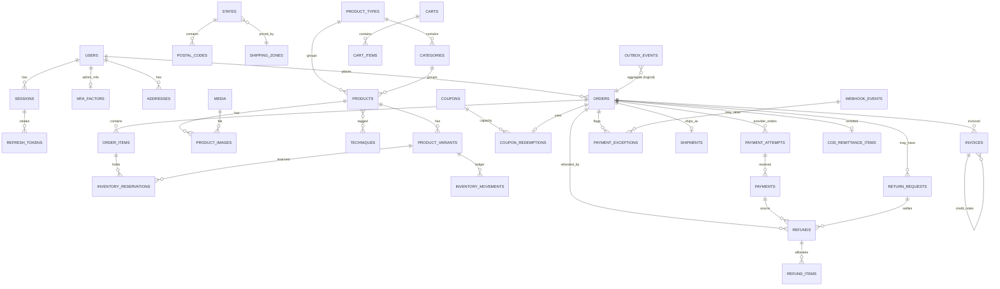

# ArtQ: Database Design

> PostgreSQL 16+ (validated on 18) · Prisma ORM 6.19.x · Extensions: `pg_trgm`, `citext`, `unaccent`
> Companion docs: [architecture.md](architecture.md) (flows, jobs) · [api.md](api.md) (contracts) · [catalog.md](catalog.md) (data) · [review.md](review.md) (change log)
>
> **Authority:** §5 (Prisma schema) is the source of truth for columns and types; §6 (raw SQL migration) adds constraints Prisma cannot express.
> §3 explains semantics and invariants. If prose and schema disagree, the schema wins and the prose is a bug.

---

## 1. Conventions

| Rule | Detail |
|------|--------|
| Names | Tables `snake_case` plural; Prisma models PascalCase singular mapped with `@@map`; columns `snake_case` via `@map` |
| Keys | `INT` identity PKs internally. Customers see slugs, order numbers (`AQ10001`), payment receipts (`AQA_…`), never raw ids |
| Money | **Integer paise** everywhere (`₹849 → 84900`). No floats, no `DECIMAL` money. Rounding happens once, per line (see §4.4) |
| Weight | Integer grams. Dimensions in cm (`DECIMAL(6,1)`) |
| Time | `TIMESTAMPTZ` stored UTC; displayed Asia/Kolkata |
| Deletion | Catalogue, users and coupons are **soft-deleted** (`deleted_at`). Anything referenced by an order, payment, refund, invoice, reservation or movement uses `ON DELETE RESTRICT`. Orders, order items, payments, refunds, invoices, movements and audit logs are **never deleted** |
| Snapshots | Orders copy product name, variant label, SKU, prices, tax, weight and addresses at purchase. `order_items` commercial columns and issued `invoices` are immutable (DB triggers, §6) |
| Enums | Postgres enums via Prisma (multi-line `enum` blocks; single-line enums are invalid Prisma syntax) |
| Case-insensitive text | `CITEXT` for emails and coupon codes |
| JSON | Only for flexible/opaque data (settings values, provider payloads, pricing snapshot, import messages). Never for fields we filter or join on |
| Concurrency | Short transactions, row locks in a **fixed lock order** (§4.1); optimistic `version` column on products/variants/orders for admin edits |
| External calls | **Never inside a DB transaction.** Persist intent → commit → call provider → persist result (architecture.md §7) |

---

## 2. Entity-relationship overview



---

## 3. Tables: semantics and invariants

### 3.1 Identity, sessions, MFA

| Table | Purpose & rules |
|-------|-----------------|
| `users` | Registered accounts only (**no guest user rows**). `email` required, unique among non-deleted users. `phone` optional and **not a login identifier at launch**; unique only once verified (`users_phone_verified_uq`). `auth_version` increments on block, role change, password reset, MFA reset → every session created with an older version is invalid. `status`: `PENDING_VERIFICATION` (signed up, email unverified) → `ACTIVE` ↔ `BLOCKED`; `DELETED` (anonymised after 30 days) |
| `sessions` | One login on one device. `audience` = `STOREFRONT` or `ADMIN` (admin tokens are never accepted by storefront routes and vice versa). Idle expiry (storefront 30 d, admin 12 h) and absolute expiry (storefront 90 d, admin 7 d). `mfa_verified_at` used for admin step-up. `revoked_at` + `revoke_reason` (`LOGOUT`, `REUSE_DETECTED`, `BLOCKED`, `ROLE_CHANGED`, `PASSWORD_RESET`, `ADMIN_REVOKED`, `MFA_RESET`) |
| `refresh_tokens` | Token **history** per session: only the SHA-256 hash is stored. `ACTIVE` → `ROTATED` (with `rotated_at`) → never reactivated. Presenting a `ROTATED` token outside the 30-second grace window = reuse → whole session revoked (architecture.md §5.2). Rows retained for session life + 30 days |
| `auth_challenges` | Pending MFA step: `MFA_LOGIN`, `MFA_ENROLL` (holds the encrypted pending TOTP secret), `STEP_UP`. 5-minute expiry, max 5 attempts, single use |
| `mfa_factors` | One confirmed TOTP factor per staff user. Secret encrypted (AES-256-GCM, envelope key version `secret_key_version`); `last_used_step` blocks TOTP replay |
| `mfa_recovery_codes` | 10 one-time codes, argon2id-hashed; `used_at` set on use |
| `otp_codes` | Email OTPs at launch (`channel = EMAIL`). Purposes: `SIGNUP_VERIFY`, `LOGIN`, `GUEST_ORDER_ACCESS` (bound to `order_id`), `EMAIL_CHANGE`; `PHONE_CHANGE` reserved for when SMS launches. Hash = sha256(code + pepper); 10-min expiry; 5 attempts |
| `password_reset_tokens` | Hashed single-use link token, 30 min |

### 3.2 Geography, addresses, serviceability

| Table | Purpose & rules |
|-------|-----------------|
| `countries`, `states` | India + 36 states/UTs with GST state code (`gst_code`, Kerala = `32`) and `shipping_zone_id` |
| `postal_codes` | **Geography only** (India Post directory): pincode → office, district, state. Used to auto-fill city/state. *Existence of a pincode does not mean ArtQ can deliver there* |
| `pincode_serviceability` | **Commercial delivery rules**: deliverable?, COD allowed?, surface-only?, EDD range, source (`MANUAL` at launch, courier API later). Resolution order: explicit row → default policy setting `SHIPPING.defaultServiceable` / `SHIPPING.defaultCod` (business decision D-6, product.md §11) |
| `addresses` | Customer address book (max 10, one default). Orders never reference addresses; they snapshot them |

### 3.3 Catalogue

| Table | Purpose & rules |
|-------|-----------------|
| `product_types` | Homepage tiles / admin "Product Types" (Resins, Wooden Frames…). `tile_link_url` lets a tile point elsewhere (e.g. "UV Resin" tile → `/category/uv-resin`) |
| `categories` | Sub-groups within one type. `UNIQUE(id, type_id)` enables the composite FK that guarantees a product's category belongs to its type |
| `techniques` | Cross-cutting tags (reference site calls them "occasions"); admin "Techniques" |
| `products` | `status`: **`DRAFT`** (default; never visible), **`ACTIVE`** (visible; allowed only when `is_publishable` and DB gate `products_active_gate_ck` passes), **`ARCHIVED`** (hidden, kept for history). `type_id`/`category_id` nullable **only for drafts** (an import with an unknown type yields a genuine *Unassigned* state, never a fake "Unknown"). `readiness` JSON stores the last publication-gate evaluation (product.md §8.7); `data_flags` holds import warnings (`STOCK_AMBIGUOUS`, `DESCRIPTION_SUSPECT_COPY`, `SIZE_CONFLICT`, `WEIGHT_ESTIMATED`, `PRICE_MISSING`…). Aggregates `min_price`, `max_price`, `max_mrp`, `available_qty`, `active_variant_count` are maintained in the same transaction as variant changes (§7). `import_key` = stable product handle across imports |
| `product_variants` | The buyable unit. `price` nullable **only while draft** (publication gate requires it). `net_quantity` + `net_unit` (`G`, `KG`, `ML`, `PCS`, `IN`) normalise sizes ("500GM", "500 gm" → 500 G). **Inventory:** `on_hand` = physical sellable units in the store; `reserved` = Σ active reservations; **available = on_hand − reserved**. `inventory_counted_at` set by a physical count (publication requires it). Shipping: `weight_g` + `weight_source` (`ESTIMATED` blocks publication), optional dims, `shipping_class` (`STANDARD`, `BULKY`, `SURFACE_ONLY`). **No backorders in v1** (no `allow_backorder` column) |
| `product_images` | Ordered images; exactly one cover. Only `media.status = READY` images are exposed to the storefront |
| `product_relations` | Frequently bought together / similar |
| `slug_redirects` | Old slug → new slug for 301s |
| `size_charts` | Optional size chart per category/product |

### 3.4 Media

| Column group | Rules |
|---|---|
| `visibility` | `PUBLIC` (catalogue, CMS, served via CDN) or `PRIVATE` (return photos, custom-work attachments, invoice PDFs, import files; separate bucket, short-lived signed URLs after an authorization check) |
| `status` | `PENDING_UPLOAD` (presigned) → `UPLOADED` (object HEAD verified) → `PROCESSING` → `READY` / `REJECTED` (type/size/decode failure) / `FAILED` (processing error, retryable) |
| Integrity | `declared_mime`/`declared_size` from the presign request; `detected_mime` (magic bytes) and `size_bytes` (actual) after upload; mismatch ⇒ `REJECTED`. `checksum_sha256` for dedupe |
| Ownership | `uploaded_by` + `owner_scope` (`admin`, `return:<orderId>`, `custom-work:<cartTokenHash>`, `import`). An upload can be attached only by its owner within its scope; unattached private uploads are purged after 24 h (`claimed_at` null) |
| Deletion | Soft delete; FK `RESTRICT` from every referencing table, so in-use media cannot be removed |

### 3.5 Inventory

**Model:** `available = on_hand − reserved`. Every change writes an `inventory_movements` row with both deltas and the resulting values.

| Event | `on_hand` | `reserved` | Reservation row | Movement reason |
|-------|-----------|-----------|-----------------|-----------------|
| Checkout initiates (prepaid or COD) | – | +q | `ACTIVE` | `RESERVE` |
| Payment expires / order cancelled before shipment | – | −q | `RELEASED` (`release_reason`) | `RELEASE` |
| Shipment dispatched (fulfilment → `SHIPPED`) | −q | −q | `CONSUMED` | `CONSUME` |
| Late capture after expiry, stock reacquired | – | +q | **new** `ACTIVE` row | `RESERVE` |
| Physical recount (admin sets counted quantity) | set to counted | – | – | `RECOUNT` (delta recorded) |
| Damage / write-off in store | −q | – | – | `DAMAGE_WRITE_OFF` |
| Return received & inspected: sellable units | +q | – | – | `RETURN_RESTOCK` |
| Return received: damaged units | – | – | – | `RETURN_DAMAGED` (0 deltas, audit only) |
| RTO received back (inspected sellable) | +q | – | – | `RTO_RESTOCK` |
| Shipment lost | – | – | – | `LOST_WRITE_OFF` (0 deltas; stock already consumed) |
| Catalogue import: **new** variant only | set initial | – | – | `IMPORT_INITIAL` |
| Inventory import (count sheet) | set/delta | – | – | `RECOUNT` / `ADJUSTMENT` (`import_id`) |

Rules:
- Checkout reserves only if `on_hand − reserved ≥ q` (atomic conditional `UPDATE`, §8.1). **Nothing ever writes `reserved` except reservation transitions.**
- Recounts and imports change only `on_hand`. A count lower than `reserved` is accepted (physical truth), creates an `OVERSOLD` exception and makes `available` negative until resolved (cancel/refund or restock). Checkout can never create this state.
- The catalogue import **never** changes `on_hand` of existing variants (it reports `STOCK_IGNORED`); stock changes go through the separate inventory import or the Inventory page.
- `variant_reservation_drift` (§6) must always be empty; the nightly job alerts on rows.

`stock_notifications` = admin **"Restock Requests"**: email (+ optional user) waiting for a variant. When a variant's `available` goes from 0 to > 0 inside a transaction, an outbox event `variant.back_in_stock` is written; the consumer emails pending requests and marks them `NOTIFIED`.

### 3.6 Cart

`carts.token_hash` = sha256 of the `aq_cart` cookie value (raw token never stored). `contact_email/phone` captured at checkout step 1 are **unverified** and used only for that checkout and abandoned-cart reminders (post-launch, consent-gated). Cart items hold `added_price` only for "price changed" notices; checkout always re-prices.

### 3.7 Coupons

`coupons.reserved_count` + `redeemed_count` ≤ `usage_limit_total` (DB check). `coupon_redemptions` (one per order):

| Status | Meaning | Counter effect |
|--------|---------|----------------|
| `RESERVED` | Checkout created a pending order with this coupon | `reserved_count +1` |
| `REDEEMED` | Payment captured (prepaid) or COD order placed | `reserved −1`, `redeemed +1` |
| `RELEASED` | Unpaid order expired/cancelled | `reserved −1` (**`redeemed_count` untouched**) |
| `REVERSED` | A *redeemed* order was cancelled before shipment and policy restores the use | `redeemed −1` |

`over_limit = true` marks a redemption honoured without capacity (late capture after the last use was taken). It is **excluded from counters**, raises `COUPON_OVER_LIMIT`, and the customer is never charged more than they paid.
Per-customer limit counts `RESERVED` + `REDEEMED` (not over-limit) rows matching `user_id`, or for guests `customer_email` (normalised). Guest email/phone are unverified, so this limit is best-effort for guests (documented limitation).

### 3.8 Shipping

`shipping_zones` (with `extra_per_kg`) + `shipping_rate_slabs` (zone × max weight → rate). The single algorithm is in architecture.md §6.5; settings in `SHIPPING`.

### 3.9 Orders: four independent state dimensions

| Dimension | Column | Values |
|-----------|--------|--------|
| Lifecycle | `status` | `PENDING_PAYMENT`, `PLACED`, `CONFIRMED`, `COMPLETED`, `CANCELLED`, `EXPIRED` |
| Payment | `payment_status` | `UNPAID`, `PROCESSING` (authorized / provider unknown), `PAID`, `PARTIALLY_REFUNDED`, `REFUNDED`, `COD_PENDING`, `COD_COLLECTED`, `COD_REMITTED`, `NOT_COLLECTED` (COD RTO/cancel) |
| Fulfilment | `fulfilment_status` | `UNFULFILLED`, `PACKED`, `SHIPPED`, `OUT_FOR_DELIVERY`, `DELIVERED`, `RTO_IN_TRANSIT`, `RTO_RECEIVED`, `LOST` |
| Returns | `return_status` | `NONE`, `OPEN`, `CLOSED` (detail in `return_requests`) |

Every change in any dimension writes `order_status_history(dimension, from_value, to_value, actor)`. Transition tables: §4.

Other order rules:
- `user_id` is set only when the buyer was **authenticated** at checkout, or later by verified-email linking (architecture.md §5.6). Guest orders have `user_id NULL`.
- `contact_email` / `contact_phone` are unverified unless `contact_email_verified_at` is set (account email, guest OTP, or set-password link).
- `captured_amount` = sum of `APPLIED` captured payments (excess captures excluded). `refunded_amount` = sum of `PROCESSED` refunds. Check: `refunded_amount ≤ captured_amount` (prepaid) or `≤ total` (COD manual refunds).
- `pricing_snapshot` (JSON) stores the full `priceCart()` output used to create the order (zone, slabs, thresholds, coupon rule) for audit.
- `tracking_token_hash`: hash of the guest tracking link token.
- `has_open_exception` drives the admin badge; maintained by the exception service.

`order_items` are immutable snapshots (trigger). Mutable counters: `return_requested_qty`, `returned_qty`, `refunded_qty`, `refunded_amount`, all bounded by checks.

### 3.10 Idempotency, payments, refunds, exceptions

| Table | Rules |
|-------|-------|
| `idempotency_keys` | `UNIQUE(scope, operation, key)`. `scope` = `user:<id>` or `cart:<id>` (storefront) / `staff:<id>` (admin). `operation` ∈ `checkout.initiate`, `payment.retry`, `refund.create`, `order.cancel`. `request_hash` = sha256 of canonical JSON body. `PROCESSING` with `locked_until` (60 s) → `COMPLETED` with `response_code` + `response_body` replayed verbatim. Retention 24 h (`expires_at`), purged nightly. Behaviour table in api.md §1.2 |
| `payment_attempts` | One per **Razorpay order**. Created **before** calling Razorpay with `status = CREATING` and our own `receipt` (`AQA_<id>`). `provider_order_id` stored when known. At most one open attempt per order (`CREATING`, `CREATED`, `PROVIDER_UNKNOWN`). `PAID` when a captured payment is applied; `CLOSED` when superseded/expired; `CREATION_FAILED` when Razorpay definitively rejected creation |
| `payments` | One per **Razorpay payment id** (unique). `status` with monotonic `status_rank`: `CREATED 0 < FAILED 1 < AUTHORIZED 2 < CAPTURED 3 < REFUNDED 4` (failed → authorized is allowed: Razorpay "late authorization"). Updates only apply when the new rank is higher. `allocation`: `APPLIED` (counts toward the order), `EXCESS` (a second capture for an already-paid order → must be refunded), `UNLINKED` (no matching attempt; reconciliation) |
| `refunds` | Every refund, provider or manual. `status`: `REQUESTED` (capacity reserved, not yet sent) → `PENDING` (provider accepted) → `PROCESSED` / `FAILED`; `UNKNOWN` when the provider call outcome is unknown (reconciler resolves). Capacity rule: Σ(`REQUESTED`,`PENDING`,`PROCESSED`,`UNKNOWN`) ≤ payment `amount` (enforced under the payment row lock, §8.6). `receipt` = `AQR_<id>` sent to Razorpay for matching. `method = MANUAL_BANK` for COD (no `payment_id`). Breakdown `items_amount + shipping_amount + cod_fee_amount = amount` |
| `refund_items` | Item-level allocation (quantity, amount, included tax) used for credit notes and to bound per-item refunds |
| `payment_exceptions` | Durable queue of money/stock problems needing attention: `AMOUNT_MISMATCH`, `CURRENCY_MISMATCH`, `EXCESS_CAPTURE`, `LATE_CAPTURE_EXPIRED`, `LATE_CAPTURE_CANCELLED`, `UNLINKED_PAYMENT`, `CAPTURE_STUCK_AUTHORIZED`, `PROVIDER_ORDER_UNKNOWN`, `REFUND_FAILED`, `REFUND_UNKNOWN`, `WEBHOOK_DEAD`, `OUTBOX_DEAD`, `RECON_MISMATCH`, `COUPON_OVER_LIMIT`, `OVERSOLD`, `COD_REMITTANCE_MISMATCH`. `dedupe_key` unique (e.g. `EXCESS_CAPTURE:pay_123`) so repeated detection never duplicates. `AUTO_RESOLVING` while an automatic refund is in flight |

### 3.11 Reliability tables

| Table | Rules |
|-------|-------|
| `webhook_events` | **Durable inbox.** `UNIQUE(provider, event_id)`. Status `RECEIVED` → `PROCESSING` (claimed, `locked_until`) → `PROCESSED` / `FAILED` (retry at `next_attempt_at`, exponential) / `DEAD` (after 10 attempts → `WEBHOOK_DEAD` exception) / `IGNORED` (irrelevant type). The HTTP endpoint acknowledges only after the row is committed |
| `outbox_events` | **Transactional outbox.** Written in the *same transaction* as the domain change (order placed, status changed, refund processed, back in stock…). Dispatcher moves `PENDING` rows to BullMQ (`jobId = outbox:<id>:<consumer>`) and marks `DISPATCHED`; after 10 failed dispatches → `DEAD` + `OUTBOX_DEAD` exception |
| `processed_messages` | Consumer-side dedupe: `(consumer, message_id)` inserted in the consumer's own transaction before applying a DB side effect |
| `email_logs` | `dedupe_key` unique (e.g. `order.placed:AQ10001:customer`): the email consumer inserts `SENDING` first, skips if `SENT` exists. Delivery is **at-least-once** (a crash after the provider accepted but before `SENT` is recorded can resend). We pass the dedupe key as the provider idempotency key where the provider supports it |
| `audit_logs` | Every admin mutation and security event (login, MFA, role change, refunds, price changes), with before/after, session, IP |

### 3.12 Fulfilment, COD, returns, invoices

| Table | Rules |
|-------|-------|
| `shipments` | **v1 = exactly one shipment per order** (`UNIQUE(order_id)`); split fulfilment is out of scope (post-launch would add `shipment_items`). `UNIQUE(courier_name, awb_number)` |
| `cod_remittances` + `cod_remittance_items` | Courier remittance batches; each COD order appears in at most one remittance (`UNIQUE(order_id)`). Amount mismatch vs order total ⇒ `COD_REMITTANCE_MISMATCH` |
| `return_requests` + items + media | `REQUESTED` → `APPROVED`/`REJECTED` → `IN_TRANSIT` → `RECEIVED` → `INSPECTED` → `REFUNDED` → `CLOSED` (or `CANCELLED`). Per item: `requested_qty` ≥ `approved_qty` ≥ `received_qty` = `sellable_qty + damaged_qty`. `order_items.return_requested_qty` bounds the total across all non-rejected requests (≤ quantity). Photos are `PRIVATE` media |
| `invoices` | Immutable tax documents: `TAX_INVOICE` (one per order, issued at dispatch) and `CREDIT_NOTE` (references `original_invoice_id` and `refund_id`). `number` ≤ 16 chars (GST rule), unique per kind+FY via `invoice_counters`. Seller/buyer snapshots, place of supply, per-line HSN/taxable/CGST/SGST/IGST, rounding adjustment. Only the PDF reference may be set once after issue (trigger) |

### 3.13 Content & system
`reels`, `testimonials`, `home_slides`, `faqs`, `cms_pages`, `newsletter_subscribers`, `contact_messages` (+ private attachments), `search_logs`, `seo_overrides`, `redirects`, `settings`, `notifications`, `product_imports` + `product_import_rows` (§9).

**Settings keys** (`settings.key`, JSON value):

| Key | Example | Public |
|-----|---------|:------:|
| `STORE_INFO` | `{name:"ArtQ", legalName, gstin, address, stateCode:"32", phone, email, whatsapp}` | partly |
| `ANNOUNCEMENT_BAR` | `{enabled:true, messages:["Shipping all over India","Free shipping on orders above ₹1000"]}` | ✓ |
| `HOME_SECTIONS`, `HERO`, `INSTAGRAM_MOMENTS`, `SOCIAL` | home layout & content | ✓ |
| `SHIPPING` | `{freeThreshold:100000, packagingWeightG:150, volumetricDivisor:5000, heavyCapG:10000, heavyCapEnabled:true, defaultServiceable:true, defaultCod:true, estimatedDays:{min:4,max:7}}` | ✓ (subset) |
| `PAYMENT` | `{razorpayEnabled:true, codEnabled:true, codFee:4000, codMin:20000, codMax:500000, pendingExpiryMinutes:30, autoRefundExcessCapture:true}` | ✓ (no secrets) |
| `ORDER` | `{customerCancelUntil:"UNFULFILLED", returnWindowHours:48, completeAfterDays:7}` | ✓ |
| `TAX` | `{pricesIncludeTax:true, shippingTaxRule:"CA_DECISION", invoiceAt:"DISPATCH"}` | |
| `NOTIFY` | `{adminEmails:[…], dailySummary:true, lowStockEmail:true}` | |

Payment provider **secrets are never stored in `settings`**; they live in the secret manager / environment.

---

## 4. State machines and concurrency rules

### 4.1 Lock order (all writers)
`orders` → `payments` (by id) → `product_variants` (ascending id) → `products` (ascending id) → `coupons` → `refunds`. Every transaction that touches more than one of these acquires row locks in this order (`SELECT … FOR UPDATE` or conditional `UPDATE`). Inventory adjustments from admin/imports lock only variants (ascending) then products.

### 4.2 Order lifecycle (`status`)

| From | To | Trigger | Notes |
|------|----|---------|-------|
| — | `PENDING_PAYMENT` | prepaid checkout initiated | reservations + coupon `RESERVED`; `expires_at = now + 30 min` |
| — | `PLACED` | COD checkout | `payment_status = COD_PENDING`; coupon `REDEEMED` |
| `PENDING_PAYMENT` | `PLACED` | captured payment applied | `payment_status = PAID`; coupon `REDEEMED` |
| `PENDING_PAYMENT` | `EXPIRED` | expiry job, **after** pre-expiry provider check finds no authorized/captured payment | reservations `RELEASED`; coupon `RELEASED` |
| `PENDING_PAYMENT` | `CANCELLED` | customer abandons ("cancel and edit cart") / admin | same releases; any later capture → refund (§4.6) |
| `EXPIRED` | `PLACED` | late capture **and** stock reacquired for every line | new reservations; coupon re-reserved/redeemed or `over_limit` |
| `PLACED` | `CONFIRMED` | admin confirms | |
| `PLACED`, `CONFIRMED` | `CANCELLED` | customer (only while `fulfilment_status = UNFULFILLED`) or admin (while `UNFULFILLED`/`PACKED`) | releases reservations; prepaid ⇒ full refund (`CANCELLATION`); coupon `REVERSED` |
| `CONFIRMED` | `COMPLETED` | system, `completeAfterDays` after `DELIVERED` with no open return | |
| `CONFIRMED` | `CANCELLED` | RTO received (fulfilment `RTO_RECEIVED`) | prepaid ⇒ refund per policy; COD ⇒ `NOT_COLLECTED` |
| `CANCELLED`, `EXPIRED`*, `COMPLETED` | — | terminal (*except the late-capture path above) | |

### 4.3 Fulfilment (`fulfilment_status`), single shipment
`UNFULFILLED → PACKED → SHIPPED → OUT_FOR_DELIVERY → DELIVERED`; `SHIPPED/OUT_FOR_DELIVERY → RTO_IN_TRANSIT → RTO_RECEIVED`; `SHIPPED/OUT_FOR_DELIVERY → LOST`. Fulfilment starts only after the order is **confirmed** (`status = CONFIRMED`) and (prepaid) `payment_status = PAID` or (COD) `COD_PENDING`. `SHIPPED` consumes reservations and issues the tax invoice in the same transaction.

### 4.4 Payment (`payment_status`)

| From | To | Trigger |
|------|----|---------|
| `UNPAID` | `PROCESSING` | provider reports `authorized`, or verification could not reach the provider |
| `UNPAID`/`PROCESSING` | `PAID` | a payment with provider status `captured`, matching amount/currency/provider order, is applied |
| `PROCESSING` | `UNPAID` | provider confirms failure and no other live payment |
| `PAID` | `PARTIALLY_REFUNDED` / `REFUNDED` | refund `PROCESSED` (refunded < / = captured) |
| `COD_PENDING` | `COD_COLLECTED` | fulfilment `DELIVERED` |
| `COD_COLLECTED` | `COD_REMITTED` | order included in a recorded remittance |
| `COD_PENDING` | `NOT_COLLECTED` | RTO / cancellation |
| `COD_*` | `PARTIALLY_REFUNDED` / `REFUNDED` | manual refund processed after collection |

Rounding: per order line, included tax = `net − round_half_up(net × 100 / (100 + rate))`; CGST = floor(tax/2), SGST = tax − CGST; IGST = tax. Totals are sums of line values; any difference to the paise total is shown as `rounding_adjustment` (normally 0).

### 4.5 Refunds and returns
- Refund capacity is reserved under the **payment row lock** (§8.6), so concurrent refunds can never exceed the captured amount; the per-item bound is checked under the order row lock against `order_items.refunded_amount`.
- Item amount refundable per unit = `net_amount / quantity` (last unit absorbs rounding). Shipping is refunded only for full pre-dispatch cancellation, or at admin discretion for merchant-fault returns. COD fee is refunded only for full pre-dispatch cancellation.
- Return approval ≠ receipt ≠ inspection. Restock (`RETURN_RESTOCK`) only for `sellable_qty` after inspection. A return refund links `refunds.return_request_id`.
- A refund after the tax invoice was issued creates a `CREDIT_NOTE` once `PROCESSED`.

### 4.6 Late and excess captures

| Situation | Action | Customer communication |
|-----------|--------|------------------------|
| Duplicate notification of the **same** payment id | No-op (unique `provider_payment_id` + monotonic rank) | none |
| Second **distinct** captured payment for an order already `PAID` | Insert payment with `allocation = EXCESS`; exception `EXCESS_CAPTURE`; auto-refund (`EXCESS_CAPTURE` kind) if `PAYMENT.autoRefundExcessCapture` | "We received a duplicate payment; refunded in 5–7 working days" |
| Capture for an `EXPIRED` order, stock reacquirable | Reacquire reservations (new rows), re-reserve coupon (or `over_limit`), `EXPIRED → PLACED`, `PAID` | normal order confirmation |
| Capture for an `EXPIRED` order, stock not reacquirable | Payment `APPLIED` → full refund (`LATE_CAPTURE`), exception `LATE_CAPTURE_EXPIRED`, order stays `EXPIRED` | "Payment received after your order expired and the item sold out; full refund issued" |
| Capture for a `CANCELLED` order | Never revive. Full refund (`LATE_CAPTURE`), exception `LATE_CAPTURE_CANCELLED` | "Your cancelled order's payment has been refunded" |
| Amount or currency mismatch | Do **not** mark paid; exception `AMOUNT_MISMATCH`/`CURRENCY_MISMATCH`; manual review | "We're verifying your payment" |
| Payment `authorized` > 15 min | Capture via API if the order is still `PENDING_PAYMENT`/`PLACED` and amounts match; otherwise exception `CAPTURE_STUCK_AUTHORIZED` and let Razorpay void/auto-refund per account settings | "Payment processing" |

---

## 5. Prisma schema (`apps/api/prisma/schema.prisma`)

Validated with `prisma validate` (Prisma 6.19.3) and applied to PostgreSQL 18 (see [review.md](review.md) §4).
Post-launch tables (`collections`, `collection_products`, `product_reviews`, `shipment_items`) are **not** in the initial migration.

```prisma
generator client {
  provider        = "prisma-client-js"
  previewFeatures = ["postgresqlExtensions"]
}

datasource db {
  provider   = "postgresql"
  url        = env("DATABASE_URL")
  extensions = [pg_trgm, citext, unaccent]
}

// ───────────────────────────── ENUMS ─────────────────────────────
enum UserRole {
  CUSTOMER
  STAFF
  ADMIN
  SUPER_ADMIN
}
enum UserStatus {
  PENDING_VERIFICATION
  ACTIVE
  BLOCKED
  DELETED
}
enum SessionAudience {
  STOREFRONT
  ADMIN
}
enum RefreshTokenStatus {
  ACTIVE
  ROTATED
  REVOKED
}
enum ChallengeType {
  MFA_LOGIN
  MFA_ENROLL
  STEP_UP
}
enum OtpChannel {
  EMAIL
  SMS
  WHATSAPP
}
enum OtpPurpose {
  SIGNUP_VERIFY
  LOGIN
  GUEST_ORDER_ACCESS
  EMAIL_CHANGE
  PHONE_CHANGE
}
enum AddressLabel {
  HOME
  WORK
  OTHER
}
enum MediaKind {
  IMAGE
  VIDEO
  DOCUMENT
}
enum MediaVisibility {
  PUBLIC
  PRIVATE
}
enum MediaStatus {
  PENDING_UPLOAD
  UPLOADED
  PROCESSING
  READY
  REJECTED
  FAILED
}
enum ProductStatus {
  DRAFT
  ACTIVE
  ARCHIVED
}
enum WeightSource {
  ESTIMATED
  MEASURED
}
enum ShippingClass {
  STANDARD
  BULKY
  SURFACE_ONLY
}
enum RelationKind {
  FREQUENTLY_BOUGHT_TOGETHER
  SIMILAR
}
enum ReservationStatus {
  ACTIVE
  CONSUMED
  RELEASED
}
enum InventoryReason {
  IMPORT_INITIAL
  RECOUNT
  ADJUSTMENT
  DAMAGE_WRITE_OFF
  RESERVE
  RELEASE
  CONSUME
  RETURN_RESTOCK
  RETURN_DAMAGED
  RTO_RESTOCK
  LOST_WRITE_OFF
}
enum StockNotificationStatus {
  PENDING
  NOTIFIED
  CANCELLED
}
enum CartStatus {
  ACTIVE
  CONVERTED
  MERGED
  ABANDONED
}
enum CouponType {
  PERCENT
  FLAT
  FREE_SHIPPING
}
enum CouponScope {
  ALL
  TYPES
  CATEGORIES
  PRODUCTS
}
enum CouponTargetType {
  TYPE
  CATEGORY
  PRODUCT
}
enum RedemptionStatus {
  RESERVED
  REDEEMED
  RELEASED
  REVERSED
}
enum OrderStatus {
  PENDING_PAYMENT
  PLACED
  CONFIRMED
  COMPLETED
  CANCELLED
  EXPIRED
}
enum OrderPaymentStatus {
  UNPAID
  PROCESSING
  PAID
  PARTIALLY_REFUNDED
  REFUNDED
  COD_PENDING
  COD_COLLECTED
  COD_REMITTED
  NOT_COLLECTED
}
enum FulfilmentStatus {
  UNFULFILLED
  PACKED
  SHIPPED
  OUT_FOR_DELIVERY
  DELIVERED
  RTO_IN_TRANSIT
  RTO_RECEIVED
  LOST
}
enum OrderReturnStatus {
  NONE
  OPEN
  CLOSED
}
enum PaymentMethod {
  RAZORPAY
  COD
}
enum StatusDimension {
  ORDER
  PAYMENT
  FULFILMENT
  RETURN
}
enum ActorType {
  CUSTOMER
  ADMIN
  SYSTEM
  WEBHOOK
}
enum IdempotencyStatus {
  PROCESSING
  COMPLETED
}
enum PaymentAttemptStatus {
  CREATING
  CREATED
  PROVIDER_UNKNOWN
  CREATION_FAILED
  PAID
  CLOSED
}
enum ProviderPaymentStatus {
  CREATED
  FAILED
  AUTHORIZED
  CAPTURED
  REFUNDED
}
enum PaymentAllocation {
  APPLIED
  EXCESS
  UNLINKED
}
enum RefundKind {
  CANCELLATION
  RETURN
  GOODWILL
  EXCESS_CAPTURE
  LATE_CAPTURE
  PRICE_ADJUSTMENT
}
enum RefundMethod {
  ORIGINAL_PAYMENT
  MANUAL_BANK
}
enum RefundStatus {
  REQUESTED
  PENDING
  PROCESSED
  FAILED
  UNKNOWN
}
enum ExceptionType {
  AMOUNT_MISMATCH
  CURRENCY_MISMATCH
  EXCESS_CAPTURE
  LATE_CAPTURE_EXPIRED
  LATE_CAPTURE_CANCELLED
  UNLINKED_PAYMENT
  CAPTURE_STUCK_AUTHORIZED
  PROVIDER_ORDER_UNKNOWN
  REFUND_FAILED
  REFUND_UNKNOWN
  WEBHOOK_DEAD
  OUTBOX_DEAD
  RECON_MISMATCH
  COUPON_OVER_LIMIT
  OVERSOLD
  COD_REMITTANCE_MISMATCH
}
enum ExceptionStatus {
  OPEN
  AUTO_RESOLVING
  RESOLVED
  DISMISSED
}
enum WebhookStatus {
  RECEIVED
  PROCESSING
  PROCESSED
  FAILED
  DEAD
  IGNORED
}
enum OutboxStatus {
  PENDING
  DISPATCHED
  DEAD
}
enum ShipmentStatus {
  CREATED
  SHIPPED
  OUT_FOR_DELIVERY
  DELIVERED
  RTO_IN_TRANSIT
  RTO_RECEIVED
  LOST
}
enum ReturnReason {
  DAMAGED
  WRONG_ITEM
  DEFECTIVE
  MISSING_ITEM
  OTHER
}
enum ReturnStatus {
  REQUESTED
  APPROVED
  REJECTED
  IN_TRANSIT
  RECEIVED
  INSPECTED
  REFUNDED
  CLOSED
  CANCELLED
}
enum InvoiceKind {
  TAX_INVOICE
  CREDIT_NOTE
}
enum SubscriberStatus {
  SUBSCRIBED
  UNSUBSCRIBED
}
enum MessageKind {
  CONTACT
  CUSTOM_WORK
}
enum MessageStatus {
  NEW
  IN_PROGRESS
  REPLIED
  CLOSED
}
enum FaqGroup {
  ORDERS
  SHIPPING
  PAYMENTS
  PRODUCTS
  RETURNS
}
enum ImportKind {
  CATALOG
  INVENTORY
}
enum ImportStatus {
  UPLOADED
  VALIDATING
  VALIDATED
  IMPORTING
  COMPLETED
  COMPLETED_WITH_ERRORS
  FAILED
  CANCELLED
}
enum ImportRowStatus {
  PENDING
  CREATED
  UPDATED
  UNCHANGED
  SKIPPED
  NEEDS_REVIEW
  FAILED
}
enum EmailStatus {
  SENDING
  SENT
  FAILED
  BOUNCED
}
enum NotificationAudience {
  ADMIN
  CUSTOMER
}

// ─────────────────────────── USERS & AUTH ───────────────────────────
model User {
  id               Int        @id @default(autoincrement())
  name             String?    @db.VarChar(120)
  email            String     @db.Citext
  emailVerifiedAt  DateTime?  @map("email_verified_at") @db.Timestamptz
  phone            String?    @db.VarChar(15)
  phoneVerifiedAt  DateTime?  @map("phone_verified_at") @db.Timestamptz
  passwordHash     String?    @map("password_hash")
  role             UserRole   @default(CUSTOMER)
  status           UserStatus @default(PENDING_VERIFICATION)
  authVersion      Int        @default(1) @map("auth_version")
  marketingOptIn   Boolean    @default(false) @map("marketing_opt_in")
  failedLoginCount Int        @default(0) @map("failed_login_count")
  lockedUntil      DateTime?  @map("locked_until") @db.Timestamptz
  lastLoginAt      DateTime?  @map("last_login_at") @db.Timestamptz
  adminNotes       String?    @map("admin_notes")
  createdAt        DateTime   @default(now()) @map("created_at") @db.Timestamptz
  updatedAt        DateTime   @updatedAt @map("updated_at") @db.Timestamptz
  deletedAt        DateTime?  @map("deleted_at") @db.Timestamptz

  sessions            Session[]
  challenges          AuthChallenge[]
  mfaFactor           MfaFactor?
  recoveryCodes       MfaRecoveryCode[]
  otpCodes            OtpCode[]
  passwordResetTokens PasswordResetToken[]
  addresses           Address[]
  orders              Order[]
  carts               Cart[]
  wishlist            WishlistItem[]
  stockNotifications  StockNotification[]
  uploads             Media[]             @relation("MediaUploader")

  @@index([role])
  @@index([createdAt])
  @@map("users")
}

model Session {
  id            String          @id @default(uuid()) @db.Uuid
  userId        Int             @map("user_id")
  audience      SessionAudience
  authVersion   Int             @map("auth_version")
  mfaVerifiedAt DateTime?       @map("mfa_verified_at") @db.Timestamptz
  ip            String?         @db.Inet
  userAgent     String?         @map("user_agent")
  createdAt     DateTime        @default(now()) @map("created_at") @db.Timestamptz
  lastUsedAt    DateTime        @default(now()) @map("last_used_at") @db.Timestamptz
  idleExpiresAt DateTime        @map("idle_expires_at") @db.Timestamptz
  absoluteExpiresAt DateTime    @map("absolute_expires_at") @db.Timestamptz
  revokedAt     DateTime?       @map("revoked_at") @db.Timestamptz
  revokeReason  String?         @map("revoke_reason") @db.VarChar(40)
  user          User            @relation(fields: [userId], references: [id], onDelete: Cascade)
  refreshTokens RefreshToken[]

  @@index([userId, revokedAt])
  @@map("sessions")
}

model RefreshToken {
  id         String             @id @default(uuid()) @db.Uuid
  sessionId  String             @map("session_id") @db.Uuid
  tokenHash  String             @unique @map("token_hash") @db.Char(64)
  status     RefreshTokenStatus @default(ACTIVE)
  parentId   String?            @map("parent_id") @db.Uuid
  issuedAt   DateTime           @default(now()) @map("issued_at") @db.Timestamptz
  rotatedAt  DateTime?          @map("rotated_at") @db.Timestamptz
  expiresAt  DateTime           @map("expires_at") @db.Timestamptz
  session    Session            @relation(fields: [sessionId], references: [id], onDelete: Cascade)

  @@index([sessionId, status])
  @@map("refresh_tokens")
}

model AuthChallenge {
  id                     String        @id @default(uuid()) @db.Uuid
  userId                 Int           @map("user_id")
  type                   ChallengeType
  sessionId              String?       @map("session_id") @db.Uuid
  attempts               Int           @default(0)
  pendingSecretCiphertext Bytes?       @map("pending_secret_ciphertext")
  pendingSecretKeyVersion Int?         @map("pending_secret_key_version")
  ip                     String?       @db.Inet
  userAgent              String?       @map("user_agent")
  expiresAt              DateTime      @map("expires_at") @db.Timestamptz
  consumedAt             DateTime?     @map("consumed_at") @db.Timestamptz
  createdAt              DateTime      @default(now()) @map("created_at") @db.Timestamptz
  user                   User          @relation(fields: [userId], references: [id], onDelete: Cascade)

  @@index([userId, createdAt])
  @@map("auth_challenges")
}

model MfaFactor {
  userId           Int       @id @map("user_id")
  secretCiphertext Bytes     @map("secret_ciphertext")
  secretKeyVersion Int       @map("secret_key_version")
  lastUsedStep     BigInt?   @map("last_used_step")
  confirmedAt      DateTime  @map("confirmed_at") @db.Timestamptz
  createdAt        DateTime  @default(now()) @map("created_at") @db.Timestamptz
  user             User      @relation(fields: [userId], references: [id], onDelete: Cascade)

  @@map("mfa_factors")
}

model MfaRecoveryCode {
  id        Int       @id @default(autoincrement())
  userId    Int       @map("user_id")
  codeHash  String    @map("code_hash")
  usedAt    DateTime? @map("used_at") @db.Timestamptz
  createdAt DateTime  @default(now()) @map("created_at") @db.Timestamptz
  user      User      @relation(fields: [userId], references: [id], onDelete: Cascade)

  @@index([userId])
  @@map("mfa_recovery_codes")
}

model OtpCode {
  id         Int        @id @default(autoincrement())
  target     String     @db.VarChar(160)
  channel    OtpChannel
  purpose    OtpPurpose
  codeHash   String     @map("code_hash") @db.Char(64)
  attempts   Int        @default(0)
  userId     Int?       @map("user_id")
  orderId    Int?       @map("order_id")
  expiresAt  DateTime   @map("expires_at") @db.Timestamptz
  consumedAt DateTime?  @map("consumed_at") @db.Timestamptz
  createdAt  DateTime   @default(now()) @map("created_at") @db.Timestamptz
  user       User?      @relation(fields: [userId], references: [id], onDelete: Cascade)
  order      Order?     @relation(fields: [orderId], references: [id], onDelete: Cascade)

  @@index([target, purpose, createdAt(sort: Desc)])
  @@map("otp_codes")
}

model PasswordResetToken {
  id        Int       @id @default(autoincrement())
  userId    Int       @map("user_id")
  tokenHash String    @unique @map("token_hash") @db.Char(64)
  expiresAt DateTime  @map("expires_at") @db.Timestamptz
  usedAt    DateTime? @map("used_at") @db.Timestamptz
  createdAt DateTime  @default(now()) @map("created_at") @db.Timestamptz
  user      User      @relation(fields: [userId], references: [id], onDelete: Cascade)

  @@map("password_reset_tokens")
}

// ───────────────────────── GEOGRAPHY & ADDRESSES ─────────────────────────
model Country {
  id        Int       @id @default(autoincrement())
  name      String    @db.VarChar(80)
  iso2      String    @unique @db.Char(2)
  phoneCode String    @map("phone_code") @db.VarChar(6)
  isActive  Boolean   @default(true) @map("is_active")
  states    State[]
  addresses Address[]

  @@map("countries")
}

model State {
  id             Int           @id @default(autoincrement())
  countryId      Int           @map("country_id")
  name           String        @db.VarChar(80)
  code           String        @db.VarChar(4)
  gstCode        String?       @map("gst_code") @db.Char(2)
  shippingZoneId Int?          @map("shipping_zone_id")
  isActive       Boolean       @default(true) @map("is_active")
  country        Country       @relation(fields: [countryId], references: [id])
  shippingZone   ShippingZone? @relation(fields: [shippingZoneId], references: [id])
  addresses      Address[]
  postalCodes    PostalCode[]

  @@unique([countryId, name])
  @@map("states")
}

/// Geography only (India Post directory). Existence does NOT imply deliverability.
model PostalCode {
  pincode    String @db.Char(6)
  officeName String @map("office_name") @db.VarChar(120)
  district   String @db.VarChar(80)
  stateId    Int    @map("state_id")
  state      State  @relation(fields: [stateId], references: [id])

  @@id([pincode, officeName])
  @@index([pincode])
  @@map("postal_codes")
}

/// Commercial delivery rules per pincode (manual at launch, courier API later).
model PincodeServiceability {
  pincode       String   @id @db.Char(6)
  isServiceable Boolean  @map("is_serviceable")
  codAvailable  Boolean  @map("cod_available")
  surfaceOnly   Boolean  @default(true) @map("surface_only")
  eddMinDays    Int?     @map("edd_min_days")
  eddMaxDays    Int?     @map("edd_max_days")
  source        String   @default("MANUAL") @db.VarChar(20)
  note          String?
  updatedBy     Int?     @map("updated_by")
  updatedAt     DateTime @updatedAt @map("updated_at") @db.Timestamptz

  @@map("pincode_serviceability")
}

model Address {
  id        Int          @id @default(autoincrement())
  userId    Int          @map("user_id")
  label     AddressLabel @default(HOME)
  fullName  String       @map("full_name") @db.VarChar(120)
  phone     String       @db.VarChar(15)
  line1     String       @db.VarChar(200)
  line2     String?      @db.VarChar(200)
  landmark  String?      @db.VarChar(120)
  city      String       @db.VarChar(80)
  stateId   Int          @map("state_id")
  pincode   String       @db.Char(6)
  countryId Int          @map("country_id")
  isDefault Boolean      @default(false) @map("is_default")
  createdAt DateTime     @default(now()) @map("created_at") @db.Timestamptz
  updatedAt DateTime     @updatedAt @map("updated_at") @db.Timestamptz
  user      User         @relation(fields: [userId], references: [id], onDelete: Cascade)
  state     State        @relation(fields: [stateId], references: [id])
  country   Country      @relation(fields: [countryId], references: [id])

  @@index([userId])
  @@map("addresses")
}

// ───────────────────────────── MEDIA ─────────────────────────────
model Media {
  id             Int             @id @default(autoincrement())
  key            String          @unique
  visibility     MediaVisibility
  kind           MediaKind
  declaredMime   String          @map("declared_mime") @db.VarChar(80)
  detectedMime   String?         @map("detected_mime") @db.VarChar(80)
  declaredSize   Int             @map("declared_size")
  sizeBytes      Int?            @map("size_bytes")
  checksumSha256 String?         @map("checksum_sha256") @db.Char(64)
  width          Int?
  height         Int?
  durationS      Decimal?        @map("duration_s") @db.Decimal(8, 2)
  renditions     Json            @default("{}")
  placeholder    String?
  status         MediaStatus     @default(PENDING_UPLOAD)
  failureReason  String?         @map("failure_reason")
  sourceUrl      String?         @map("source_url")
  uploadedBy     Int?            @map("uploaded_by")
  ownerScope     String          @map("owner_scope") @db.VarChar(60)
  claimedAt      DateTime?       @map("claimed_at") @db.Timestamptz
  createdAt      DateTime        @default(now()) @map("created_at") @db.Timestamptz
  updatedAt      DateTime        @updatedAt @map("updated_at") @db.Timestamptz
  deletedAt      DateTime?       @map("deleted_at") @db.Timestamptz
  uploader       User?           @relation("MediaUploader", fields: [uploadedBy], references: [id])

  productImages       ProductImage[]
  variantImages       ProductVariant[]     @relation("VariantImage")
  productVideos       Product[]            @relation("ProductVideo")
  productOgImages     Product[]            @relation("ProductOgImage")
  typeImages          ProductType[]        @relation("TypeImage")
  typeBanners         ProductType[]        @relation("TypeBanner")
  categoryImages      Category[]           @relation("CategoryImage")
  techniqueImages     Technique[]          @relation("TechniqueImage")
  techniqueHeroes     Technique[]          @relation("TechniqueHero")
  reelVideos          Reel[]               @relation("ReelVideo")
  reelThumbnails      Reel[]               @relation("ReelThumbnail")
  testimonialAvatars  Testimonial[]
  slideImages         HomeSlide[]          @relation("SlideMedia")
  slideMobileImages   HomeSlide[]          @relation("SlideMobileMedia")
  returnAttachments   ReturnRequestMedia[]
  messageAttachments  ContactMessageMedia[]
  invoicePdfs         Invoice[]
  importFiles         ProductImport[]

  @@index([status, createdAt])
  @@map("media")
}

// ──────────────────────────── CATALOGUE ────────────────────────────
model ProductType {
  id              Int        @id @default(autoincrement())
  name            String     @db.VarChar(80)
  slug            String     @unique @db.VarChar(100)
  description     String?
  imageMediaId    Int?       @map("image_media_id")
  bannerMediaId   Int?       @map("banner_media_id")
  tileLinkUrl     String?    @map("tile_link_url") @db.VarChar(300)
  sortOrder       Int        @default(0) @map("sort_order")
  isActive        Boolean    @default(true) @map("is_active")
  showOnHome      Boolean    @default(true) @map("show_on_home")
  showInMenu      Boolean    @default(true) @map("show_in_menu")
  metaTitle       String?    @map("meta_title") @db.VarChar(160)
  metaDescription String?    @map("meta_description") @db.VarChar(320)
  createdAt       DateTime   @default(now()) @map("created_at") @db.Timestamptz
  updatedAt       DateTime   @updatedAt @map("updated_at") @db.Timestamptz
  image           Media?     @relation("TypeImage", fields: [imageMediaId], references: [id], onDelete: Restrict)
  banner          Media?     @relation("TypeBanner", fields: [bannerMediaId], references: [id], onDelete: Restrict)
  categories      Category[]
  products        Product[]

  @@index([isActive, sortOrder])
  @@map("product_types")
}

model Category {
  id              Int         @id @default(autoincrement())
  typeId          Int         @map("type_id")
  name            String      @db.VarChar(100)
  slug            String      @unique @db.VarChar(120)
  description     String?
  imageMediaId    Int?        @map("image_media_id")
  sizeChartId     Int?        @map("size_chart_id")
  defaultHsnCode  String?     @map("default_hsn_code") @db.VarChar(8)
  defaultGstRate  Decimal?    @map("default_gst_rate") @db.Decimal(4, 2)
  sortOrder       Int         @default(0) @map("sort_order")
  isActive        Boolean     @default(true) @map("is_active")
  metaTitle       String?     @map("meta_title") @db.VarChar(160)
  metaDescription String?     @map("meta_description") @db.VarChar(320)
  createdAt       DateTime    @default(now()) @map("created_at") @db.Timestamptz
  updatedAt       DateTime    @updatedAt @map("updated_at") @db.Timestamptz
  type            ProductType @relation(fields: [typeId], references: [id], onDelete: Restrict)
  image           Media?      @relation("CategoryImage", fields: [imageMediaId], references: [id], onDelete: Restrict)
  sizeChart       SizeChart?  @relation(fields: [sizeChartId], references: [id], onDelete: SetNull)
  products        Product[]

  @@unique([typeId, name])
  @@unique([id, typeId])
  @@index([typeId, isActive, sortOrder])
  @@map("categories")
}

model Technique {
  id              Int                @id @default(autoincrement())
  name            String             @db.VarChar(100)
  slug            String             @unique @db.VarChar(120)
  description     String?
  imageMediaId    Int?               @map("image_media_id")
  heroMediaId     Int?               @map("hero_media_id")
  sortOrder       Int                @default(0) @map("sort_order")
  isActive        Boolean            @default(true) @map("is_active")
  metaTitle       String?            @map("meta_title") @db.VarChar(160)
  metaDescription String?            @map("meta_description") @db.VarChar(320)
  createdAt       DateTime           @default(now()) @map("created_at") @db.Timestamptz
  updatedAt       DateTime           @updatedAt @map("updated_at") @db.Timestamptz
  image           Media?             @relation("TechniqueImage", fields: [imageMediaId], references: [id], onDelete: Restrict)
  hero            Media?             @relation("TechniqueHero", fields: [heroMediaId], references: [id], onDelete: Restrict)
  products        ProductTechnique[]

  @@map("techniques")
}

model SizeChart {
  id         Int        @id @default(autoincrement())
  name       String     @db.VarChar(100)
  content    Json?
  createdAt  DateTime   @default(now()) @map("created_at") @db.Timestamptz
  updatedAt  DateTime   @updatedAt @map("updated_at") @db.Timestamptz
  categories Category[]
  products   Product[]

  @@map("size_charts")
}

model Product {
  id                 Int           @id @default(autoincrement())
  typeId             Int?          @map("type_id")
  categoryId         Int?          @map("category_id")
  status             ProductStatus @default(DRAFT)
  publishedAt        DateTime?     @map("published_at") @db.Timestamptz
  isPublishable      Boolean       @default(false) @map("is_publishable")
  readiness          Json          @default("{}")
  dataFlags          String[]      @default([]) @map("data_flags")
  importKey          String?       @unique @map("import_key") @db.VarChar(120)
  name               String        @db.VarChar(200)
  slug               String        @unique @db.VarChar(220)
  shortDescription   String?       @map("short_description") @db.VarChar(300)
  description        String?
  productDetails     String[]      @default([]) @map("product_details")
  specificationsCare String[]      @default([]) @map("specifications_care")
  howToUse           String?       @map("how_to_use")
  specifications     Json          @default("{}")
  tags               String[]      @default([])
  hsnCode            String?       @map("hsn_code") @db.VarChar(8)
  gstRate            Decimal?      @map("gst_rate") @db.Decimal(4, 2)
  taxApprovedAt      DateTime?     @map("tax_approved_at") @db.Timestamptz
  taxApprovedBy      Int?          @map("tax_approved_by")
  videoMediaId       Int?          @map("video_media_id")
  ogMediaId          Int?          @map("og_media_id")
  sizeChartId        Int?          @map("size_chart_id")
  isNewArrival       Boolean       @default(false) @map("is_new_arrival")
  newArrivalRank     Int?          @map("new_arrival_rank")
  isTrending         Boolean       @default(false) @map("is_trending")
  trendingRank       Int?          @map("trending_rank")
  isFeatured         Boolean       @default(false) @map("is_featured")
  sortOrder          Int           @default(0) @map("sort_order")
  minPrice           Int?          @map("min_price")
  maxPrice           Int?          @map("max_price")
  maxMrp             Int?          @map("max_mrp")
  availableQty       Int           @default(0) @map("available_qty")
  activeVariantCount Int           @default(0) @map("active_variant_count")
  soldCount          Int           @default(0) @map("sold_count")
  searchVector       Unsupported("tsvector")? @map("search_vector")
  metaTitle          String?       @map("meta_title") @db.VarChar(160)
  metaDescription    String?       @map("meta_description") @db.VarChar(320)
  version            Int           @default(1)
  createdBy          Int?          @map("created_by")
  updatedBy          Int?          @map("updated_by")
  createdAt          DateTime      @default(now()) @map("created_at") @db.Timestamptz
  updatedAt          DateTime      @updatedAt @map("updated_at") @db.Timestamptz
  deletedAt          DateTime?     @map("deleted_at") @db.Timestamptz

  type               ProductType?        @relation(fields: [typeId], references: [id], onDelete: Restrict)
  category           Category?           @relation(fields: [categoryId], references: [id], onDelete: Restrict)
  sizeChart          SizeChart?          @relation(fields: [sizeChartId], references: [id], onDelete: SetNull)
  video              Media?              @relation("ProductVideo", fields: [videoMediaId], references: [id], onDelete: Restrict)
  ogImage            Media?              @relation("ProductOgImage", fields: [ogMediaId], references: [id], onDelete: Restrict)
  variants           ProductVariant[]
  images             ProductImage[]
  techniques         ProductTechnique[]
  relations          ProductRelation[]   @relation("ProductRelationFrom")
  relatedFrom        ProductRelation[]   @relation("ProductRelationTo")
  wishlistItems      WishlistItem[]
  orderItems         OrderItem[]
  reels              Reel[]
  testimonials       Testimonial[]
  stockNotifications StockNotification[]

  @@index([status, typeId])
  @@index([status, categoryId])
  @@index([isNewArrival, newArrivalRank])
  @@index([isTrending, trendingRank])
  @@index([minPrice])
  @@index([createdAt(sort: Desc)])
  @@map("products")
}

model ProductVariant {
  id                 Int           @id @default(autoincrement())
  productId          Int           @map("product_id")
  sku                String        @db.VarChar(64)
  size               String?       @db.VarChar(60)
  netQuantity        Decimal?      @map("net_quantity") @db.Decimal(10, 3)
  netUnit            String?       @map("net_unit") @db.VarChar(8)
  color              String?       @db.VarChar(60)
  colorHex           String?       @map("color_hex") @db.Char(7)
  thickness          String?       @db.VarChar(40)
  label              String        @db.VarChar(160)
  price              Int?
  mrp                Int?
  priceApprovedAt    DateTime?     @map("price_approved_at") @db.Timestamptz
  costPrice          Int?          @map("cost_price")
  onHand             Int           @default(0) @map("on_hand")
  reserved           Int           @default(0)
  inventoryCountedAt DateTime?     @map("inventory_counted_at") @db.Timestamptz
  lowStockThreshold  Int           @default(5) @map("low_stock_threshold")
  weightG            Int?          @map("weight_g")
  weightSource       WeightSource? @map("weight_source")
  lengthCm           Decimal?      @map("length_cm") @db.Decimal(6, 1)
  widthCm            Decimal?      @map("width_cm") @db.Decimal(6, 1)
  heightCm           Decimal?      @map("height_cm") @db.Decimal(6, 1)
  shippingClass      ShippingClass @default(STANDARD) @map("shipping_class")
  imageMediaId       Int?          @map("image_media_id")
  barcode            String?       @db.VarChar(64)
  sortOrder          Int           @default(0) @map("sort_order")
  isActive           Boolean       @default(true) @map("is_active")
  dataFlags          String[]      @default([]) @map("data_flags")
  version            Int           @default(1)
  createdAt          DateTime      @default(now()) @map("created_at") @db.Timestamptz
  updatedAt          DateTime      @updatedAt @map("updated_at") @db.Timestamptz
  deletedAt          DateTime?     @map("deleted_at") @db.Timestamptz

  product            Product               @relation(fields: [productId], references: [id], onDelete: Restrict)
  image              Media?                @relation("VariantImage", fields: [imageMediaId], references: [id], onDelete: Restrict)
  cartItems          CartItem[]
  orderItems         OrderItem[]
  reservations       InventoryReservation[]
  movements          InventoryMovement[]
  stockNotifications StockNotification[]
  reels              Reel[]

  @@index([productId, sortOrder])
  @@map("product_variants")
}

model ProductImage {
  id        Int     @id @default(autoincrement())
  productId Int     @map("product_id")
  mediaId   Int     @map("media_id")
  alt       String? @db.VarChar(200)
  sortOrder Int     @default(0) @map("sort_order")
  isCover   Boolean @default(false) @map("is_cover")
  product   Product @relation(fields: [productId], references: [id], onDelete: Cascade)
  media     Media   @relation(fields: [mediaId], references: [id], onDelete: Restrict)

  @@unique([productId, mediaId])
  @@index([productId, sortOrder])
  @@map("product_images")
}

model ProductTechnique {
  productId   Int       @map("product_id")
  techniqueId Int       @map("technique_id")
  product     Product   @relation(fields: [productId], references: [id], onDelete: Cascade)
  technique   Technique @relation(fields: [techniqueId], references: [id], onDelete: Cascade)

  @@id([productId, techniqueId])
  @@map("product_techniques")
}

model ProductRelation {
  productId        Int          @map("product_id")
  relatedProductId Int          @map("related_product_id")
  kind             RelationKind
  sortOrder        Int          @default(0) @map("sort_order")
  product          Product      @relation("ProductRelationFrom", fields: [productId], references: [id], onDelete: Cascade)
  related          Product      @relation("ProductRelationTo", fields: [relatedProductId], references: [id], onDelete: Cascade)

  @@id([productId, relatedProductId, kind])
  @@map("product_relations")
}

model SlugRedirect {
  id        Int      @id @default(autoincrement())
  entity    String   @db.VarChar(20)
  oldSlug   String   @map("old_slug") @db.VarChar(220)
  newSlug   String   @map("new_slug") @db.VarChar(220)
  createdAt DateTime @default(now()) @map("created_at") @db.Timestamptz

  @@unique([entity, oldSlug])
  @@map("slug_redirects")
}

// ──────────────────────────── INVENTORY ────────────────────────────
model InventoryReservation {
  id            Int               @id @default(autoincrement())
  orderId       Int               @map("order_id")
  orderItemId   Int               @map("order_item_id")
  variantId     Int               @map("variant_id")
  quantity      Int
  status        ReservationStatus @default(ACTIVE)
  createdAt     DateTime          @default(now()) @map("created_at") @db.Timestamptz
  consumedAt    DateTime?         @map("consumed_at") @db.Timestamptz
  releasedAt    DateTime?         @map("released_at") @db.Timestamptz
  releaseReason String?           @map("release_reason") @db.VarChar(40)
  order         Order             @relation(fields: [orderId], references: [id], onDelete: Restrict)
  orderItem     OrderItem         @relation(fields: [orderItemId], references: [id], onDelete: Restrict)
  variant       ProductVariant    @relation(fields: [variantId], references: [id], onDelete: Restrict)
  movements     InventoryMovement[]

  @@index([variantId, status])
  @@index([orderId])
  @@map("inventory_reservations")
}

model InventoryMovement {
  id              BigInt                @id @default(autoincrement())
  variantId       Int                   @map("variant_id")
  reason          InventoryReason
  onHandDelta     Int                   @map("on_hand_delta")
  reservedDelta   Int                   @map("reserved_delta")
  onHandAfter     Int                   @map("on_hand_after")
  reservedAfter   Int                   @map("reserved_after")
  orderId         Int?                  @map("order_id")
  reservationId   Int?                  @map("reservation_id")
  returnRequestId Int?                  @map("return_request_id")
  importId        Int?                  @map("import_id")
  note            String?
  actorId         Int?                  @map("actor_id")
  createdAt       DateTime              @default(now()) @map("created_at") @db.Timestamptz
  variant         ProductVariant        @relation(fields: [variantId], references: [id], onDelete: Restrict)
  order           Order?                @relation(fields: [orderId], references: [id], onDelete: Restrict)
  reservation     InventoryReservation? @relation(fields: [reservationId], references: [id], onDelete: Restrict)
  returnRequest   ReturnRequest?        @relation(fields: [returnRequestId], references: [id], onDelete: Restrict)
  import          ProductImport?        @relation(fields: [importId], references: [id], onDelete: Restrict)

  @@index([variantId, createdAt(sort: Desc)])
  @@map("inventory_movements")
}

/// "Restock Requests" in admin.
model StockNotification {
  id         Int                     @id @default(autoincrement())
  variantId  Int                     @map("variant_id")
  productId  Int                     @map("product_id")
  userId     Int?                    @map("user_id")
  email      String                  @db.Citext
  status     StockNotificationStatus @default(PENDING)
  notifiedAt DateTime?               @map("notified_at") @db.Timestamptz
  createdAt  DateTime                @default(now()) @map("created_at") @db.Timestamptz
  variant    ProductVariant          @relation(fields: [variantId], references: [id], onDelete: Cascade)
  product    Product                 @relation(fields: [productId], references: [id], onDelete: Cascade)
  user       User?                   @relation(fields: [userId], references: [id], onDelete: SetNull)

  @@index([variantId, status])
  @@map("stock_notifications")
}

// ─────────────────────────── CART & WISHLIST ───────────────────────────
model Cart {
  id             Int        @id @default(autoincrement())
  tokenHash      String     @unique @map("token_hash") @db.Char(64)
  userId         Int?       @map("user_id")
  status         CartStatus @default(ACTIVE)
  couponId       Int?       @map("coupon_id")
  contactEmail   String?    @map("contact_email") @db.Citext
  contactPhone   String?    @map("contact_phone") @db.VarChar(15)
  pincode        String?    @db.Char(6)
  lastActivityAt DateTime   @default(now()) @map("last_activity_at") @db.Timestamptz
  createdAt      DateTime   @default(now()) @map("created_at") @db.Timestamptz
  updatedAt      DateTime   @updatedAt @map("updated_at") @db.Timestamptz
  user           User?      @relation(fields: [userId], references: [id], onDelete: SetNull)
  coupon         Coupon?    @relation(fields: [couponId], references: [id], onDelete: SetNull)
  items          CartItem[]
  orders         Order[]

  @@index([status, lastActivityAt])
  @@map("carts")
}

model CartItem {
  id         Int            @id @default(autoincrement())
  cartId     Int            @map("cart_id")
  variantId  Int            @map("variant_id")
  quantity   Int
  addedPrice Int            @map("added_price")
  createdAt  DateTime       @default(now()) @map("created_at") @db.Timestamptz
  updatedAt  DateTime       @updatedAt @map("updated_at") @db.Timestamptz
  cart       Cart           @relation(fields: [cartId], references: [id], onDelete: Cascade)
  variant    ProductVariant @relation(fields: [variantId], references: [id], onDelete: Cascade)

  @@unique([cartId, variantId])
  @@map("cart_items")
}

model WishlistItem {
  userId    Int      @map("user_id")
  productId Int      @map("product_id")
  createdAt DateTime @default(now()) @map("created_at") @db.Timestamptz
  user      User     @relation(fields: [userId], references: [id], onDelete: Cascade)
  product   Product  @relation(fields: [productId], references: [id], onDelete: Cascade)

  @@id([userId, productId])
  @@map("wishlist_items")
}

// ───────────────────────────── COUPONS ─────────────────────────────
model Coupon {
  id                Int                @id @default(autoincrement())
  code              String             @unique @db.Citext
  title             String             @db.VarChar(120)
  description       String?
  type              CouponType
  value             Int
  maxDiscount       Int?               @map("max_discount")
  minOrderValue     Int                @default(0) @map("min_order_value")
  startsAt          DateTime?          @map("starts_at") @db.Timestamptz
  endsAt            DateTime?          @map("ends_at") @db.Timestamptz
  usageLimitTotal   Int?               @map("usage_limit_total")
  usageLimitPerCustomer Int?           @default(1) @map("usage_limit_per_customer")
  reservedCount     Int                @default(0) @map("reserved_count")
  redeemedCount     Int                @default(0) @map("redeemed_count")
  firstOrderOnly    Boolean            @default(false) @map("first_order_only")
  isPublic          Boolean            @default(false) @map("is_public")
  isActive          Boolean            @default(true) @map("is_active")
  appliesTo         CouponScope        @default(ALL) @map("applies_to")
  createdBy         Int?               @map("created_by")
  createdAt         DateTime           @default(now()) @map("created_at") @db.Timestamptz
  updatedAt         DateTime           @updatedAt @map("updated_at") @db.Timestamptz
  deletedAt         DateTime?          @map("deleted_at") @db.Timestamptz
  targets           CouponTarget[]
  redemptions       CouponRedemption[]
  carts             Cart[]
  orders            Order[]

  @@map("coupons")
}

model CouponTarget {
  couponId   Int              @map("coupon_id")
  targetType CouponTargetType @map("target_type")
  targetId   Int              @map("target_id")
  coupon     Coupon           @relation(fields: [couponId], references: [id], onDelete: Cascade)

  @@id([couponId, targetType, targetId])
  @@map("coupon_targets")
}

model CouponRedemption {
  id            Int              @id @default(autoincrement())
  couponId      Int              @map("coupon_id")
  orderId       Int              @unique @map("order_id")
  userId        Int?             @map("user_id")
  customerEmail String           @map("customer_email") @db.Citext
  customerPhone String?          @map("customer_phone") @db.VarChar(15)
  discount      Int
  status        RedemptionStatus @default(RESERVED)
  overLimit     Boolean          @default(false) @map("over_limit")
  reservedAt    DateTime         @default(now()) @map("reserved_at") @db.Timestamptz
  redeemedAt    DateTime?        @map("redeemed_at") @db.Timestamptz
  releasedAt    DateTime?        @map("released_at") @db.Timestamptz
  reversedAt    DateTime?        @map("reversed_at") @db.Timestamptz
  coupon        Coupon           @relation(fields: [couponId], references: [id], onDelete: Restrict)
  order         Order            @relation(fields: [orderId], references: [id], onDelete: Restrict)

  @@index([couponId, status])
  @@index([couponId, userId])
  @@index([couponId, customerEmail])
  @@map("coupon_redemptions")
}

// ───────────────────────────── SHIPPING ─────────────────────────────
model ShippingZone {
  id         Int                @id @default(autoincrement())
  name       String             @db.VarChar(80)
  extraPerKg Int                @map("extra_per_kg")
  isActive   Boolean            @default(true) @map("is_active")
  sortOrder  Int                @default(0) @map("sort_order")
  states     State[]
  slabs      ShippingRateSlab[]
  orders     Order[]

  @@map("shipping_zones")
}

model ShippingRateSlab {
  id         Int          @id @default(autoincrement())
  zoneId     Int          @map("zone_id")
  maxWeightG Int          @map("max_weight_g")
  rate       Int
  zone       ShippingZone @relation(fields: [zoneId], references: [id], onDelete: Cascade)

  @@unique([zoneId, maxWeightG])
  @@map("shipping_rate_slabs")
}

// ────────────────────────────── ORDERS ──────────────────────────────
model Order {
  id                    Int                @id @default(autoincrement())
  orderNumber           String             @unique @map("order_number") @db.VarChar(20)
  userId                Int?               @map("user_id")
  cartId                Int?               @map("cart_id")
  contactEmail          String             @map("contact_email") @db.Citext
  contactPhone          String             @map("contact_phone") @db.VarChar(15)
  contactEmailVerifiedAt DateTime?         @map("contact_email_verified_at") @db.Timestamptz
  status                OrderStatus        @default(PENDING_PAYMENT)
  paymentStatus         OrderPaymentStatus @default(UNPAID) @map("payment_status")
  fulfilmentStatus      FulfilmentStatus   @default(UNFULFILLED) @map("fulfilment_status")
  returnStatus          OrderReturnStatus  @default(NONE) @map("return_status")
  paymentMethod         PaymentMethod      @map("payment_method")
  currency              String             @default("INR") @db.Char(3)
  subtotal              Int
  mrpTotal              Int                @map("mrp_total")
  couponDiscount        Int                @default(0) @map("coupon_discount")
  shippingFee           Int                @default(0) @map("shipping_fee")
  codFee                Int                @default(0) @map("cod_fee")
  total                 Int
  capturedAmount        Int                @default(0) @map("captured_amount")
  refundedAmount        Int                @default(0) @map("refunded_amount")
  taxTotal              Int                @default(0) @map("tax_total")
  couponId              Int?               @map("coupon_id")
  couponCode            String?            @map("coupon_code") @db.Citext
  actualWeightG         Int                @map("actual_weight_g")
  chargeableWeightG     Int                @map("chargeable_weight_g")
  shippingZoneId        Int?               @map("shipping_zone_id")
  pricingSnapshot       Json               @map("pricing_snapshot")

  shipName              String             @map("ship_name") @db.VarChar(120)
  shipPhone             String             @map("ship_phone") @db.VarChar(15)
  shipLine1             String             @map("ship_line1") @db.VarChar(200)
  shipLine2             String?            @map("ship_line2") @db.VarChar(200)
  shipLandmark          String?            @map("ship_landmark") @db.VarChar(120)
  shipCity              String             @map("ship_city") @db.VarChar(80)
  shipState             String             @map("ship_state") @db.VarChar(80)
  shipStateCode         String?            @map("ship_state_code") @db.Char(2)
  shipPincode           String             @map("ship_pincode") @db.Char(6)
  shipCountry           String             @default("India") @map("ship_country") @db.VarChar(80)
  billSameAsShip        Boolean            @default(true) @map("bill_same_as_ship")
  billingSnapshot       Json?              @map("billing_snapshot")
  gstin                 String?            @db.VarChar(15)
  businessName          String?            @map("business_name") @db.VarChar(160)

  customerNote          String?            @map("customer_note") @db.VarChar(500)
  adminNote             String?            @map("admin_note")
  source                String             @default("web") @db.VarChar(20)
  utmSource             String?            @map("utm_source") @db.VarChar(80)
  utmMedium             String?            @map("utm_medium") @db.VarChar(80)
  utmCampaign           String?            @map("utm_campaign") @db.VarChar(120)
  ip                    String?            @db.Inet
  userAgent             String?            @map("user_agent")
  trackingTokenHash     String             @unique @map("tracking_token_hash") @db.Char(64)
  hasOpenException      Boolean            @default(false) @map("has_open_exception")
  version               Int                @default(1)

  expiresAt             DateTime?          @map("expires_at") @db.Timestamptz
  placedAt              DateTime?          @map("placed_at") @db.Timestamptz
  confirmedAt           DateTime?          @map("confirmed_at") @db.Timestamptz
  completedAt           DateTime?          @map("completed_at") @db.Timestamptz
  cancelledAt           DateTime?          @map("cancelled_at") @db.Timestamptz
  expiredAt             DateTime?          @map("expired_at") @db.Timestamptz
  cancelReason          String?            @map("cancel_reason") @db.VarChar(300)
  cancelledBy           ActorType?         @map("cancelled_by")
  createdAt             DateTime           @default(now()) @map("created_at") @db.Timestamptz
  updatedAt             DateTime           @updatedAt @map("updated_at") @db.Timestamptz

  user                  User?                  @relation(fields: [userId], references: [id], onDelete: Restrict)
  cart                  Cart?                  @relation(fields: [cartId], references: [id], onDelete: SetNull)
  coupon                Coupon?                @relation(fields: [couponId], references: [id], onDelete: Restrict)
  shippingZone          ShippingZone?          @relation(fields: [shippingZoneId], references: [id], onDelete: Restrict)
  items                 OrderItem[]
  history               OrderStatusHistory[]
  reservations          InventoryReservation[]
  movements             InventoryMovement[]
  redemption            CouponRedemption?
  paymentAttempts       PaymentAttempt[]
  payments              Payment[]
  refunds               Refund[]
  exceptions            PaymentException[]
  shipment              Shipment?
  codRemittanceItem     CodRemittanceItem?
  returns               ReturnRequest[]
  invoices              Invoice[]
  otpCodes              OtpCode[]

  @@index([userId, createdAt(sort: Desc)])
  @@index([status, createdAt(sort: Desc)])
  @@index([paymentStatus])
  @@index([fulfilmentStatus])
  @@index([contactEmail])
  @@index([status, expiresAt])
  @@map("orders")
}

model OrderItem {
  id                 Int             @id @default(autoincrement())
  orderId            Int             @map("order_id")
  productId          Int             @map("product_id")
  variantId          Int             @map("variant_id")
  productName        String          @map("product_name") @db.VarChar(200)
  variantLabel       String          @map("variant_label") @db.VarChar(160)
  sku                String          @db.VarChar(64)
  imageUrl           String?         @map("image_url")
  unitPrice          Int             @map("unit_price")
  unitMrp            Int?            @map("unit_mrp")
  quantity           Int
  lineTotal          Int             @map("line_total")
  discount           Int             @default(0)
  netAmount          Int             @map("net_amount")
  taxRate            Decimal         @map("tax_rate") @db.Decimal(4, 2)
  taxAmount          Int             @map("tax_amount")
  hsnCode            String?         @map("hsn_code") @db.VarChar(8)
  weightG            Int             @map("weight_g")
  returnRequestedQty Int             @default(0) @map("return_requested_qty")
  returnedQty        Int             @default(0) @map("returned_qty")
  refundedQty        Int             @default(0) @map("refunded_qty")
  refundedAmount     Int             @default(0) @map("refunded_amount")
  order              Order           @relation(fields: [orderId], references: [id], onDelete: Restrict)
  product            Product         @relation(fields: [productId], references: [id], onDelete: Restrict)
  variant            ProductVariant  @relation(fields: [variantId], references: [id], onDelete: Restrict)
  reservations       InventoryReservation[]
  refundItems        RefundItem[]
  returnItems        ReturnRequestItem[]

  @@index([orderId])
  @@index([productId])
  @@map("order_items")
}

model OrderStatusHistory {
  id             Int             @id @default(autoincrement())
  orderId        Int             @map("order_id")
  dimension      StatusDimension
  fromValue      String?         @map("from_value") @db.VarChar(30)
  toValue        String          @map("to_value") @db.VarChar(30)
  note           String?
  actorType      ActorType       @map("actor_type")
  actorId        Int?            @map("actor_id")
  createdAt      DateTime        @default(now()) @map("created_at") @db.Timestamptz
  order          Order           @relation(fields: [orderId], references: [id], onDelete: Restrict)

  @@index([orderId, createdAt])
  @@map("order_status_history")
}

// ─────────────────────── IDEMPOTENCY, PAYMENTS, REFUNDS ───────────────────────
model IdempotencyKey {
  id           Int               @id @default(autoincrement())
  scope        String            @db.VarChar(60)
  operation    String            @db.VarChar(60)
  key          String            @db.VarChar(100)
  requestHash  String            @map("request_hash") @db.Char(64)
  status       IdempotencyStatus @default(PROCESSING)
  lockedUntil  DateTime          @map("locked_until") @db.Timestamptz
  resourceType String?           @map("resource_type") @db.VarChar(30)
  resourceId   String?           @map("resource_id") @db.VarChar(40)
  responseCode Int?              @map("response_code")
  responseBody Json?             @map("response_body")
  createdAt    DateTime          @default(now()) @map("created_at") @db.Timestamptz
  completedAt  DateTime?         @map("completed_at") @db.Timestamptz
  expiresAt    DateTime          @map("expires_at") @db.Timestamptz

  @@unique([scope, operation, key])
  @@index([expiresAt])
  @@map("idempotency_keys")
}

model PaymentAttempt {
  id               Int                  @id @default(autoincrement())
  orderId          Int                  @map("order_id")
  receipt          String               @unique @db.VarChar(40)
  providerOrderId  String?              @unique @map("provider_order_id") @db.VarChar(64)
  amount           Int
  currency         String               @default("INR") @db.Char(3)
  status           PaymentAttemptStatus @default(CREATING)
  lastError        String?              @map("last_error")
  providerCheckedAt DateTime?           @map("provider_checked_at") @db.Timestamptz
  createdAt        DateTime             @default(now()) @map("created_at") @db.Timestamptz
  updatedAt        DateTime             @updatedAt @map("updated_at") @db.Timestamptz
  order            Order                @relation(fields: [orderId], references: [id], onDelete: Restrict)
  payments         Payment[]

  @@index([status, createdAt])
  @@index([orderId])
  @@map("payment_attempts")
}

model Payment {
  id                Int                   @id @default(autoincrement())
  orderId           Int?                  @map("order_id")
  attemptId         Int?                  @map("attempt_id")
  providerPaymentId String                @unique @map("provider_payment_id") @db.VarChar(64)
  providerOrderId   String                @map("provider_order_id") @db.VarChar(64)
  method            String?               @db.VarChar(20)
  amount            Int
  currency          String                @db.Char(3)
  status            ProviderPaymentStatus
  statusRank        Int                   @map("status_rank")
  allocation        PaymentAllocation     @default(APPLIED)
  amountRefunded    Int                   @default(0) @map("amount_refunded")
  capturedAt        DateTime?             @map("captured_at") @db.Timestamptz
  errorCode         String?               @map("error_code") @db.VarChar(80)
  errorDescription  String?               @map("error_description")
  raw               Json?
  createdAt         DateTime              @default(now()) @map("created_at") @db.Timestamptz
  updatedAt         DateTime              @updatedAt @map("updated_at") @db.Timestamptz
  order             Order?                @relation(fields: [orderId], references: [id], onDelete: Restrict)
  attempt           PaymentAttempt?       @relation(fields: [attemptId], references: [id], onDelete: Restrict)
  refunds           Refund[]
  exceptions        PaymentException[]

  @@index([orderId])
  @@index([providerOrderId])
  @@map("payments")
}

model Refund {
  id                Int           @id @default(autoincrement())
  orderId           Int           @map("order_id")
  paymentId         Int?          @map("payment_id")
  returnRequestId   Int?          @map("return_request_id")
  kind              RefundKind
  method            RefundMethod
  status            RefundStatus  @default(REQUESTED)
  amount            Int
  itemsAmount       Int           @default(0) @map("items_amount")
  shippingAmount    Int           @default(0) @map("shipping_amount")
  codFeeAmount      Int           @default(0) @map("cod_fee_amount")
  reason            String?
  receipt           String        @unique @db.VarChar(40)
  idempotencyKey    String?       @map("idempotency_key") @db.VarChar(100)
  providerRefundId  String?       @unique @map("provider_refund_id") @db.VarChar(64)
  manualReference   String?       @map("manual_reference") @db.VarChar(120)
  failureReason     String?       @map("failure_reason")
  requestedBy       Int?          @map("requested_by")
  raw               Json?
  createdAt         DateTime      @default(now()) @map("created_at") @db.Timestamptz
  sentAt            DateTime?     @map("sent_at") @db.Timestamptz
  processedAt       DateTime?     @map("processed_at") @db.Timestamptz
  updatedAt         DateTime      @updatedAt @map("updated_at") @db.Timestamptz
  order             Order         @relation(fields: [orderId], references: [id], onDelete: Restrict)
  payment           Payment?      @relation(fields: [paymentId], references: [id], onDelete: Restrict)
  returnRequest     ReturnRequest? @relation(fields: [returnRequestId], references: [id], onDelete: Restrict)
  items             RefundItem[]
  creditNotes       Invoice[]
  exceptions        PaymentException[]

  @@index([orderId])
  @@index([status, createdAt])
  @@map("refunds")
}

model RefundItem {
  refundId    Int       @map("refund_id")
  orderItemId Int       @map("order_item_id")
  quantity    Int
  amount      Int
  taxAmount   Int       @map("tax_amount")
  refund      Refund    @relation(fields: [refundId], references: [id], onDelete: Restrict)
  orderItem   OrderItem @relation(fields: [orderItemId], references: [id], onDelete: Restrict)

  @@id([refundId, orderItemId])
  @@map("refund_items")
}

model PaymentException {
  id             Int             @id @default(autoincrement())
  type           ExceptionType
  status         ExceptionStatus @default(OPEN)
  dedupeKey      String          @unique @map("dedupe_key") @db.VarChar(120)
  orderId        Int?            @map("order_id")
  paymentId      Int?            @map("payment_id")
  refundId       Int?            @map("refund_id")
  webhookEventId Int?            @map("webhook_event_id")
  amount         Int?
  details        Json            @default("{}")
  assignedTo     Int?            @map("assigned_to")
  resolution     String?
  createdAt      DateTime        @default(now()) @map("created_at") @db.Timestamptz
  resolvedAt     DateTime?       @map("resolved_at") @db.Timestamptz
  resolvedBy     Int?            @map("resolved_by")
  order          Order?          @relation(fields: [orderId], references: [id], onDelete: Restrict)
  payment        Payment?        @relation(fields: [paymentId], references: [id], onDelete: Restrict)
  refund         Refund?         @relation(fields: [refundId], references: [id], onDelete: Restrict)
  webhookEvent   WebhookEvent?   @relation(fields: [webhookEventId], references: [id], onDelete: Restrict)

  @@index([status, type, createdAt])
  @@map("payment_exceptions")
}

model WebhookEvent {
  id                Int           @id @default(autoincrement())
  provider          String        @db.VarChar(20)
  eventId           String        @map("event_id") @db.VarChar(120)
  eventType         String        @map("event_type") @db.VarChar(80)
  payload           Json
  status            WebhookStatus @default(RECEIVED)
  attempts          Int           @default(0)
  lastError         String?       @map("last_error")
  nextAttemptAt     DateTime      @default(now()) @map("next_attempt_at") @db.Timestamptz
  lockedUntil       DateTime?     @map("locked_until") @db.Timestamptz
  providerCreatedAt DateTime?     @map("provider_created_at") @db.Timestamptz
  receivedAt        DateTime      @default(now()) @map("received_at") @db.Timestamptz
  processedAt       DateTime?     @map("processed_at") @db.Timestamptz
  exceptions        PaymentException[]

  @@unique([provider, eventId])
  @@index([status, nextAttemptAt])
  @@map("webhook_events")
}

model OutboxEvent {
  id            BigInt       @id @default(autoincrement())
  aggregateType String       @map("aggregate_type") @db.VarChar(40)
  aggregateId   String       @map("aggregate_id") @db.VarChar(40)
  eventType     String       @map("event_type") @db.VarChar(60)
  payload       Json
  status        OutboxStatus @default(PENDING)
  attempts      Int          @default(0)
  availableAt   DateTime     @default(now()) @map("available_at") @db.Timestamptz
  lastError     String?      @map("last_error")
  createdAt     DateTime     @default(now()) @map("created_at") @db.Timestamptz
  dispatchedAt  DateTime?    @map("dispatched_at") @db.Timestamptz

  @@index([status, availableAt])
  @@map("outbox_events")
}

model ProcessedMessage {
  consumer    String   @db.VarChar(60)
  messageId   String   @map("message_id") @db.VarChar(80)
  processedAt DateTime @default(now()) @map("processed_at") @db.Timestamptz

  @@id([consumer, messageId])
  @@map("processed_messages")
}

// ───────────────────────── FULFILMENT, COD, RETURNS ─────────────────────────
/// v1: exactly one shipment per order (no split fulfilment).
model Shipment {
  id            Int            @id @default(autoincrement())
  orderId       Int            @unique @map("order_id")
  courierName   String         @map("courier_name") @db.VarChar(80)
  awbNumber     String         @map("awb_number") @db.VarChar(40)
  trackingUrl   String?        @map("tracking_url")
  status        ShipmentStatus @default(CREATED)
  weightG       Int?           @map("weight_g")
  shippedAt     DateTime?      @map("shipped_at") @db.Timestamptz
  deliveredAt   DateTime?      @map("delivered_at") @db.Timestamptz
  rtoInitiatedAt DateTime?     @map("rto_initiated_at") @db.Timestamptz
  rtoReceivedAt DateTime?      @map("rto_received_at") @db.Timestamptz
  lostAt        DateTime?      @map("lost_at") @db.Timestamptz
  createdAt     DateTime       @default(now()) @map("created_at") @db.Timestamptz
  updatedAt     DateTime       @updatedAt @map("updated_at") @db.Timestamptz
  order         Order          @relation(fields: [orderId], references: [id], onDelete: Restrict)

  @@unique([courierName, awbNumber])
  @@map("shipments")
}

model CodRemittance {
  id          Int                 @id @default(autoincrement())
  courierName String              @map("courier_name") @db.VarChar(80)
  reference   String              @db.VarChar(80)
  amount      Int
  remittedAt  DateTime            @map("remitted_at") @db.Timestamptz
  note        String?
  recordedBy  Int?                @map("recorded_by")
  createdAt   DateTime            @default(now()) @map("created_at") @db.Timestamptz
  items       CodRemittanceItem[]

  @@unique([courierName, reference])
  @@map("cod_remittances")
}

model CodRemittanceItem {
  remittanceId Int           @map("remittance_id")
  orderId      Int           @unique @map("order_id")
  amount       Int
  remittance   CodRemittance @relation(fields: [remittanceId], references: [id], onDelete: Restrict)
  order        Order         @relation(fields: [orderId], references: [id], onDelete: Restrict)

  @@id([remittanceId, orderId])
  @@map("cod_remittance_items")
}

model ReturnRequest {
  id          Int                  @id @default(autoincrement())
  orderId     Int                  @map("order_id")
  userId      Int?                 @map("user_id")
  reason      ReturnReason
  description String?
  status      ReturnStatus         @default(REQUESTED)
  adminNote   String?              @map("admin_note")
  decidedBy   Int?                 @map("decided_by")
  decidedAt   DateTime?            @map("decided_at") @db.Timestamptz
  receivedAt  DateTime?            @map("received_at") @db.Timestamptz
  inspectedAt DateTime?            @map("inspected_at") @db.Timestamptz
  closedAt    DateTime?            @map("closed_at") @db.Timestamptz
  createdAt   DateTime             @default(now()) @map("created_at") @db.Timestamptz
  updatedAt   DateTime             @updatedAt @map("updated_at") @db.Timestamptz
  order       Order                @relation(fields: [orderId], references: [id], onDelete: Restrict)
  items       ReturnRequestItem[]
  media       ReturnRequestMedia[]
  refunds     Refund[]
  movements   InventoryMovement[]

  @@index([status, createdAt])
  @@map("return_requests")
}

model ReturnRequestItem {
  returnRequestId Int           @map("return_request_id")
  orderItemId     Int           @map("order_item_id")
  requestedQty    Int           @map("requested_qty")
  approvedQty     Int?          @map("approved_qty")
  receivedQty     Int?          @map("received_qty")
  sellableQty     Int?          @map("sellable_qty")
  damagedQty      Int?          @map("damaged_qty")
  returnRequest   ReturnRequest @relation(fields: [returnRequestId], references: [id], onDelete: Restrict)
  orderItem       OrderItem     @relation(fields: [orderItemId], references: [id], onDelete: Restrict)

  @@id([returnRequestId, orderItemId])
  @@map("return_request_items")
}

model ReturnRequestMedia {
  returnRequestId Int           @map("return_request_id")
  mediaId         Int           @map("media_id")
  returnRequest   ReturnRequest @relation(fields: [returnRequestId], references: [id], onDelete: Restrict)
  media           Media         @relation(fields: [mediaId], references: [id], onDelete: Restrict)

  @@id([returnRequestId, mediaId])
  @@map("return_request_media")
}

model Invoice {
  id                Int          @id @default(autoincrement())
  orderId           Int          @map("order_id")
  kind              InvoiceKind
  number            String       @unique @db.VarChar(16)
  fy                String       @db.VarChar(5)
  seq               Int
  issuedAt          DateTime     @map("issued_at") @db.Timestamptz
  originalInvoiceId Int?         @map("original_invoice_id")
  refundId          Int?         @map("refund_id")
  sellerSnapshot    Json         @map("seller_snapshot")
  buyerSnapshot     Json         @map("buyer_snapshot")
  placeOfSupply     String       @map("place_of_supply") @db.Char(2)
  lines             Json
  taxableTotal      Int          @map("taxable_total")
  cgstTotal         Int          @map("cgst_total")
  sgstTotal         Int          @map("sgst_total")
  igstTotal         Int          @map("igst_total")
  roundingAdjustment Int         @default(0) @map("rounding_adjustment")
  grandTotal        Int          @map("grand_total")
  pdfMediaId        Int?         @map("pdf_media_id")
  createdBy         Int?         @map("created_by")
  createdAt         DateTime     @default(now()) @map("created_at") @db.Timestamptz
  order             Order        @relation(fields: [orderId], references: [id], onDelete: Restrict)
  original          Invoice?     @relation("CreditNoteOf", fields: [originalInvoiceId], references: [id], onDelete: Restrict)
  creditNotes       Invoice[]    @relation("CreditNoteOf")
  refund            Refund?      @relation(fields: [refundId], references: [id], onDelete: Restrict)
  pdf               Media?       @relation(fields: [pdfMediaId], references: [id], onDelete: Restrict)

  @@unique([kind, fy, seq])
  @@index([orderId])
  @@map("invoices")
}

model InvoiceCounter {
  kind   InvoiceKind
  fy     String      @db.VarChar(5)
  lastNo Int         @default(0) @map("last_no")

  @@id([kind, fy])
  @@map("invoice_counters")
}

// ───────────────────────── CONTENT & MARKETING ─────────────────────────
model Reel {
  id               Int             @id @default(autoincrement())
  title            String?         @db.VarChar(160)
  videoMediaId     Int             @map("video_media_id")
  thumbnailMediaId Int?            @map("thumbnail_media_id")
  productId        Int?            @map("product_id")
  variantId        Int?            @map("variant_id")
  instagramUrl     String?         @map("instagram_url")
  sortOrder        Int             @default(0) @map("sort_order")
  isActive         Boolean         @default(true) @map("is_active")
  createdAt        DateTime        @default(now()) @map("created_at") @db.Timestamptz
  updatedAt        DateTime        @updatedAt @map("updated_at") @db.Timestamptz
  video            Media           @relation("ReelVideo", fields: [videoMediaId], references: [id], onDelete: Restrict)
  thumbnail        Media?          @relation("ReelThumbnail", fields: [thumbnailMediaId], references: [id], onDelete: Restrict)
  product          Product?        @relation(fields: [productId], references: [id], onDelete: SetNull)
  variant          ProductVariant? @relation(fields: [variantId], references: [id], onDelete: SetNull)

  @@index([isActive, sortOrder])
  @@map("reels")
}

model Testimonial {
  id            Int      @id @default(autoincrement())
  name          String   @db.VarChar(120)
  location      String?  @db.VarChar(80)
  quote         String
  rating        Int      @db.SmallInt
  avatarMediaId Int?     @map("avatar_media_id")
  productId     Int?     @map("product_id")
  sortOrder     Int      @default(0) @map("sort_order")
  isActive      Boolean  @default(true) @map("is_active")
  createdAt     DateTime @default(now()) @map("created_at") @db.Timestamptz
  avatar        Media?   @relation(fields: [avatarMediaId], references: [id], onDelete: Restrict)
  product       Product? @relation(fields: [productId], references: [id], onDelete: SetNull)

  @@map("testimonials")
}

model HomeSlide {
  id            Int       @id @default(autoincrement())
  heading       String?   @db.VarChar(160)
  subheading    String?   @db.VarChar(240)
  ctaText       String?   @map("cta_text") @db.VarChar(40)
  ctaLink       String?   @map("cta_link")
  mediaId       Int       @map("media_id")
  mobileMediaId Int?      @map("mobile_media_id")
  sortOrder     Int       @default(0) @map("sort_order")
  isActive      Boolean   @default(true) @map("is_active")
  startsAt      DateTime? @map("starts_at") @db.Timestamptz
  endsAt        DateTime? @map("ends_at") @db.Timestamptz
  media         Media     @relation("SlideMedia", fields: [mediaId], references: [id], onDelete: Restrict)
  mobileMedia   Media?    @relation("SlideMobileMedia", fields: [mobileMediaId], references: [id], onDelete: Restrict)

  @@map("home_slides")
}

model Faq {
  id        Int      @id @default(autoincrement())
  group     FaqGroup
  question  String   @db.VarChar(300)
  answer    String
  sortOrder Int      @default(0) @map("sort_order")
  isActive  Boolean  @default(true) @map("is_active")

  @@map("faqs")
}

model CmsPage {
  id              Int      @id @default(autoincrement())
  slug            String   @unique @db.VarChar(80)
  title           String   @db.VarChar(160)
  content         String
  metaTitle       String?  @map("meta_title") @db.VarChar(160)
  metaDescription String?  @map("meta_description") @db.VarChar(320)
  isPublished     Boolean  @default(true) @map("is_published")
  updatedBy       Int?     @map("updated_by")
  updatedAt       DateTime @updatedAt @map("updated_at") @db.Timestamptz

  @@map("cms_pages")
}

model NewsletterSubscriber {
  id               Int              @id @default(autoincrement())
  email            String           @unique @db.Citext
  status           SubscriberStatus @default(SUBSCRIBED)
  source           String           @default("footer") @db.VarChar(20)
  unsubscribeToken String           @unique @map("unsubscribe_token") @db.Char(32)
  createdAt        DateTime         @default(now()) @map("created_at") @db.Timestamptz
  unsubscribedAt   DateTime?        @map("unsubscribed_at") @db.Timestamptz

  @@map("newsletter_subscribers")
}

model ContactMessage {
  id          Int                   @id @default(autoincrement())
  kind        MessageKind           @default(CONTACT)
  name        String                @db.VarChar(120)
  email       String                @db.Citext
  phone       String?               @db.VarChar(15)
  subject     String?               @db.VarChar(160)
  message     String
  orderNumber String?               @map("order_number") @db.VarChar(20)
  details     Json?
  status      MessageStatus         @default(NEW)
  adminNote   String?               @map("admin_note")
  createdAt   DateTime              @default(now()) @map("created_at") @db.Timestamptz
  attachments ContactMessageMedia[]

  @@index([status, createdAt])
  @@map("contact_messages")
}

model ContactMessageMedia {
  messageId Int            @map("message_id")
  mediaId   Int            @map("media_id")
  message   ContactMessage @relation(fields: [messageId], references: [id], onDelete: Restrict)
  media     Media          @relation(fields: [mediaId], references: [id], onDelete: Restrict)

  @@id([messageId, mediaId])
  @@map("contact_message_media")
}

model SearchLog {
  id           BigInt   @id @default(autoincrement())
  query        String   @db.VarChar(120)
  normalized   String   @db.VarChar(120)
  resultsCount Int      @map("results_count")
  createdAt    DateTime @default(now()) @map("created_at") @db.Timestamptz

  @@index([normalized, createdAt])
  @@map("search_logs")
}

model SeoOverride {
  id              Int     @id @default(autoincrement())
  path            String  @unique @db.VarChar(300)
  metaTitle       String? @map("meta_title") @db.VarChar(160)
  metaDescription String? @map("meta_description") @db.VarChar(320)
  canonical       String?
  noindex         Boolean @default(false)

  @@map("seo_overrides")
}

model Redirect {
  id         Int    @id @default(autoincrement())
  fromPath   String @unique @map("from_path") @db.VarChar(300)
  toPath     String @map("to_path") @db.VarChar(300)
  statusCode Int    @default(301) @map("status_code") @db.SmallInt

  @@map("redirects")
}

// ────────────────────────────── SYSTEM ──────────────────────────────
model Setting {
  key       String   @id @db.VarChar(64)
  value     Json
  isPublic  Boolean  @default(false) @map("is_public")
  updatedBy Int?     @map("updated_by")
  updatedAt DateTime @updatedAt @map("updated_at") @db.Timestamptz

  @@map("settings")
}

model Notification {
  id        Int                  @id @default(autoincrement())
  userId    Int?                 @map("user_id")
  audience  NotificationAudience
  type      String               @db.VarChar(40)
  title     String               @db.VarChar(160)
  body      String?
  link      String?
  readAt    DateTime?            @map("read_at") @db.Timestamptz
  createdAt DateTime             @default(now()) @map("created_at") @db.Timestamptz

  @@index([audience, readAt, createdAt])
  @@map("notifications")
}

model EmailLog {
  id                Int         @id @default(autoincrement())
  dedupeKey         String      @unique @map("dedupe_key") @db.VarChar(120)
  toEmail           String      @map("to_email") @db.Citext
  template          String      @db.VarChar(60)
  subject           String      @db.VarChar(200)
  providerMessageId String?     @map("provider_message_id") @db.VarChar(120)
  status            EmailStatus @default(SENDING)
  attempts          Int         @default(0)
  error             String?
  orderId           Int?        @map("order_id")
  userId            Int?        @map("user_id")
  createdAt         DateTime    @default(now()) @map("created_at") @db.Timestamptz
  updatedAt         DateTime    @updatedAt @map("updated_at") @db.Timestamptz

  @@index([orderId])
  @@map("email_logs")
}

model AuditLog {
  id        BigInt   @id @default(autoincrement())
  actorId   Int?     @map("actor_id")
  sessionId String?  @map("session_id") @db.Uuid
  action    String   @db.VarChar(60)
  entity    String   @db.VarChar(40)
  entityId  String?  @map("entity_id") @db.VarChar(40)
  before    Json?
  after     Json?
  ip        String?  @db.Inet
  userAgent String?  @map("user_agent")
  createdAt DateTime @default(now()) @map("created_at") @db.Timestamptz

  @@index([entity, entityId])
  @@index([actorId, createdAt])
  @@map("audit_logs")
}

model ProductImport {
  id           Int                @id @default(autoincrement())
  kind         ImportKind
  fileMediaId  Int                @map("file_media_id")
  fileName     String             @map("file_name") @db.VarChar(200)
  status       ImportStatus       @default(UPLOADED)
  totalRows    Int                @default(0) @map("total_rows")
  createdCount Int                @default(0) @map("created_count")
  updatedCount Int                @default(0) @map("updated_count")
  unchangedCount Int              @default(0) @map("unchanged_count")
  reviewCount  Int                @default(0) @map("review_count")
  failedCount  Int                @default(0) @map("failed_count")
  validatedAt  DateTime?          @map("validated_at") @db.Timestamptz
  createdBy    Int                @map("created_by")
  createdAt    DateTime           @default(now()) @map("created_at") @db.Timestamptz
  completedAt  DateTime?          @map("completed_at") @db.Timestamptz
  file         Media              @relation(fields: [fileMediaId], references: [id], onDelete: Restrict)
  rows         ProductImportRow[]
  movements    InventoryMovement[]

  @@index([status, createdAt])
  @@map("product_imports")
}

model ProductImportRow {
  id                Int             @id @default(autoincrement())
  importId          Int             @map("import_id")
  rowNumber         Int             @map("row_number")
  sku               String?         @db.VarChar(64)
  productKey        String?         @map("product_key") @db.VarChar(120)
  payload           Json
  status            ImportRowStatus @default(PENDING)
  messages          Json            @default("[]")
  baseVersion       Int?            @map("base_version")
  productId         Int?            @map("product_id")
  variantId         Int?            @map("variant_id")
  attempts          Int             @default(0)
  processedAt       DateTime?       @map("processed_at") @db.Timestamptz
  import            ProductImport   @relation(fields: [importId], references: [id], onDelete: Cascade)

  @@unique([importId, rowNumber])
  @@index([importId, status])
  @@map("product_import_rows")
}
```

---

## 6. Raw SQL migration (`0002_constraints_search_integrity`)

Applied immediately after `0001_init` in the same release. Validated on PostgreSQL 18.

```sql
-- 0002_constraints_search_integrity.sql
-- Things Prisma cannot express: partial unique indexes, cross-column/table checks,
-- composite FKs, sequences, triggers. Runs right after 0001_init in the same release.

-- ── Partial unique indexes ─────────────────────────────────────────────
CREATE UNIQUE INDEX users_email_live_uq          ON users (email) WHERE deleted_at IS NULL;
CREATE UNIQUE INDEX users_phone_verified_uq      ON users (phone) WHERE phone_verified_at IS NOT NULL AND deleted_at IS NULL;
CREATE UNIQUE INDEX variants_sku_live_uq         ON product_variants (sku) WHERE deleted_at IS NULL;
CREATE UNIQUE INDEX variants_options_live_uq     ON product_variants (product_id, COALESCE(size,''), COALESCE(color,''), COALESCE(thickness,''))
  WHERE deleted_at IS NULL;
CREATE UNIQUE INDEX carts_user_active_uq         ON carts (user_id) WHERE status = 'ACTIVE' AND user_id IS NOT NULL;
CREATE UNIQUE INDEX addresses_one_default_uq     ON addresses (user_id) WHERE is_default;
CREATE UNIQUE INDEX product_images_one_cover_uq  ON product_images (product_id) WHERE is_cover;
CREATE UNIQUE INDEX stock_notif_pending_uq       ON stock_notifications (variant_id, email) WHERE status = 'PENDING';
CREATE UNIQUE INDEX reservations_live_uq         ON inventory_reservations (order_item_id) WHERE status IN ('ACTIVE','CONSUMED');
CREATE UNIQUE INDEX orders_one_pending_per_cart_uq ON orders (cart_id) WHERE status = 'PENDING_PAYMENT' AND cart_id IS NOT NULL;
CREATE UNIQUE INDEX attempts_one_open_per_order_uq ON payment_attempts (order_id) WHERE status IN ('CREATING','CREATED','PROVIDER_UNKNOWN');
CREATE UNIQUE INDEX invoices_one_tax_invoice_uq  ON invoices (order_id) WHERE kind = 'TAX_INVOICE';
CREATE UNIQUE INDEX refunds_idempotency_uq       ON refunds (order_id, idempotency_key) WHERE idempotency_key IS NOT NULL;
CREATE UNIQUE INDEX mfa_recovery_live_uq         ON mfa_recovery_codes (user_id, code_hash) WHERE used_at IS NULL;

-- ── Composite FK: a product's category must belong to the product's type ──
-- (categories has UNIQUE(id, type_id) from 0001)
ALTER TABLE products ADD CONSTRAINT products_category_matches_type_fk
  FOREIGN KEY (category_id, type_id) REFERENCES categories (id, type_id) ON DELETE RESTRICT;

-- ── Catalogue checks ─────────────────────────────────────────────────────
ALTER TABLE products ADD CONSTRAINT products_gst_rate_ck   CHECK (gst_rate IS NULL OR gst_rate BETWEEN 0 AND 40);
ALTER TABLE products ADD CONSTRAINT products_active_gate_ck CHECK (
  status <> 'ACTIVE' OR (is_publishable AND type_id IS NOT NULL AND category_id IS NOT NULL
                         AND hsn_code IS NOT NULL AND gst_rate IS NOT NULL AND tax_approved_at IS NOT NULL
                         AND published_at IS NOT NULL));
ALTER TABLE product_variants ADD CONSTRAINT variants_price_ck   CHECK (price IS NULL OR price > 0);
ALTER TABLE product_variants ADD CONSTRAINT variants_mrp_ck     CHECK (mrp IS NULL OR (price IS NOT NULL AND mrp >= price));
ALTER TABLE product_variants ADD CONSTRAINT variants_cost_ck    CHECK (cost_price IS NULL OR cost_price >= 0);
ALTER TABLE product_variants ADD CONSTRAINT variants_on_hand_ck CHECK (on_hand >= 0);
ALTER TABLE product_variants ADD CONSTRAINT variants_reserved_ck CHECK (reserved >= 0);
-- NOTE: reserved may exceed on_hand only after a physical recount/write-off (oversold); checkout never allows it.
ALTER TABLE product_variants ADD CONSTRAINT variants_weight_ck  CHECK (weight_g IS NULL OR weight_g > 0);
ALTER TABLE product_variants ADD CONSTRAINT variants_dims_ck    CHECK (
  (length_cm IS NULL AND width_cm IS NULL AND height_cm IS NULL) OR (length_cm > 0 AND width_cm > 0 AND height_cm > 0));
ALTER TABLE product_variants ADD CONSTRAINT variants_low_stock_ck CHECK (low_stock_threshold >= 0);
ALTER TABLE product_variants ADD CONSTRAINT variants_hex_ck     CHECK (color_hex IS NULL OR color_hex ~ '^#[0-9A-Fa-f]{6}$');
ALTER TABLE addresses        ADD CONSTRAINT addresses_pincode_ck CHECK (pincode ~ '^[1-9][0-9]{5}$');
ALTER TABLE testimonials     ADD CONSTRAINT testimonials_rating_ck CHECK (rating BETWEEN 1 AND 5);
ALTER TABLE media            ADD CONSTRAINT media_size_ck CHECK (declared_size > 0 AND (size_bytes IS NULL OR size_bytes > 0));

-- ── Cart, coupons, shipping ─────────────────────────────────────────────
ALTER TABLE cart_items ADD CONSTRAINT cart_items_qty_ck CHECK (quantity BETWEEN 1 AND 50);
ALTER TABLE coupons ADD CONSTRAINT coupons_value_ck CHECK (
  (type = 'PERCENT' AND value BETWEEN 1 AND 100) OR (type = 'FLAT' AND value > 0) OR (type = 'FREE_SHIPPING' AND value = 0));
ALTER TABLE coupons ADD CONSTRAINT coupons_counts_ck CHECK (reserved_count >= 0 AND redeemed_count >= 0);
ALTER TABLE coupons ADD CONSTRAINT coupons_capacity_ck CHECK (usage_limit_total IS NULL OR reserved_count + redeemed_count <= usage_limit_total);
ALTER TABLE coupons ADD CONSTRAINT coupons_window_ck CHECK (starts_at IS NULL OR ends_at IS NULL OR starts_at < ends_at);
ALTER TABLE coupon_redemptions ADD CONSTRAINT redemptions_discount_ck CHECK (discount >= 0);
ALTER TABLE shipping_rate_slabs ADD CONSTRAINT slabs_ck CHECK (max_weight_g > 0 AND rate >= 0);
ALTER TABLE shipping_zones ADD CONSTRAINT zones_extra_ck CHECK (extra_per_kg >= 0);

-- ── Orders ──────────────────────────────────────────────────────────────
ALTER TABLE orders ADD CONSTRAINT orders_money_ck CHECK (
  subtotal >= 0 AND mrp_total >= subtotal AND coupon_discount BETWEEN 0 AND subtotal
  AND shipping_fee >= 0 AND cod_fee >= 0 AND captured_amount >= 0 AND refunded_amount >= 0 AND tax_total >= 0);
ALTER TABLE orders ADD CONSTRAINT orders_total_ck CHECK (total = subtotal - coupon_discount + shipping_fee + cod_fee);
ALTER TABLE orders ADD CONSTRAINT orders_refund_cap_ck CHECK (
  refunded_amount <= CASE WHEN payment_method = 'COD' THEN total ELSE captured_amount END);
ALTER TABLE orders ADD CONSTRAINT orders_cod_fee_ck CHECK (payment_method = 'COD' OR cod_fee = 0);
ALTER TABLE orders ADD CONSTRAINT orders_weights_ck CHECK (actual_weight_g > 0 AND chargeable_weight_g >= actual_weight_g);
ALTER TABLE order_items ADD CONSTRAINT order_items_ck CHECK (
  quantity > 0 AND unit_price > 0 AND line_total = unit_price * quantity
  AND discount BETWEEN 0 AND line_total AND net_amount = line_total - discount
  AND tax_amount BETWEEN 0 AND net_amount AND weight_g > 0
  AND return_requested_qty BETWEEN 0 AND quantity AND returned_qty BETWEEN 0 AND return_requested_qty
  AND refunded_qty BETWEEN 0 AND quantity AND refunded_amount BETWEEN 0 AND net_amount);

-- ── Inventory ───────────────────────────────────────────────────────────
ALTER TABLE inventory_reservations ADD CONSTRAINT reservations_ck CHECK (
  quantity > 0
  AND (status <> 'CONSUMED' OR consumed_at IS NOT NULL)
  AND (status <> 'RELEASED' OR released_at IS NOT NULL));
ALTER TABLE inventory_movements ADD CONSTRAINT movements_after_ck CHECK (on_hand_after >= 0 AND reserved_after >= 0);

-- ── Payments & refunds ──────────────────────────────────────────────────
ALTER TABLE payment_attempts ADD CONSTRAINT attempts_amount_ck CHECK (amount > 0);
ALTER TABLE payments ADD CONSTRAINT payments_amount_ck CHECK (amount > 0 AND amount_refunded BETWEEN 0 AND amount);
ALTER TABLE refunds ADD CONSTRAINT refunds_amount_ck CHECK (
  amount > 0 AND items_amount >= 0 AND shipping_amount >= 0 AND cod_fee_amount >= 0
  AND amount = items_amount + shipping_amount + cod_fee_amount);
ALTER TABLE refunds ADD CONSTRAINT refunds_method_ck CHECK (
  (method = 'ORIGINAL_PAYMENT' AND payment_id IS NOT NULL) OR (method = 'MANUAL_BANK' AND payment_id IS NULL));
ALTER TABLE refund_items ADD CONSTRAINT refund_items_ck CHECK (quantity >= 0 AND amount >= 0 AND tax_amount BETWEEN 0 AND amount);
ALTER TABLE cod_remittances ADD CONSTRAINT cod_remit_amount_ck CHECK (amount > 0);
ALTER TABLE cod_remittance_items ADD CONSTRAINT cod_remit_item_amount_ck CHECK (amount > 0);

-- ── Returns ─────────────────────────────────────────────────────────────
ALTER TABLE return_request_items ADD CONSTRAINT return_items_qty_ck CHECK (
  requested_qty > 0
  AND (approved_qty IS NULL OR approved_qty BETWEEN 0 AND requested_qty)
  AND (received_qty IS NULL OR (approved_qty IS NOT NULL AND received_qty BETWEEN 0 AND approved_qty))
  AND (sellable_qty IS NULL OR damaged_qty IS NULL OR sellable_qty + damaged_qty = received_qty));

-- ── Sequences ───────────────────────────────────────────────────────────
CREATE SEQUENCE order_number_seq START 10001;   -- 'AQ' || nextval('order_number_seq')

-- ── Invoices are immutable once issued ─────────────────────────────────
CREATE OR REPLACE FUNCTION invoices_immutable() RETURNS trigger AS $$
BEGIN
  IF TG_OP = 'DELETE' THEN
    RAISE EXCEPTION 'invoices are immutable (id=%)', OLD.id;
  END IF;
  -- only allowed change: attaching the rendered PDF once
  IF (to_jsonb(NEW) - 'pdf_media_id') <> (to_jsonb(OLD) - 'pdf_media_id')
     OR (OLD.pdf_media_id IS NOT NULL AND NEW.pdf_media_id IS DISTINCT FROM OLD.pdf_media_id) THEN
    RAISE EXCEPTION 'invoices are immutable (id=%); issue a credit note instead', OLD.id;
  END IF;
  RETURN NEW;
END $$ LANGUAGE plpgsql;
CREATE TRIGGER invoices_immutable_trg BEFORE UPDATE OR DELETE ON invoices
  FOR EACH ROW EXECUTE FUNCTION invoices_immutable();

-- Order items are snapshots: commercial columns never change after insert.
CREATE OR REPLACE FUNCTION order_items_snapshot_guard() RETURNS trigger AS $$
BEGIN
  IF (NEW.order_id, NEW.product_id, NEW.variant_id, NEW.product_name, NEW.variant_label, NEW.sku,
      NEW.unit_price, NEW.unit_mrp, NEW.quantity, NEW.line_total, NEW.discount, NEW.net_amount,
      NEW.tax_rate, NEW.tax_amount, NEW.hsn_code, NEW.weight_g)
     IS DISTINCT FROM
     (OLD.order_id, OLD.product_id, OLD.variant_id, OLD.product_name, OLD.variant_label, OLD.sku,
      OLD.unit_price, OLD.unit_mrp, OLD.quantity, OLD.line_total, OLD.discount, OLD.net_amount,
      OLD.tax_rate, OLD.tax_amount, OLD.hsn_code, OLD.weight_g) THEN
    RAISE EXCEPTION 'order_items snapshot columns are immutable (id=%)', OLD.id;
  END IF;
  RETURN NEW;
END $$ LANGUAGE plpgsql;
CREATE TRIGGER order_items_snapshot_trg BEFORE UPDATE ON order_items
  FOR EACH ROW EXECUTE FUNCTION order_items_snapshot_guard();

-- ── Search document (rebuilt when product, variants, category or type change) ──
CREATE INDEX products_name_trgm   ON products USING GIN (name gin_trgm_ops);
CREATE INDEX products_tags_gin    ON products USING GIN (tags);
CREATE INDEX products_search_gin  ON products USING GIN (search_vector);
CREATE INDEX variants_filter_idx  ON product_variants (product_id, is_active, price) WHERE deleted_at IS NULL;

CREATE OR REPLACE FUNCTION product_search_document(p_id INT) RETURNS tsvector AS $$
  SELECT
      setweight(to_tsvector('simple', unaccent(coalesce(p.name,''))), 'A')
   || setweight(to_tsvector('simple', unaccent(coalesce(t.name,'') || ' ' || coalesce(c.name,''))), 'B')
   || setweight(to_tsvector('simple', unaccent(array_to_string(p.tags,' ') || ' ' || coalesce(v.terms,''))), 'C')
   || setweight(to_tsvector('english', regexp_replace(coalesce(p.description,''), '<[^>]+>', ' ', 'g')), 'D')
  FROM products p
  LEFT JOIN product_types t ON t.id = p.type_id
  LEFT JOIN categories    c ON c.id = p.category_id
  LEFT JOIN LATERAL (
    SELECT string_agg(concat_ws(' ', sku, size, color, thickness), ' ') AS terms
    FROM product_variants WHERE product_id = p.id AND deleted_at IS NULL AND is_active
  ) v ON TRUE
  WHERE p.id = p_id
$$ LANGUAGE sql STABLE;

-- products: AFTER trigger re-computes from committed row state (cheap at this catalogue size)
CREATE OR REPLACE FUNCTION products_search_trg_fn() RETURNS trigger AS $$
BEGIN
  UPDATE products SET search_vector = product_search_document(NEW.id) WHERE id = NEW.id;
  RETURN NULL;
END $$ LANGUAGE plpgsql;
CREATE TRIGGER products_search_trg AFTER INSERT OR UPDATE OF name, tags, description, type_id, category_id ON products
  FOR EACH ROW EXECUTE FUNCTION products_search_trg_fn();

CREATE OR REPLACE FUNCTION variants_search_trg_fn() RETURNS trigger AS $$
BEGIN
  UPDATE products SET search_vector = product_search_document(id)
   WHERE id IN (SELECT DISTINCT x FROM unnest(ARRAY[
     CASE WHEN TG_OP <> 'DELETE' THEN NEW.product_id END,
     CASE WHEN TG_OP <> 'INSERT' THEN OLD.product_id END]) AS x WHERE x IS NOT NULL);
  RETURN NULL;
END $$ LANGUAGE plpgsql;
CREATE TRIGGER variants_search_trg AFTER INSERT OR DELETE OR UPDATE OF sku, size, color, thickness, is_active, deleted_at, product_id
  ON product_variants FOR EACH ROW EXECUTE FUNCTION variants_search_trg_fn();

CREATE OR REPLACE FUNCTION taxonomy_search_trg_fn() RETURNS trigger AS $$
BEGIN
  IF TG_TABLE_NAME = 'categories' THEN
    UPDATE products SET search_vector = product_search_document(id) WHERE category_id = NEW.id;
  ELSE
    UPDATE products SET search_vector = product_search_document(id) WHERE type_id = NEW.id;
  END IF;
  RETURN NULL;
END $$ LANGUAGE plpgsql;
CREATE TRIGGER categories_search_trg AFTER UPDATE OF name ON categories
  FOR EACH ROW EXECUTE FUNCTION taxonomy_search_trg_fn();
CREATE TRIGGER types_search_trg AFTER UPDATE OF name ON product_types
  FOR EACH ROW EXECUTE FUNCTION taxonomy_search_trg_fn();

-- ── Aggregate rebuild + drift detection ────────────────────────────────
-- The application updates aggregates in the same transaction as every variant change;
-- this function is the single definition, also used by the nightly drift check.
CREATE OR REPLACE FUNCTION product_aggregates(p_id INT)
RETURNS TABLE (min_price INT, max_price INT, max_mrp INT, available_qty INT, active_variant_count INT) AS $$
  SELECT MIN(price) FILTER (WHERE price IS NOT NULL),
         MAX(price) FILTER (WHERE price IS NOT NULL),
         MAX(mrp),
         COALESCE(SUM(GREATEST(on_hand - reserved, 0)), 0)::INT,
         COUNT(*)::INT
  FROM product_variants
  WHERE product_id = p_id AND is_active AND deleted_at IS NULL
$$ LANGUAGE sql STABLE;

CREATE OR REPLACE VIEW product_aggregate_drift AS
  SELECT p.id, p.min_price, a.min_price AS exp_min_price, p.max_price, a.max_price AS exp_max_price,
         p.max_mrp, a.max_mrp AS exp_max_mrp, p.available_qty, a.available_qty AS exp_available_qty,
         p.active_variant_count, a.active_variant_count AS exp_active_variant_count
  FROM products p CROSS JOIN LATERAL product_aggregates(p.id) a
  WHERE (p.min_price, p.max_price, p.max_mrp, p.available_qty, p.active_variant_count)
        IS DISTINCT FROM (a.min_price, a.max_price, a.max_mrp, a.available_qty, a.active_variant_count);

CREATE OR REPLACE VIEW variant_reservation_drift AS
  SELECT v.id, v.reserved, COALESCE(SUM(r.quantity) FILTER (WHERE r.status = 'ACTIVE'), 0) AS expected_reserved
  FROM product_variants v LEFT JOIN inventory_reservations r ON r.variant_id = v.id
  GROUP BY v.id, v.reserved
  HAVING v.reserved <> COALESCE(SUM(r.quantity) FILTER (WHERE r.status = 'ACTIVE'), 0);
```

---

## 7. Denormalised aggregates

| Field | Maintained by | When | Drift check |
|-------|--------------|------|-------------|
| `products.min_price/max_price/max_mrp/available_qty/active_variant_count` | `catalog.refreshAggregates(productId)` using `product_aggregates()` | **Same transaction** as any variant price/MRP/active/stock/reservation change (products locked after variants, §4.1) | `product_aggregate_drift` view: nightly job rebuilds and alerts if any rows |
| `product_variants.reserved` | Reservation transitions only | Same transaction | `variant_reservation_drift` view (must be empty; alert, never auto-fix silently) |
| `products.sold_count` | Payment applied (+qty), cancellation (−qty) | Same transaction | nightly recompute from `order_items` of `PLACED+` orders |
| `coupons.reserved_count/redeemed_count` | Redemption transitions | Same transaction | nightly recompute from `coupon_redemptions` (non-over-limit) |
| `orders.captured_amount/refunded_amount`, `payments.amount_refunded`, `order_items.refunded_*` | Payment/refund services | Same transaction | nightly reconciliation (architecture.md §7.4) |
| `products.search_vector` | DB triggers on products, variants, categories, types | Same transaction | `search.rebuild` admin action re-runs `product_search_document()` for all |

---

## 8. Critical transactions (reference SQL)

Parameters are shown as `$n`. Each block is one short transaction; **no network calls inside**.

### 8.1 Initiate checkout: reserve stock, coupon, create order + payment attempt (TX1)
```sql
BEGIN;
-- (a) idempotency row claimed beforehand (api.md §1.2)
-- (b) for each cart line, ascending variant_id:
UPDATE product_variants
   SET reserved = reserved + $qty, version = version + 1, updated_at = now()
 WHERE id = $variant_id AND is_active AND deleted_at IS NULL AND price IS NOT NULL
   AND on_hand - reserved >= $qty
RETURNING on_hand, reserved;                      -- 0 rows ⇒ ROLLBACK, 409 OUT_OF_STOCK
-- (c) products touched: UPDATE products SET available_qty = …, … (product_aggregates) — ascending id
-- (d) coupon (if any)
SELECT * FROM coupons WHERE id = $coupon_id FOR UPDATE;   -- re-validate window, active, min order, scope
SELECT count(*) FROM coupon_redemptions
 WHERE coupon_id = $coupon_id AND status IN ('RESERVED','REDEEMED') AND NOT over_limit
   AND (user_id = $user_id OR customer_email = $email);   -- ≥ per-customer limit ⇒ ROLLBACK, 422
UPDATE coupons SET reserved_count = reserved_count + 1
 WHERE id = $coupon_id AND (usage_limit_total IS NULL OR reserved_count + redeemed_count < usage_limit_total)
RETURNING id;                                      -- 0 rows ⇒ ROLLBACK, 422 COUPON_USAGE_EXCEEDED
-- (e) order, items, reservations, redemption, history
INSERT INTO orders (…, status, payment_status, expires_at) VALUES (…, 'PENDING_PAYMENT', 'UNPAID', now() + interval '30 minutes');
INSERT INTO order_items (…); INSERT INTO inventory_reservations (…, 'ACTIVE'); INSERT INTO inventory_movements (…, 'RESERVE');
INSERT INTO coupon_redemptions (…, status) VALUES (…, 'RESERVED');
INSERT INTO payment_attempts (order_id, receipt, amount, currency, status) VALUES ($order_id, 'AQA_' || $attempt_id, $total, 'INR', 'CREATING');
UPDATE idempotency_keys SET resource_type = 'order', resource_id = $order_number WHERE id = $idem_id;
COMMIT;
-- then (outside TX) Razorpay orders.create(receipt = AQA_…) and TX2 below
```
Concurrency verified: 20 parallel single-unit reservations against `on_hand = 5` → exactly 5 succeed; 10 parallel final-use coupon reservations with limit 1 → exactly 1 succeeds (review.md §4).

### 8.2 Store provider order (TX2)
```sql
UPDATE payment_attempts SET provider_order_id = $rzp_order_id, status = 'CREATED', updated_at = now()
 WHERE id = $attempt_id AND status IN ('CREATING','PROVIDER_UNKNOWN');
UPDATE idempotency_keys SET status = 'COMPLETED', response_code = 201, response_body = $json, completed_at = now() WHERE id = $idem_id;
```

### 8.3 Apply a verified payment (idempotent; used by verify, webhook and reconciler)
Preconditions checked **before** the transaction, from a provider fetch: `payment.order_id = attempt.provider_order_id`, `amount = attempt.amount`, `currency = 'INR'`, `status = 'captured'`.
```sql
BEGIN;
SELECT id, status, payment_status, total FROM orders WHERE id = $order_id FOR UPDATE;
INSERT INTO payments (order_id, attempt_id, provider_payment_id, provider_order_id, amount, currency, status, status_rank, allocation, captured_at, raw)
VALUES ($order_id, $attempt_id, $pay_id, $rzp_order_id, $amount, 'INR', 'CAPTURED', 3, $allocation, $captured_at, $raw)
ON CONFLICT (provider_payment_id) DO UPDATE
   SET status = EXCLUDED.status, status_rank = EXCLUDED.status_rank, captured_at = EXCLUDED.captured_at, raw = EXCLUDED.raw
 WHERE payments.status_rank < EXCLUDED.status_rank;     -- monotonic: older/equal events are no-ops
-- $allocation decided above: 'APPLIED' if order not yet PAID, else 'EXCESS' (→ exception + refund, §4.6)
-- If APPLIED and order PENDING_PAYMENT:
UPDATE orders SET status = 'PLACED', payment_status = 'PAID', captured_amount = captured_amount + $amount,
       placed_at = now(), expires_at = NULL, version = version + 1
 WHERE id = $order_id AND status = 'PENDING_PAYMENT';
UPDATE payment_attempts SET status = 'PAID' WHERE id = $attempt_id;
UPDATE coupon_redemptions SET status = 'REDEEMED', redeemed_at = now() WHERE order_id = $order_id AND status = 'RESERVED';
UPDATE coupons SET reserved_count = reserved_count - 1, redeemed_count = redeemed_count + 1 WHERE id = $coupon_id;
UPDATE products SET sold_count = sold_count + $qty WHERE id = ANY($product_ids);
UPDATE carts SET status = 'CONVERTED' WHERE id = $cart_id;
INSERT INTO order_status_history (order_id, dimension, from_value, to_value, actor_type) VALUES
  ($order_id, 'ORDER', 'PENDING_PAYMENT', 'PLACED', $actor), ($order_id, 'PAYMENT', 'UNPAID', 'PAID', $actor);
INSERT INTO outbox_events (aggregate_type, aggregate_id, event_type, payload) VALUES ('order', $order_number, 'order.placed', $payload);
COMMIT;
```
If the order is `EXPIRED` or `CANCELLED`, the late-capture rules in §4.6 apply instead (still one transaction per decision; refunds are requested via §8.6).

### 8.4 Expire or cancel an unpaid order → release
```sql
BEGIN;
SELECT id FROM orders WHERE id = $order_id AND status = 'PENDING_PAYMENT' AND payment_status IN ('UNPAID') FOR UPDATE;  -- 0 rows ⇒ skip
UPDATE inventory_reservations SET status = 'RELEASED', released_at = now(), release_reason = $reason
 WHERE order_id = $order_id AND status = 'ACTIVE' RETURNING variant_id, quantity;
UPDATE product_variants SET reserved = reserved - $qty WHERE id = $variant_id;   -- per row, ascending id
INSERT INTO inventory_movements (…, reason) VALUES (…, 'RELEASE');
UPDATE coupon_redemptions SET status = 'RELEASED', released_at = now() WHERE order_id = $order_id AND status = 'RESERVED';
UPDATE coupons SET reserved_count = reserved_count - 1 WHERE id = $coupon_id;   -- only if a row was released
UPDATE payment_attempts SET status = 'CLOSED' WHERE order_id = $order_id AND status IN ('CREATING','CREATED','PROVIDER_UNKNOWN','CREATION_FAILED');
UPDATE orders SET status = $new_status, expired_at|cancelled_at = now() WHERE id = $order_id;
INSERT INTO outbox_events (…, 'order.expired' | 'order.cancelled', …);
COMMIT;
-- if any variant's available went 0 → >0: outbox 'variant.back_in_stock' in the same TX
```
`redeemed_count` is **never** decremented here: an unpaid order never redeemed.

### 8.5 Dispatch: consume reservations + issue invoice
```sql
BEGIN;
SELECT … FROM orders WHERE id = $order_id AND fulfilment_status = 'PACKED' FOR UPDATE;
UPDATE inventory_reservations SET status = 'CONSUMED', consumed_at = now() WHERE order_id = $order_id AND status = 'ACTIVE' RETURNING variant_id, quantity;
UPDATE product_variants SET on_hand = on_hand - $qty, reserved = reserved - $qty WHERE id = $variant_id;  -- ascending id
INSERT INTO inventory_movements (…, 'CONSUME');
INSERT INTO shipments (…) / UPDATE shipments SET status = 'SHIPPED', shipped_at = now();
UPDATE invoice_counters SET last_no = last_no + 1 WHERE kind = 'TAX_INVOICE' AND fy = $fy RETURNING last_no;
INSERT INTO invoices (…) VALUES (…);                 -- immutable snapshot
UPDATE orders SET fulfilment_status = 'SHIPPED' WHERE id = $order_id;
INSERT INTO outbox_events (…, 'order.shipped', …), (…, 'invoice.render', …);
COMMIT;
```

### 8.6 Reserve refund capacity (then call provider outside the TX)
```sql
BEGIN;
SELECT id, amount FROM payments WHERE id = $payment_id FOR UPDATE;
INSERT INTO refunds (order_id, payment_id, kind, method, status, amount, items_amount, shipping_amount, cod_fee_amount, receipt, idempotency_key, requested_by)
SELECT $order_id, $payment_id, $kind, 'ORIGINAL_PAYMENT', 'REQUESTED', $amount, $items, $ship, $cod, $receipt, $idem_key, $staff_id
WHERE (SELECT COALESCE(SUM(amount), 0) FROM refunds
        WHERE payment_id = $payment_id AND status IN ('REQUESTED','PENDING','PROCESSED','UNKNOWN')) + $amount
      <= (SELECT amount FROM payments WHERE id = $payment_id)
RETURNING id;                                         -- 0 rows ⇒ 409 REFUND_EXCEEDS_CAPTURED
INSERT INTO refund_items (…);  -- after checking order_items.refunded_amount + amount ≤ net_amount under the order lock
INSERT INTO outbox_events (…, 'refund.requested', …);
COMMIT;
```
Concurrency verified: three concurrent ₹700 refunds against a ₹1,000 capture → exactly one accepted (review.md §4).

### 8.7 Webhook inbox: receive, claim, finish
```sql
-- receive (HTTP handler): commit before 200
INSERT INTO webhook_events (provider, event_id, event_type, payload, provider_created_at)
VALUES ('RAZORPAY', $event_id, $type, $payload, $created_at)
ON CONFLICT (provider, event_id) DO NOTHING RETURNING id;
-- claim (worker / sweeper); also reclaims crashed PROCESSING rows after lock expiry
UPDATE webhook_events SET status = 'PROCESSING', attempts = attempts + 1, locked_until = now() + interval '5 minutes'
 WHERE id = $id AND (status IN ('RECEIVED','FAILED') OR (status = 'PROCESSING' AND locked_until < now()))
RETURNING id;
-- success: same transaction as the domain change it caused
UPDATE webhook_events SET status = 'PROCESSED', processed_at = now(), locked_until = NULL WHERE id = $id;
-- failure:
UPDATE webhook_events SET status = CASE WHEN attempts >= 10 THEN 'DEAD' ELSE 'FAILED' END, last_error = $err,
       next_attempt_at = now() + make_interval(secs => least(3600, 30 * power(2, attempts))), locked_until = NULL
 WHERE id = $id;
```
Verified: duplicate inserts are no-ops; 4 concurrent claims → 1 winner; an expired lock is reclaimable.

### 8.8 Outbox dispatch
```sql
BEGIN;
SELECT id, event_type, payload FROM outbox_events
 WHERE status = 'PENDING' AND available_at <= now()
 ORDER BY id LIMIT 100 FOR UPDATE SKIP LOCKED;
-- enqueue each to BullMQ with jobId 'outbox:<id>:<consumer>' (duplicate jobIds are ignored by BullMQ)
UPDATE outbox_events SET status = 'DISPATCHED', dispatched_at = now() WHERE id = ANY($ids);
COMMIT;   -- crash before COMMIT ⇒ rows stay PENDING and are re-enqueued with the same jobId
```

---

## 9. Imports

Two separate import kinds (`product_imports.kind`):

| | `CATALOG` | `INVENTORY` |
|---|-----------|-------------|
| Changes | types/categories (create-missing optional), products, variants, descriptions, images, prices (requires `pricing:write`), flags, SEO | `on_hand` only (`SET` counted quantity or `DELTA`) |
| Never changes | `on_hand` of existing variants, `reserved`, product `status` (imports create/keep `DRAFT`; publishing is a separate gated action) | prices, content, `reserved` |
| Identity | Variant by **SKU** (stable; generated SKUs are written back to the result file); product by `import_key` (product handle column), falling back to exact name on first import | SKU |

**Lifecycle:** `UPLOADED` → `VALIDATING` → `VALIDATED` (every row stored in `product_import_rows` with `payload`, messages and `base_version` = current `products.version`/`variants.version`) → admin confirms → `IMPORTING` → `COMPLETED` / `COMPLETED_WITH_ERRORS` / `FAILED` / `CANCELLED`.

**Row outcomes:** `CREATED`, `UPDATED`, `UNCHANGED`, `SKIPPED` (blank/ignored), `NEEDS_REVIEW` (data flag or concurrent edit), `FAILED` (validation/DB error, message stored).

**Resume & retries:** the job processes `PENDING` rows in batches of 25, one transaction per batch, holding a Postgres advisory lock per import (one active import at a time). A crash resumes from remaining `PENDING` rows; a row is retried up to 3 times before `FAILED`.

**Concurrent edits:** at apply time, if the target product/variant `version` differs from the row's `base_version`, the row becomes `NEEDS_REVIEW` (no overwrite). Inventory imports lock variants ascending and set `on_hand` via the same adjustment service as the Inventory page (so active reservations are never overwritten).

**Spreadsheet → database mapping (catalogue template "2. Products & Variants")**

| Spreadsheet column | Target | Notes |
|---|---|---|
| Category (Type) * | `product_types.name` | Unknown type ⇒ product imported as DRAFT with `type_id NULL` (shown as *Unassigned*) unless "create missing" is chosen |
| Subcategory * | `categories.name` within type | Blank ⇒ default category named after the type |
| Product Name * | `products.name`; consecutive rows = one product | Sheet1 layout: blank cells are forward-filled from the previous row |
| Description * | `products.description` | Identical text across unrelated products ⇒ `DESCRIPTION_SUSPECT_COPY` |
| Product Images | `media` (downloaded via the SSRF-safe fetcher, architecture.md §9.3) + `product_images` | 1st = cover |
| Size / Volume * | `variants.size`, `net_quantity`, `net_unit` | Unit missing or conflicting with details ⇒ `SIZE_CONFLICT` |
| Color / Thickness | variant options | "NA" ⇒ null |
| Selling Price (₹) * | `variants.price` (×100) | Missing ⇒ `PRICE_MISSING`, variant stays draft |
| MRP (₹) | `variants.mrp` (×100) | Must be ≥ price |
| Stock Quantity * | new variants only: `on_hand` + `IMPORT_INITIAL` | Non-integer text ("500KG", "Stock Out", notes) ⇒ `STOCK_AMBIGUOUS`, `on_hand = 0`, `inventory_counted_at NULL` |
| SKU | `variants.sku` | Generated if blank (`{TYPE}-{CAT}-{OPTION}`) |
| Parcel Weight (kg) | `variants.weight_g` (×1000), `weight_source = MEASURED` | Missing ⇒ category default with `weight_source = ESTIMATED` + `WEIGHT_ESTIMATED` (blocks publication) |
| Techniques / Occasions | `product_techniques` | Created if missing |
| Is Trending / New Arrival | flags | |
| Is Active | **ignored** (warning) | Publication is a gated admin action |
| Product Details / Specifications & Care (`|`) | arrays | |
| Meta Title / Description / Keywords | SEO | |

---

## 10. Seed data

| Seed | Contents |
|------|----------|
| `geo.ts` | India, 36 states/UTs with GST codes, zone mapping |
| `postal_codes.ts` | India Post directory → `postal_codes` (geography only) |
| `shipping.ts` | Zones, slabs, `extra_per_kg` (product.md §8.2) |
| `settings.ts` | All keys in §3.13 |
| `admin.ts` | First SUPER_ADMIN from env; **must enrol MFA on first login** |
| `cms.ts` | Placeholder policies/FAQs marked "DRAFT – needs client text" |
| `catalog.ts` | Runs the CATALOG importer on the cleaned sheet → all products `DRAFT` (catalog.md §5) |

---

## 11. Post-launch schema (not in the initial migration)
`collections` + `collection_products`, `product_reviews`, `shipment_items` (split fulfilment), `warehouses` + per-warehouse stock, SMS/WhatsApp OTP channels (`otp_codes.channel` already supports them).
