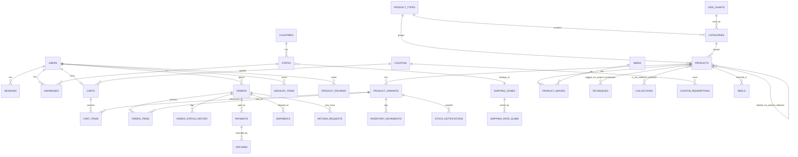

# ArtQ: Database Design

> PostgreSQL 16 · Prisma ORM · Extensions: `pg_trgm`, `citext`, `unaccent`
> Companion docs: [architecture.md](architecture.md) · [api.md](api.md) · [catalog.md](catalog.md)

---

## 1. Conventions

| Rule | Detail |
|------|--------|
| Table names | `snake_case`, plural (`product_variants`). Prisma models are PascalCase singular, mapped with `@@map`. |
| Column names | `snake_case` in DB, camelCase in Prisma (`@map`). |
| Primary keys | `id SERIAL/INT` auto-increment (simple, readable in admin). Public-facing identifiers are **slugs** (catalogue) or **order_number** (orders), never raw ids in customer URLs. |
| Money | **Integer paise** (`INT`), e.g. ₹849 → `84900`. Column names end in `_paise` only in raw SQL docs; in Prisma they are `price`, `mrp`, … and typed `Int`. Max INT = ₹2.1 crore per field, which is enough. |
| Weight | Integer **grams** (`weight_g`). |
| Timestamps | `created_at`, `updated_at` (`TIMESTAMPTZ`, UTC). Displayed in IST (Asia/Kolkata). |
| Soft delete | `deleted_at TIMESTAMPTZ NULL` on products, variants, users, coupons. Orders are **never** deleted. |
| Booleans | `is_*` prefix, `NOT NULL DEFAULT`. |
| Enums | Postgres enums via Prisma `enum`. |
| Case-insensitive text | Emails, coupon codes use `CITEXT`. |
| Snapshots | Orders copy product name, variant label, prices and addresses at purchase time (catalogue can change later). |
| JSON | Only for truly flexible data (settings values, raw payment payloads, import errors). Never for data we filter on. |

---

## 2. Entity-relationship diagram



---

## 3. Tables in detail

### 3.1 Users & authentication

#### `users`
| Column | Type | Null | Default | Notes |
|--------|------|------|---------|-------|
| id | INT PK | | serial | |
| name | VARCHAR(120) | ✓ | | Null for guest until provided |
| email | CITEXT | ✓ | | **Unique** (partial index where `deleted_at IS NULL`) |
| phone | VARCHAR(15) | ✓ | | E.164 `+919876543210`; unique partial |
| password_hash | TEXT | ✓ | | argon2id; null for guests / OTP-only users |
| role | `user_role` | | `CUSTOMER` | CUSTOMER, STAFF, ADMIN, SUPER_ADMIN |
| status | `user_status` | | `ACTIVE` | ACTIVE, BLOCKED, PENDING_VERIFICATION |
| is_guest | BOOLEAN | | false | Created implicitly at guest checkout |
| email_verified_at | TIMESTAMPTZ | ✓ | | |
| phone_verified_at | TIMESTAMPTZ | ✓ | | |
| marketing_opt_in | BOOLEAN | | false | Newsletter / promo consent |
| totp_secret | TEXT | ✓ | | Encrypted; admin 2FA |
| failed_login_count | INT | | 0 | |
| locked_until | TIMESTAMPTZ | ✓ | | |
| last_login_at | TIMESTAMPTZ | ✓ | | |
| admin_notes | TEXT | ✓ | | Internal notes on customer |
| created_at / updated_at / deleted_at | TIMESTAMPTZ | | now() | |

Indexes: `UNIQUE(email) WHERE deleted_at IS NULL`, `UNIQUE(phone) WHERE deleted_at IS NULL`, `(role)`, `(created_at)`.
Check: `email IS NOT NULL OR phone IS NOT NULL`.

#### `sessions`
| Column | Type | Notes |
|--------|------|-------|
| id | UUID PK | `sid` claim in JWT |
| user_id | INT FK → users ON DELETE CASCADE | |
| refresh_token_hash | CHAR(64) | sha256 of current refresh token, **unique** |
| family_id | UUID | Rotation family for reuse detection |
| user_agent | TEXT | |
| ip | INET | |
| expires_at | TIMESTAMPTZ | |
| revoked_at | TIMESTAMPTZ NULL | |
| created_at / last_used_at | TIMESTAMPTZ | |

Indexes: `(user_id)`, `(family_id)`, `(expires_at)`.

#### `otp_codes`
| Column | Type | Notes |
|--------|------|-------|
| id | INT PK | |
| target | VARCHAR(160) | email or phone |
| channel | `otp_channel` | EMAIL, SMS, WHATSAPP |
| purpose | `otp_purpose` | SIGNUP_VERIFY, LOGIN, GUEST_ORDER_ACCESS, EMAIL_CHANGE, CHECKOUT_VERIFY, PASSWORD_RESET |
| code_hash | CHAR(64) | sha256(code + pepper) |
| attempts | INT default 0 | max 5 |
| expires_at | TIMESTAMPTZ | now + 10 min |
| consumed_at | TIMESTAMPTZ NULL | |
| user_id | INT NULL FK | |
| created_at | TIMESTAMPTZ | |

Index: `(target, purpose, created_at DESC)`.

#### `password_reset_tokens`
id, user_id FK, token_hash CHAR(64) UNIQUE, expires_at (30 min), used_at NULL, created_at.

#### `addresses`
| Column | Type | Notes |
|--------|------|-------|
| id | INT PK | |
| user_id | INT FK → users CASCADE | |
| label | `address_label` | HOME, WORK, OTHER |
| full_name | VARCHAR(120) | |
| phone | VARCHAR(15) | |
| line1 | VARCHAR(200) | House/flat, building |
| line2 | VARCHAR(200) NULL | Area, street |
| landmark | VARCHAR(120) NULL | |
| city | VARCHAR(80) | |
| state_id | INT FK → states | |
| pincode | CHAR(6) | `^[1-9][0-9]{5}$` check |
| country_id | INT FK → countries | default India |
| is_default | BOOLEAN | One default per user (partial unique index `(user_id) WHERE is_default`) |
| created_at / updated_at | | |

#### `countries`
id, name, iso2 CHAR(2) UNIQUE (`IN`), phone_code (`+91`), is_active. Seed: India only active.

#### `states`
id, country_id FK, name ("Kerala"), code (`KL`, GST state code `32`), gst_code CHAR(2), shipping_zone_id FK, is_active. UNIQUE(country_id, name). Seed: 28 states + 8 UTs.

#### `pincodes`
pincode CHAR(6), office_name, district, state_id FK, is_cod_available BOOLEAN default true, is_serviceable BOOLEAN default true. PK `(pincode, office_name)`, index `(pincode)`. Seeded from India Post dataset; used for city/state auto-fill and serviceability.

---

### 3.2 Catalogue

#### `product_types`  (homepage round tiles: Resins, Wooden Frames, …)
| Column | Type | Notes |
|--------|------|-------|
| id | INT PK | |
| name | VARCHAR(80) | "Wooden Frames" |
| slug | VARCHAR(100) UNIQUE | `wooden-frames` |
| description | TEXT NULL | Shown on `/type/:slug` banner (sanitised HTML) |
| image_media_id | INT NULL FK → media | Circle tile image |
| banner_media_id | INT NULL FK → media | |
| sort_order | INT default 0 | |
| is_active | BOOLEAN default true | |
| show_on_home | BOOLEAN default true | |
| show_in_menu | BOOLEAN default true | |
| meta_title / meta_description / meta_keywords | VARCHAR(160)/VARCHAR(320)/TEXT | |
| created_at / updated_at | | |

#### `categories`  (sub-groups: "2:1 Resin", "Gel Pigments", …)
| Column | Type | Notes |
|--------|------|-------|
| id | INT PK | |
| type_id | INT FK → product_types RESTRICT | |
| name | VARCHAR(100) | |
| slug | VARCHAR(120) UNIQUE | |
| description | TEXT NULL | |
| image_media_id | INT NULL | |
| size_chart_id | INT NULL FK → size_charts | |
| default_weight_g | INT NULL | Fallback for variants with no weight |
| default_hsn_code / default_gst_rate | VARCHAR(8) / NUMERIC(4,2) NULL | Defaults copied to new products |
| sort_order, is_active, meta_* , timestamps | | |

UNIQUE(type_id, name).

#### `techniques`  (reference calls these "occasions")
id, name ("Deep Pour Casting"), slug UNIQUE, description, image_media_id, hero_media_id, sort_order, is_active, meta_*, timestamps.

#### `collections`
id, name, slug UNIQUE, description, image_media_id, is_active, starts_at NULL, ends_at NULL, sort_order, meta_*, timestamps.
`collection_products`: collection_id FK, product_id FK, sort_order. PK(collection_id, product_id).

#### `size_charts`
id, name, content JSONB (`{columns:[...], rows:[[...]]}`) or html TEXT, timestamps.

#### `products`
| Column | Type | Null | Notes |
|--------|------|------|-------|
| id | INT PK | | |
| type_id | INT FK → product_types | | Denormalised for fast filtering (must equal category.type_id, enforced in service) |
| category_id | INT FK → categories | ✓ | Some products (Glitters, Silica Gel) have no sub-category in the sheet; we create a default category with the same name instead, so in practice NOT NULL |
| name | VARCHAR(200) | | "2:1 Epoxy Resin" |
| slug | VARCHAR(220) UNIQUE | | `2-1-epoxy-resin` |
| short_description | VARCHAR(300) | ✓ | Card/meta fallback |
| description | TEXT | ✓ | Sanitised HTML |
| product_details | TEXT[] | | Bullets ("Crystal clear finish") |
| specifications_care | TEXT[] | | Bullets ("Store in a cool dry place") |
| how_to_use | TEXT | ✓ | |
| dimensions_and_fit | TEXT | ✓ | |
| specifications | JSONB | | Key/values ("Mix ratio": "2:1", "Cure time": "24 h") |
| tags | TEXT[] | | Search keywords |
| hsn_code | VARCHAR(8) | ✓ | |
| gst_rate | NUMERIC(4,2) | | default 18.00 |
| video_media_id | INT FK → media | ✓ | |
| size_chart_id | INT FK | ✓ | Overrides category's |
| is_active | BOOLEAN | | true |
| is_new_arrival | BOOLEAN | | false |
| new_arrival_rank | INT | ✓ | |
| is_trending | BOOLEAN | | false |
| trending_rank | INT | ✓ | |
| is_featured | BOOLEAN | | false |
| sort_order | INT | | 0 |
| min_price | INT | | **Denormalised** min active variant price (paise) |
| max_price | INT | | Denormalised |
| max_mrp | INT | ✓ | For "sale" filter |
| total_stock | INT | | Σ active variant stock |
| sold_count | INT | | For "best selling" sort |
| rating_avg | NUMERIC(2,1) | ✓ | Phase 9 |
| rating_count | INT | | 0 |
| search_vector | TSVECTOR | | Maintained by trigger (see §6) |
| meta_title / meta_description / meta_keywords | | ✓ | |
| og_media_id | INT | ✓ | |
| created_by / updated_by | INT FK → users | ✓ | |
| created_at / updated_at / deleted_at | | | |

Indexes: `(type_id, is_active)`, `(category_id, is_active)`, `(is_new_arrival, new_arrival_rank) WHERE is_active`, `(is_trending, trending_rank) WHERE is_active`, `(min_price)`, `(created_at DESC)`, `(sold_count DESC)`, GIN `(search_vector)`, GIN `(name gin_trgm_ops)`, GIN `(tags)`.

#### `product_variants`
| Column | Type | Null | Notes |
|--------|------|------|-------|
| id | INT PK | | |
| product_id | INT FK → products CASCADE | | |
| sku | VARCHAR(64) | | **Unique** (partial where not deleted), e.g. `RES-21-750G` |
| size | VARCHAR(60) | ✓ | "750 gm", "12X16 Double Frame", "20 gm" |
| color | VARCHAR(60) | ✓ | "Metallic Gold", "Natural Teak" |
| color_hex | CHAR(7) | ✓ | `#d4af37` for swatches |
| thickness | VARCHAR(40) | ✓ | "1 inch", "0.5 inch" |
| label | VARCHAR(160) | | Generated "750 gm" / "12X12 · 1 inch"; used in cart/orders |
| price | INT | | Selling price paise; CHECK > 0 |
| mrp | INT | ✓ | CHECK (mrp IS NULL OR mrp >= price) |
| cost_price | INT | ✓ | For margin reports (admin only) |
| stock | INT | | CHECK ≥ 0 |
| low_stock_threshold | INT | | default 5 |
| allow_backorder | BOOLEAN | | false |
| weight_g | INT | ✓ | Shipping weight incl. container |
| length_cm / width_cm / height_cm | NUMERIC(6,1) | ✓ | For courier volumetric weight (Phase 9) |
| image_media_id | INT FK → media | ✓ | Variant-specific image |
| barcode | VARCHAR(64) | ✓ | |
| sort_order | INT | | 0 |
| is_active | BOOLEAN | | true |
| created_at / updated_at / deleted_at | | | |

Indexes: `UNIQUE(sku) WHERE deleted_at IS NULL`, `(product_id, sort_order)`, `(stock) WHERE stock <= low_stock_threshold` (low-stock report).
Unique business key: `UNIQUE(product_id, size, color, thickness) WHERE deleted_at IS NULL` (NULLs coalesced to '' via expression index).

Option behaviour: the PDP shows a selector only for option columns that have >1 distinct non-null value among a product's active variants.

#### `product_images`
| Column | Type | Notes |
|--------|------|-------|
| id | INT PK | |
| product_id | INT FK CASCADE | |
| media_id | INT FK → media | |
| alt | VARCHAR(200) | Defaults to product name |
| sort_order | INT | 0 = cover |
| is_cover | BOOLEAN | Exactly one per product (partial unique) |

#### `product_techniques`
product_id FK, technique_id FK. PK(product_id, technique_id).

#### `product_relations`
product_id FK, related_product_id FK, kind (`FREQUENTLY_BOUGHT_TOGETHER`, `SIMILAR`), sort_order. PK(product_id, related_product_id, kind).

#### `slug_redirects`
id, entity (`PRODUCT`/`CATEGORY`/`TYPE`/…), old_slug UNIQUE per entity, new_slug, created_at. Used for 301s.

#### `media`
| Column | Type | Notes |
|--------|------|-------|
| id | INT PK | |
| key | TEXT UNIQUE | R2 object key of original |
| kind | `media_kind` | IMAGE, VIDEO, DOCUMENT |
| mime | VARCHAR(80) | |
| size_bytes | INT | |
| width / height | INT NULL | |
| duration_s | NUMERIC NULL | Video |
| variants | JSONB | `{ "webp": [160,320,…], "avif": [...] }` |
| placeholder | TEXT NULL | Base64 LQIP / blurhash |
| status | `media_status` | UPLOADING, PROCESSING, READY, FAILED |
| source_url | TEXT NULL | Original URL if imported from spreadsheet |
| uploaded_by | INT FK users NULL | |
| created_at | | |

---

### 3.3 Inventory

#### `inventory_movements`  (append-only ledger)
| Column | Type | Notes |
|--------|------|-------|
| id | BIGINT PK | |
| variant_id | INT FK | |
| delta | INT | −2 sold, +2 released, +50 restock |
| stock_after | INT | Stock after this movement |
| reason | `inventory_reason` | ORDER_RESERVED, ORDER_RELEASED (expired/failed), ORDER_CANCELLED, RETURN_RESTOCK, MANUAL_ADJUST, IMPORT, INITIAL |
| order_id | INT NULL FK | |
| note | TEXT NULL | |
| actor_id | INT NULL FK users | |
| created_at | | |

Index `(variant_id, created_at DESC)`.

#### `stock_notifications`  ("Notify me when available"; reference: restock-requests)
id, variant_id FK, product_id FK, user_id NULL FK, email CITEXT NULL, phone NULL, status (`PENDING`, `NOTIFIED`, `CANCELLED`), notified_at, created_at.
UNIQUE(variant_id, email) WHERE status='PENDING'. Index `(variant_id, status)`.

---

### 3.4 Cart & wishlist

#### `carts`
| Column | Type | Notes |
|--------|------|-------|
| id | INT PK | |
| token | CHAR(43) UNIQUE | Random base64url, stored in `aq_cart` cookie |
| user_id | INT NULL FK UNIQUE (where status=ACTIVE) | One active cart per user |
| status | `cart_status` | ACTIVE, CONVERTED, MERGED, ABANDONED |
| coupon_id | INT NULL FK → coupons | |
| email / phone | NULL | Captured at checkout step 1, used for abandoned cart |
| pincode | CHAR(6) NULL | For shipping estimate |
| last_activity_at | TIMESTAMPTZ | |
| reminder_count | INT default 0 | |
| last_reminder_at | TIMESTAMPTZ NULL | |
| converted_order_id | INT NULL FK | |
| created_at / updated_at | | |

Index `(status, last_activity_at)`.

#### `cart_items`
id, cart_id FK CASCADE, variant_id FK, quantity INT CHECK (1..50), added_price INT (price when added, to show "price dropped/increased" notices), created_at, updated_at. UNIQUE(cart_id, variant_id).

#### `wishlist_items`
user_id FK CASCADE, product_id FK CASCADE, variant_id NULL, created_at. PK(user_id, product_id).

---

### 3.5 Coupons

#### `coupons`
| Column | Type | Notes |
|--------|------|-------|
| id | INT PK | |
| code | CITEXT UNIQUE | Stored upper-case `WELCOME10` |
| title | VARCHAR(120) | Shown in cart "Get 10% off on first order" |
| description | TEXT NULL | Terms |
| type | `coupon_type` | PERCENT, FLAT, FREE_SHIPPING |
| value | INT | PERCENT: whole percent 1–100; FLAT: paise; FREE_SHIPPING: 0 |
| max_discount | INT NULL | Cap for PERCENT (paise) |
| min_order_value | INT default 0 | Paise, on eligible subtotal |
| starts_at / ends_at | TIMESTAMPTZ NULL | |
| usage_limit_total | INT NULL | |
| usage_limit_per_user | INT NULL default 1 | |
| used_count | INT default 0 | Incremented in the same TX as redemption |
| first_order_only | BOOLEAN false | |
| is_public | BOOLEAN false | Listed in "Available coupons" |
| is_active | BOOLEAN true | |
| applies_to | `coupon_scope` | ALL, TYPES, CATEGORIES, PRODUCTS |
| created_by | INT FK | |
| created_at / updated_at / deleted_at | | |

`coupon_targets`: coupon_id FK, target_type (TYPE/CATEGORY/PRODUCT), target_id INT. PK(coupon_id, target_type, target_id).

#### `coupon_redemptions`
id, coupon_id FK, order_id FK UNIQUE, user_id NULL, email CITEXT NULL, phone NULL, discount INT, status (`APPLIED`, `REVERSED`), created_at. Index `(coupon_id, user_id)`, `(coupon_id, email)`.

---

### 3.6 Shipping

#### `shipping_zones`
id, name ("Kerala", "South India", "Rest of India", "Remote"), is_active, sort_order. Each `states.shipping_zone_id` points here.

#### `shipping_rate_slabs`
| Column | Type | Notes |
|--------|------|-------|
| id | INT PK | |
| zone_id | INT FK | |
| max_weight_g | INT | Slab upper bound (500, 1000, 2000, 5000) |
| rate | INT | Paise |
| extra_per_kg | INT NULL | Only on the last slab: charge per additional kg beyond max |
| UNIQUE(zone_id, max_weight_g) | | |

Shipping settings (free threshold, packaging weight, COD fee, COD limits, heavy-item cap) live in `settings` (§3.10).

---

### 3.7 Orders & payments

#### `orders`
| Column | Type | Null | Notes |
|--------|------|------|-------|
| id | INT PK | | |
| order_number | VARCHAR(20) UNIQUE | | `AQ10001` from sequence `order_number_seq START 10001` |
| user_id | INT FK users | ✓ | Null only if guest user creation is disabled; normally guest user row |
| email | CITEXT | | Contact snapshot |
| phone | VARCHAR(15) | | |
| status | `order_status` | | PENDING_PAYMENT, PLACED, CONFIRMED, PACKED, SHIPPED, OUT_FOR_DELIVERY, DELIVERED, CANCELLED, EXPIRED, RETURN_REQUESTED, RETURNED, RETURN_REJECTED |
| payment_status | `payment_status` | | PENDING, PAID, FAILED, REFUNDED, PARTIALLY_REFUNDED |
| payment_method | `payment_method` | | RAZORPAY, COD |
| currency | CHAR(3) | | `INR` |
| subtotal | INT | | Σ line totals (selling price) |
| mrp_total | INT | | Σ MRP × qty |
| coupon_discount | INT | | 0 if none |
| shipping_fee | INT | | |
| cod_fee | INT | | |
| total | INT | | subtotal − coupon_discount + shipping_fee + cod_fee |
| refunded_amount | INT | | default 0 |
| tax_total | INT | | Included GST (for invoice) |
| coupon_id | INT FK | ✓ | |
| coupon_code | CITEXT | ✓ | Snapshot |
| total_weight_g | INT | | |
| shipping_zone_id | INT FK | ✓ | |
| ship_name, ship_phone, ship_line1, ship_line2, ship_landmark, ship_city, ship_state, ship_state_code, ship_pincode, ship_country | VARCHAR | | **Snapshot** of shipping address |
| bill_same_as_ship | BOOLEAN | | true |
| bill_name … bill_pincode | VARCHAR | ✓ | Billing snapshot |
| gstin / business_name | VARCHAR | ✓ | B2B invoice |
| customer_note | VARCHAR(500) | ✓ | |
| admin_note | TEXT | ✓ | Internal |
| source | VARCHAR(20) | | `web`, `admin` (manual order), `app` |
| utm_source / utm_medium / utm_campaign | VARCHAR | ✓ | Attribution |
| ip / user_agent | | ✓ | Fraud checks |
| expires_at | TIMESTAMPTZ | ✓ | For PENDING_PAYMENT |
| placed_at, confirmed_at, packed_at, shipped_at, delivered_at, cancelled_at | TIMESTAMPTZ | ✓ | |
| cancel_reason | VARCHAR(300) | ✓ | |
| cancelled_by | `actor_type` | ✓ | CUSTOMER, ADMIN, SYSTEM |
| invoice_number | VARCHAR(30) UNIQUE | ✓ | `AQ/2026-27/00001` assigned when PAID/PLACED (GST: sequential per financial year) |
| tracking_token | CHAR(32) | | Random, for public tracking link |
| created_at / updated_at | | | |

Indexes: `(user_id, created_at DESC)`, `(status, created_at DESC)`, `(payment_status)`, `(email)`, `(phone)`, `(created_at)`, `(status, expires_at) WHERE status='PENDING_PAYMENT'`.
Checks: all money ≥ 0; `total = subtotal - coupon_discount + shipping_fee + cod_fee`.

#### `order_items`
| Column | Type | Notes |
|--------|------|-------|
| id | INT PK | |
| order_id | INT FK CASCADE | |
| product_id | INT FK (SET NULL on delete) | |
| variant_id | INT FK (SET NULL) | |
| product_name | VARCHAR(200) | Snapshot |
| variant_label | VARCHAR(160) | "750 gm" |
| sku | VARCHAR(64) | |
| image_url | TEXT | Snapshot (CDN url) |
| unit_price | INT | |
| unit_mrp | INT NULL | |
| quantity | INT | CHECK > 0 |
| line_total | INT | unit_price × qty |
| discount | INT | Allocated coupon discount |
| tax_rate | NUMERIC(4,2) | |
| tax_amount | INT | Included GST of (line_total − discount) |
| hsn_code | VARCHAR(8) NULL | |
| weight_g | INT | per unit |
| cancelled_qty / returned_qty | INT default 0 | Partial cancel/return |

#### `order_status_history`
id, order_id FK, from_status NULL, to_status, note, actor_type (CUSTOMER/ADMIN/SYSTEM/WEBHOOK), actor_id NULL, notify_customer BOOLEAN, created_at. Index `(order_id, created_at)`.

#### `payments`
| Column | Type | Notes |
|--------|------|-------|
| id | INT PK | |
| order_id | INT FK | One order can have several attempts |
| provider | `payment_provider` | RAZORPAY, COD, MANUAL |
| provider_order_id | VARCHAR(64) UNIQUE NULL | `order_Nxyz` |
| provider_payment_id | VARCHAR(64) UNIQUE NULL | `pay_Nabc` |
| signature | VARCHAR(128) NULL | |
| amount | INT | paise |
| currency | CHAR(3) | |
| status | `payment_attempt_status` | CREATED, AUTHORIZED, CAPTURED, FAILED, REFUNDED |
| method | VARCHAR(20) NULL | upi, card, netbanking, wallet |
| error_code / error_description | NULL | |
| raw | JSONB | Latest provider payload |
| captured_at | TIMESTAMPTZ NULL | |
| created_at / updated_at | | |

#### `refunds`
id, payment_id FK, order_id FK, amount INT, reason, provider_refund_id UNIQUE NULL, status (PENDING, PROCESSED, FAILED), initiated_by FK users, raw JSONB, created_at, processed_at.

#### `webhook_events`
id, provider (RAZORPAY, SHIPROCKET), event_id VARCHAR UNIQUE, event_type, payload JSONB, processed_at NULL, error TEXT NULL, created_at. Guarantees idempotency.

#### `shipments`
id, order_id FK, courier_name, awb_number, tracking_url, status (CREATED, PICKED_UP, IN_TRANSIT, OUT_FOR_DELIVERY, DELIVERED, RTO, LOST), shiprocket_order_id NULL, shiprocket_shipment_id NULL, label_url NULL, weight_g, shipped_at, delivered_at, created_at, updated_at. (One order may ship in multiple boxes later.)

#### `return_requests`
id, order_id FK, user_id FK, reason (`DAMAGED`, `WRONG_ITEM`, `DEFECTIVE`, `MISSING_ITEM`, `OTHER`), description, status (REQUESTED, APPROVED, REJECTED, PICKED_UP, REFUNDED, CLOSED), refund_amount INT NULL, restock BOOLEAN, admin_note, created_at, updated_at.
`return_request_items`: return_request_id, order_item_id, quantity. `return_request_media`: return_request_id, media_id.

---

### 3.8 Content & marketing

| Table | Columns |
|-------|---------|
| `reels` | id, title, video_media_id FK, thumbnail_media_id FK, product_id FK NULL, variant_id NULL, instagram_url NULL, caption NULL, sort_order, is_active, view_count INT, created_at, updated_at |
| `testimonials` | id, name, location NULL, quote TEXT, rating SMALLINT CHECK 1–5, avatar_media_id NULL, product_id NULL, sort_order, is_active, created_at |
| `home_slides` | id, heading, subheading, cta_text, cta_link, media_id (desktop), mobile_media_id, kind (IMAGE/VIDEO), sort_order, is_active, starts_at, ends_at |
| `faqs` | id, group (`ORDERS`, `SHIPPING`, `PAYMENTS`, `PRODUCTS`, `RETURNS`), question, answer TEXT (HTML), sort_order, is_active |
| `cms_pages` | id, slug UNIQUE (`terms`, `privacy-policy`, `shipping-policy`, `return-policy`, `cancellation-policy`, `about`), title, content TEXT (HTML), meta_title, meta_description, is_published, updated_by, updated_at |
| `newsletter_subscribers` | id, email CITEXT UNIQUE, status (SUBSCRIBED, UNSUBSCRIBED), source (`footer`, `signup`, `checkout`), unsubscribe_token CHAR(32) UNIQUE, user_id NULL, created_at, unsubscribed_at |
| `contact_messages` | id, kind (CONTACT, CUSTOM_WORK), name, email, phone, subject, message, order_number NULL, details JSONB (custom work: size, wood, qty, budget, date), attachment_media_ids INT[], status (NEW, IN_PROGRESS, REPLIED, CLOSED), admin_note, created_at |
| `product_reviews` *(Phase 9)* | id, product_id, user_id, order_item_id NULL (verified purchase), rating 1–5, title, body, status (PENDING, APPROVED, REJECTED), media_ids INT[], created_at. UNIQUE(product_id, user_id) |
| `search_logs` | id BIGINT, query VARCHAR(120), normalized VARCHAR(120), results_count INT, user_id NULL, created_at. Index `(normalized, created_at)` |
| `seo_overrides` | id, path VARCHAR UNIQUE (`/shop`), meta_title, meta_description, meta_keywords, og_media_id, canonical, noindex BOOLEAN |
| `redirects` | id, from_path UNIQUE, to_path, status_code (301/302), hits INT |

### 3.9 System

| Table | Columns |
|-------|---------|
| `notifications` | id, user_id NULL (null = all admins), audience (ADMIN/CUSTOMER), type (`NEW_ORDER`, `LOW_STOCK`, `RETURN_REQUEST`, `CONTACT_MESSAGE`, `PAYMENT_ISSUE`), title, body, link, read_at, created_at |
| `email_logs` | id, to_email, template, subject, provider_message_id, status (QUEUED, SENT, FAILED, BOUNCED), error, order_id NULL, user_id NULL, created_at |
| `audit_logs` | id BIGINT, actor_id FK, action (`product.update`, `order.status_change`, `settings.update`, …), entity, entity_id, before JSONB, after JSONB, ip INET, user_agent, created_at. Index `(entity, entity_id)`, `(actor_id, created_at)` |
| `product_imports` | id, file_media_id, file_name, status (UPLOADED, VALIDATED, IMPORTING, COMPLETED, FAILED), mode (CREATE_ONLY, UPSERT_BY_SKU), total_rows, valid_rows, created_count, updated_count, error_count, errors JSONB (`[{row, column, message, severity}]`), preview JSONB, created_by, created_at, completed_at |

### 3.10 `settings` (key/value)
| Column | Type |
|--------|------|
| key | VARCHAR(64) PK |
| value | JSONB |
| is_public | BOOLEAN (exposed via `/settings/public`) |
| updated_by / updated_at | |

Seeded keys:

| Key | Example value | Public |
|-----|---------------|:------:|
| `STORE_INFO` | `{name:"ArtQ", legalName, gstin, address, stateCode:"KL", phone, email, whatsapp}` | partly |
| `ANNOUNCEMENT_BAR` | `{enabled:true, speed:40, messages:["Shipping all over India","Free shipping on orders above ₹1000"]}` | ✓ |
| `HOME_SECTIONS` | `[{key:"hero",enabled:true},{key:"categories",title:"Product Category",eyebrow:"CHECK OUT OUR RANGE"},{key:"newArrivals",...},{key:"reels"},{key:"techniques"},{key:"testimonials"},{key:"instagram"}]` | ✓ |
| `HERO` | `{mode:"video", videoMediaId, posterMediaId, heading:"ARTQ", subheading:"WOOD MOULDS & RESINS", ctaText, ctaLink}` | ✓ |
| `INSTAGRAM_MOMENTS` | `[{mediaId, url}]` | ✓ |
| `SHIPPING` | `{freeThreshold:100000, packagingWeightG:100, heavyCapG:10000, heavyCapEnabled:true, estimatedDays:{min:4,max:7}}` | ✓ |
| `PAYMENT` | `{razorpayEnabled:true, codEnabled:true, codFee:4000, codMin:20000, codMax:500000, codRequiresOtp:false}` | ✓ (no keys) |
| `ORDER` | `{pendingExpiryMinutes:30, cancelAllowedStatuses:["PLACED","CONFIRMED"], returnWindowHours:48}` | ✓ |
| `TAX` | `{pricesIncludeTax:true, defaultGstRate:18}` | |
| `SOCIAL` | `{instagram, facebook, youtube, whatsapp}` | ✓ |
| `NOTIFY` | `{adminEmails:[...], dailySummary:true, lowStockEmail:true}` | |

---

## 4. Enums (summary)

```
user_role:            CUSTOMER | STAFF | ADMIN | SUPER_ADMIN
user_status:          ACTIVE | BLOCKED | PENDING_VERIFICATION
otp_channel:          EMAIL | SMS | WHATSAPP
otp_purpose:          SIGNUP_VERIFY | LOGIN | GUEST_ORDER_ACCESS | EMAIL_CHANGE | CHECKOUT_VERIFY | PASSWORD_RESET
address_label:        HOME | WORK | OTHER
media_kind:           IMAGE | VIDEO | DOCUMENT
media_status:         UPLOADING | PROCESSING | READY | FAILED
inventory_reason:     INITIAL | IMPORT | MANUAL_ADJUST | ORDER_RESERVED | ORDER_RELEASED | ORDER_CANCELLED | RETURN_RESTOCK
cart_status:          ACTIVE | CONVERTED | MERGED | ABANDONED
coupon_type:          PERCENT | FLAT | FREE_SHIPPING
coupon_scope:         ALL | TYPES | CATEGORIES | PRODUCTS
order_status:         PENDING_PAYMENT | PLACED | CONFIRMED | PACKED | SHIPPED | OUT_FOR_DELIVERY | DELIVERED |
                      CANCELLED | EXPIRED | RETURN_REQUESTED | RETURNED | RETURN_REJECTED
payment_status:       PENDING | PAID | FAILED | REFUNDED | PARTIALLY_REFUNDED
payment_method:       RAZORPAY | COD
payment_provider:     RAZORPAY | COD | MANUAL
payment_attempt_status: CREATED | AUTHORIZED | CAPTURED | FAILED | REFUNDED
actor_type:           CUSTOMER | ADMIN | SYSTEM | WEBHOOK
```

### Allowed order status transitions (enforced in `orders.service.ts`)
| From | To |
|------|----|
| PENDING_PAYMENT | PLACED (paid), EXPIRED, CANCELLED |
| PLACED | CONFIRMED, CANCELLED |
| CONFIRMED | PACKED, CANCELLED |
| PACKED | SHIPPED, CANCELLED (admin only) |
| SHIPPED | OUT_FOR_DELIVERY, DELIVERED |
| OUT_FOR_DELIVERY | DELIVERED |
| DELIVERED | RETURN_REQUESTED |
| RETURN_REQUESTED | RETURNED, RETURN_REJECTED |

---

## 5. Prisma schema (`apps/api/prisma/schema.prisma`)

```prisma
generator client {
  provider        = "prisma-client-js"
  previewFeatures = ["postgresqlExtensions", "fullTextSearchPostgres"]
}

datasource db {
  provider   = "postgresql"
  url        = env("DATABASE_URL")
  extensions = [pg_trgm, citext, unaccent]
}

// ───────────────────────────── ENUMS ─────────────────────────────
enum UserRole { CUSTOMER STAFF ADMIN SUPER_ADMIN }
enum UserStatus { ACTIVE BLOCKED PENDING_VERIFICATION }
enum OtpChannel { EMAIL SMS WHATSAPP }
enum OtpPurpose { SIGNUP_VERIFY LOGIN GUEST_ORDER_ACCESS EMAIL_CHANGE CHECKOUT_VERIFY PASSWORD_RESET }
enum AddressLabel { HOME WORK OTHER }
enum MediaKind { IMAGE VIDEO DOCUMENT }
enum MediaStatus { UPLOADING PROCESSING READY FAILED }
enum InventoryReason { INITIAL IMPORT MANUAL_ADJUST ORDER_RESERVED ORDER_RELEASED ORDER_CANCELLED RETURN_RESTOCK }
enum CartStatus { ACTIVE CONVERTED MERGED ABANDONED }
enum CouponType { PERCENT FLAT FREE_SHIPPING }
enum CouponScope { ALL TYPES CATEGORIES PRODUCTS }
enum CouponTargetType { TYPE CATEGORY PRODUCT }
enum RedemptionStatus { APPLIED REVERSED }
enum OrderStatus {
  PENDING_PAYMENT PLACED CONFIRMED PACKED SHIPPED OUT_FOR_DELIVERY DELIVERED
  CANCELLED EXPIRED RETURN_REQUESTED RETURNED RETURN_REJECTED
}
enum PaymentStatus { PENDING PAID FAILED REFUNDED PARTIALLY_REFUNDED }
enum PaymentMethod { RAZORPAY COD }
enum PaymentProvider { RAZORPAY COD MANUAL }
enum PaymentAttemptStatus { CREATED AUTHORIZED CAPTURED FAILED REFUNDED }
enum RefundStatus { PENDING PROCESSED FAILED }
enum ActorType { CUSTOMER ADMIN SYSTEM WEBHOOK }
enum ShipmentStatus { CREATED PICKED_UP IN_TRANSIT OUT_FOR_DELIVERY DELIVERED RTO LOST }
enum ReturnReason { DAMAGED WRONG_ITEM DEFECTIVE MISSING_ITEM OTHER }
enum ReturnStatus { REQUESTED APPROVED REJECTED PICKED_UP REFUNDED CLOSED }
enum StockNotificationStatus { PENDING NOTIFIED CANCELLED }
enum RelationKind { FREQUENTLY_BOUGHT_TOGETHER SIMILAR }
enum SubscriberStatus { SUBSCRIBED UNSUBSCRIBED }
enum MessageKind { CONTACT CUSTOM_WORK }
enum MessageStatus { NEW IN_PROGRESS REPLIED CLOSED }
enum FaqGroup { ORDERS SHIPPING PAYMENTS PRODUCTS RETURNS }
enum ImportStatus { UPLOADED VALIDATED IMPORTING COMPLETED FAILED }
enum ImportMode { CREATE_ONLY UPSERT_BY_SKU }
enum ReviewStatus { PENDING APPROVED REJECTED }
enum EmailStatus { QUEUED SENT FAILED BOUNCED }
enum NotificationAudience { ADMIN CUSTOMER }

// ─────────────────────────── USERS & AUTH ───────────────────────────
model User {
  id               Int        @id @default(autoincrement())
  name             String?    @db.VarChar(120)
  email            String?    @db.Citext
  phone            String?    @db.VarChar(15)
  passwordHash     String?    @map("password_hash")
  role             UserRole   @default(CUSTOMER)
  status           UserStatus @default(ACTIVE)
  isGuest          Boolean    @default(false) @map("is_guest")
  emailVerifiedAt  DateTime?  @map("email_verified_at") @db.Timestamptz
  phoneVerifiedAt  DateTime?  @map("phone_verified_at") @db.Timestamptz
  marketingOptIn   Boolean    @default(false) @map("marketing_opt_in")
  totpSecret       String?    @map("totp_secret")
  failedLoginCount Int        @default(0) @map("failed_login_count")
  lockedUntil      DateTime?  @map("locked_until") @db.Timestamptz
  lastLoginAt      DateTime?  @map("last_login_at") @db.Timestamptz
  adminNotes       String?    @map("admin_notes")
  createdAt        DateTime   @default(now()) @map("created_at") @db.Timestamptz
  updatedAt        DateTime   @updatedAt @map("updated_at") @db.Timestamptz
  deletedAt        DateTime?  @map("deleted_at") @db.Timestamptz

  sessions            Session[]
  addresses           Address[]
  orders              Order[]
  carts               Cart[]
  wishlist            WishlistItem[]
  stockNotifications  StockNotification[]
  reviews             ProductReview[]
  otpCodes            OtpCode[]
  passwordResetTokens PasswordResetToken[]

  // partial unique indexes (email/phone where deleted_at is null) are added in a raw SQL migration
  @@index([role])
  @@index([createdAt])
  @@map("users")
}

model Session {
  id               String    @id @default(uuid()) @db.Uuid
  userId           Int       @map("user_id")
  refreshTokenHash String    @unique @map("refresh_token_hash") @db.Char(64)
  familyId         String    @map("family_id") @db.Uuid
  userAgent        String?   @map("user_agent")
  ip               String?   @db.Inet
  expiresAt        DateTime  @map("expires_at") @db.Timestamptz
  revokedAt        DateTime? @map("revoked_at") @db.Timestamptz
  createdAt        DateTime  @default(now()) @map("created_at") @db.Timestamptz
  lastUsedAt       DateTime  @default(now()) @map("last_used_at") @db.Timestamptz
  user             User      @relation(fields: [userId], references: [id], onDelete: Cascade)

  @@index([userId])
  @@index([familyId])
  @@index([expiresAt])
  @@map("sessions")
}

model OtpCode {
  id         Int        @id @default(autoincrement())
  target     String     @db.VarChar(160)
  channel    OtpChannel
  purpose    OtpPurpose
  codeHash   String     @map("code_hash") @db.Char(64)
  attempts   Int        @default(0)
  expiresAt  DateTime   @map("expires_at") @db.Timestamptz
  consumedAt DateTime?  @map("consumed_at") @db.Timestamptz
  userId     Int?       @map("user_id")
  createdAt  DateTime   @default(now()) @map("created_at") @db.Timestamptz
  user       User?      @relation(fields: [userId], references: [id], onDelete: Cascade)

  @@index([target, purpose, createdAt(sort: Desc)])
  @@map("otp_codes")
}

model PasswordResetToken {
  id        Int       @id @default(autoincrement())
  userId    Int       @map("user_id")
  tokenHash String    @unique @map("token_hash") @db.Char(64)
  expiresAt DateTime  @map("expires_at") @db.Timestamptz
  usedAt    DateTime? @map("used_at") @db.Timestamptz
  createdAt DateTime  @default(now()) @map("created_at") @db.Timestamptz
  user      User      @relation(fields: [userId], references: [id], onDelete: Cascade)

  @@map("password_reset_tokens")
}

model Country {
  id        Int     @id @default(autoincrement())
  name      String  @db.VarChar(80)
  iso2      String  @unique @db.Char(2)
  phoneCode String  @map("phone_code") @db.VarChar(6)
  isActive  Boolean @default(true) @map("is_active")
  states    State[]
  addresses Address[]

  @@map("countries")
}

model State {
  id             Int           @id @default(autoincrement())
  countryId      Int           @map("country_id")
  name           String        @db.VarChar(80)
  code           String        @db.VarChar(4)
  gstCode        String?       @map("gst_code") @db.Char(2)
  shippingZoneId Int?          @map("shipping_zone_id")
  isActive       Boolean       @default(true) @map("is_active")
  country        Country       @relation(fields: [countryId], references: [id])
  shippingZone   ShippingZone? @relation(fields: [shippingZoneId], references: [id])
  addresses      Address[]
  pincodes       Pincode[]

  @@unique([countryId, name])
  @@map("states")
}

model Pincode {
  pincode        String  @db.Char(6)
  officeName     String  @map("office_name") @db.VarChar(120)
  district       String  @db.VarChar(80)
  stateId        Int     @map("state_id")
  isCodAvailable Boolean @default(true) @map("is_cod_available")
  isServiceable  Boolean @default(true) @map("is_serviceable")
  state          State   @relation(fields: [stateId], references: [id])

  @@id([pincode, officeName])
  @@index([pincode])
  @@map("pincodes")
}

model Address {
  id        Int          @id @default(autoincrement())
  userId    Int          @map("user_id")
  label     AddressLabel @default(HOME)
  fullName  String       @map("full_name") @db.VarChar(120)
  phone     String       @db.VarChar(15)
  line1     String       @db.VarChar(200)
  line2     String?      @db.VarChar(200)
  landmark  String?      @db.VarChar(120)
  city      String       @db.VarChar(80)
  stateId   Int          @map("state_id")
  pincode   String       @db.Char(6)
  countryId Int          @map("country_id")
  isDefault Boolean      @default(false) @map("is_default")
  createdAt DateTime     @default(now()) @map("created_at") @db.Timestamptz
  updatedAt DateTime     @updatedAt @map("updated_at") @db.Timestamptz
  user      User         @relation(fields: [userId], references: [id], onDelete: Cascade)
  state     State        @relation(fields: [stateId], references: [id])
  country   Country      @relation(fields: [countryId], references: [id])

  @@index([userId])
  @@map("addresses")
}

// ───────────────────────────── MEDIA ─────────────────────────────
model Media {
  id         Int         @id @default(autoincrement())
  key        String      @unique
  kind       MediaKind
  mime       String      @db.VarChar(80)
  sizeBytes  Int         @map("size_bytes")
  width      Int?
  height     Int?
  durationS  Decimal?    @map("duration_s") @db.Decimal(8, 2)
  variants   Json        @default("{}")
  placeholder String?
  status     MediaStatus @default(UPLOADING)
  sourceUrl  String?     @map("source_url")
  uploadedBy Int?        @map("uploaded_by")
  createdAt  DateTime    @default(now()) @map("created_at") @db.Timestamptz

  productImages ProductImage[]

  @@map("media")
}

// ──────────────────────────── CATALOGUE ────────────────────────────
model ProductType {
  id              Int        @id @default(autoincrement())
  name            String     @db.VarChar(80)
  slug            String     @unique @db.VarChar(100)
  description     String?
  imageMediaId    Int?       @map("image_media_id")
  bannerMediaId   Int?       @map("banner_media_id")
  sortOrder       Int        @default(0) @map("sort_order")
  isActive        Boolean    @default(true) @map("is_active")
  showOnHome      Boolean    @default(true) @map("show_on_home")
  showInMenu      Boolean    @default(true) @map("show_in_menu")
  metaTitle       String?    @map("meta_title") @db.VarChar(160)
  metaDescription String?    @map("meta_description") @db.VarChar(320)
  metaKeywords    String?    @map("meta_keywords")
  createdAt       DateTime   @default(now()) @map("created_at") @db.Timestamptz
  updatedAt       DateTime   @updatedAt @map("updated_at") @db.Timestamptz
  categories      Category[]
  products        Product[]

  @@index([isActive, sortOrder])
  @@map("product_types")
}

model Category {
  id              Int         @id @default(autoincrement())
  typeId          Int         @map("type_id")
  name            String      @db.VarChar(100)
  slug            String      @unique @db.VarChar(120)
  description     String?
  imageMediaId    Int?        @map("image_media_id")
  sizeChartId     Int?        @map("size_chart_id")
  defaultWeightG  Int?        @map("default_weight_g")
  defaultHsnCode  String?     @map("default_hsn_code") @db.VarChar(8)
  defaultGstRate  Decimal?    @map("default_gst_rate") @db.Decimal(4, 2)
  sortOrder       Int         @default(0) @map("sort_order")
  isActive        Boolean     @default(true) @map("is_active")
  metaTitle       String?     @map("meta_title") @db.VarChar(160)
  metaDescription String?     @map("meta_description") @db.VarChar(320)
  metaKeywords    String?     @map("meta_keywords")
  createdAt       DateTime    @default(now()) @map("created_at") @db.Timestamptz
  updatedAt       DateTime    @updatedAt @map("updated_at") @db.Timestamptz
  type            ProductType @relation(fields: [typeId], references: [id], onDelete: Restrict)
  sizeChart       SizeChart?  @relation(fields: [sizeChartId], references: [id])
  products        Product[]

  @@unique([typeId, name])
  @@index([typeId, isActive, sortOrder])
  @@map("categories")
}

model Technique {
  id              Int                @id @default(autoincrement())
  name            String             @db.VarChar(100)
  slug            String             @unique @db.VarChar(120)
  description     String?
  imageMediaId    Int?               @map("image_media_id")
  heroMediaId     Int?               @map("hero_media_id")
  sortOrder       Int                @default(0) @map("sort_order")
  isActive        Boolean            @default(true) @map("is_active")
  metaTitle       String?            @map("meta_title") @db.VarChar(160)
  metaDescription String?            @map("meta_description") @db.VarChar(320)
  metaKeywords    String?            @map("meta_keywords")
  createdAt       DateTime           @default(now()) @map("created_at") @db.Timestamptz
  updatedAt       DateTime           @updatedAt @map("updated_at") @db.Timestamptz
  products        ProductTechnique[]

  @@map("techniques")
}

model Collection {
  id              Int                 @id @default(autoincrement())
  name            String              @db.VarChar(120)
  slug            String              @unique @db.VarChar(140)
  description     String?
  imageMediaId    Int?                @map("image_media_id")
  isActive        Boolean             @default(true) @map("is_active")
  startsAt        DateTime?           @map("starts_at") @db.Timestamptz
  endsAt          DateTime?           @map("ends_at") @db.Timestamptz
  sortOrder       Int                 @default(0) @map("sort_order")
  metaTitle       String?             @map("meta_title") @db.VarChar(160)
  metaDescription String?             @map("meta_description") @db.VarChar(320)
  createdAt       DateTime            @default(now()) @map("created_at") @db.Timestamptz
  updatedAt       DateTime            @updatedAt @map("updated_at") @db.Timestamptz
  products        CollectionProduct[]

  @@map("collections")
}

model CollectionProduct {
  collectionId Int        @map("collection_id")
  productId    Int        @map("product_id")
  sortOrder    Int        @default(0) @map("sort_order")
  collection   Collection @relation(fields: [collectionId], references: [id], onDelete: Cascade)
  product      Product    @relation(fields: [productId], references: [id], onDelete: Cascade)

  @@id([collectionId, productId])
  @@map("collection_products")
}

model SizeChart {
  id         Int        @id @default(autoincrement())
  name       String     @db.VarChar(100)
  content    Json?
  html       String?
  createdAt  DateTime   @default(now()) @map("created_at") @db.Timestamptz
  updatedAt  DateTime   @updatedAt @map("updated_at") @db.Timestamptz
  categories Category[]
  products   Product[]

  @@map("size_charts")
}

model Product {
  id                 Int       @id @default(autoincrement())
  typeId             Int       @map("type_id")
  categoryId         Int?      @map("category_id")
  name               String    @db.VarChar(200)
  slug               String    @unique @db.VarChar(220)
  shortDescription   String?   @map("short_description") @db.VarChar(300)
  description        String?
  productDetails     String[]  @default([]) @map("product_details")
  specificationsCare String[]  @default([]) @map("specifications_care")
  howToUse           String?   @map("how_to_use")
  dimensionsAndFit   String?   @map("dimensions_and_fit")
  specifications     Json      @default("{}")
  tags               String[]  @default([])
  hsnCode            String?   @map("hsn_code") @db.VarChar(8)
  gstRate            Decimal   @default(18) @map("gst_rate") @db.Decimal(4, 2)
  videoMediaId       Int?      @map("video_media_id")
  sizeChartId        Int?      @map("size_chart_id")
  isActive           Boolean   @default(true) @map("is_active")
  isNewArrival       Boolean   @default(false) @map("is_new_arrival")
  newArrivalRank     Int?      @map("new_arrival_rank")
  isTrending         Boolean   @default(false) @map("is_trending")
  trendingRank       Int?      @map("trending_rank")
  isFeatured         Boolean   @default(false) @map("is_featured")
  sortOrder          Int       @default(0) @map("sort_order")
  minPrice           Int       @default(0) @map("min_price")
  maxPrice           Int       @default(0) @map("max_price")
  maxMrp             Int?      @map("max_mrp")
  totalStock         Int       @default(0) @map("total_stock")
  soldCount          Int       @default(0) @map("sold_count")
  ratingAvg          Decimal?  @map("rating_avg") @db.Decimal(2, 1)
  ratingCount        Int       @default(0) @map("rating_count")
  searchVector       Unsupported("tsvector")? @map("search_vector")
  metaTitle          String?   @map("meta_title") @db.VarChar(160)
  metaDescription    String?   @map("meta_description") @db.VarChar(320)
  metaKeywords       String?   @map("meta_keywords")
  ogMediaId          Int?      @map("og_media_id")
  createdBy          Int?      @map("created_by")
  updatedBy          Int?      @map("updated_by")
  createdAt          DateTime  @default(now()) @map("created_at") @db.Timestamptz
  updatedAt          DateTime  @updatedAt @map("updated_at") @db.Timestamptz
  deletedAt          DateTime? @map("deleted_at") @db.Timestamptz

  type               ProductType         @relation(fields: [typeId], references: [id])
  category           Category?           @relation(fields: [categoryId], references: [id])
  sizeChart          SizeChart?          @relation(fields: [sizeChartId], references: [id])
  variants           ProductVariant[]
  images             ProductImage[]
  techniques         ProductTechnique[]
  collections        CollectionProduct[]
  relations          ProductRelation[]   @relation("ProductRelationFrom")
  relatedFrom        ProductRelation[]   @relation("ProductRelationTo")
  wishlistItems      WishlistItem[]
  orderItems         OrderItem[]
  reels              Reel[]
  testimonials       Testimonial[]
  stockNotifications StockNotification[]
  reviews            ProductReview[]

  @@index([typeId, isActive])
  @@index([categoryId, isActive])
  @@index([isNewArrival, newArrivalRank])
  @@index([isTrending, trendingRank])
  @@index([minPrice])
  @@index([createdAt(sort: Desc)])
  @@index([soldCount(sort: Desc)])
  @@map("products")
}

model ProductVariant {
  id                Int       @id @default(autoincrement())
  productId         Int       @map("product_id")
  sku               String    @db.VarChar(64)
  size              String?   @db.VarChar(60)
  color             String?   @db.VarChar(60)
  colorHex          String?   @map("color_hex") @db.Char(7)
  thickness         String?   @db.VarChar(40)
  label             String    @db.VarChar(160)
  price             Int
  mrp               Int?
  costPrice         Int?      @map("cost_price")
  stock             Int       @default(0)
  lowStockThreshold Int       @default(5) @map("low_stock_threshold")
  allowBackorder    Boolean   @default(false) @map("allow_backorder")
  weightG           Int?      @map("weight_g")
  lengthCm          Decimal?  @map("length_cm") @db.Decimal(6, 1)
  widthCm           Decimal?  @map("width_cm") @db.Decimal(6, 1)
  heightCm          Decimal?  @map("height_cm") @db.Decimal(6, 1)
  imageMediaId      Int?      @map("image_media_id")
  barcode           String?   @db.VarChar(64)
  sortOrder         Int       @default(0) @map("sort_order")
  isActive          Boolean   @default(true) @map("is_active")
  createdAt         DateTime  @default(now()) @map("created_at") @db.Timestamptz
  updatedAt         DateTime  @updatedAt @map("updated_at") @db.Timestamptz
  deletedAt         DateTime? @map("deleted_at") @db.Timestamptz

  product            Product              @relation(fields: [productId], references: [id], onDelete: Cascade)
  cartItems          CartItem[]
  orderItems         OrderItem[]
  movements          InventoryMovement[]
  stockNotifications StockNotification[]

  // UNIQUE(sku) WHERE deleted_at IS NULL and CHECKs added via raw SQL migration
  @@index([productId, sortOrder])
  @@map("product_variants")
}

model ProductImage {
  id        Int     @id @default(autoincrement())
  productId Int     @map("product_id")
  mediaId   Int     @map("media_id")
  alt       String? @db.VarChar(200)
  sortOrder Int     @default(0) @map("sort_order")
  isCover   Boolean @default(false) @map("is_cover")
  product   Product @relation(fields: [productId], references: [id], onDelete: Cascade)
  media     Media   @relation(fields: [mediaId], references: [id])

  @@index([productId, sortOrder])
  @@map("product_images")
}

model ProductTechnique {
  productId   Int       @map("product_id")
  techniqueId Int       @map("technique_id")
  product     Product   @relation(fields: [productId], references: [id], onDelete: Cascade)
  technique   Technique @relation(fields: [techniqueId], references: [id], onDelete: Cascade)

  @@id([productId, techniqueId])
  @@map("product_techniques")
}

model ProductRelation {
  productId        Int          @map("product_id")
  relatedProductId Int          @map("related_product_id")
  kind             RelationKind
  sortOrder        Int          @default(0) @map("sort_order")
  product          Product      @relation("ProductRelationFrom", fields: [productId], references: [id], onDelete: Cascade)
  related          Product      @relation("ProductRelationTo", fields: [relatedProductId], references: [id], onDelete: Cascade)

  @@id([productId, relatedProductId, kind])
  @@map("product_relations")
}

model SlugRedirect {
  id        Int      @id @default(autoincrement())
  entity    String   @db.VarChar(20)
  oldSlug   String   @map("old_slug") @db.VarChar(220)
  newSlug   String   @map("new_slug") @db.VarChar(220)
  createdAt DateTime @default(now()) @map("created_at") @db.Timestamptz

  @@unique([entity, oldSlug])
  @@map("slug_redirects")
}

// ──────────────────────────── INVENTORY ────────────────────────────
model InventoryMovement {
  id         BigInt          @id @default(autoincrement())
  variantId  Int             @map("variant_id")
  delta      Int
  stockAfter Int             @map("stock_after")
  reason     InventoryReason
  orderId    Int?            @map("order_id")
  note       String?
  actorId    Int?            @map("actor_id")
  createdAt  DateTime        @default(now()) @map("created_at") @db.Timestamptz
  variant    ProductVariant  @relation(fields: [variantId], references: [id])
  order      Order?          @relation(fields: [orderId], references: [id])

  @@index([variantId, createdAt(sort: Desc)])
  @@map("inventory_movements")
}

model StockNotification {
  id         Int                     @id @default(autoincrement())
  variantId  Int                     @map("variant_id")
  productId  Int                     @map("product_id")
  userId     Int?                    @map("user_id")
  email      String?                 @db.Citext
  phone      String?                 @db.VarChar(15)
  status     StockNotificationStatus @default(PENDING)
  notifiedAt DateTime?               @map("notified_at") @db.Timestamptz
  createdAt  DateTime                @default(now()) @map("created_at") @db.Timestamptz
  variant    ProductVariant          @relation(fields: [variantId], references: [id], onDelete: Cascade)
  product    Product                 @relation(fields: [productId], references: [id], onDelete: Cascade)
  user       User?                   @relation(fields: [userId], references: [id])

  @@index([variantId, status])
  @@map("stock_notifications")
}

// ─────────────────────────── CART & WISHLIST ───────────────────────────
model Cart {
  id               Int        @id @default(autoincrement())
  token            String     @unique @db.Char(43)
  userId           Int?       @map("user_id")
  status           CartStatus @default(ACTIVE)
  couponId         Int?       @map("coupon_id")
  email            String?    @db.Citext
  phone            String?    @db.VarChar(15)
  pincode          String?    @db.Char(6)
  lastActivityAt   DateTime   @default(now()) @map("last_activity_at") @db.Timestamptz
  reminderCount    Int        @default(0) @map("reminder_count")
  lastReminderAt   DateTime?  @map("last_reminder_at") @db.Timestamptz
  convertedOrderId Int?       @map("converted_order_id")
  createdAt        DateTime   @default(now()) @map("created_at") @db.Timestamptz
  updatedAt        DateTime   @updatedAt @map("updated_at") @db.Timestamptz
  user             User?      @relation(fields: [userId], references: [id])
  coupon           Coupon?    @relation(fields: [couponId], references: [id])
  items            CartItem[]

  // UNIQUE(user_id) WHERE status='ACTIVE' via raw SQL
  @@index([status, lastActivityAt])
  @@map("carts")
}

model CartItem {
  id         Int            @id @default(autoincrement())
  cartId     Int            @map("cart_id")
  variantId  Int            @map("variant_id")
  quantity   Int
  addedPrice Int            @map("added_price")
  createdAt  DateTime       @default(now()) @map("created_at") @db.Timestamptz
  updatedAt  DateTime       @updatedAt @map("updated_at") @db.Timestamptz
  cart       Cart           @relation(fields: [cartId], references: [id], onDelete: Cascade)
  variant    ProductVariant @relation(fields: [variantId], references: [id], onDelete: Cascade)

  @@unique([cartId, variantId])
  @@map("cart_items")
}

model WishlistItem {
  userId    Int      @map("user_id")
  productId Int      @map("product_id")
  variantId Int?     @map("variant_id")
  createdAt DateTime @default(now()) @map("created_at") @db.Timestamptz
  user      User     @relation(fields: [userId], references: [id], onDelete: Cascade)
  product   Product  @relation(fields: [productId], references: [id], onDelete: Cascade)

  @@id([userId, productId])
  @@map("wishlist_items")
}

// ───────────────────────────── COUPONS ─────────────────────────────
model Coupon {
  id                Int                @id @default(autoincrement())
  code              String             @unique @db.Citext
  title             String             @db.VarChar(120)
  description       String?
  type              CouponType
  value             Int
  maxDiscount       Int?               @map("max_discount")
  minOrderValue     Int                @default(0) @map("min_order_value")
  startsAt          DateTime?          @map("starts_at") @db.Timestamptz
  endsAt            DateTime?          @map("ends_at") @db.Timestamptz
  usageLimitTotal   Int?               @map("usage_limit_total")
  usageLimitPerUser Int?               @default(1) @map("usage_limit_per_user")
  usedCount         Int                @default(0) @map("used_count")
  firstOrderOnly    Boolean            @default(false) @map("first_order_only")
  isPublic          Boolean            @default(false) @map("is_public")
  isActive          Boolean            @default(true) @map("is_active")
  appliesTo         CouponScope        @default(ALL) @map("applies_to")
  createdBy         Int?               @map("created_by")
  createdAt         DateTime           @default(now()) @map("created_at") @db.Timestamptz
  updatedAt         DateTime           @updatedAt @map("updated_at") @db.Timestamptz
  deletedAt         DateTime?          @map("deleted_at") @db.Timestamptz
  targets           CouponTarget[]
  redemptions       CouponRedemption[]
  carts             Cart[]
  orders            Order[]

  @@map("coupons")
}

model CouponTarget {
  couponId   Int              @map("coupon_id")
  targetType CouponTargetType @map("target_type")
  targetId   Int              @map("target_id")
  coupon     Coupon           @relation(fields: [couponId], references: [id], onDelete: Cascade)

  @@id([couponId, targetType, targetId])
  @@map("coupon_targets")
}

model CouponRedemption {
  id        Int              @id @default(autoincrement())
  couponId  Int              @map("coupon_id")
  orderId   Int              @unique @map("order_id")
  userId    Int?             @map("user_id")
  email     String?          @db.Citext
  phone     String?          @db.VarChar(15)
  discount  Int
  status    RedemptionStatus @default(APPLIED)
  createdAt DateTime         @default(now()) @map("created_at") @db.Timestamptz
  coupon    Coupon           @relation(fields: [couponId], references: [id])
  order     Order            @relation(fields: [orderId], references: [id])

  @@index([couponId, userId])
  @@index([couponId, email])
  @@map("coupon_redemptions")
}

// ───────────────────────────── SHIPPING ─────────────────────────────
model ShippingZone {
  id        Int                 @id @default(autoincrement())
  name      String              @db.VarChar(80)
  isActive  Boolean             @default(true) @map("is_active")
  sortOrder Int                 @default(0) @map("sort_order")
  states    State[]
  slabs     ShippingRateSlab[]
  orders    Order[]

  @@map("shipping_zones")
}

model ShippingRateSlab {
  id         Int          @id @default(autoincrement())
  zoneId     Int          @map("zone_id")
  maxWeightG Int          @map("max_weight_g")
  rate       Int
  extraPerKg Int?         @map("extra_per_kg")
  zone       ShippingZone @relation(fields: [zoneId], references: [id], onDelete: Cascade)

  @@unique([zoneId, maxWeightG])
  @@map("shipping_rate_slabs")
}

// ────────────────────────────── ORDERS ──────────────────────────────
model Order {
  id              Int           @id @default(autoincrement())
  orderNumber     String        @unique @map("order_number") @db.VarChar(20)
  userId          Int?          @map("user_id")
  email           String        @db.Citext
  phone           String        @db.VarChar(15)
  status          OrderStatus   @default(PENDING_PAYMENT)
  paymentStatus   PaymentStatus @default(PENDING) @map("payment_status")
  paymentMethod   PaymentMethod @map("payment_method")
  currency        String        @default("INR") @db.Char(3)
  subtotal        Int
  mrpTotal        Int           @map("mrp_total")
  couponDiscount  Int           @default(0) @map("coupon_discount")
  shippingFee     Int           @default(0) @map("shipping_fee")
  codFee          Int           @default(0) @map("cod_fee")
  total           Int
  refundedAmount  Int           @default(0) @map("refunded_amount")
  taxTotal        Int           @default(0) @map("tax_total")
  couponId        Int?          @map("coupon_id")
  couponCode      String?       @map("coupon_code") @db.Citext
  totalWeightG    Int           @map("total_weight_g")
  shippingZoneId  Int?          @map("shipping_zone_id")

  shipName        String        @map("ship_name") @db.VarChar(120)
  shipPhone       String        @map("ship_phone") @db.VarChar(15)
  shipLine1       String        @map("ship_line1") @db.VarChar(200)
  shipLine2       String?       @map("ship_line2") @db.VarChar(200)
  shipLandmark    String?       @map("ship_landmark") @db.VarChar(120)
  shipCity        String        @map("ship_city") @db.VarChar(80)
  shipState       String        @map("ship_state") @db.VarChar(80)
  shipStateCode   String?       @map("ship_state_code") @db.Char(2)
  shipPincode     String        @map("ship_pincode") @db.Char(6)
  shipCountry     String        @default("India") @map("ship_country") @db.VarChar(80)

  billSameAsShip  Boolean       @default(true) @map("bill_same_as_ship")
  billName        String?       @map("bill_name") @db.VarChar(120)
  billPhone       String?       @map("bill_phone") @db.VarChar(15)
  billLine1       String?       @map("bill_line1") @db.VarChar(200)
  billLine2       String?       @map("bill_line2") @db.VarChar(200)
  billCity        String?       @map("bill_city") @db.VarChar(80)
  billState       String?       @map("bill_state") @db.VarChar(80)
  billStateCode   String?       @map("bill_state_code") @db.Char(2)
  billPincode     String?       @map("bill_pincode") @db.Char(6)
  gstin           String?       @db.VarChar(15)
  businessName    String?       @map("business_name") @db.VarChar(160)

  customerNote    String?       @map("customer_note") @db.VarChar(500)
  adminNote       String?       @map("admin_note")
  source          String        @default("web") @db.VarChar(20)
  utmSource       String?       @map("utm_source") @db.VarChar(80)
  utmMedium       String?       @map("utm_medium") @db.VarChar(80)
  utmCampaign     String?       @map("utm_campaign") @db.VarChar(120)
  ip              String?       @db.Inet
  userAgent       String?       @map("user_agent")

  expiresAt       DateTime?     @map("expires_at") @db.Timestamptz
  placedAt        DateTime?     @map("placed_at") @db.Timestamptz
  confirmedAt     DateTime?     @map("confirmed_at") @db.Timestamptz
  packedAt        DateTime?     @map("packed_at") @db.Timestamptz
  shippedAt       DateTime?     @map("shipped_at") @db.Timestamptz
  deliveredAt     DateTime?     @map("delivered_at") @db.Timestamptz
  cancelledAt     DateTime?     @map("cancelled_at") @db.Timestamptz
  cancelReason    String?       @map("cancel_reason") @db.VarChar(300)
  cancelledBy     ActorType?    @map("cancelled_by")
  invoiceNumber   String?       @unique @map("invoice_number") @db.VarChar(30)
  trackingToken   String        @map("tracking_token") @db.Char(32)
  createdAt       DateTime      @default(now()) @map("created_at") @db.Timestamptz
  updatedAt       DateTime      @updatedAt @map("updated_at") @db.Timestamptz

  user            User?               @relation(fields: [userId], references: [id])
  coupon          Coupon?             @relation(fields: [couponId], references: [id])
  shippingZone    ShippingZone?       @relation(fields: [shippingZoneId], references: [id])
  items           OrderItem[]
  history         OrderStatusHistory[]
  payments        Payment[]
  refunds         Refund[]
  shipments       Shipment[]
  returns         ReturnRequest[]
  movements       InventoryMovement[]
  redemption      CouponRedemption?

  @@index([userId, createdAt(sort: Desc)])
  @@index([status, createdAt(sort: Desc)])
  @@index([paymentStatus])
  @@index([email])
  @@index([phone])
  @@index([status, expiresAt])
  @@map("orders")
}

model OrderItem {
  id           Int             @id @default(autoincrement())
  orderId      Int             @map("order_id")
  productId    Int?            @map("product_id")
  variantId    Int?            @map("variant_id")
  productName  String          @map("product_name") @db.VarChar(200)
  variantLabel String          @map("variant_label") @db.VarChar(160)
  sku          String          @db.VarChar(64)
  imageUrl     String?         @map("image_url")
  unitPrice    Int             @map("unit_price")
  unitMrp      Int?            @map("unit_mrp")
  quantity     Int
  lineTotal    Int             @map("line_total")
  discount     Int             @default(0)
  taxRate      Decimal         @map("tax_rate") @db.Decimal(4, 2)
  taxAmount    Int             @map("tax_amount")
  hsnCode      String?         @map("hsn_code") @db.VarChar(8)
  weightG      Int             @map("weight_g")
  cancelledQty Int             @default(0) @map("cancelled_qty")
  returnedQty  Int             @default(0) @map("returned_qty")
  order        Order           @relation(fields: [orderId], references: [id], onDelete: Cascade)
  product      Product?        @relation(fields: [productId], references: [id], onDelete: SetNull)
  variant      ProductVariant? @relation(fields: [variantId], references: [id], onDelete: SetNull)
  returnItems  ReturnRequestItem[]

  @@index([orderId])
  @@index([productId])
  @@map("order_items")
}

model OrderStatusHistory {
  id             Int          @id @default(autoincrement())
  orderId        Int          @map("order_id")
  fromStatus     OrderStatus? @map("from_status")
  toStatus       OrderStatus  @map("to_status")
  note           String?
  actorType      ActorType    @map("actor_type")
  actorId        Int?         @map("actor_id")
  notifyCustomer Boolean      @default(true) @map("notify_customer")
  createdAt      DateTime     @default(now()) @map("created_at") @db.Timestamptz
  order          Order        @relation(fields: [orderId], references: [id], onDelete: Cascade)

  @@index([orderId, createdAt])
  @@map("order_status_history")
}

model Payment {
  id                  Int                  @id @default(autoincrement())
  orderId             Int                  @map("order_id")
  provider            PaymentProvider
  providerOrderId     String?              @unique @map("provider_order_id") @db.VarChar(64)
  providerPaymentId   String?              @unique @map("provider_payment_id") @db.VarChar(64)
  signature           String?              @db.VarChar(128)
  amount              Int
  currency            String               @default("INR") @db.Char(3)
  status              PaymentAttemptStatus @default(CREATED)
  method              String?              @db.VarChar(20)
  errorCode           String?              @map("error_code") @db.VarChar(80)
  errorDescription    String?              @map("error_description")
  raw                 Json?
  capturedAt          DateTime?            @map("captured_at") @db.Timestamptz
  createdAt           DateTime             @default(now()) @map("created_at") @db.Timestamptz
  updatedAt           DateTime             @updatedAt @map("updated_at") @db.Timestamptz
  order               Order                @relation(fields: [orderId], references: [id])
  refunds             Refund[]

  @@index([orderId])
  @@map("payments")
}

model Refund {
  id               Int          @id @default(autoincrement())
  paymentId        Int          @map("payment_id")
  orderId          Int          @map("order_id")
  amount           Int
  reason           String?
  providerRefundId String?      @unique @map("provider_refund_id") @db.VarChar(64)
  status           RefundStatus @default(PENDING)
  initiatedBy      Int?         @map("initiated_by")
  raw              Json?
  createdAt        DateTime     @default(now()) @map("created_at") @db.Timestamptz
  processedAt      DateTime?    @map("processed_at") @db.Timestamptz
  payment          Payment      @relation(fields: [paymentId], references: [id])
  order            Order        @relation(fields: [orderId], references: [id])

  @@map("refunds")
}

model WebhookEvent {
  id          Int       @id @default(autoincrement())
  provider    String    @db.VarChar(20)
  eventId     String    @unique @map("event_id") @db.VarChar(120)
  eventType   String    @map("event_type") @db.VarChar(80)
  payload     Json
  processedAt DateTime? @map("processed_at") @db.Timestamptz
  error       String?
  createdAt   DateTime  @default(now()) @map("created_at") @db.Timestamptz

  @@map("webhook_events")
}

model Shipment {
  id                   Int            @id @default(autoincrement())
  orderId              Int            @map("order_id")
  courierName          String?        @map("courier_name") @db.VarChar(80)
  awbNumber            String?        @map("awb_number") @db.VarChar(40)
  trackingUrl          String?        @map("tracking_url")
  status               ShipmentStatus @default(CREATED)
  shiprocketOrderId    String?        @map("shiprocket_order_id") @db.VarChar(40)
  shiprocketShipmentId String?        @map("shiprocket_shipment_id") @db.VarChar(40)
  labelUrl             String?        @map("label_url")
  weightG              Int?           @map("weight_g")
  shippedAt            DateTime?      @map("shipped_at") @db.Timestamptz
  deliveredAt          DateTime?      @map("delivered_at") @db.Timestamptz
  createdAt            DateTime       @default(now()) @map("created_at") @db.Timestamptz
  updatedAt            DateTime       @updatedAt @map("updated_at") @db.Timestamptz
  order                Order          @relation(fields: [orderId], references: [id])

  @@index([orderId])
  @@index([awbNumber])
  @@map("shipments")
}

model ReturnRequest {
  id           Int                 @id @default(autoincrement())
  orderId      Int                 @map("order_id")
  userId       Int?                @map("user_id")
  reason       ReturnReason
  description  String?
  status       ReturnStatus        @default(REQUESTED)
  refundAmount Int?                @map("refund_amount")
  restock      Boolean             @default(false)
  mediaIds     Int[]               @default([]) @map("media_ids")
  adminNote    String?             @map("admin_note")
  createdAt    DateTime            @default(now()) @map("created_at") @db.Timestamptz
  updatedAt    DateTime            @updatedAt @map("updated_at") @db.Timestamptz
  order        Order               @relation(fields: [orderId], references: [id])
  items        ReturnRequestItem[]

  @@index([status, createdAt])
  @@map("return_requests")
}

model ReturnRequestItem {
  returnRequestId Int           @map("return_request_id")
  orderItemId     Int           @map("order_item_id")
  quantity        Int
  returnRequest   ReturnRequest @relation(fields: [returnRequestId], references: [id], onDelete: Cascade)
  orderItem       OrderItem     @relation(fields: [orderItemId], references: [id])

  @@id([returnRequestId, orderItemId])
  @@map("return_request_items")
}

// ───────────────────────── CONTENT & MARKETING ─────────────────────────
model Reel {
  id               Int      @id @default(autoincrement())
  title            String?  @db.VarChar(160)
  videoMediaId     Int      @map("video_media_id")
  thumbnailMediaId Int?     @map("thumbnail_media_id")
  productId        Int?     @map("product_id")
  variantId        Int?     @map("variant_id")
  instagramUrl     String?  @map("instagram_url")
  caption          String?
  sortOrder        Int      @default(0) @map("sort_order")
  isActive         Boolean  @default(true) @map("is_active")
  viewCount        Int      @default(0) @map("view_count")
  createdAt        DateTime @default(now()) @map("created_at") @db.Timestamptz
  updatedAt        DateTime @updatedAt @map("updated_at") @db.Timestamptz
  product          Product? @relation(fields: [productId], references: [id], onDelete: SetNull)

  @@index([isActive, sortOrder])
  @@map("reels")
}

model Testimonial {
  id            Int      @id @default(autoincrement())
  name          String   @db.VarChar(120)
  location      String?  @db.VarChar(80)
  quote         String
  rating        Int      @db.SmallInt
  avatarMediaId Int?     @map("avatar_media_id")
  productId     Int?     @map("product_id")
  sortOrder     Int      @default(0) @map("sort_order")
  isActive      Boolean  @default(true) @map("is_active")
  createdAt     DateTime @default(now()) @map("created_at") @db.Timestamptz
  product       Product? @relation(fields: [productId], references: [id], onDelete: SetNull)

  @@map("testimonials")
}

model HomeSlide {
  id            Int       @id @default(autoincrement())
  heading       String?   @db.VarChar(160)
  subheading    String?   @db.VarChar(240)
  ctaText       String?   @map("cta_text") @db.VarChar(40)
  ctaLink       String?   @map("cta_link")
  mediaId       Int       @map("media_id")
  mobileMediaId Int?      @map("mobile_media_id")
  kind          MediaKind @default(IMAGE)
  sortOrder     Int       @default(0) @map("sort_order")
  isActive      Boolean   @default(true) @map("is_active")
  startsAt      DateTime? @map("starts_at") @db.Timestamptz
  endsAt        DateTime? @map("ends_at") @db.Timestamptz

  @@map("home_slides")
}

model Faq {
  id        Int      @id @default(autoincrement())
  group     FaqGroup
  question  String   @db.VarChar(300)
  answer    String
  sortOrder Int      @default(0) @map("sort_order")
  isActive  Boolean  @default(true) @map("is_active")

  @@map("faqs")
}

model CmsPage {
  id              Int      @id @default(autoincrement())
  slug            String   @unique @db.VarChar(80)
  title           String   @db.VarChar(160)
  content         String
  metaTitle       String?  @map("meta_title") @db.VarChar(160)
  metaDescription String?  @map("meta_description") @db.VarChar(320)
  isPublished     Boolean  @default(true) @map("is_published")
  updatedBy       Int?     @map("updated_by")
  updatedAt       DateTime @updatedAt @map("updated_at") @db.Timestamptz

  @@map("cms_pages")
}

model NewsletterSubscriber {
  id               Int              @id @default(autoincrement())
  email            String           @unique @db.Citext
  status           SubscriberStatus @default(SUBSCRIBED)
  source           String           @default("footer") @db.VarChar(20)
  unsubscribeToken String           @unique @map("unsubscribe_token") @db.Char(32)
  userId           Int?             @map("user_id")
  createdAt        DateTime         @default(now()) @map("created_at") @db.Timestamptz
  unsubscribedAt   DateTime?        @map("unsubscribed_at") @db.Timestamptz

  @@map("newsletter_subscribers")
}

model ContactMessage {
  id                 Int           @id @default(autoincrement())
  kind               MessageKind   @default(CONTACT)
  name               String        @db.VarChar(120)
  email              String        @db.Citext
  phone              String?       @db.VarChar(15)
  subject            String?       @db.VarChar(160)
  message            String
  orderNumber        String?       @map("order_number") @db.VarChar(20)
  details            Json?
  attachmentMediaIds Int[]         @default([]) @map("attachment_media_ids")
  status             MessageStatus @default(NEW)
  adminNote          String?       @map("admin_note")
  createdAt          DateTime      @default(now()) @map("created_at") @db.Timestamptz

  @@index([status, createdAt])
  @@map("contact_messages")
}

model ProductReview {
  id          Int          @id @default(autoincrement())
  productId   Int          @map("product_id")
  userId      Int          @map("user_id")
  orderItemId Int?         @map("order_item_id")
  rating      Int          @db.SmallInt
  title       String?      @db.VarChar(160)
  body        String?
  status      ReviewStatus @default(PENDING)
  mediaIds    Int[]        @default([]) @map("media_ids")
  createdAt   DateTime     @default(now()) @map("created_at") @db.Timestamptz
  product     Product      @relation(fields: [productId], references: [id], onDelete: Cascade)
  user        User         @relation(fields: [userId], references: [id], onDelete: Cascade)

  @@unique([productId, userId])
  @@index([productId, status])
  @@map("product_reviews")
}

model SearchLog {
  id           BigInt   @id @default(autoincrement())
  query        String   @db.VarChar(120)
  normalized   String   @db.VarChar(120)
  resultsCount Int      @map("results_count")
  userId       Int?     @map("user_id")
  createdAt    DateTime @default(now()) @map("created_at") @db.Timestamptz

  @@index([normalized, createdAt])
  @@map("search_logs")
}

model SeoOverride {
  id              Int     @id @default(autoincrement())
  path            String  @unique @db.VarChar(300)
  metaTitle       String? @map("meta_title") @db.VarChar(160)
  metaDescription String? @map("meta_description") @db.VarChar(320)
  metaKeywords    String? @map("meta_keywords")
  ogMediaId       Int?    @map("og_media_id")
  canonical       String?
  noindex         Boolean @default(false)

  @@map("seo_overrides")
}

model Redirect {
  id         Int    @id @default(autoincrement())
  fromPath   String @unique @map("from_path") @db.VarChar(300)
  toPath     String @map("to_path") @db.VarChar(300)
  statusCode Int    @default(301) @map("status_code") @db.SmallInt
  hits       Int    @default(0)

  @@map("redirects")
}

// ────────────────────────────── SYSTEM ──────────────────────────────
model Setting {
  key       String   @id @db.VarChar(64)
  value     Json
  isPublic  Boolean  @default(false) @map("is_public")
  updatedBy Int?     @map("updated_by")
  updatedAt DateTime @updatedAt @map("updated_at") @db.Timestamptz

  @@map("settings")
}

model Notification {
  id        Int                  @id @default(autoincrement())
  userId    Int?                 @map("user_id")
  audience  NotificationAudience
  type      String               @db.VarChar(40)
  title     String               @db.VarChar(160)
  body      String?
  link      String?
  readAt    DateTime?            @map("read_at") @db.Timestamptz
  createdAt DateTime             @default(now()) @map("created_at") @db.Timestamptz

  @@index([audience, readAt, createdAt])
  @@map("notifications")
}

model EmailLog {
  id                Int         @id @default(autoincrement())
  toEmail           String      @map("to_email") @db.Citext
  template          String      @db.VarChar(60)
  subject           String      @db.VarChar(200)
  providerMessageId String?     @map("provider_message_id") @db.VarChar(120)
  status            EmailStatus @default(QUEUED)
  error             String?
  orderId           Int?        @map("order_id")
  userId            Int?        @map("user_id")
  createdAt         DateTime    @default(now()) @map("created_at") @db.Timestamptz

  @@index([orderId])
  @@map("email_logs")
}

model AuditLog {
  id        BigInt   @id @default(autoincrement())
  actorId   Int?     @map("actor_id")
  action    String   @db.VarChar(60)
  entity    String   @db.VarChar(40)
  entityId  String?  @map("entity_id") @db.VarChar(40)
  before    Json?
  after     Json?
  ip        String?  @db.Inet
  userAgent String?  @map("user_agent")
  createdAt DateTime @default(now()) @map("created_at") @db.Timestamptz

  @@index([entity, entityId])
  @@index([actorId, createdAt])
  @@map("audit_logs")
}

model ProductImport {
  id           Int          @id @default(autoincrement())
  fileMediaId  Int?         @map("file_media_id")
  fileName     String       @map("file_name") @db.VarChar(200)
  status       ImportStatus @default(UPLOADED)
  mode         ImportMode   @default(UPSERT_BY_SKU)
  totalRows    Int          @default(0) @map("total_rows")
  validRows    Int          @default(0) @map("valid_rows")
  createdCount Int          @default(0) @map("created_count")
  updatedCount Int          @default(0) @map("updated_count")
  errorCount   Int          @default(0) @map("error_count")
  errors       Json         @default("[]")
  preview      Json?
  createdBy    Int?         @map("created_by")
  createdAt    DateTime     @default(now()) @map("created_at") @db.Timestamptz
  completedAt  DateTime?    @map("completed_at") @db.Timestamptz

  @@map("product_imports")
}
```

---

## 6. Raw SQL migration (things Prisma can't express)

`prisma/migrations/0002_constraints_and_search/migration.sql`:

```sql
-- Partial unique indexes
CREATE UNIQUE INDEX users_email_active_uq   ON users (email) WHERE deleted_at IS NULL AND email IS NOT NULL;
CREATE UNIQUE INDEX users_phone_active_uq   ON users (phone) WHERE deleted_at IS NULL AND phone IS NOT NULL;
CREATE UNIQUE INDEX variants_sku_active_uq  ON product_variants (sku) WHERE deleted_at IS NULL;
CREATE UNIQUE INDEX variants_options_uq     ON product_variants (product_id, COALESCE(size,''), COALESCE(color,''), COALESCE(thickness,''))
  WHERE deleted_at IS NULL;
CREATE UNIQUE INDEX carts_user_active_uq    ON carts (user_id) WHERE status = 'ACTIVE' AND user_id IS NOT NULL;
CREATE UNIQUE INDEX addresses_default_uq    ON addresses (user_id) WHERE is_default;
CREATE UNIQUE INDEX product_images_cover_uq ON product_images (product_id) WHERE is_cover;
CREATE UNIQUE INDEX stock_notif_pending_uq  ON stock_notifications (variant_id, email) WHERE status = 'PENDING';

-- Checks
ALTER TABLE users            ADD CONSTRAINT users_contact_ck  CHECK (email IS NOT NULL OR phone IS NOT NULL);
ALTER TABLE product_variants ADD CONSTRAINT variants_price_ck CHECK (price > 0);
ALTER TABLE product_variants ADD CONSTRAINT variants_mrp_ck   CHECK (mrp IS NULL OR mrp >= price);
ALTER TABLE product_variants ADD CONSTRAINT variants_stock_ck CHECK (stock >= 0 OR allow_backorder);
ALTER TABLE cart_items       ADD CONSTRAINT cart_qty_ck       CHECK (quantity BETWEEN 1 AND 50);
ALTER TABLE order_items      ADD CONSTRAINT order_qty_ck      CHECK (quantity > 0);
ALTER TABLE addresses        ADD CONSTRAINT pincode_ck        CHECK (pincode ~ '^[1-9][0-9]{5}$');
ALTER TABLE testimonials     ADD CONSTRAINT rating_ck         CHECK (rating BETWEEN 1 AND 5);
ALTER TABLE orders           ADD CONSTRAINT orders_total_ck   CHECK (total = subtotal - coupon_discount + shipping_fee + cod_fee AND total >= 0);

-- Order number sequence
CREATE SEQUENCE order_number_seq START 10001;
-- usage: SELECT 'AQ' || nextval('order_number_seq');

-- Invoice number sequence per financial year is handled by a small table:
CREATE TABLE invoice_counters (fy VARCHAR(7) PRIMARY KEY, last_no INT NOT NULL DEFAULT 0);
-- usage (in TX): UPDATE invoice_counters SET last_no = last_no + 1 WHERE fy = '2026-27' RETURNING last_no;

-- Full-text search
CREATE INDEX products_name_trgm ON products USING GIN (name gin_trgm_ops);
CREATE INDEX products_tags_gin  ON products USING GIN (tags);
CREATE INDEX products_search_gin ON products USING GIN (search_vector);

CREATE OR REPLACE FUNCTION products_search_refresh() RETURNS trigger AS $$
DECLARE type_name TEXT; cat_name TEXT; skus TEXT;
BEGIN
  SELECT name INTO type_name FROM product_types WHERE id = NEW.type_id;
  SELECT name INTO cat_name  FROM categories    WHERE id = NEW.category_id;
  SELECT string_agg(sku || ' ' || COALESCE(color,'') || ' ' || COALESCE(size,''), ' ')
    INTO skus FROM product_variants WHERE product_id = NEW.id AND deleted_at IS NULL;
  NEW.search_vector :=
      setweight(to_tsvector('simple', unaccent(COALESCE(NEW.name,''))), 'A')
   || setweight(to_tsvector('simple', unaccent(COALESCE(type_name,'') || ' ' || COALESCE(cat_name,''))), 'B')
   || setweight(to_tsvector('simple', unaccent(array_to_string(NEW.tags,' ') || ' ' || COALESCE(skus,''))), 'C')
   || setweight(to_tsvector('english', regexp_replace(COALESCE(NEW.description,''), '<[^>]+>', ' ', 'g')), 'D');
  RETURN NEW;
END $$ LANGUAGE plpgsql;

CREATE TRIGGER products_search_trg BEFORE INSERT OR UPDATE ON products
  FOR EACH ROW EXECUTE FUNCTION products_search_refresh();
-- When variants change, the service "touches" the product (UPDATE products SET updated_at=now()) to refresh the vector.
```

---

## 7. Denormalised fields: how they stay correct

| Field | Updated by | When |
|-------|-----------|------|
| `products.min_price/max_price/max_mrp/total_stock` | `catalog.service.refreshProductAggregates(productId)` | Any variant create/update/delete, stock change, import |
| `products.sold_count` | `orders.service.markPaid` (+qty), cancel/return (−qty) | Order lifecycle |
| `products.rating_avg/rating_count` | review approve/reject | Phase 9 |
| `coupons.used_count` | Redemption insert/reverse (same TX) | Order paid / cancelled |

A nightly job `cleanup` also recomputes aggregates for all products as a safety net.

---

## 8. Critical transactions (pseudo-SQL)

### 8.1 Reserve stock & create order
```sql
BEGIN;
-- for each cart line (ordered by variant_id to avoid deadlocks):
UPDATE product_variants SET stock = stock - :qty, updated_at = now()
 WHERE id = :variant_id AND is_active AND deleted_at IS NULL AND stock >= :qty
RETURNING stock;                     -- 0 rows ⇒ ROLLBACK, 409 OUT_OF_STOCK
INSERT INTO inventory_movements (variant_id, delta, stock_after, reason, ...) VALUES (..., -:qty, :stock, 'ORDER_RESERVED', ...);
INSERT INTO orders (...) VALUES (...) RETURNING id;     -- status PENDING_PAYMENT or PLACED (COD)
INSERT INTO order_items (...) ...;
INSERT INTO order_status_history (...) ...;
COMMIT;
```

### 8.2 Mark paid (idempotent; used by /verify and webhook)
```sql
BEGIN;
SELECT * FROM orders WHERE id = :id FOR UPDATE;
-- if payment_status = 'PAID' → COMMIT and return (no-op)
UPDATE payments SET status='CAPTURED', provider_payment_id=:pid, captured_at=now(), raw=:raw WHERE provider_order_id=:rzp_order;
UPDATE orders SET status='PLACED', payment_status='PAID', placed_at=now(), invoice_number=:inv, expires_at=NULL WHERE id=:id;
INSERT INTO coupon_redemptions ...; UPDATE coupons SET used_count = used_count + 1 WHERE id=:cid;
UPDATE products SET sold_count = sold_count + :qty WHERE id IN (...);
UPDATE carts SET status='CONVERTED', converted_order_id=:id WHERE id=:cart_id;
INSERT INTO order_status_history ...;
COMMIT;
-- after commit: enqueue emails & admin notification
```

### 8.3 Expire / cancel → release stock
```sql
BEGIN;
SELECT ... FROM orders WHERE id=:id AND status IN ('PENDING_PAYMENT', 'PLACED', 'CONFIRMED', 'PACKED') FOR UPDATE;
UPDATE product_variants SET stock = stock + :qty WHERE id = :variant_id;   -- per item (qty - cancelled_qty)
INSERT INTO inventory_movements (..., reason = 'ORDER_RELEASED' | 'ORDER_CANCELLED');
UPDATE orders SET status='EXPIRED'|'CANCELLED', cancelled_at=now(), cancel_reason=:r WHERE id=:id;
UPDATE coupon_redemptions SET status='REVERSED' WHERE order_id=:id; UPDATE coupons SET used_count = used_count - 1 ...;
COMMIT;
-- if a variant went 0 → >0: enqueue stock.restock-notify
```

---

## 9. Seed data (`prisma/seed/`)

| Seed file | Contents |
|-----------|----------|
| `countries.ts` | India (`IN`, +91) |
| `states.ts` | 36 states/UTs with GST codes (Kerala = 32) and zone mapping |
| `shipping.ts` | 4 zones + slabs from product.md §8.2 |
| `pincodes.ts` | India Post CSV → `pincodes` (optional in dev, ~165k offices / 19k pincodes) |
| `settings.ts` | All keys from §3.10 |
| `admin.ts` | SUPER_ADMIN from env `SEED_ADMIN_EMAIL` / `SEED_ADMIN_PASSWORD` |
| `cms.ts` | Placeholder policies, about page, FAQs |
| `catalog.ts` | Types, categories, techniques, products & variants from [catalog.md](catalog.md) (via the same importer used by admin) |
| `content.ts` | Sample testimonials (from reference: Anjali, "Absolutely loved the collection!…"), demo reels |

---

## 10. Spreadsheet → database column mapping

| Spreadsheet column (`2. Products & Variants` template) | Table.column | Notes |
|---|---|---|
| Category (Type) * | `product_types.name` (matched by name, case-insensitive) | Must exist (or created in "create missing" mode) |
| Subcategory * | `categories.name` (within type) | Blank → default category named after the Type |
| Product Name * | `products.name` | Consecutive rows with the same name = one product |
| Description * | `products.description` | First row of the product only |
| Product Images (comma-separated) | `media` + `product_images` | 1st = cover; downloaded & re-hosted |
| Size / Volume * | `product_variants.size` | Normalised ("300 gm" / "300GM" → "300 gm") |
| Color | `product_variants.color` | "NA" → null |
| Thickness | `product_variants.thickness` | |
| Variant Image URL | `product_variants.image_media_id` | |
| Selling Price (₹) * | `product_variants.price` | × 100 → paise |
| MRP / Orig Price (₹) | `product_variants.mrp` | × 100; must be ≥ price |
| Stock Quantity * | `product_variants.stock` | Must be an integer ≥ 0 |
| SKU | `product_variants.sku` | Generated if blank: `{TYPE}-{CAT}-{SIZE}` uppercased |
| Parcel Weight (kg) | `product_variants.weight_g` | × 1000 |
| Techniques / Occasions | `product_techniques` | Comma list; created if missing |
| Is Trending / Is New Arrival / Is Active | `products.is_trending/is_new_arrival/is_active` | TRUE/FALSE |
| Product Details (\|) | `products.product_details[]` | split on `\|`, trimmed |
| Specifications & Care (\|) | `products.specifications_care[]` | |
| Meta Title / Description / Keywords | `products.meta_*` | |
