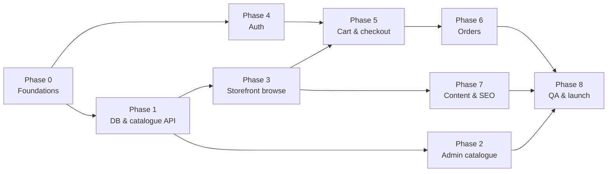

# ArtQ: Task List (phased build plan)

> Each task has an ID, a description, acceptance criteria (✅ = how we know it's done) and an estimate in **developer-days (d)**.
> Status boxes: `[ ]` todo · `[~]` in progress · `[x]` done.
> Assumes a team of **1 full-stack lead + 1 frontend dev** (+ part-time designer/QA). Total ≈ 95–110 dev-days → **~12–14 weeks** calendar.

| Phase | Name | Goal | Est. |
|-------|------|------|-----:|
| 0 | Foundations | Repo, tooling, environments, design tokens | 6 d |
| 1 | Database & catalogue backend | Schema, migrations, seed, catalogue API, import | 12 d |
| 2 | Admin panel: catalogue | Admin can manage the whole catalogue | 11 d |
| 3 | Storefront: browsing | Home, listing, PDP, search; matches reference | 15 d |
| 4 | Auth & accounts | Signup/login/OTP, profile, addresses, wishlist | 8 d |
| 5 | Cart, checkout & payments | Cart, coupons, shipping, Razorpay, COD | 14 d |
| 6 | Orders & fulfilment | Order management, emails, invoices, tracking, returns | 11 d |
| 7 | Content, marketing & SEO | Reels, testimonials, CMS, newsletter, restock, SEO | 8 d |
| 8 | QA, hardening & launch | Testing, performance, security, go-live | 9 d |
| 9 | Post-launch enhancements | Shiprocket, reviews, WhatsApp/SMS, analytics | backlog |

**Milestones**
- **M1 (end Phase 2):** Admin demo with real catalogue loaded.
- **M2 (end Phase 3):** Browsable storefront on staging (no checkout).
- **M3 (end Phase 5):** Test purchase end-to-end with Razorpay test mode.
- **M4 (end Phase 8):** Production launch.

---

## Phase 0: Foundations (6 d)

- [ ] **0.1 Monorepo scaffold** (1 d)
  pnpm workspaces + Turborepo; `apps/web` (Next.js 15, App Router, TS), `apps/admin` (Vite React TS), `apps/api` (Express TS), `packages/shared`, `packages/ui`, `packages/config`.
  ✅ `pnpm dev` starts all three apps; `pnpm build` passes; shared package importable from all apps.
- [ ] **0.2 Code quality** (0.5 d)
  ESLint (typescript-eslint, react, import order), Prettier, `tsc --noEmit` per app, Husky + lint-staged, commitlint (conventional commits).
  ✅ Pre-commit blocks lint errors; `pnpm lint && pnpm typecheck` green.
- [ ] **0.3 Local infrastructure** (0.5 d)
  `docker-compose.yml`: Postgres 16, Redis 7, Mailpit, MinIO (S3). `.env.example` for all apps (see architecture.md §12).
  ✅ `docker compose up` + `pnpm dev` works on a fresh machine following README in < 15 min.
- [ ] **0.4 API skeleton** (1 d)
  Express app with middleware chain (requestId, pino, helmet, cors, compression, cookie-parser, error handler, zod `validate()`), `config/env.ts` (zod-validated), `/health`, `/health/ready`, `AppError` classes, module folder pattern, Vitest + Supertest setup.
  ✅ `GET /health/ready` checks DB+Redis; invalid env crashes at boot with a clear message; one sample integration test passes.
- [ ] **0.5 Worker skeleton** (0.5 d)
  BullMQ connection, `queues.ts`, `worker.ts` entry, a `ping` job, Bull Board UI mounted at `/admin/queues` (admin-only).
  ✅ Enqueue `ping` from API → processed by worker → visible in Bull Board.
- [ ] **0.6 Design tokens & UI primitives** (1.5 d)
  Tailwind preset in `packages/ui` with all tokens from design-system.md (colours, fonts, radius, spacing, breakpoints); fonts via `next/font`; primitives: Button, IconButton, Input, Select, Checkbox, Badge, Price, Skeleton, SectionTitle, Drawer, Modal, Toast.
  ✅ `/dev/ui` page on web (dev only) shows all primitives in all states; matches reference colours/fonts.
- [ ] **0.7 CI pipeline** (0.5 d)
  GitHub Actions: install (cache) → lint → typecheck → test (postgres & redis service containers) → build.
  ✅ PRs show green/red checks; main branch protected.
- [ ] **0.8 Staging environments** (0.5 d)
  Vercel projects for web/admin (preview per PR), Railway/VPS for api+worker+Postgres+Redis, R2 bucket + `cdn` domain, Sentry projects, domains `staging.artq.in`, `api-staging…`, `admin-staging…`.
  ✅ Merge to `main` auto-deploys to staging; Sentry receives a test error from each app.

---

## Phase 1: Database & catalogue backend (12 d)

- [ ] **1.1 Prisma schema** (2 d)
  Implement full schema from database.md §5; migration `0001_init`; raw SQL migration `0002_constraints_and_search` (partial uniques, checks, sequence, search trigger).
  ✅ `prisma migrate dev` from scratch succeeds; ERD generated (prisma-erd) matches database.md; check constraints verified by tests (negative stock rejected, mrp < price rejected).
- [ ] **1.2 Shared money/slug/size helpers** (0.5 d)
  `packages/shared`: `toPaise`, `formatINR`, `discountPercent`, `slugify` (handles "2:1" → "2-1"), `normalizeSize` ("500GM" → "500 gm"), `buildVariantLabel`, SKU generator.
  ✅ Unit tests cover all spreadsheet edge cases listed in catalog.md.
- [ ] **1.3 Seeds: reference data** (1 d)
  Countries, 36 states with GST codes & zones, shipping zones/slabs, settings keys, super admin, CMS placeholders, FAQs, sample testimonials.
  ✅ `pnpm db:seed` idempotent (re-runnable); admin can log in with seeded credentials (after Phase 4 auth; until then verified via DB).
- [ ] **1.4 Pincode dataset** (0.5 d)
  Script to load India Post pincode CSV into `pincodes`.
  ✅ `GET /pincodes/682016` returns Ernakulam, Kerala.
- [ ] **1.5 Media module** (1.5 d)
  R2/MinIO client, presign + complete endpoints, `media.process` job (sharp → webp/avif widths 160–1600, LQIP), CDN URL builder, delete.
  ✅ Upload a 5 MB JPG via presign → within 10 s `media.status=READY` and all sizes reachable on CDN; EXIF stripped.
- [ ] **1.6 Catalogue read API** (2.5 d)
  `/types`, `/types/:slug`, `/categories/:slug`, `/techniques…`, `/collections/:slug`, `/navigation`, `/products` (filters, sort, facets, pagination), `/products/:slug`, `/products/:slug/availability`, `/products/:slug/related`, `/products/by-ids`.
  ✅ Integration tests for every filter & sort; listing p95 < 150 ms with 1k seeded products; slug redirect works; inactive/deleted products never returned.
- [ ] **1.7 Search** (1 d)
  tsvector trigger, `/search`, `/search/suggest` (trigram), `search_logs`.
  ✅ "gold" finds Metallic Gold Gel Pigment; "reisn" suggests resin products; "TWF-1IN" finds teak frame by SKU.
- [ ] **1.8 Catalogue write services** (1 d)
  Product create/update with variants & images in one transaction, `refreshProductAggregates`, slug change → `slug_redirects`, inventory movement on stock change, audit log.
  ✅ Changing a variant price updates `products.min_price`; renaming product creates redirect; every change appears in `audit_logs`.
- [ ] **1.9 Excel import engine** (2 d)
  exceljs parser for the official template **and** "Sheet1" layout (forward-fill blank cells), validators (per catalog.md §4), dry-run preview, upsert by SKU, image URL download & re-host (Drive link conversion), `import.products` job with progress, error report xlsx.
  ✅ Importing the client's file produces a preview with the exact warnings listed in catalog.md §4; confirming creates 64 products / 98 variants (± client fixes); re-import is idempotent (updates, no duplicates).

---

## Phase 2: Admin panel, catalogue (11 d)

- [ ] **2.1 Admin shell** (1 d)
  Vite + React Router + TanStack Query + shadcn/ui themed with tokens; sidebar layout, top bar, breadcrumbs, toasts, confirm dialogs, 404; API client with auth refresh (login screen wired in 4.x; temporarily dev token).
  ✅ Responsive layout works at 1280 px and on a tablet; navigation between all module placeholders.
- [ ] **2.2 Reusable DataTable** (1 d)
  TanStack Table: server pagination, sorting, column filters, search, row selection + bulk actions, empty/loading states, URL-synced state.
  ✅ Used by products, orders, customers with no copy-paste.
- [ ] **2.3 Media uploader & library** (1 d)
  Drag-drop multi-upload with progress, reorder (dnd-kit), set cover, alt text, pick-from-library modal.
  ✅ Upload 10 images at once; reorder persists; cover star moves.
- [ ] **2.4 Types / Categories / Techniques / Collections / Size charts CRUD** (1.5 d)
  Forms with image, slug auto-gen (editable), SEO fields, drag sort, active toggles; collections product picker.
  ✅ Creating a category under "Pigments" appears in `/navigation` within 60 s on web.
- [ ] **2.5 Product list page** (1 d)
  Table columns per product.md §7, filters (type, category, status, stock low/out, new/trending), quick toggles, bulk actions, duplicate.
  ✅ Can find any product by name or SKU in < 2 s; bulk "mark trending" on 5 products works.
- [ ] **2.6 Product editor** (3 d)
  Sections: Basic (name, slug, type, category, techniques), Descriptions (Tiptap rich text, details list, specs & care list, how to use, specifications key/values), Media (images, video), **Variants grid** (add row, generate combinations from Size × Thickness × Colour, inline price/MRP/stock/weight/SKU, variant image, active, bulk set price/stock), Tax (HSN, GST), Relations (frequently bought together, similar), Flags & ranks, SEO with Google preview snippet; unsaved-changes guard; preview link to storefront.
  ✅ Can recreate "Teak Wood Frame" (14 variants via 2 sizes lists × 2 depths) in under 5 minutes; validation errors show next to fields; MRP < price blocked.
- [ ] **2.7 Inventory page** (1 d)
  Variant-level table with inline stock edit (reason required), CSV bulk update, movement history drawer, low-stock filter.
  ✅ Editing stock writes movement row; history shows who/when/why.
- [ ] **2.8 Import / Export UI** (1.5 d)
  Upload xlsx → preview table (create/update badges, errors/warnings per row, filter by severity) → confirm → live progress → report; download template; export catalogue.
  ✅ Client's file can be imported end-to-end by a non-developer using only the UI.
- [ ] **M1 demo**: real catalogue (with placeholder images) loaded on staging admin.

---

## Phase 3: Storefront, browsing (15 d)

- [ ] **3.1 Layout shell** (2 d)
  Announcement bar (marquee, settings-driven), header (mobile + desktop variants, sticky/hide-on-scroll), mega-menu, mobile drawer, footer with newsletter, WhatsApp button, toast system, cart/wishlist badge counts (client), skip-link, focus management.
  ✅ Pixel-close to `ArtQ Site Ref.png` at 390 px wide; keyboard can open menu/drawer and Esc closes; Lighthouse a11y ≥ 95.
- [ ] **3.2 API client & data layer** (1 d)
  Typed fetch wrapper (server: `next.revalidate: 60`; client: TanStack Query, `credentials: 'include'`), error boundary, `formatINR`, image loader for CDN.
  ✅ No Next.js route handlers/Server Actions exist (lint rule or CI grep); all data from Node API.
- [ ] **3.3 Home page** (2.5 d)
  Hero video (poster, saveData fallback, reduced-motion), category circles grid, New Arrivals grid, Trending reels grid (autoplay-in-view, full-screen viewer with product CTA), techniques strip, testimonials carousel (swipe, auto-advance, a11y), Instagram moments; section order from `HOME_SECTIONS` setting.
  ✅ LCP < 2.5 s on throttled 4G (Moto G Power profile); only one reel plays at a time on mobile; all sections hide gracefully when empty.
- [ ] **3.4 Product card + quick-add** (1.5 d)
  Card per design-system §5.5, hover image, badges, wishlist heart, ADD → direct add or variant bottom-sheet/popover; NOTIFY ME for out-of-stock.
  ✅ Adding a single-variant product opens mini-cart; multi-variant opens picker; works with touch and keyboard.
- [ ] **3.5 Listing template** (3 d)
  Used by /shop, /type, /category, /technique, /collection, /new-arrivals, /trending, /search: banner, breadcrumbs, category chips, toolbar, sort, filters (sidebar desktop / bottom sheet mobile), active chips, price slider, facets, Load more + `?page=`, skeletons, empty state; URL-synced state; canonical/noindex rules.
  ✅ Every filter combination is shareable by URL; back button restores filters & scroll; `/type/pigments?category=gel-pigments` shows 29 items.
- [ ] **3.6 Product detail page** (3.5 d)
  Gallery (swipe, thumbnails, zoom, lightbox, video), price block, variant selectors (size/colour/thickness with availability logic and `?variant=`), stock message, qty stepper, Add to cart / Buy now / wishlist, Notify-me modal, pincode delivery check, trust row, accordions, techniques, related/FBT ("Add all"), recently viewed, sticky mobile add-to-cart bar, live availability refetch, JSON-LD Product + Breadcrumb.
  ✅ Selecting "12×16 / 0.5 inch" shows "unavailable" (no such variant) and the closest valid choice; Google Rich Results test passes; price never stale after stock change (live refetch).
- [ ] **3.7 Search UX** (1 d)
  Search overlay with debounced suggestions, recent searches, keyboard navigation, results page, zero-results state.
  ✅ Arrow keys + Enter navigate suggestions; zero-result queries logged.
- [ ] **3.8 Content pages** (0.5 d)
  About, Contact (form → API), Custom work (form + uploads), FAQs (accordion + FAQPage JSON-LD), policy pages from CMS, 404, error page.
  ✅ Contact submission lands in admin Messages (Phase 7 UI) and Mailpit shows admin email.
- [ ] **M2**: storefront browsable on staging; client review round 1.

---

## Phase 4: Auth & accounts (8 d)

- [ ] **4.1 Auth backend** (2.5 d)
  argon2id, signup + email OTP verify, login (email/phone + password), OTP login, refresh rotation with reuse detection, logout/logout-all, forgot/reset password, set-password for guests, lockout, rate limits (Redis), `authOptional/authRequired/requirePermission` middleware, role→permission map.
  ✅ Test suite: reuse of rotated refresh token revokes family; 6th wrong password locks 15 min; OTP 6th attempt rejected; no user enumeration on forgot-password/OTP request.
- [ ] **4.2 Email infrastructure** (1 d)
  Resend client (Mailpit in dev), React Email base layout (logo, teal header, footer), `email.send` job with retries + `email_logs`; templates: otp, welcome, password_reset.
  ✅ Emails render correctly in Gmail (web + Android) and Outlook; failed sends retried 5× and visible in logs.
- [ ] **4.3 Storefront auth pages** (1.5 d)
  Login (password + OTP tabs), signup + OTP screen (6-box input, resend timer, paste support), guest-login, forgot/reset; `?next=` redirect; in-memory access token + silent refresh on load and on 401.
  ✅ Refreshing any page keeps user logged in; logging out in one tab logs out others (BroadcastChannel).
- [ ] **4.4 Account area** (1.5 d)
  Profile edit, change password, email change with OTP, address book (CRUD, default, pincode auto-fill), delete account; route guard.
  ✅ Pincode 682016 auto-fills Kochi/Kerala; max 10 addresses enforced.
- [ ] **4.5 Wishlist** (1 d)
  API toggle/list/merge; guest wishlist in localStorage; merge on login; wishlist page with Move to cart.
  ✅ Guest hearts 3 products → logs in → all 3 in account wishlist; badge counts correct.
- [ ] **4.6 Admin login & staff** (0.5 d)
  Admin login screen, TOTP 2FA setup/verify, staff CRUD (SUPER_ADMIN), permission-based menu hiding.
  ✅ STAFF user cannot see Products/Settings menus and gets 403 from those APIs.

---

## Phase 5: Cart, checkout & payments (14 d)

- [ ] **5.1 Cart backend** (2 d)
  `aq_cart` cookie, cart CRUD, live re-pricing & stock clamping, guest→user merge on login, `CartView` shape.
  ✅ Adding qty > stock returns 409 with available qty; merge sums quantities and clamps; carts survive 30 days.
- [ ] **5.2 Pricing engine** (1.5 d)
  `priceCart()` per architecture.md §6.4: subtotal, MRP savings, coupon allocation, weight, zone shipping, free-shipping threshold, heavy cap, COD fee, GST breakup.
  ✅ 40+ table-driven unit tests (edge cases: exactly ₹1000, coupon pushes below threshold, 30 kg resin, FREE_SHIPPING coupon, COD limits).
- [ ] **5.3 Coupons** (1.5 d)
  Validation chain (product.md §8.4), apply/remove on cart, public coupon list with eligibility, admin CRUD + redemptions view.
  ✅ Every coupon error code reachable by a test; per-user limit enforced for guests by email/phone.
- [ ] **5.4 Shipping config** (1 d)
  Zone/slab admin UI with state mapping, SHIPPING settings form, `/pincodes/:pin` serviceability & COD flags, `/cart/estimate`.
  ✅ Admin changes Kerala 500 g rate → cart shows new rate immediately.
- [ ] **5.5 Cart page & mini-cart** (1.5 d)
  Per product.md §5.5 & §5.7: line items, qty stepper, remove + undo, move to wishlist, free-shipping progress bar, coupon box + available coupons, summary, empty state, stock/price-change warnings.
  ✅ All amounts match API exactly (no client-side math besides display).
- [ ] **5.6 Checkout page** (2.5 d)
  Contact → Address (saved cards / new form with pincode auto-fill / billing / GSTIN) → Shipping & payment (methods, COD availability reason, notes, terms) → sticky summary; `/checkout/quote` on each change; form validation (RHF + zod shared schemas); returning-email login hint; abandoned-cart contact capture.
  ✅ Usable one-handed at 360 px; validation messages for every field; COD option disappears for ₹6,000 cart with reason shown.
- [ ] **5.7 Order creation & stock reservation** (1.5 d)
  `/checkout/initiate` with transaction from database.md §8.1, Idempotency-Key, `expectedTotal` check (`PRICE_CHANGED`), order number & tracking token, COD path, `orders.expire-pending` cron job.
  ✅ Concurrency test: 20 parallel checkouts for a variant with stock 5 → exactly 5 orders succeed, stock = 0, never negative; expired orders restore stock.
- [ ] **5.8 Razorpay integration** (2 d)
  Create Razorpay order, Checkout.js (loaded only on checkout, theme `#00a99d`, prefill), `/checkout/verify` signature check, `markOrderPaid` (idempotent, amount check), webhook endpoint with raw body + signature + `webhook_events`, payment-failed handling & retry-payment, late capture after expiry → re-reserve or auto-refund.
  ✅ Test mode: UPI success, card failure, closing modal, duplicate webhook, webhook-before-verify all leave the order in the correct state; no double emails.
- [ ] **5.9 Success page & analytics events** (0.5 d)
  Success page (product.md §5.8), guest "create password", GA4/Meta events (`view_item_list` … `purchase`, fired once).
  ✅ GA4 DebugView shows full funnel with correct values in rupees.
- [ ] **M3**: full test purchase on staging (prepaid + COD).

---

## Phase 6: Orders & fulfilment (11 d)

- [ ] **6.1 Order emails** (1.5 d)
  Templates: order_placed (customer + admin), payment_failed nudge (delayed job), order_status (confirmed/shipped with AWB/delivered), order_cancelled, refund_processed.
  ✅ Each status change sends exactly one email (respecting `notifyCustomer`).
- [ ] **6.2 Admin orders list & detail** (2.5 d)
  Filters, search by number/phone/email, CSV export; detail: items, customer, addresses, payments & Razorpay IDs, timeline, internal notes, status actions with transition rules, ship modal (courier, AWB, tracking URL), edit address before packing, resend email.
  ✅ Invalid transitions are not offered; every action writes history + audit log.
- [ ] **6.3 Cancellations & refunds** (1.5 d)
  Customer cancel (allowed statuses), admin cancel with refund/restock options, partial refunds via Razorpay Refund API, refund webhooks, payment_status updates, coupon reversal.
  ✅ Cancel prepaid order → Razorpay test refund created → order shows REFUNDED after webhook; stock restored with movement rows.
- [ ] **6.4 Invoices & packing slips** (1.5 d)
  @react-pdf GST invoice (store GSTIN, invoice number per FY, HSN, taxable value, CGST/SGST vs IGST by state, totals in words), packing slip with address label; download from admin & customer account.
  ✅ CA reviews a sample invoice and approves format; Kerala order shows CGST+SGST, Karnataka shows IGST.
- [ ] **6.5 Customer orders & tracking** (1.5 d)
  My orders list/detail, cancel, buy again, invoice download, tracking timeline, public tracking via token link and via order number + OTP.
  ✅ Guest can open tracking from email link without logging in; cannot see other orders.
- [ ] **6.6 Returns** (1.5 d)
  Customer "Report a problem" (within 48 h of delivery, photo upload), admin returns queue (approve/reject, refund amount, restock), emails.
  ✅ Request after 48 h blocked with message; approved return with restock increments stock.
- [ ] **6.7 Admin dashboard & notifications** (1 d)
  KPIs, sales chart (Recharts), orders by status, top products, low stock, pending actions; in-app notifications bell (new order, low stock, return, message); daily summary & low-stock emails (cron).
  ✅ New order appears in bell within 5 s (polling 30 s acceptable); 08:00 IST email arrives on staging.

---

## Phase 7: Content, marketing & SEO (8 d)

- [ ] **7.1 Content admin** (2 d)
  Hero/home slides, announcement bar, home section order/toggles, reels (video upload, thumbnail, product link, reorder), testimonials, FAQs, CMS pages (Tiptap), Instagram moments, social links.
  ✅ Client can change every piece of homepage text/media without a developer.
- [ ] **7.2 Newsletter** (0.5 d)
  Subscribe API (double-entry safe), unsubscribe link/token, admin list + CSV export.
  ✅ Duplicate subscribe shows friendly message; unsubscribe works from email link.
- [ ] **7.3 Back-in-stock** (1 d)
  Notify-me API, admin grouped view + "notify now", automatic `stock.restock-notify` job on 0→>0, back_in_stock email with deep link to variant.
  ✅ Restocking the 8-inch acrylic hoop emails all waiting subscribers once.
- [ ] **7.4 Abandoned cart** (1 d)
  Cron finds carts with contact & items idle 1 h/24 h, sends up to 2 reminders (consent-aware), admin list + manual remind; restores cart via signed link.
  ✅ Reminder link restores the exact cart on another device.
- [ ] **7.5 Messages inbox** (0.5 d)
  Contact & custom-work messages with status workflow and notes.
  ✅ Admin can mark replied/closed; filters by status.
- [ ] **7.6 SEO** (2 d)
  Metadata for every route (from entity meta or templates), Open Graph/Twitter images, JSON-LD (Organization, WebSite+SearchAction, Product, BreadcrumbList, FAQPage), `sitemap.ts` from `/seo/sitemap-entries`, `robots.ts` (staging noindex), canonical rules, redirects (Next.js middleware → `/seo/resolve`), SEO overrides admin, slug-redirect 301s.
  ✅ Screaming Frog crawl: no broken links, no duplicate titles, all products in sitemap; Rich Results test passes for PDP and FAQs.
- [ ] **7.7 Reports** (1 d)
  Sales by day/month, product performance, search terms, GST monthly CSV.
  ✅ GST CSV totals equal sum of invoices for the month.

---

## Phase 8: QA, hardening & launch (9 d)

- [ ] **8.1 Automated tests** (2.5 d)
  Unit: pricing, coupons, shipping, status transitions, import parser. API integration: auth, cart, checkout, webhooks, admin permissions. Playwright E2E (mobile + desktop): browse → add → coupon → checkout (Razorpay test) → success; signup/login; admin create product → visible on site; cancel & refund.
  ✅ CI runs all; coverage ≥ 80 % on `checkout/*`, `orders/*`, `auth/*`.
- [ ] **8.2 Performance pass** (1.5 d)
  Lighthouse/WebPageTest on home, listing, PDP; image sizes/`sizes` attr; bundle analysis; DB `EXPLAIN ANALYZE` on listing/search; API caching headers; k6 load test (100 rps on listing, 20 rps checkout quote).
  ✅ Lighthouse mobile Performance ≥ 90, LCP < 2.5 s, CLS < 0.1; API p95 < 300 ms under load.
- [ ] **8.3 Security review** (1 d)
  OWASP checklist (architecture.md §11), dependency audit, CSP, rate limits verified, admin 2FA enforced, secrets audit, Razorpay webhook replay test, IDOR tests on orders/addresses.
  ✅ No high/critical findings open.
- [ ] **8.4 Accessibility & cross-browser** (1 d)
  axe scans, keyboard-only run, screen reader smoke (VoiceOver iOS, TalkBack), Safari iOS 15+, Samsung Internet, Firefox.
  ✅ WCAG 2.1 AA issues fixed; checkout completable with keyboard only.
- [ ] **8.5 Content & data go-live** (1 d)
  Final catalogue import with real photos/weights/stock, policies text from client, GST/HSN confirmed, store info, shipping rates, coupons (e.g. WELCOME10), Razorpay live KYC & keys, email domain (SPF/DKIM/DMARC).
  ✅ Client signs off the catalogue in staging.
- [ ] **8.6 Production setup** (1 d)
  Prod DB with PITR + daily backups + restore test, prod Redis, R2 prod bucket, domains + SSL, `www`→apex redirect, Vercel prod, API autoscale/health checks, Sentry alerts, uptime monitors, GA4/Meta/Search Console verification, robots allow.
  ✅ Restore drill from backup succeeds; alerts reach the team.
- [ ] **8.7 Launch** (1 d)
  Smoke test checklist on prod (real ₹1 order with live keys then refund), submit sitemap, monitor for 48 h, hand-over training for admin (1 h session + short video guide).
  ✅ First real customer order processed end-to-end; client can operate admin alone.

---

## Phase 9: Post-launch backlog (prioritise after 4–6 weeks of data)

| ID | Item | Est. |
|----|------|-----:|
| 9.1 | **Shiprocket integration**: auto order creation, AWB, labels, pickup, tracking webhooks, live pincode serviceability & EDD | 5 d |
| 9.2 | **Product reviews & ratings** with photos, verified-purchase badge, moderation, review request email 5 days after delivery | 4 d |
| 9.3 | **SMS / WhatsApp** (MSG91, DLT templates): OTP, order updates, abandoned cart | 3 d |
| 9.4 | Google sign-in (One Tap) | 1 d |
| 9.5 | Bundles / "Build your kit" (resin + pigments + frame at combo price) | 4 d |
| 9.6 | Bulk/wholesale price tiers (qty-based pricing for pro artists) | 3 d |
| 9.7 | Gift wrapping & gift message | 1 d |
| 9.8 | Loyalty points / referral codes | 5 d |
| 9.9 | Meta Conversions API server-side events, Google Merchant Center product feed | 2 d |
| 9.10 | Blog / tutorials (resin how-tos for SEO) | 3 d |
| 9.11 | Multi-warehouse stock | 4 d |
| 9.12 | PWA (add to home screen, offline cart) | 2 d |
| 9.13 | Meilisearch upgrade if catalogue > 5k | 2 d |

---

## Dependencies & critical path

**Parallel tracks (2 devs):** Dev A (backend-leaning): 1 → 4.1 → 5.1–5.3, 5.7–5.8 → 6.x. Dev B (frontend-leaning): 0.6 → 3.x → 2.x → 5.5–5.6 → 7.x.

## Client inputs needed (with deadlines)

| Needed | By end of | Blocks |
|--------|-----------|--------|
| Logo (SVG), brand confirmation, domain | Phase 0 | 0.8, 3.1 |
| Answers to product.md §11 open questions | Phase 1 | 5.x, 6.4 |
| Corrected catalogue (catalog.md §4 issues) | Phase 2 | M1 |
| Product photos (min 1 per product, ideally 3) | Phase 3 | M2 |
| Hero video, reels, testimonials, about-page content | Phase 7 | 7.1 |
| Policies text, GSTIN, HSN/GST rates (CA) | Phase 6 | 6.4, launch |
| Razorpay account with KYC done | Phase 5 (test) / Phase 8 (live) | 5.8, launch |
| Package weights per variant | Phase 5 | 5.2 accuracy |

## Definition of Done (every task)
1. Code reviewed and merged via PR with green CI.
2. Tests added/updated (unit and/or integration; E2E for user flows).
3. Works on mobile (360 px) and desktop (1440 px).
4. Loading, empty and error states handled.
5. Accessible (keyboard, labels, contrast).
6. Admin-facing changes audited; customer-facing text reviewed for typos.
7. Deployed to staging and verified by someone other than the author.
8. Docs updated if behaviour/API/schema changed.
